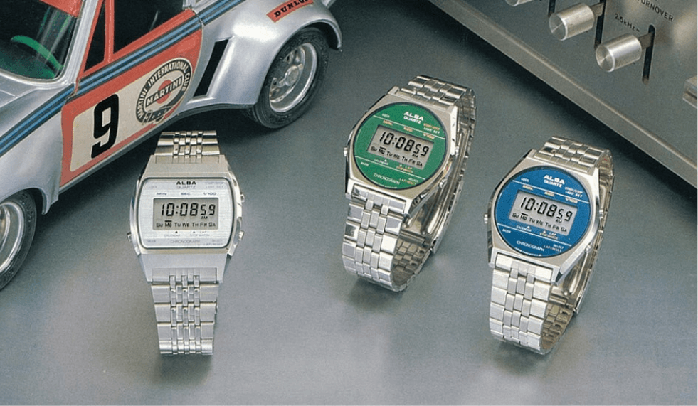
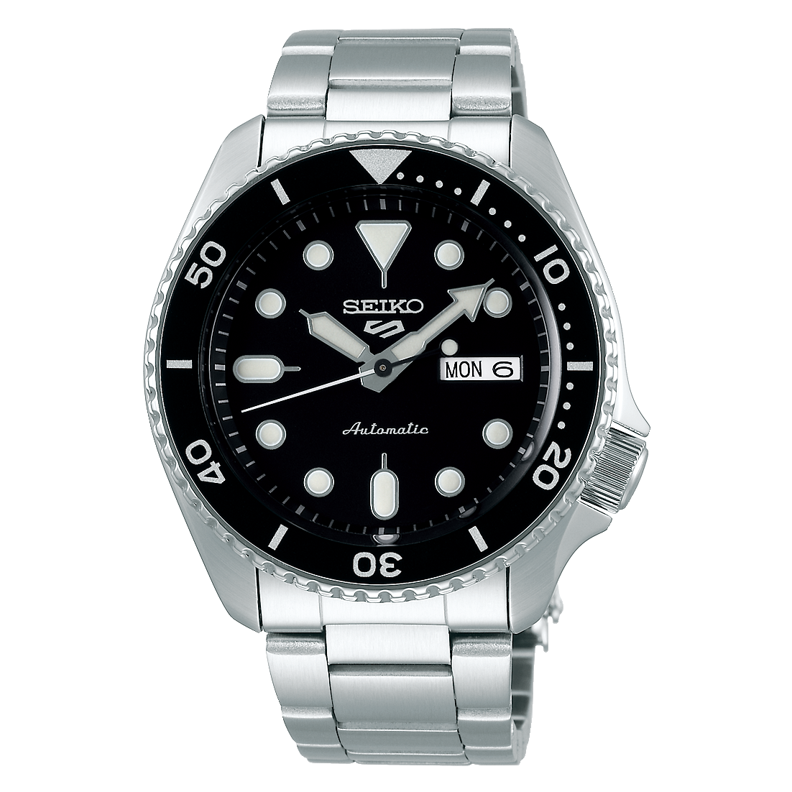
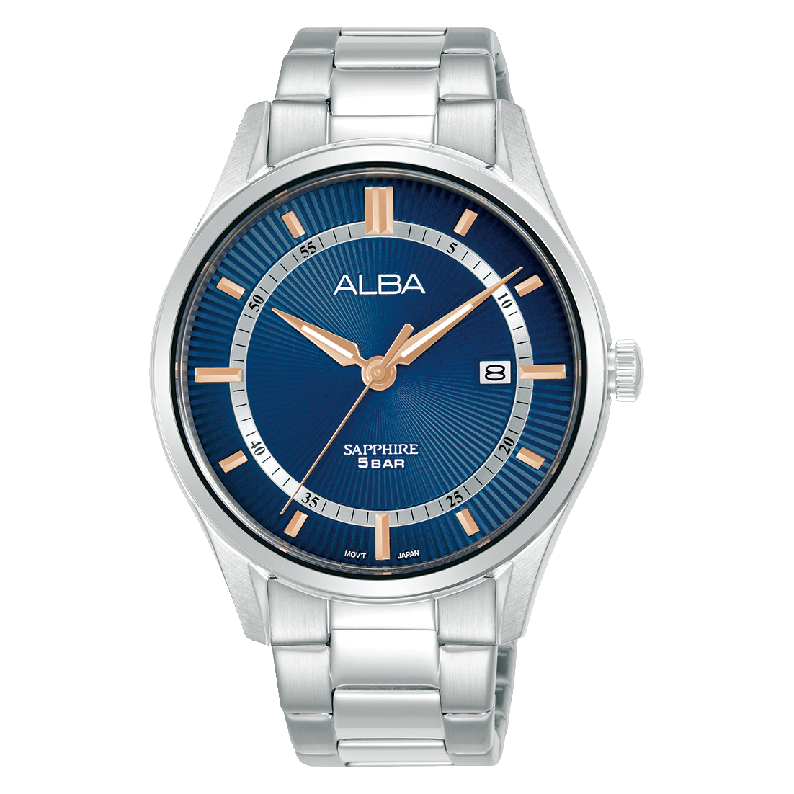
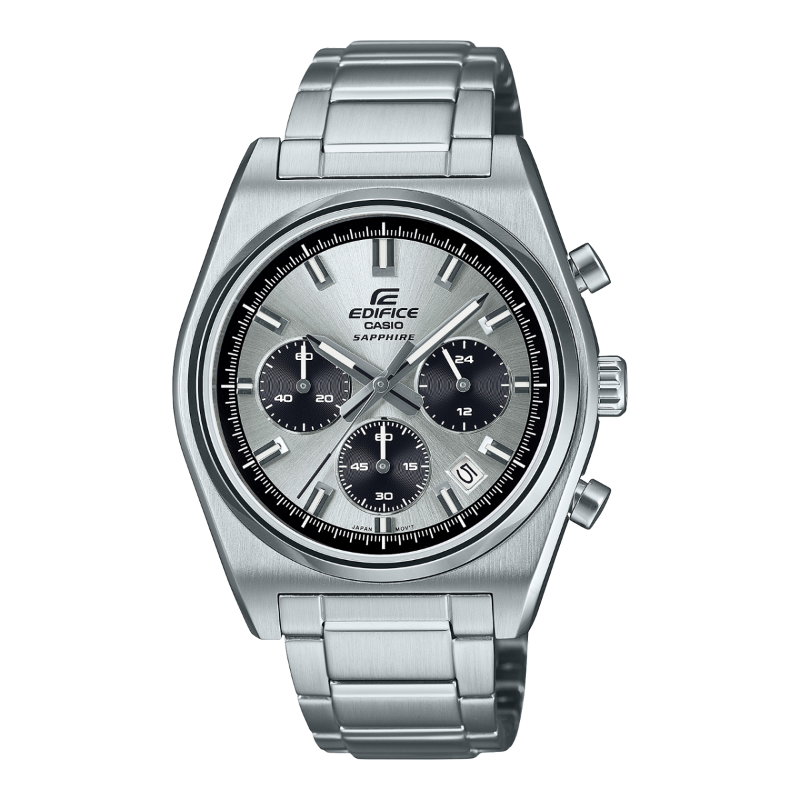

ALBA is one of those watch brands I had seen around for years without really paying much attention to it.

I knew the Seiko connection. I knew they made a bunch of affordable quartz and automatic watches. Every now and then one would show up while browsing Amazon and I'd think, "that actually looks pretty good", and then move on.

Then I came across the ALBA AX7019X1.

Light blue dial. Chronograph. Stainless steel bracelet. A genuinely unusual koi pattern on the dial. And it was sitting on Amazon for roughly ₹13,000.

So I bought it.

And I was not expecting to like it this much.

The bracelet? Fine. Nothing to write home about. It feels slightly light and is probably the first place where you realise this is still a relatively affordable watch.

But the rest of it surprised me.

The metallic dial looks fantastic when light hits it. The koi pattern around the lower half of the dial gives the watch way more personality than the usual blue-sunburst-chronograph formula. The orange accents work. The tachymeter bezel works. Even with three subdials, a date window and quite a lot happening on the face, it somehow does not turn into a mess.

It just has character.

And after wearing it for a while, I started looking through the rest of ALBA's Indian lineup properly.

That sent me down a bit of a rabbit hole.

Because if you are looking at ALBA watches in India right now, the brand suddenly makes a lot of sense.

---

# Wait, What Exactly Is ALBA?

Here's the funny part.

ALBA was basically created for this exact job.

Seiko's own company history dates the birth of ALBA to **1979**. During the 1970s, Seiko saw the watch market increasingly splitting between expensive luxury watches and buyers looking for lower-priced options. ALBA was created to respond to that demand for affordable watches.

The name ALBA itself means "dawn", "daybreak" or "beginning" in Italian.

So this is not some new budget brand buying generic movements and trying to borrow credibility from Seiko.

ALBA has been around for more than four decades, and the brand was created by Seiko Watch Corporation itself.

And that original purpose is important.

ALBA was supposed to give people affordable watches without requiring them to climb all the way up Seiko's own catalogue.

In India in 2026, that idea suddenly feels very relevant again.

---

# Because Seiko Has Gotten Expensive

If you have been following Seiko prices in India, you already know where this is going.

Take one of the most obvious examples, the Seiko 5 Sports SRPD55K1.

Older Indian listings show an MRP of **₹30,000**. Today, Seiko India's own website lists the same reference at **₹40,000**.

That is a ₹10,000 jump.

You may still find old stock at older pricing, and retailers obviously run discounts, so MRP is not the same thing as the price everybody will actually pay. But the official direction is pretty obvious.

The mainstream Seiko mechanical watch has moved up the ladder.

I am also not going to pretend we know exactly why Seiko has done this. There is plenty of speculation around exchange rates, positioning, discount structures and Seiko moving more upmarket globally, but unless Seiko says what the reason is, that is all it is. Speculation.

What we can actually see is much simpler.

A Seiko 5 Sports that used to sit at ₹30,000 now carries a ₹40,000 official MRP.

Meanwhile, ALBA is selling automatic watches for roughly ₹12,500 to ₹18,000.

That creates a pretty massive gap.

And ALBA is sitting right inside it.

---

# ALBA's Spec Sheets Can Get Slightly Ridiculous

Start at the cheaper end.

The **ALBA AS9R17X1 Asterix** officially carries an MRP of ₹9,000.

Stainless steel case. Stainless steel bracelet. Date. And, most importantly, **sapphire crystal**.

Nine thousand rupees.

That is genuinely good.

Move up slightly and things get more interesting.

The **AZ5011X1** is a ₹12,500 solar chronograph with a stainless steel case and bracelet, 100 metres of water resistance and ALBA's VR42 solar movement.

No battery changes every couple of years. Leave it exposed to light and get on with your life.

Then there are the automatics.

Something like the **AL4539X1** costs ₹15,500 and gives you an automatic Y676 movement, day-date, stainless steel construction, a rotating bezel and **200 metres of water resistance**.

The catch is mineral crystal, which we will get to.

And there are loads of these.

ALBA's Indian catalogue has automatics clustered around ₹15,000 to ₹18,000, solar chronographs around ₹12,500, regular chronographs around ₹10,000 to ₹15,000, and sapphire quartz watches starting below that.

For someone buying their first "proper" watch after years of basic fashion watches or smartwatches, that is a very interesting part of the market.

But.

Before this turns into an ALBA fan club meeting, there is a catch.

Casio exists.

---

# Casio Ruins the Party a Little

If you judge watches purely by specification sheets, ALBA does not automatically win.

Not even close.

The Casio Edifice **EFB-730D-7AV**, for example, officially costs ₹11,995 in India.

For that money you get a stainless steel case, stainless steel bracelet, 100 metres of water resistance, a chronograph and **sapphire crystal**.

That is an annoyingly good specification sheet.

My AX7019X1 has an official MRP of ₹15,000 and uses mineral crystal.

So no, I am not going to tell you ALBA is somehow untouchable value and every other brand should pack up and go home.

If your buying process involves opening six tabs, making a spreadsheet and awarding points for sapphire crystal, Casio Edifice is going to make several ALBAs look expensive.

And honestly, that is good for buyers.

Competition around ₹10,000 to ₹20,000 is fantastic right now.

What ALBA gets right is slightly different.

It has specs that are generally competitive enough, but a lot of the watches also look like somebody actually had fun designing them.

That matters more than watch enthusiasts sometimes admit.

A sapphire crystal does not help if you think the watch attached to it is boring.

---

# The AX7019X1 Is a Perfect Example

Back to the watch that started this whole thing.

The official specification sheet for the AX7019X1 reads:

**Key Specifications:**
- **Case Size:** 44mm
- **Thickness:** 12mm
- **Movement:** VK68 quartz chronograph
- **Crystal:** Mineral
- **Case:** Stainless steel
- **Bracelet:** Stainless steel
- **Water Resistance:** 100 metres
- **Chronograph:** 1/5 second, up to 60 minutes
- **Functions:** Split timing, instant reset, date and 12/24-hour indication
- **MRP:** ₹15,000

I got mine for roughly ₹13,000 from Amazon.

Now forget the spec sheet for a second.

That dial is the reason this watch works.

ALBA officially describes it as a light blue dial, which does not really do it justice. In person, it has a shiny metallic finish that moves between silver and icy blue depending on the lighting.

Then there is the koi pattern across the bottom section of the dial.

Not koi-like. It is a koi pattern, and it is probably my favourite detail on the whole watch.

The little flashes of orange around the dial tie into the orange seconds hand and the orange ring around the crown. None of it is particularly subtle, but it works.

I genuinely had not expected this much personality from it.

The chronograph is good too. It gives the watch something to play with beyond simply telling the time, and visually the three subdials suit the motorsport-ish design really well.

Then there is the size.

44mm sounds huge.

And it is a big watch. I'm not going to pretend otherwise.

But on the wrist, I do not think it wears as ridiculously large as the number would suggest. The bracelet width and overall case proportions help keep everything visually balanced.

On a small wrist though? Definitely try one before buying.

Then we get to the bracelet.

This is the weak point for me.

It looks fine. It matches the watch. The finishing is perfectly acceptable.

It just feels a little light.

Pick up a more expensive watch with a properly substantial bracelet and you will immediately notice the difference. Nothing about the ALBA bracelet is terrible, but it is not the part of the watch I would show somebody and say, "look what ₹13,000 gets you."

The dial?

Absolutely.

The bracelet?

It's okay.

And I am completely fine with saying that.

---

# What About ALBA Automatics?

This is probably where watch enthusiasts will start arguing.

Movement calibre. Beat rate. Hacking. Hand winding. Power reserve. Movement architecture.

All valid things to care about.

But I also think the watch community occasionally becomes way too enthusiast-brained about this stuff.

Think about somebody buying their first automatic watch.

They have probably just discovered that you can buy a watch powered by the movement of your wrist.

You can take it off, flip it over, see mechanical parts moving through the caseback on models that offer one, put it back on and realise there is no disposable battery inside keeping the thing alive.

That is cool.

Most first-time automatic buyers are not standing inside a watch shop thinking:

"But does the seconds hand stop when I pull the crown out?"

They want a mechanical watch.

They want something that looks good.

They want it to feel special.

They want decent water resistance, a usable day or date complication and preferably something they will still enjoy looking at six months later.

A lot of ALBA's affordable automatics use Y675 or Y676 family movements. Enthusiasts will correctly point out that models using the Y676 do not offer manual hand-winding or hacking, while Seiko's current 4R36 does.

That is worth knowing.

But it also needs context.

These ALBA movements are still automatic. They wind themselves while you wear the watch. What you cannot do on the Y676 is manually wind the watch through the crown or stop the seconds hand while setting the time.

If those features matter to you, the Seiko is the better movement.

For most people buying their first automatic?

I really do not think that is going to decide whether they enjoy the watch.

The deeper movement stuff matters once you start going down the rabbit hole. And if movement specifications are important to you, absolutely compare calibres before buying.

But I would not dismiss a ₹15,000 automatic that somebody genuinely loves because an enthusiast checklist says another movement has more features.

Watches are supposed to be fun.

---

# Where ALBA Cuts Costs

None of this means the brand gets a free pass.

There are compromises.

The first is **mineral crystal**.

ALBA does use sapphire on some of its quartz watches, which makes it slightly frustrating that quite a few of the more expensive automatics and chronographs still use mineral.

The ₹15,500 AL4539X1 uses mineral.

My ₹15,000-MRP AX7019X1 uses mineral too.

When Casio is selling sapphire Edifice chronographs for under ₹12,000, that deserves criticism.

Second, **some of these watches are big**.

42mm. 43mm. 44mm. Even 44.5mm shows up in the automatic catalogue.

If you love compact 36 to 39mm watches, ALBA's sportier catalogue is not always going to be your happy place.

Third, **the bracelets and finishing are not necessarily going to match the dial quality**.

That is based on my AX7019X1 rather than something I am claiming about every ALBA ever made.

But on mine, the dial and overall styling feel like the stars of the show.

The bracelet feels like where somebody in accounting finally got involved.

There is also a small but important bit of expectation-setting around the "Japanese watch" label.

ALBA is a Japanese brand created by Seiko Watch Corporation.

That does **not** mean every ALBA is made in Japan.

Current ALBA India product pages for some models list China as the country of origin.

That is not automatically a quality problem. Plenty of excellent watches are manufactured in China.

It is just worth knowing what you are actually buying.

---

# So Why Is ALBA Interesting Right Now?

Because the market around it has changed.

For years, Seiko occupied this really comfortable position in India where somebody getting deeper into watches could start with Casio or Timex, save a little more money, and eventually stretch into a Seiko automatic.

That jump is getting harder to justify.

When a mainstream Seiko 5 Sports carries a ₹40,000 MRP, the person with ₹15,000 to ₹20,000 in their pocket starts looking elsewhere.

Citizen becomes interesting.

Casio becomes interesting.

Microbrands become interesting.

And ALBA becomes very interesting.

Not because ALBA suddenly got better overnight.

Because the company has been sitting in this part of the market all along.

Remember, Seiko created ALBA in 1979 specifically because buyers wanted more affordable watches.

Almost fifty years later, that job description still works.

---

# Should You Buy One?

I would not blindly recommend every ALBA.

Some are too big for my taste.

Some should have sapphire crystal at the price.

Some have competitors from Casio that simply beat them if you are comparing raw specifications.

And if movement technology is the main reason you are buying an automatic, do your homework on the exact calibre before ordering.

But I also think ALBA deserves considerably more attention from Indian buyers than it currently gets.

Especially if you are buying your first serious watch somewhere between ₹10,000 and ₹20,000.

There are quartz watches with sapphire.

There are solar chronographs.

There are affordable automatics.

There are proper 100 and 200 metre water-resistant sports watches.

And, importantly, there are a lot of designs that do not look like yet another copy of the same five watches everyone already owns.

My AX7019X1 is not the best chronograph under ₹15,000 by every measurable specification.

The Casio comparison already proved that.

The bracelet could be better.

I would have loved sapphire.

44mm will be too big for some people.

But I put it on my wrist and I like looking at it.

That metallic icy-blue dial. The koi pattern. The flashes of orange. The slightly ridiculous amount of detail crammed into the face.

It has character.

And character is really difficult to put into a specifications table.

Would I buy another ALBA?

Yeah.

Not because it is secretly a Seiko 5 for half the money.

It isn't.

I'd buy another one because ALBA seems to understand that an affordable watch can still be interesting.

And right now, the Indian watch market could use a lot more of that.

---

# Quick ALBA FAQ

## Is ALBA owned by Seiko?

ALBA was created by Seiko in 1979 to serve buyers looking for more affordable watches. It remains part of the Seiko Watch Corporation ecosystem.

## Are ALBA watches good value in India?

A lot of them are. ALBA has quartz watches with sapphire crystal around the ₹9,000 mark, solar chronographs around ₹12,500, and plenty of automatics around ₹15,000 to ₹18,000. That does not mean every model is the best deal in its class. Casio Edifice, for example, can beat some ALBA chronographs on raw specifications.

## Are ALBA watches made in Japan?

Do not assume that every ALBA is made in Japan. ALBA is a Japanese brand created by Seiko, but current Indian product listings for some models show China as the country of origin.

## Is ALBA better than Seiko?

That is the wrong comparison. Seiko's current 4R36 automatics offer features such as hacking and manual winding that cheaper ALBA automatics may not. ALBA makes more sense as the affordable option for someone who wants an interesting watch without spending current Seiko 5 money.

## Is the ALBA AX7019X1 worth buying?

At the roughly ₹13,000 I paid, I think so. The bracelet is average and mineral crystal is a compromise, but the dial, koi pattern, styling, chronograph and 100 metres of water resistance make it a watch I genuinely enjoy wearing.

---

If you are shopping around this price range, our [Best Watches Under ₹10,000](/blog/best-watches-under-10k/) guide is a good place to start below ALBA territory, while our [Seiko Alternatives: Citizen](/blog/seiko-alternatives-citizen/) guide covers what happens once your budget starts climbing toward current Seiko money.

Got an ALBA already? Come show it off on [r/thewristjournal](https://www.reddit.com/r/thewristjournal/). I am especially curious to see which models people have actually bought in India rather than just admired through a product page.

Happy hunting.
