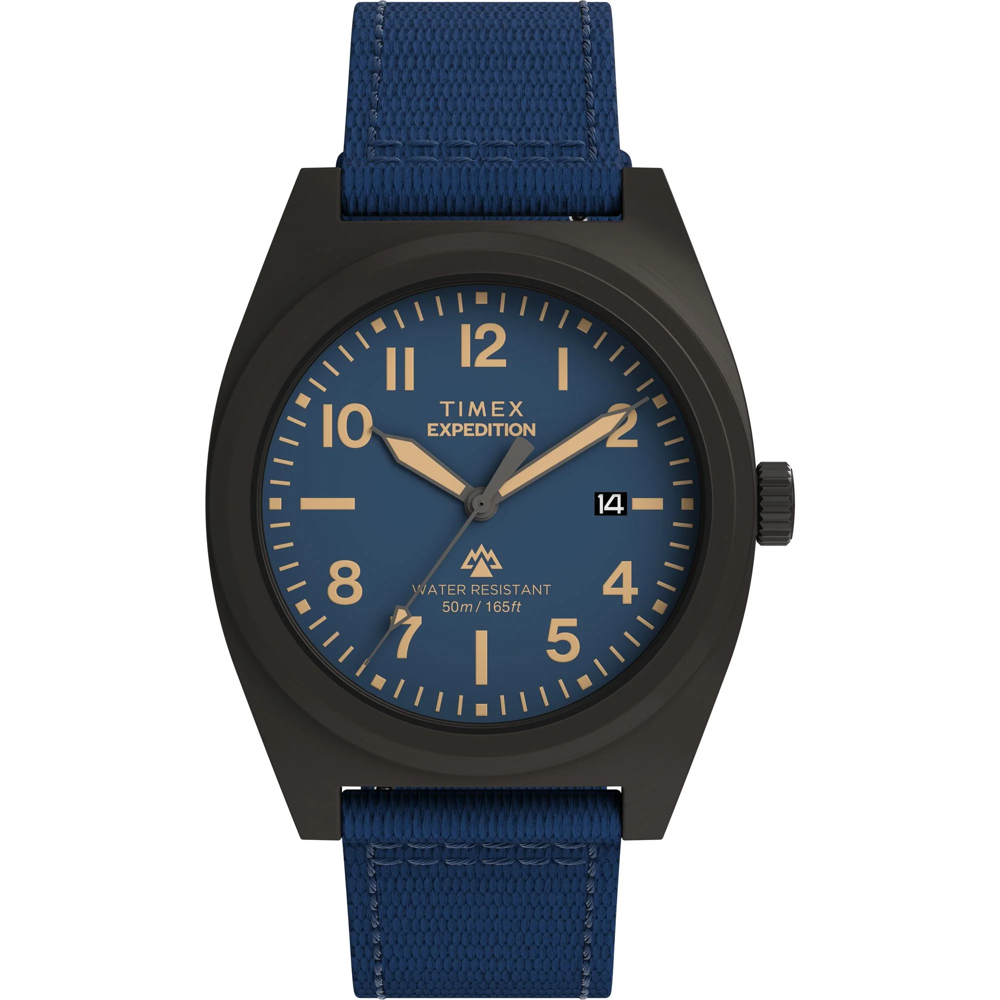
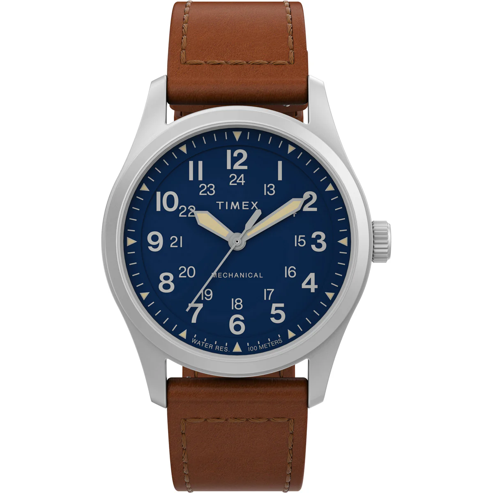
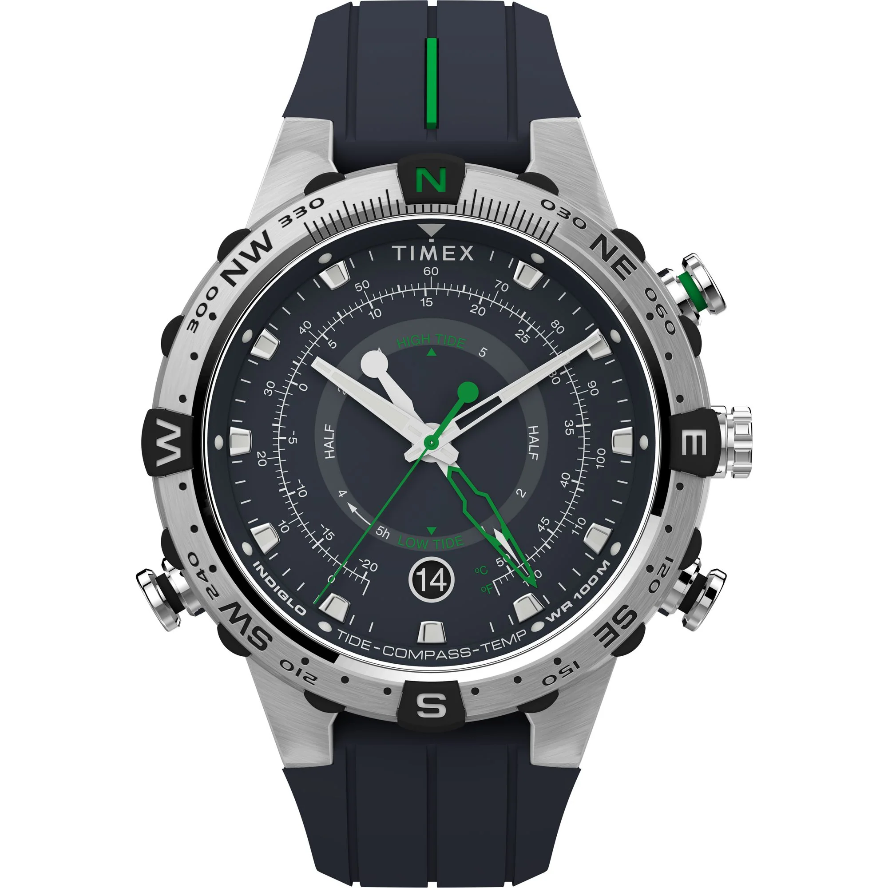
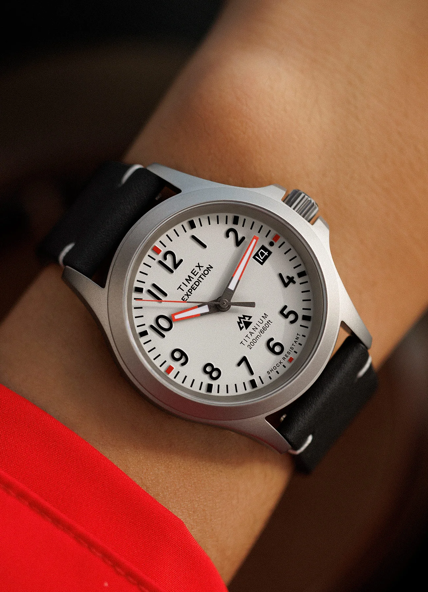
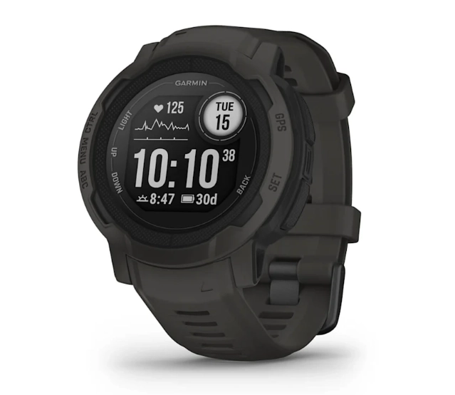
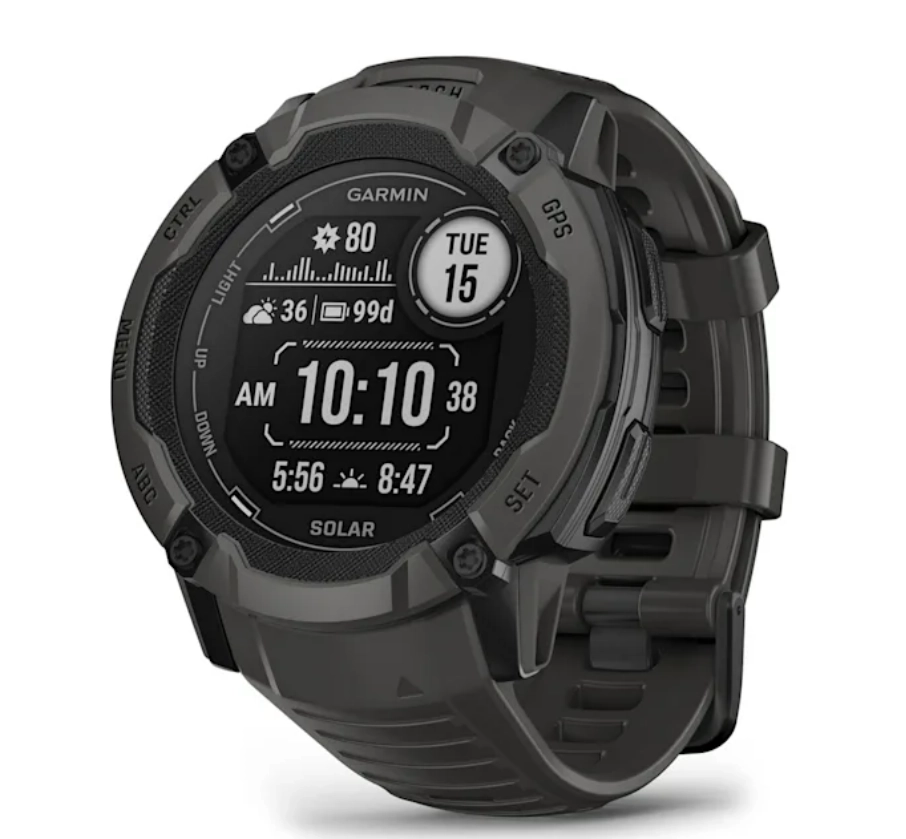
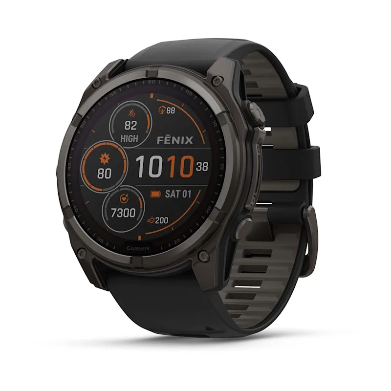

The outdoors do not care about your watch's brand name. They care about whether it can survive a downpour, tell you which way is north, and still be ticking when you get back to base camp. An outdoor watch is not a fashion accessory — it is a tool. And like all good tools, it needs to be reliable, functional, and tough enough to handle whatever the trail throws at it.

This guide covers **the best outdoor watch at every major price point** available in India right now. Each budget has a clear winner and a solid alternative, so no matter what you are working with, there is something here for you.

---

# 1. Under ₹10,000 — The Entry Point

## Winner: [Casio Pro Trek PRJ-B001-5](https://www.casio.com/in/watches/protrek/product.PRJ-B001-5/) – ₹10,495 (Under 10K with offers)

Casio Pro Trek PRJ-B001-5

**Key Specifications:**
- **Power:** Solar
- **Build:** Rugged, shock-resistant construction
- **Connectivity:** Bluetooth
- **Series:** Pro Trek

For under ten thousand rupees, a solar-powered watch with Bluetooth connectivity is a genuinely impressive package. The Casio Pro Trek PRJ-B001-5 is built for life outside — it is rugged, dependable, and never needs a battery swap thanks to Tough Solar charging.

Bluetooth lets you sync with your phone for time adjustments and basic data logging, which is a feature you rarely see at this price in a purpose-built outdoor watch. If your budget caps out around ten grand and you want something that actually belongs on a trail, this is the one to get.

**The one catch:** It is not the best looking watch in the world. The design is functional rather than fashionable. But honestly, if you are buying an outdoor watch for looks, you are doing it wrong.

### Alternative: [Timex Capstone TW2Y18200UJ](https://shop.timexindia.com/collections/expedition/products/timex-capstone-blue-round-dial-analog-mens-watch-tw2y18200uj) – ₹9,995

Timex Capstone Blue Dial TW2Y18200UJ

A blue-dial analog piece from Timex's Expedition lineup. It has a date complication and looks considerably better than the Pro Trek above — more of a watch you could wear casually after a hike. The trade-off? It lacks any real outdoor features beyond basic water resistance. No compass, no solar, no sensors. It is a good-looking watch that happens to be in the Expedition line rather than a true outdoor tool.

---

# 2. Under ₹15,000 — The Sweet Spot

## Winner: [Casio Pro Trek PRW-35-7](https://www.casio.com/in/watches/protrek/product.PRW-35-7/) – ₹15,995 (Under 15K with offers)

Casio Pro Trek PRW-35-7

**Key Specifications:**
- **Power:** Tough Solar
- **Sensors:** Compass, Barometric Pressure, Altitude
- **Timekeeping:** Radio Controlled Multiband 6
- **Crystal:** Mineral
- **Water Resistance:** 100 meters

This is where outdoor watches get serious. The PRW-35 packs Casio's Triple Sensor technology — digital compass, barometric pressure readings, and altitude measurement — into a package that runs entirely on solar power. That is a staggering amount of functionality for under fifteen thousand rupees.

The watch also looks genuinely great. The white colourway gives it a clean, modern aesthetic that stands out from the usual dark tactical crowd. Casio has really refined the Pro Trek line over the years, and the PRW-35 might be the best expression of that at this price.

**Worth noting:** The Multiband 6 radio-controlled timekeeping is incredible technology — it syncs with atomic clocks for perfect accuracy. The catch? The signal does not reach India, so you will not benefit from it here. Still does not take away from the rest of the package.

**Cons:** Honestly, we struggled to find any. This is an exceptional watch for the money.

### Alternative: [Timex Expedition North Field Post Mechanical](https://shop.timexindia.com/collections/expedition/products/timex-mechanical-hand-wind-blue-dial-men-watch-tw2v00700-tw2v00700) – ₹13,596 (Under offer)

Timex Expedition North Field Post Mechanical

Here is something completely different — a hand-wound mechanical watch with a sapphire crystal at under fourteen thousand. No battery, no charging, just wind it up and go. There is a romantic appeal to a mechanical movement on the trail, knowing your watch runs purely on your energy.

The sapphire crystal is a massive deal at this price — it is virtually scratch-proof, which is exactly what you want outdoors. The downside? It does not have any actual outdoor features. No compass, no sensors worth writing home about. It is more of a rugged field watch than a technical outdoor tool.

---

# 3. Under ₹20,000 — The Sensor Master

## Winner: [Timex Expedition North TW2V22100UJ](https://shop.timexindia.com/collections/expedition/products/timex-expedition-north-blue-round-dial-analog-mens-watch-tw2v22100uj) – ₹19,495

Timex Expedition North TW2V22100UJ

**Key Specifications:**
- **Sensors:** Tide, Temperature, Compass
- **Dial:** Blue, 45mm
- **Type:** Analog
- **Crystal:** Mineral

Timex pulls ahead in this bracket with a genuinely impressive sensor suite. Tide tracking, temperature readings, and a compass — all crammed into an analog watch that actually looks like something you would want to wear. The blue dial is striking and the overall design leans more towards rugged sophistication than pure utility.

For coastal hikes, beach trips, or any outdoor activity where tidal data matters, this is incredibly useful. The compass alone makes it a worthy upgrade over watches twice this price that lack one.

**The catches:** At 45mm, this thing runs big. If you have wrists under 7 inches, it might feel like a dinner plate. And the lack of sapphire crystal at nearly twenty thousand is a bit disappointing — mineral glass will pick up scratches over time.

### Alternative: Just go for the PRW-35-7

Seriously. If you are in the under-₹20,000 range and the Timex does not appeal to you, the Casio Pro Trek PRW-35-7 we covered above is still the strongest outdoor watch you can buy under this budget. Solar power, triple sensor, and no battery worries — all for less money.

---

# 4. Under ₹25,000 — The Beast

## Winner: [Casio G-Shock Mudman GW-9500TLC-1](https://www.casio.com/in/watches/gshock/product.GW-9500TLC-1/) – ₹24,995

Casio G-Shock Mudman GW-9500TLC-1

**Key Specifications:**
- **Power:** Tough Solar
- **Sensors:** Compass, Barometric Pressure, Altitude
- **Timekeeping:** Radio Controlled Multiband 6
- **Resistance:** Mud, Shock, Vibration
- **Special Edition:** Team Land Cruiser Toyota Auto Body (TLC)

The Mudman is not just a name — it is a promise. This watch is engineered to survive environments that would kill most timepieces. Mud resistance, extreme shock protection, and a build quality that feels like it could survive being run over by the Land Cruiser it is named after.

This is the Team Land Cruiser Toyota Auto Body edition, and it looks absolutely insane. The colourway and detailing set it apart from standard G-Shock fare — it has a rugged, purposeful aesthetic that screams "I have actually been places." Under the hood, you get the same Triple Sensor suite as the Pro Trek (compass, barometer, altimeter), plus Tough Solar charging.

**Worth noting:** Like all G-Shocks, this runs big. If you prefer watches under 44mm, this will feel like you strapped a small computer to your wrist. Also, no Bluetooth connectivity, which means no phone syncing — surprising at nearly twenty-five thousand rupees.

### Alternative: [Timex Expedition North TW2W78200UJ](https://shop.timexindia.com/collections/expedition/products/timex-expedition-north-gray-round-dial-analog-mens-watch-tw2w78200uj) – ₹22,995

Timex Expedition North Gray Dial Titanium TW2W78200UJ

If you want something completely different from the Mudman's tactical aggression, the Timex Expedition North in titanium is a breath of fresh air. The titanium case makes it incredibly lightweight and corrosion-resistant — genuinely great properties for an outdoor watch. The gray dial is clean, classy, and would not look out of place in a boardroom.

The problem? Titanium is essentially the only feature here. It is a quartz watch with no outdoor sensors, no solar, and nothing particularly technical. The automatic version exists but costs about ten thousand more. At ₹22,995, you are paying for the material and the looks, not the functionality.

---

# 5. Under ₹30,000 — The Smart Upgrade

## Winner: [Garmin Instinct 2](https://www.garmin-india.com/p/010-02626-00) – ₹32,990 (Regularly found under 30K)

Garmin Instinct 2

**Key Specifications:**
- **Battery Life:** Up to 28 days (smartwatch mode)
- **Sensors:** Heart Rate, Altimeter, Barometer, Compass, Thermometer
- **Navigation:** GPS, GLONASS, Galileo, TracBack routing
- **Display:** MIP (sunlight readable)
- **Connectivity:** Phone notifications, Garmin Connect
- **Sports:** Multi-sport tracking

This is where the game changes completely. The Garmin Instinct 2 is not just a watch with a compass — it is a full-blown outdoor computer on your wrist. Twenty-eight days of battery life in smartwatch mode, heart rate monitoring, a barometric altimeter, compass, thermometer, and access to multiple satellite navigation systems.

The TracBack feature alone justifies this purchase for serious hikers — it records your route and navigates you back to your starting point along the exact same path. No more wondering if you missed a turn. The MIP display looks like a classic digital watch rather than a smartwatch screen, which is a deliberate design choice that massively extends battery life and is fully readable in direct sunlight.

**Worth noting:** This is an older model, but Garmin still actively supports it with software updates. If you can stretch the budget slightly, the Instinct 2X Solar is the next step up and offers nearly unlimited battery with solar charging.

### Alternative: [Casio G-Shock Mudmaster GG-B100X-1A](https://www.casio.com/in/watches/gshock/product.GG-B100X-1A/) – ₹29,995

Casio G-Shock Mudmaster GG-B100X-1A

The Mudmaster takes the Mudman's toughness and cranks everything up. Extreme mud and shock resistance, solar power, compass, barometric pressure, altitude readings, Multiband 6, and — unlike the Mudman above — Bluetooth connectivity for phone syncing through the G-Shock app.

It looks incredible too. The all-black colourway with subtle accents is genuinely aggressive. If you want a pure analog-digital tool watch and do not need the fitness tracking and navigation features of the Garmin, this is a phenomenal choice. Just be prepared for classic G-Shock sizing — this thing is not small.

---

# 6. Under ₹35,000 — The Solar Powerhouse

## Winner: [Garmin Instinct 2X Solar](https://www.garmin-india.com/p/010-02805-00) – ₹35,290 (Available under 35K)

Garmin Instinct 2X Solar

**Key Specifications:**
- **Battery Life:** Unlimited (with sufficient solar exposure)
- **Power:** Solar charging
- **All Instinct 2 features:** Improved and enhanced
- **Bonus:** Built-in LED flashlight (multi-mode)
- **Display:** MIP (sunlight readable)

Take everything the Instinct 2 does and make it better. The 2X Solar adds solar charging that can theoretically give you unlimited battery life with enough sun exposure — perfect for extended outdoor trips where charging is not an option. It also has a genuinely useful LED flashlight built into the bezel that supports multiple modes including red light for preserving night vision.

Every sensor and feature from the Instinct 2 is here, but refined. Better GPS accuracy, improved heart rate tracking, and enhanced sports profiles. If you are serious about outdoor activities — whether that is trekking in the Himalayas, running trails in the Western Ghats, or just weekend camping — this is the watch that will keep up with you.

**The trade-off:** It is noticeably larger than the standard Instinct 2. If wrist size is a concern, try it on before committing.

### Alternatives: None worth noting.

At this price point, the Instinct 2X Solar dominates so thoroughly that recommending an alternative would be doing you a disservice.

---

# 7. If Money Is No Problem…

## [Garmin fenix 8 – 51mm, Solar, Sapphire](https://www.garmin-india.com/p/010-02907-21) – ₹1,48,990

Garmin fenix 8 Solar Sapphire Titanium

**Key Specifications:**
- **Battery Life:** Up to 48 days
- **Case:** Titanium, 51mm
- **Crystal:** Sapphire
- **Power:** Solar charging
- **Navigation:** Offline maps, multi-band GPS
- **Features:** Voice commands, advanced health metrics, dive-ready

This is the endgame. The Garmin fenix 8 is the most advanced outdoor watch money can buy, and it knows it.

Forty-eight days of battery life. A titanium case that shrugs off abuse. Sapphire crystal that will not scratch no matter what you throw at it. Offline topographic maps that work without your phone. Voice commands for hands-free operation on the trail. Multi-band GPS for pinpoint navigation accuracy even under heavy tree cover or in deep canyons.

It does everything the Instinct 2X Solar does, but with premium materials, a larger and sharper display, and features like advanced sleep analysis, body battery energy monitoring, and the ability to function as a dive computer. It is genuinely the Swiss Army knife of watches — if the Swiss Army also had satellite navigation and a heart rate monitor.

**The con:** The price. At nearly one and a half lakh rupees, this is a serious investment. But if you are someone who lives outdoors — a mountaineer, ultra-runner, expedition leader — this watch will outlast and outperform everything else on your wrist for years.

---

# Final Thoughts

The outdoor watch market in India has never been better. Whether you are spending ten thousand or ten times that, there is a genuinely capable watch waiting for you.

**Our top picks:**

- **Best value for money:** The **Casio Pro Trek PRW-35-7** at around ₹15,000 is borderline ridiculous. Solar, compass, barometer, altimeter — it has no business being this good at this price.
- **Best pure toughness:** The **G-Shock Mudman GW-9500TLC-1** will survive anything you throw at it. Or run over it with.
- **Best all-rounder:** The **Garmin Instinct 2X Solar** at ~₹35,000 gives you solar charging, GPS navigation, health tracking, and a flashlight. It is the complete outdoor package.
- **Best for serious adventurers:** The **Garmin fenix 8** is simply the most capable outdoor watch on the planet. If you can afford it, nothing comes close.

All prices are MRP or listed retail prices. Many of these watches can be found at lower prices during festive sales, on Amazon and Flipkart deals, or through negotiation at authorized dealers. Happy trails.
