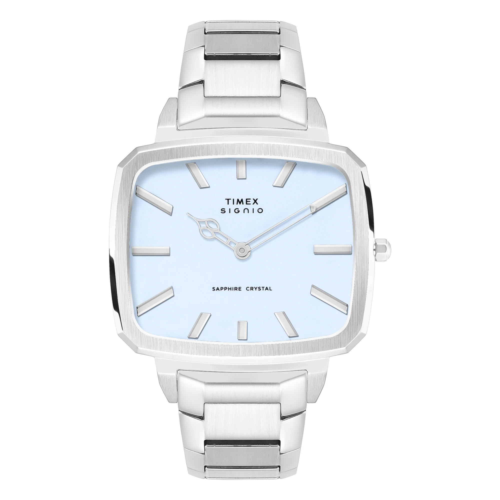
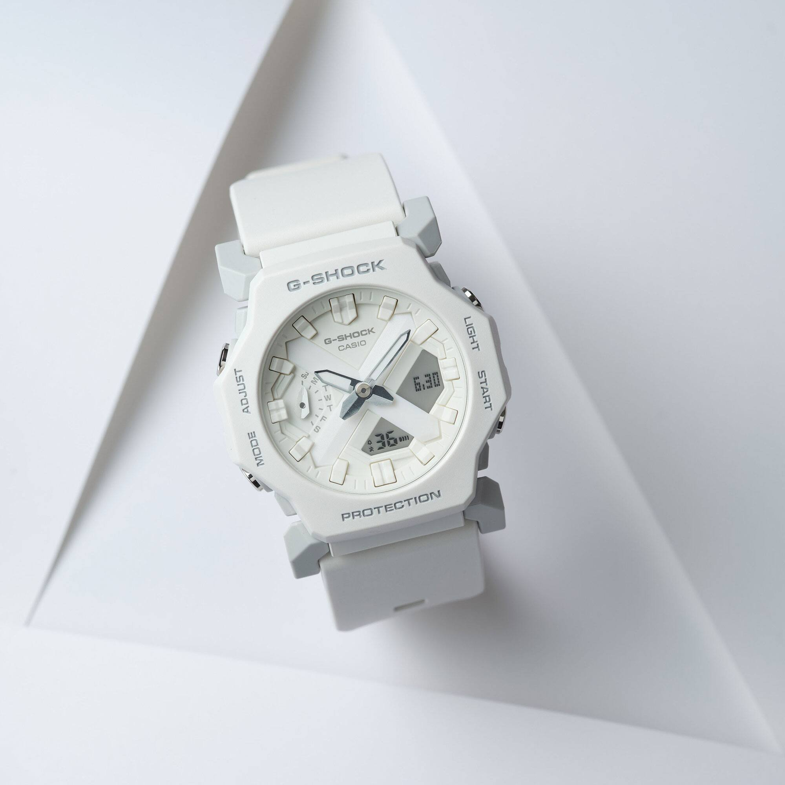
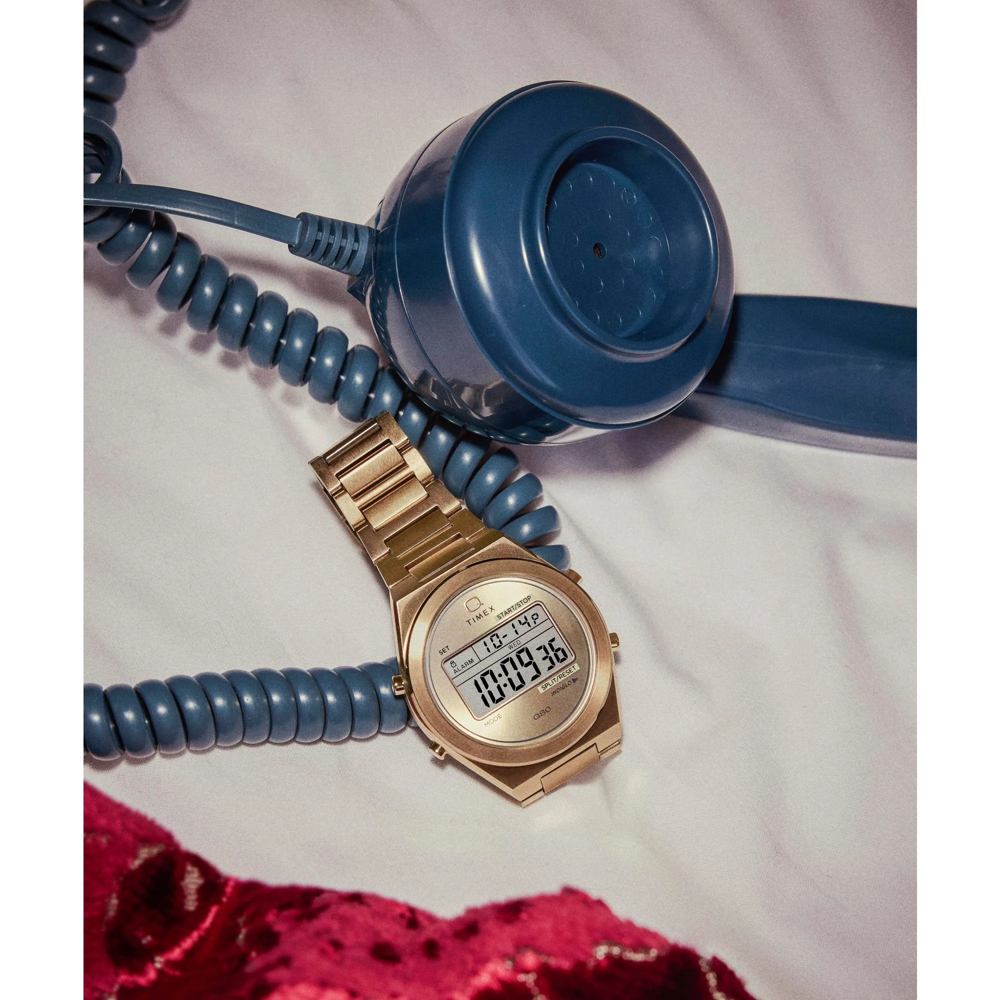
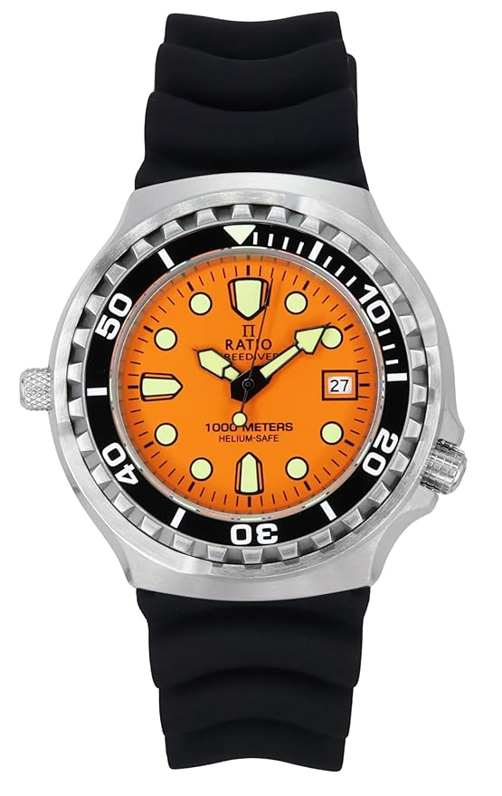
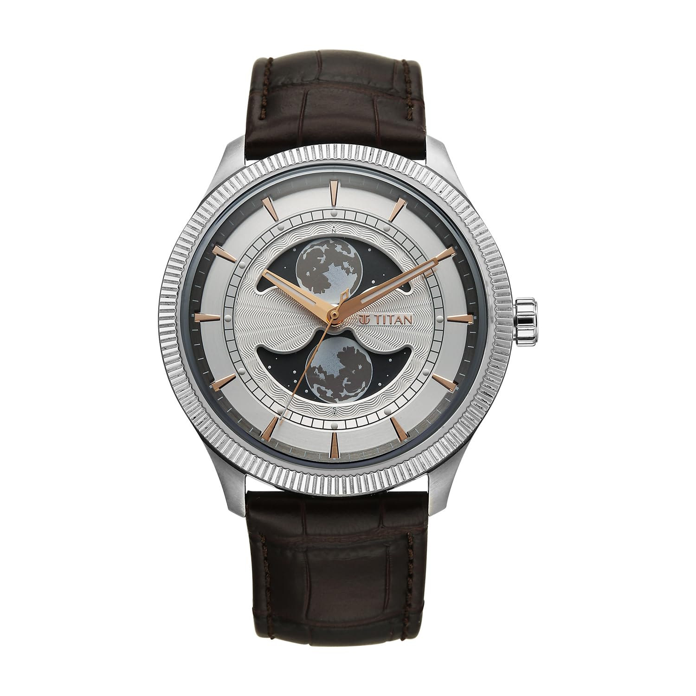
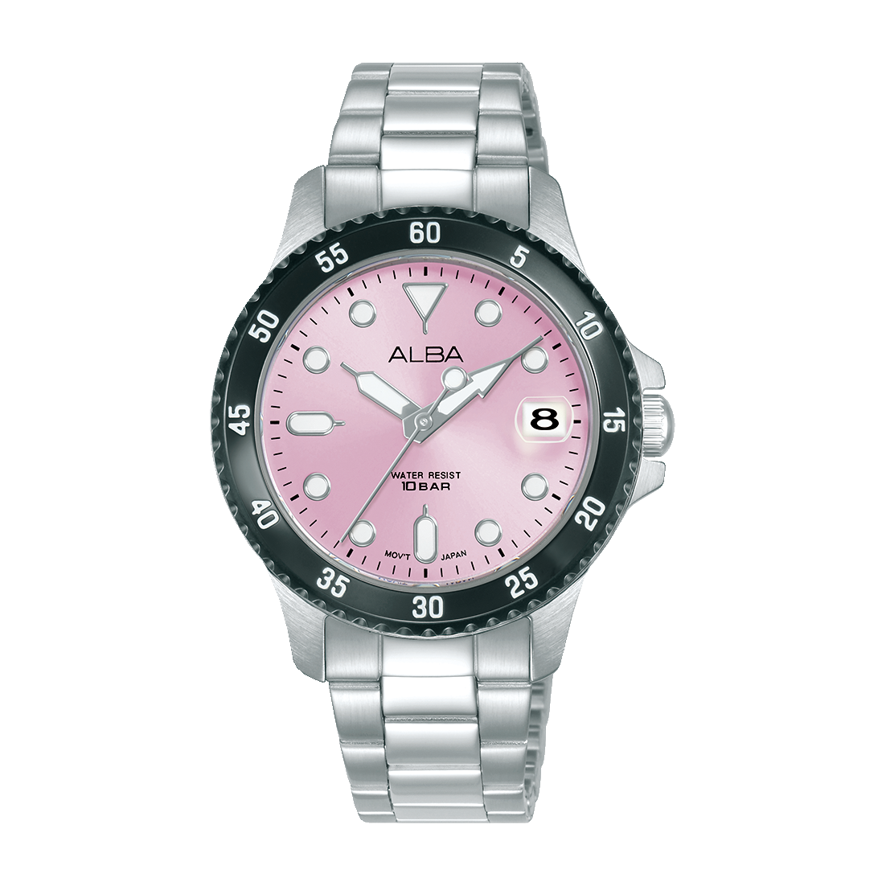

The [under ₹5,000 guide](/blog/best-watches-under-5k/) got great reviews. Like, people actually really loved it. So here we are with the sequel nobody asked for but everybody needed.

The ₹5,000 to ₹10,000 bracket is where things get genuinely dangerous for your wallet. You are past the entry-level zone and into territory where watches start packing serious specs: sapphire crystals, automatic movements, 1000-metre dive ratings, and moonphase complications. Stuff that would cost you multiples more from the big Swiss names. And the variety here is wild. You have got CasiOaks channeling luxury sports watch energy, a Singaporean micro-brand diver that has no business being this good, a Titan with an actual moonphase complication, and a pink Alba that we are putting on a men's watch list because rules are fake.

None of the watches from the under ₹5,000 list are repeated here. If you missed that one, [go read it](/blog/best-watches-under-5k/). If you want to go even cheaper, the [Best Watches Under ₹3,000](/blog/best-watches-under-3k/) guide has some absolute legends. And for Timex-specific picks in this range, the [Best Timex Under ₹10,000](/blog/timex-under-10k/) deep-dive has you covered.

Prices are as of May 2026 and will fluctuate. Let's go.

---

# 1. The Race Car on Your Wrist

## [Casio Edifice ED599](https://amzn.to/4uleRXJ) – ₹9,395

Casio Edifice ED599 Sunburst Blue Dial

**Key Specifications:**
- **Case Size:** 47mm Stainless Steel
- **Display:** Analog + Digital
- **Water Resistance:** 100 Meters
- **Battery Life:** 10 Years
- **Features:** World Time, Stopwatch, Timer, 3 Daily Alarms

The Edifice line has always been Casio's answer to the motorsport-obsessed crowd, and the ED599 leans into that energy hard. The official model number is EFV-C110D, but everyone in India knows it as the ED599, and one look at that sunburst blue dial will make you understand why this thing sells.

The dial is the star. A deep, shifting blue with sharp silver accents that catches light like the hood of a freshly waxed sports car. There is a futuristic, almost sci-fi quality to the whole design, part race car dashboard, part spaceship instrument panel. This is not a watch that whispers elegance. This is a watch that kicks the door open and says "I'm here."

Behind the looks, you get the full Casio digital arsenal. World time across 48 cities, a 1/100-second stopwatch, countdown timer, three daily alarms, and the legendary 10-year battery life that means you can literally forget about maintenance for a decade. The analog-digital combo display gives you the best of both worlds, traditional watch aesthetics with the precision of digital readouts.

At 47mm in stainless steel with a matching bracelet, it has real wrist presence. It is a confident, bold watch that works surprisingly well with everything from office wear to weekend fits.

**Also worth knowing:** There is a golden dial variant that swaps the blue for a warm champagne tone. Different energy entirely, equally cool.

<a href="https://amzn.to/4uleRXJ" target="_blank" rel="noopener noreferrer" class="buy-cta">→ Buy on Amazon</a>

---

# 2. The Head Turner Nobody Expects

## [Timex Signio TWEG34101](https://amzn.to/4f3m367) – ₹9,995

Timex Signio TWEG34101 Rectangular Blue Dial

**Key Specifications:**
- **Case Size:** 41mm Rectangular
- **Dial:** Blue
- **Bracelet:** Stainless Steel
- **Crystal:** Mineral Glass
- **Water Resistance:** 30 Meters

Square/Rectangular watches have always occupied a special corner in horology. And the Signio borrows from the same design language: sharp edges, geometric confidence, and a refusal to blend in with the round-everything crowd. And maybe, think of the rectangle lying down horizontally.

The TWEG34101 takes that rectangular case and pairs it with one of the most unique hour hand designs we have seen at this price. It is genuinely distinctive. The kind of detail that makes you do a double take and then stare at your own wrist for an uncomfortably long time. The blue dial against the stainless steel case and bracelet creates a combination that looks far more expensive than ten thousand rupees.

At 41mm, the proportions are well balanced, large enough to have presence but not so big that it overwhelms. The slim profile slides under shirt cuffs easily, making it a genuine dress watch contender in a price range dominated by chunky sports pieces.

**Why it stands out:** In a sea of round dials, this thing is a rectangular island. People will notice it. People will ask about it. That is not something you can say about most watches under ten thousand.

<a href="https://amzn.to/4f3m367" target="_blank" rel="noopener noreferrer" class="buy-cta">→ Buy on Amazon</a>

---

# 3. The CasiOak That Got the Colour Right

## [Casio G-Shock G1388](https://amzn.to/3RprLWa) – ₹9,195

Casio G-Shock GA-2100 CasiOak Black with Mint Green Accents

**Key Specifications:**
- **Case Size:** 45.4mm (Carbon Core Guard)
- **Weight:** ~51g
- **Water Resistance:** 200 Meters
- **Display:** Analog + Digital
- **Features:** World Time, Stopwatch, Timer, 5 Alarms

Let's talk about the CasiOak phenomenon for a second. When Casio dropped the GA-2100 in 2019, the internet collectively lost its mind. The octagonal bezel bore a striking resemblance to the Audemars Piguet Royal Oak, a watch that costs roughly 200 times more. The nickname "CasiOak" was coined by Steven Davila in the Scottish Watches Facebook group, and it stuck. Permanently.

Here is the thing Casio will tell you though: the octagonal design was never meant to copy the Royal Oak. The original G-Shock from 1983, the DW-5000C, already had an octagonal bezel. Casio was referencing its own history. Don't believe me? Go count. The result is one of the most desirable watches on the planet at any price point.

This particular colourway, the G1388, is the one that gets it perfect. All black case, all black dial, with these beautiful mint green accents on the hands, the hour markers, and subtle dial details. It is the exact right amount of fun without being loud. Dark enough to wear with literally anything, but with just enough colour pop to make it interesting.

The Carbon Core Guard structure keeps the weight to a wild 51 grams. 200 metres of water resistance. World time across 48 cities. Five daily alarms. And the hand-shift feature that moves the analog hands out of the way when you are using the digital display. At ₹9,195, this is one of the best value propositions in the entire G-Shock lineup.

**The bottom line:** If you want one watch that does everything, office, gym, travel, swimming, or just looking cool, the CasiOak is it. This colourway specifically is just chef's kiss.

<a href="https://amzn.to/3RprLWa" target="_blank" rel="noopener noreferrer" class="buy-cta">→ Buy on Amazon</a>

---

# 4. The Compact G-Shock That Gives Omnitrix Energy

## [Casio G-Shock G1552](https://justintime.in/collections/mens-watches/products/casio-g-shock-men-quartz-white-dial-analog-digital-resin-watch-g1552?variant=50060551291155) – ₹8,995

Casio G-Shock GA-2300 Compact White

**Key Specifications:**
- **Case Size:** 42.1mm (Carbon Core Guard)
- **Weight:** ~49g
- **Water Resistance:** 200 Meters
- **Display:** Analog + Digital
- **Features:** World Time, Stopwatch, Timer, Alarms

Do you remember the Omnitrix from Ben 10? That chunky, alien-tech wristwatch that every kid in the 2000s desperately wanted? The GA-2300 has that energy. It is hard to explain why. Something about the compact proportions, the slightly unconventional case shape, and the way it sits on the wrist like a gadget rather than just a watch. It just feels like it should do more than tell the time. It feels like it should transform you into something.

But design nostalgia aside, the GA-2300 is genuinely one of the best G-Shocks Casio has released in years. At 42.1mm and 49 grams, it is noticeably more compact and lighter than most G-Shocks. That is a big deal. A lot of people love the idea of a G-Shock but bounce off the whole "wearing a dinner plate on your wrist" thing. The GA-2300 fixes that completely.

You still get everything that makes a G-Shock a G-Shock. The Carbon Core Guard for shock resistance. 200 metres of water resistance. World time, stopwatch, countdown timer. Neobrite hands that glow in the dark. All the standard features in a package that finally fits smaller wrists without looking ridiculous.

All the colourways look good, but we are going with the white here. It pops. It is funky. It is different. And different is the whole point.

**Why this over the regular CasiOak:** If 45mm is too much watch for your wrist, the GA-2300 at 42mm is the answer. Same DNA, more comfortable proportions.

---

# 5. The Digital Watch That Looks Like a Million Bucks

## [Q Timex TW2Y09700UJ](https://amzn.to/4urwRQn) – ₹8,396

Q Timex Q80 Continental Gold Digital

**Key Specifications:**
- **Case Size:** 39mm Brushed Stainless Steel
- **Display:** Digital (Rectangular LCD)
- **Bracelet:** Gold-tone Brushed Stainless Steel
- **Water Resistance:** 50 Meters
- **Special Feature:** INDIGLO® Backlight

This one made us stop and stare for an embarrassing amount of time. Imagine if the classic Q Timex and the Tissot PRX had a baby, and that baby also happened to be digital. That is the Q80 Continental.

The Q Timex line has always been about channeling retro cool, but this particular model takes it somewhere new entirely. The 39mm brushed stainless steel case with polished edges feels premium. The rectangular digital display sits inside a round case, encircled with sunburst brushing that catches light in the most satisfying way. And in gold? Good lord. This watch looks so posh, so sophisticated, so quietly expensive that wearing it feels like getting away with something.

Timex drew inspiration from the bold designs and decadent glamour of West Hollywood for this one, and it shows. There is a retro-meets-art-deco elegance here that you simply do not find at this price. The brushed gold bracelet is the kind of metal work that watchmakers charging three or four times this would be proud of.

You get the standard Timex digital feature set (chronograph, alarm, day and date) plus the iconic INDIGLO backlight for late-night time checks. At 50 metres of water resistance, it handles rain, hand-washing, and light swimming without drama.

**Our strong recommendation:** Go gold. The silver version is nice, but the gold is where this watch truly becomes something special. It is classy, it is cool, it is unapologetically glamorous.

<a href="https://amzn.to/4urwRQn" target="_blank" rel="noopener noreferrer" class="buy-cta">→ Buy on Amazon</a>

---

# 6. The Boardroom-to-Bar Daily Beater

## [Casio A2523](https://amzn.to/4dmMcvu) – ₹6,995

Casio MTP-B195D A2523 Angular Metal Watch

**Key Specifications:**
- **Case Size:** 38mm (46.5mm lug-to-lug)
- **Case Material:** Stainless Steel
- **Dial:** Octagonal, Brushed Metal Finish
- **Complication:** Date Display
- **Weight:** 114g
- **Water Resistance:** 50 Meters

Every collection needs a daily beater. Not the flashiest watch in the drawer, not the one you baby and protect from scratches. The one you just grab and go. Office meeting at 9? This. Friday night out at 10? This. Weekend grocery run? This. The Casio A2523 is that watch.

The beauty of the MTP-B195D is in its quiet confidence. The angular, octagonal case design is modern without being aggressive. The brushed metal finish across the entire case and bracelet gives it a serious, business-appropriate look. At 38mm on the dial with 46.5mm lug-to-lug, it sits perfectly on a wide range of wrist sizes, from 5.5 inches to 7.5 inches, without looking too big or too small on anyone.

The stainless steel construction means it has proper heft, 114 grams of reassuring weight on the wrist, and the fold-over clasp is satisfying to close. A date window handles the only complication you actually need on a daily wearer. Nothing more, nothing less. No fuss.

50 metres of water resistance means you do not need to take it off for hand-washing, rain, or even a casual dip. It just works. Every day. Without demanding attention or maintenance.

**Why we love it:** Some watches are conversation starters. The A2523 is a conversation finisher; it does its job so well that you never think about it. And that is perhaps the highest compliment you can give a daily beater.

<a href="https://amzn.to/4dmMcvu" target="_blank" rel="noopener noreferrer" class="buy-cta">→ Buy on Amazon</a>

---

# 7. The Micro-Brand Diver That Punches Absurdly Above Its Weight

## [Ratio Free Diver V2](https://amzn.to/49YoCmr) – ~₹10,999

Ratio Free Diver V2 Automatic 1000m Dive Watch

**Key Specifications:**
- **Water Resistance:** 1,000 Meters. Yes, one thousand.
- **Crystal:** Sapphire (Anti-Reflective)
- **Movement:** Quartz VX42E/Automatic (NH36A, Seiko-calibre, Costs more)
- **Special Features:** Helium Release Valve, Super Luminous Markers
- **Construction:** Screw-down Crown, Screw-down Caseback, Ceramic Bezel Insert

Okay, full transparency. This one technically costs about ₹10,999, which is over our ₹10,000 limit. But with the card discounts that are almost always available, you can get it around ten thousand. And even if you pay full price, we could not in good conscience leave this watch off the list. It is too insane.

Ratio is a Singapore-based micro-brand that has been quietly building a cult following among dive watch enthusiasts. The Free Diver V2 is their crown jewel, and the spec sheet reads like a joke. One thousand metres of water resistance. Sapphire crystal with anti-reflective coating. A Seiko NH36A automatic movement with hand-winding and hacking. A helium release valve, a feature designed for actual saturation divers who need to decompress safely, something you normally find on watches costing ₹50,000 and above. Super lume markers that glow like radioactive beacons in the dark.

For context: the Seiko Prospex line starts delivering 200-metre divers at more than ₹30,000. The Citizen Promaster does similar at roughly the same price. And here is Ratio, a micro-brand, delivering five times the depth rating, sapphire crystal, and an automatic movement for a third of the cost. It genuinely does not make sense.

The watch is chunky — we are not going to lie about that. But it is a pure tool diver, and tool divers are supposed to be chunky. On the wrist, it is a genuine conversation piece. People will ask about it. You will get to explain what a helium release valve is. And that, honestly, is half the fun.

**The bottom line:** If you are even remotely into dive watches or mechanical movements, the Ratio Free Diver V2 is the best value proposition in India right now. We are not being hyperbolic. The specs-to-price ratio (pun intended) is genuinely unmatched.

<a href="https://amzn.to/49YoCmr" target="_blank" rel="noopener noreferrer" class="buy-cta">→ Buy on Amazon</a>

---

# 8. The Moonphase That Has No Business Existing at This Price

## [Titan Stellar 10050SL01](https://amzn.to/3RF9dBf) – ₹9,495

Titan Stellar Dual Moonphase 10050SL01

**Key Specifications:**
- **Case Size:** 43mm (47.5mm lug-to-lug)
- **Thickness:** 11.25mm
- **Movement:** In-house Quartz 7129A
- **Special Feature:** Oversized Dual Moonphase Display with Luminous Craters
- **Crystal:** Curved Mineral Glass
- **Water Resistance:** 50 Meters (5 ATM)

We give Titan a hard time sometimes. There are moments where the value-for-money equation does not quite add up compared to what Casio or Timex offer at the same price. Credit where credit is due though — with the Stellar Dual Moonphase, Titan has created something genuinely special.

A moonphase complication at under ₹10,000 is already rare. A *dual* moonphase showing the moon's journey as seen from both hemispheres? At this price? We cannot think of another watch that does this. Not from Casio. Not from Timex. Not from Seiko. Nobody.

The oversized moonphase sub-dial dominates the lower half of the dial and Titan has filled the craters with lume material, so they actually glow in the dark. It is a beautiful, almost poetic touch: a little luminous moon on your wrist when the lights go off. The fluted bezel adds a premium frame to the whole package, and the ultra-fine pressed dial pattern shifts subtly with light, adding depth that flat dials cannot match.

The Stellar is available in Classic Leather, Classic Blue, and IP Bronze finishes. Each one has a different personality. The movement is Titan's in-house Quartz 7129A, which handles both timekeeping and the moonphase mechanism.

At 43mm with 47.5mm lug-to-lug, it is on the bigger side. If you have wrists under 6.5 inches, try it on before committing. For everyone else, it wears beautifully.

**Why we love it:** Titan went and made an actual celestial-themed timepiece with luminous craters and dual-hemisphere moon tracking for under ten grand. That deserves respect. Genuine kudos.

<a href="https://amzn.to/3RF9dBf" target="_blank" rel="noopener noreferrer" class="buy-cta">→ Buy on Amazon</a>

---

# Funky Pick: The Bubblegum Statement

## [Alba AG8Q37X1](https://justintime.in/collections/mens-watches/products/alba-men-quartz-pink-dial-analog-stainless-steel-watch-ag8q37x1?variant=53933277577491) – ₹10,000 (or less)

Alba AG8Q37X1 Bubblegum Pink Dial

**Key Specifications:**
- **Case Size:** 34mm Stainless Steel
- **Dial:** Bubblegum Pink
- **Movement:** Quartz (Calibre VJ32)
- **Crystal:** Mineral with Magnifier
- **Water Resistance:** 100 Meters
- **Construction:** Screw Case Back

Yeah. It is pink. Yeah, it is technically listed as a women's watch. And yeah, we are putting it on this list anyway.

Here is our stance and we are not backing down from it: all watches are unisex. Seriously. The whole "men's watches" and "women's watches" distinction is almost entirely a marketing construct. The watchmaking world has been slowly waking up to this, with brands like Cartier, Patek Philippe, and Grand Seiko increasingly designing pieces that intentionally blur the line. If a 36mm Rolex Datejust is perfectly fine on a man's wrist in 2026, a 34mm Alba in pink is fair game too.

And this one is genuinely charming. The bubblegum pink dial against the full stainless steel case and bracelet creates this fun, almost candy-like aesthetic that just makes you smile. It is playful. It is confident. It is the kind of watch that says "I wear what I like and I do not need your approval for it."

Alba, for those unfamiliar, is a subsidiary of Seiko, the same parent company behind Grand Seiko, Presage, and the venerable Seiko 5. The VJ32 calibre inside is a reliable workhorse. The screw case back and 100-metre water resistance give it proper robustness despite the delicate colour palette. And at 34mm, it sits compact and elegant on the wrist.

**Who is this for:** Not everyone. And that is exactly the point. If you see this and your immediate reaction is "I would never," it was never meant for you. But if you see it and feel even a tiny spark of "actually, that is kind of fun" — trust that instinct. Life is way too short for boring watches.

---

# Final Thoughts

The ₹5,000 to ₹10,000 segment is where the Indian watch market gets properly exciting. You are no longer just buying function: you are buying personality, engineering heritage, and genuine design ambition. A Singapore micro-brand diver with 1000-metre ratings. A Titan with dual moonphase. An Indian-market CasiOak in the best colourway. A digital Q Timex that looks like it belongs in a luxury boutique. This price range is stacked.

**Our top picks:**

- **Best value, period:** The **Casio G-Shock CasiOak G1388**. 200m water resistance, 51 grams, and the coolest colourway in the entire GA-2100 lineup. Nothing else at this price gives you this much watch.
- **Most insane specs-to-price:** The **Ratio Free Diver V2**. 1000m depth rating, sapphire crystal, automatic movement. We are still not over it.
- **Most unique:** The **Titan Stellar Moonphase**. Dual moonphase with luminous craters under ten thousand rupees. Nobody else is doing this.
- **Best daily wearer:** The **Casio A2523**. Grabs and goes without complaint. Boardroom to bar, every single day.
- **Best looking:** The **Q Timex Q80 Continental** in gold. Posh, sophisticated, and unapologetically glamorous.
- **Best for small wrists:** The **Casio G-Shock G1552** at 42mm. Compact G-Shock energy without the bulk.
- **Best conversation starter:** The **Alba AG8Q37X1** in pink. Not for everyone, massively charming for the right person.

Prices fluctuate constantly, especially during Amazon and Flipkart sales. Always shop around. Want to make sure you are buying from trusted sellers? Our [Where to Buy Watches in India](/blog/where-to-buy-watches-in-india/) guide covers every reliable retailer. Looking for more in a similar budget? The [Best Timex Under ₹10,000](/blog/timex-under-10k/) guide has a Timex-only deep dive. And if Japanese watches are calling, the [Fun Japanese Watches Under ₹50,000](/blog/japanese-watches-under-50k/) guide awaits.

Happy hunting.
