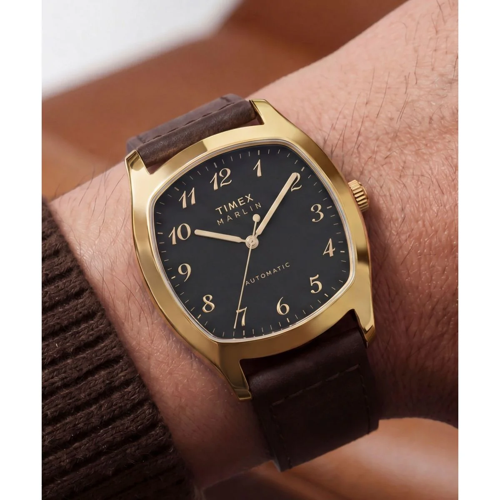
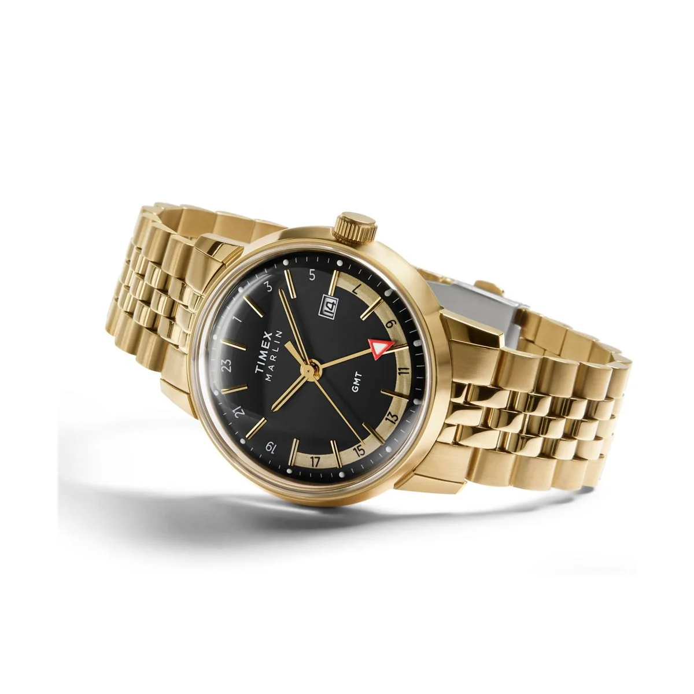
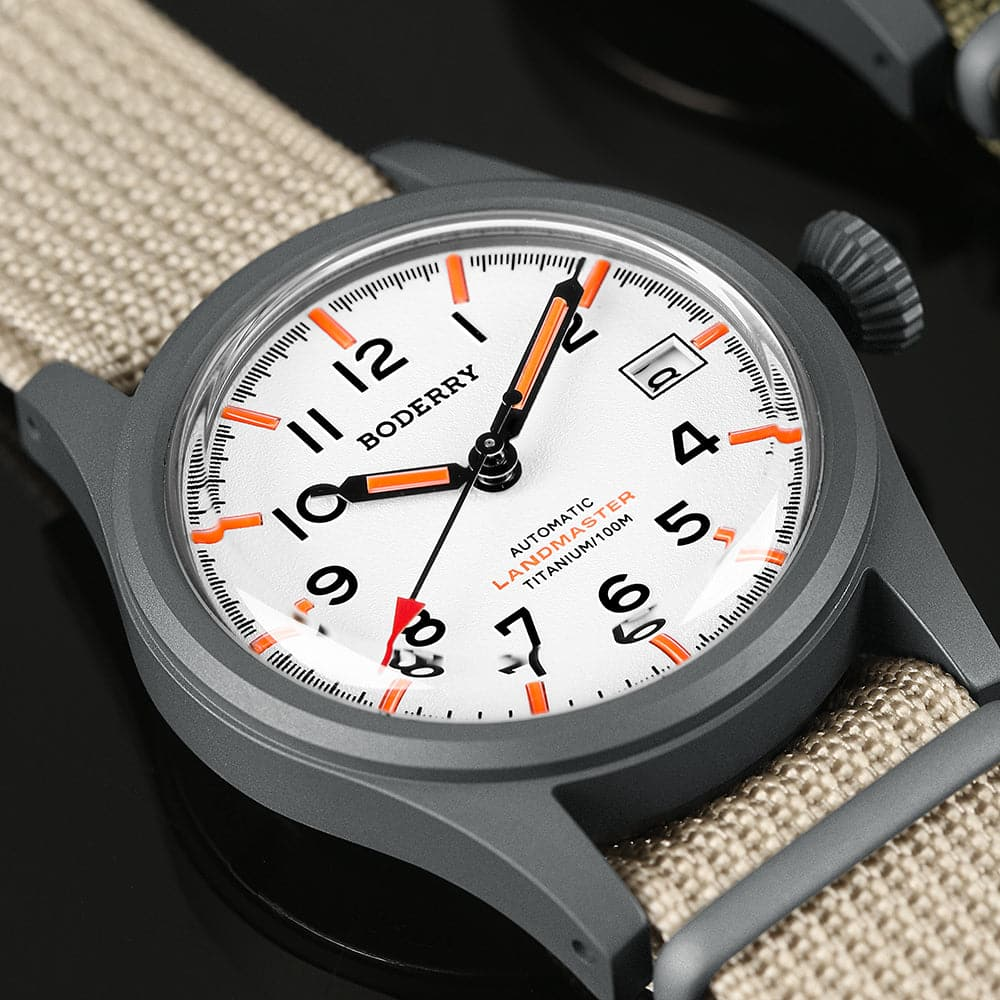
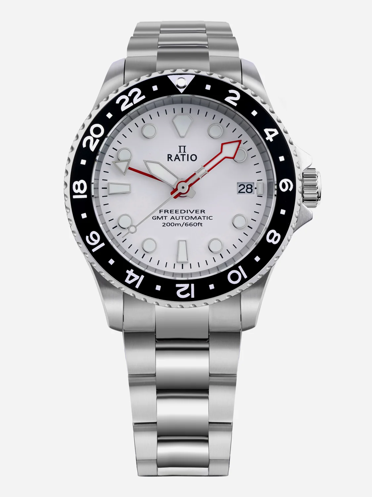
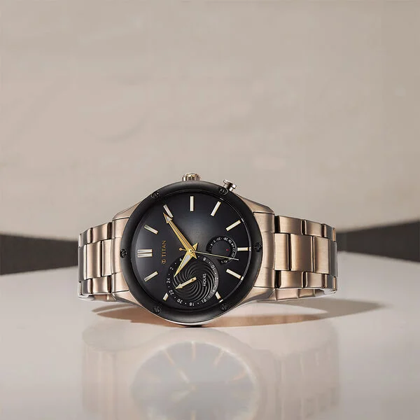
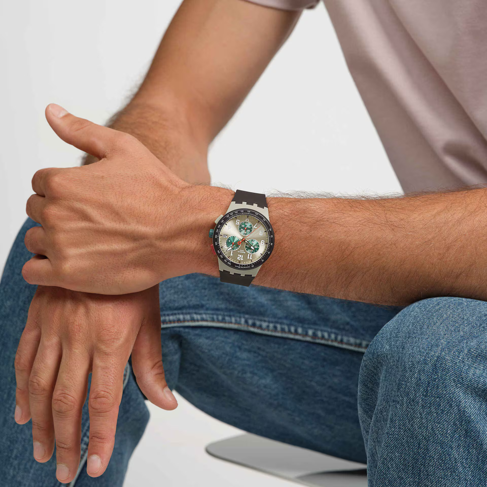
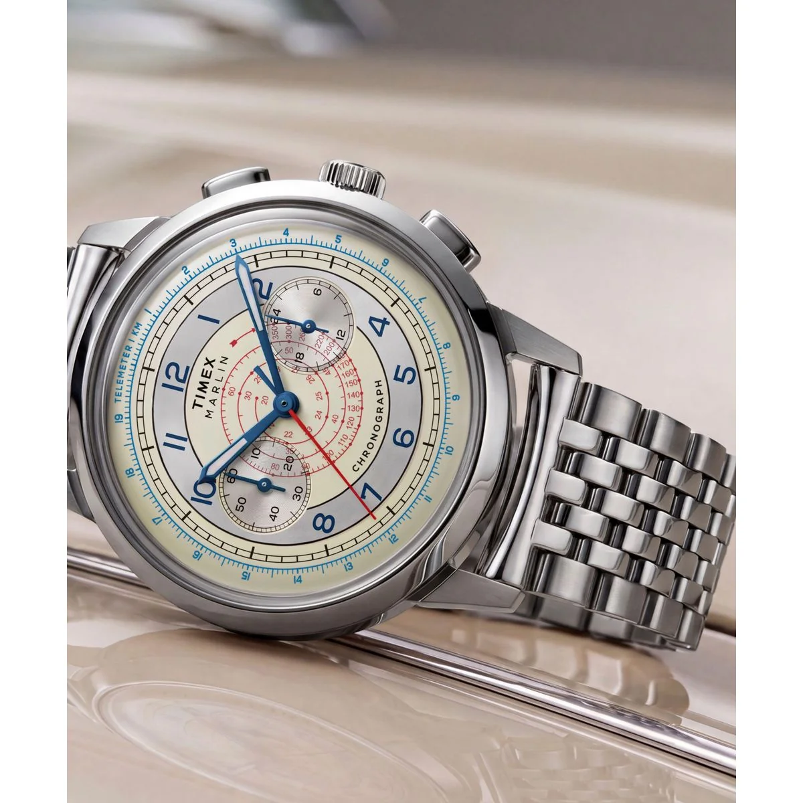

We have done [under ₹5,000](https://thewristjournal.com/blog/best-watches-under-5k/) and [under ₹10,000](https://thewristjournal.com/blog/best-watches-under-10k/). Naturally, the next step is to help you spend more money. Very responsible of us. But ₹20,000 is a slightly awkward watch budget. There are some lovely watches here, alongside quite a few that make you wonder what the extra money actually bought. Spending twice as much does not automatically get you twice the watch.

This list is for the ones that give you a reason to move up. A dressy little automatic with an unusual case, a titanium field watch, an affordable automatic GMT, and a few chronographs that earn their place largely by looking very, very good. There is also one Timex above the limit, clearly marked as a stretch pick. We have not discovered a new way of rounding down.

*Prices are indicative and can change. Timex estimates below use the listed MRP less 10%, subject to the offer applying at checkout. Other retailer prices reflect the shortlist used for this guide, rather than guaranteed live offers.*

## 1. The Marlin That Dressed Up

### [Timex Marlin Tonneau TW2Y84500IK](https://shop.timexindia.com/products/timex-marlin-tonneau-36mm-black-dial-mechanical-automatic-men-watch-tw2y84500ik) | Around ₹19,796 with 10% off

*MRP: ₹21,995*

**The essentials:** 36mm stainless steel case, automatic movement, mineral crystal, leather strap, 50m water resistance.

This is a lovely little thing. The softened square shape, somewhere between a cushion and a tonneau, gives it a very different look from the usual round Marlin. Add the black dial, gold-tone case and those curly numerals, and it looks like it should come with a neatly pressed shirt. The brown leather strap works nicely with the warm case colour too. Nothing here needs to shout to get your attention.

At 36mm, this is one of the more promising options for smaller wrists, although a shaped case will wear differently from a round watch of the same width. You get an automatic movement and an exhibition caseback, but the design is the reason we would buy it. Mineral glass is a compromise at nearly ₹20,000, and the 12mm thickness means it is not an ultra-thin dress watch. Still, if you want something dressy without buying another round white dial on black leather, this is a very appealing detour.

[View on Timex India](https://shop.timexindia.com/products/timex-marlin-tonneau-36mm-black-dial-mechanical-automatic-men-watch-tw2y84500ik)

## 2. The One With a Meeting at Nine

### [Timex Marlin GMT TW2Y47700IK](https://shop.timexindia.com/collections/marlin/products/timex-marlin-black-round-dial-analog-mens-watch-tw2y47700ik) | Around ₹15,296 with 10% off

*MRP: ₹16,995*

**The essentials:** 40mm stainless steel case, quartz GMT movement, domed acrylic crystal, steel bracelet, 50m water resistance.

Gold case, gold bracelet, black dial. This thing looks like it has opinions about your investment portfolio. It is a much bolder combination than the Tonneau, but the simple round case and dark dial keep it from becoming too much. The red-tipped GMT hand adds a small break in the colour scheme, and the domed crystal is a big part of the appeal. That curved profile gives the Marlin a warmth that a flat crystal would lose.

The GMT hand lets you follow a second time zone, and this is a quartz watch, so you can leave it in a drawer for a few days without coming back to a stopped movement. The catch is that the dome is acrylic. Lovely for the vintage look, less lovely if scratches bother you. We like this as a slightly flashy everyday watch, especially at the discounted price. You do not need international business interests to enjoy a GMT. A friend who moved abroad will do.

[View on Timex India](https://shop.timexindia.com/collections/marlin/products/timex-marlin-black-round-dial-analog-mens-watch-tw2y47700ik)

## 3. Titanium, Minus the Fuss

### [Boderry Landmaster](https://link.amazon/B026dQz3Y) | Around ₹18,950

**The essentials:** 38mm titanium case, NH35 automatic movement, domed sapphire crystal, 100m water resistance.

The Landmaster is the pick for someone who likes their watches a little quieter. The straightforward field-watch layout and muted titanium finish give it a useful, unfussy appearance, and the compact case is a welcome change from outdoor watches that seem to require their own sleeve. Titanium, sapphire and an automatic movement make a convincing package at this price. Just keep the 48mm lug-to-lug measurement in mind. A 38mm diameter does not tell the whole story.

The weak points are the lume and the stock strap. The lume is underwhelming, which is particularly annoying on a field watch, and the strap is fairly ordinary. We would leave room in the budget for a replacement instead of assuming the purchase ends with the watch. It still makes sense if you specifically want a light titanium automatic with a restrained design, but those compromises stop it from being an automatic recommendation for everyone. Yes, even though it is automatic.

[View on Amazon](https://link.amazon/B026dQz3Y)

## 4. The GMT Without the Pepsi Tax

### [Ratio FreeDiver GMT RTF057](https://link.amazon/B0bXonqKj) | Around ₹14,500

**The essentials:** 40mm stainless steel case, NH34 automatic GMT movement, sapphire crystal with anti-reflective coating, 200m water resistance.

Ratio is back, and this time it has brought another time zone. The RTF057 pairs a clean white dial with a black 24-hour bezel, giving it that familiar dive-watch shape without making the whole thing too busy. The Pepsi version was roughly ₹5,000 more in our shortlist. Unless the red and blue bezel is the entire reason you want one, we would happily keep the money and take this. Black and white is hardly a punishment.

An automatic GMT with sapphire at around ₹14,500 is a strong proposition. The NH34 gives you a separate GMT hand for a second time zone, while the screw-down crown and 200m rating add to the practical appeal. It is 13.6mm thick, though, so do not mistake the tidy dial for a slim watch. This is the one we would investigate first if an automatic GMT is the priority. Check the seller's warranty arrangements before ordering, particularly when comparing an Indian listing with a direct overseas purchase.

[View on Amazon](https://link.amazon/B0bXonqKj)

## 5. The Titan We Would Buy for the Dial

### [Titan Stellar 10009KM03](https://link.amazon/B0eGqo6Lb) | Around ₹14,396

**The essentials:** 42.2mm stainless steel case, quartz multifunction movement, mineral glass, steel bracelet.

The colour is what gets us here. Titan calls it brown, which is accurate but does not sound nearly as interesting as the watch looks. The warm metallic shades, contrasting bezel and detailed dial make a handsome combination, especially if your collection is already drowning in black, blue and silver. The 24-hour and date subdials give the face some activity without needing a chronograph, and the whole thing has enough going on to reward a second look.

The rest of the package is fairly ordinary, and that is worth saying. This is a quartz multifunction watch with mineral glass, so we would choose it because we liked the design, rather than because it wins a specification contest. Around ₹14,400, that is a reasonable argument. At the ₹17,995 MRP, we would be less enthusiastic. It is also 49.2mm long, so try it on if your wrist is small. A pretty dial only gets you so far if the lugs are hanging over the sides.

[View on Amazon](https://link.amazon/B0eGqo6Lb)

## 6. The CasiOak With Better Armour

### [Casio G-Shock GM-2100BM-1ADR (G1762)](https://link.amazon/B0aVbboJz) | ₹17,995

**The essentials:** 44.4mm case width, resin and stainless steel construction, shock resistance, 200m water resistance, approximately 71g.

We already like the CasiOak. Give it a textured metal bezel and this is what happens: we start trying to justify another one. The GM-2100BM has a more industrial appearance than the plain resin models, with contrasting metal surfaces and dark sections that make the octagonal shape stand out. The texture is the main attraction here. It adds detail without needing a loud colour or a collaboration logo across half the dial.

Underneath, you still get the useful G-Shock stuff: world time, alarms, stopwatch, timer and a light, along with shock resistance and 200m water resistance. Be clear about what the extra money buys, though. This has a metal bezel around a resin case and a resin strap, and it runs on replaceable batteries. We would pick it for the finish and the look. If all you want is the CasiOak experience, the cheaper resin versions already do that very well.

[View on Amazon](https://link.amazon/B0aVbboJz)

## 7. The Edifice With All the Angles

### [Casio Edifice EFB-680D-7AVUDF (EX552)](https://link.amazon/B04fftt9H) | ₹13,995

**The essentials:** 45.8mm case width, quartz chronograph, sapphire crystal with glare-resistant coating, steel bracelet, 100m water resistance.

This Edifice looks like somebody at Casio put the curves away for the afternoon. The hexagonal bezel, sharp case lines and angular bracelet give it a crisp, sporty appearance, while the white dial keeps the chronograph layout from feeling too heavy. It is one of the more coherent designs in a category where adding another scale sometimes seems to count as product development.

The practical side is strong too. Sapphire with a glare-resistant coating, a solid steel bracelet, a chronograph and 100m water resistance for ₹13,995 is an easy package to like. The size is the sticking point. Casio lists it at 45.8mm wide and 151g, so this is a fairly substantial watch, even with a relatively modest 10.5mm thickness. Try it on before ordering if you prefer smaller watches. If it fits, this would be one of our first stops for an everyday steel chronograph.

[View on Amazon](https://link.amazon/B04fftt9H)

## 8. The One That Looks Like a Weekend

### [Swatch Obsidian Ink SUST402](https://luxury.tatacliq.com/swatch-obsidian-ink-quartz-chronograph-unisex-42-mm-sust402/p-mp000000025543526) | Around ₹14,700

**The essentials:** 42mm case, quartz chronograph, sunbrushed greenish-silver dial with an olive tint, dark green subdials, 3-bar water resistance.

Obsidian Ink sounds like it should be an all-black watch worn by a villain. Instead, you get this cheerful combination of a brushed greenish-silver dial with an olive tint, darker green subdials and small red accents. The colours are the whole attraction. It looks fresh without going neon, and the chronograph layout gives those green subdials plenty of room to do their thing. Of all the watches here, this is one of the easiest to imagine wearing with a T-shirt on a lazy Saturday.

At roughly ₹14,700, the Edifice makes a stronger case on specifications. The Swatch makes its case when you look at it. Its 3-bar rating is also a long way from the water resistance offered by the G-Shock or Ratio, so this would not be our swimming pick. We would consider it as a fun addition to a collection, particularly one that has become a little too sensible. Buying another black dial is not compulsory. We checked.

[View on Tata CLiQ Luxury](https://luxury.tatacliq.com/swatch-obsidian-ink-quartz-chronograph-unisex-42-mm-sust402/p-mp000000025543526)

## Stretch Pick: Fine, One More Marlin

### [Timex Marlin Neo Classic Chronograph TW3A00300UJ](https://shop.timexindia.com/products/timex-marlin-neo-round-40mm-silver-dial-analog-men-watch-tw3a00300uj) | Around ₹21,596 with 10% off

*MRP: ₹23,995. This one is above the ₹20,000 budget, even after the discount.*

**The essentials:** 40mm stainless steel case, quartz chronograph, domed acrylic crystal, steel bracelet, 50m water resistance.

The dial is an absolute banger. The pale background, blue details, red accents and all those little scales give it a vintage instrument look that is hard to ignore. There is plenty happening, but the colours tie it together nicely. Paired with the rounded case, curved pushers and domed crystal, it looks like a watch you might spot in an old photograph and immediately start searching for. Timex has been doing some very good things with the Marlin, and this is one of the most tempting.

You are paying for that design, so make sure you love it. The movement is quartz, the crystal is acrylic, and the discounted price still crosses our limit by about ₹1,600. None of that ruins the watch, but it does make this a more personal purchase than the Edifice. If the dial does nothing for you, save the money. If you have already zoomed into the photo three times, we suspect this paragraph is not going to help.

[View on Timex India](https://shop.timexindia.com/products/timex-marlin-neo-round-40mm-silver-dial-analog-men-watch-tw3a00300uj)

## Where We Would Spend the Money

The ₹15,000 to ₹20,000 bracket is a bit whacky. Some watches offer a clear reason to be here, while others feel stuck between excellent cheaper options and more tempting watches a little further up. We would start with the Edifice for an everyday chronograph, the Ratio for an automatic GMT, and the Marlin Tonneau for something dressier. The G-Shock is the pick if that textured metal bezel is what caught your eye in the first place.

But having ₹20,000 available does not mean you need to spend all of it. Drop below ₹15,000 and there are interesting Alba and Edifice options worth considering. If nothing here really grabs you, it is also worth looking at the Citizen and Seiko options above ₹20,000 before settling. Buy something because you keep wanting to look at it, because it suits how you live, or preferably both. An unused part of your budget is allowed to remain in your bank account. Even on a watch blog.

<!-- SPECIFICATION SOURCES, checked 27 September 2026:
Timex Tonneau: https://shop.timexindia.com/products/timex-marlin-tonneau-36mm-black-dial-mechanical-automatic-men-watch-tw2y84500ik
Timex GMT: https://shop.timexindia.com/collections/marlin/products/timex-marlin-black-round-dial-analog-mens-watch-tw2y47700ik
Boderry Landmaster family specifications, strap version: https://www.boderry.com/products/landmaster-titanium-automatic-field-watch-blue
Ratio RTF057: https://www.ratiowatches.com/products/ratio-freediver-gmt-series-sapphire-stainless-steel-white-dial-automatic-rtf057-200m-mens-watch
Titan: https://www.titan.co.in/product/titan-stellar-quartz-multifunction-watch-for-men-with-colour-stainless-steel-strap-10009km03.html
G-Shock: https://www.casio.com/in/watches/gshock/product.GM-2100BM-1A/
Edifice: https://www.casio.com/in/watches/edifice/product.EFB-680D-7AV/
Swatch: https://www.swatch.com/en-in/obsidian-ink-sust402/SUST402.html
Timex Neo Classic: https://shop.timexindia.com/products/timex-marlin-neo-round-40mm-silver-dial-analog-men-watch-tw3a00300uj
-->
