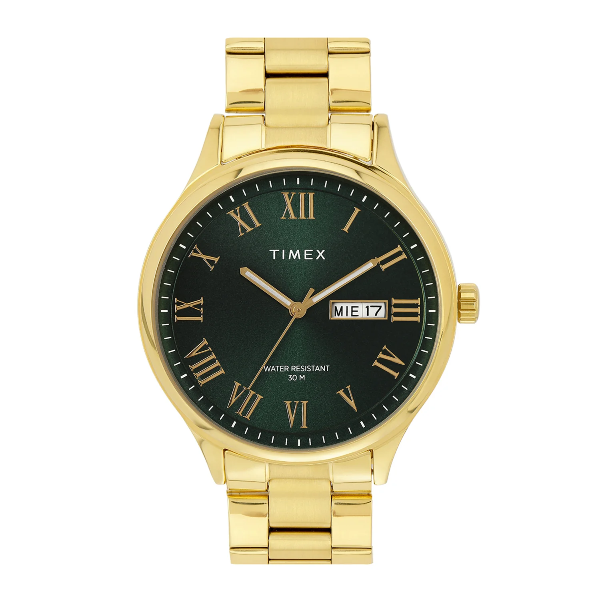
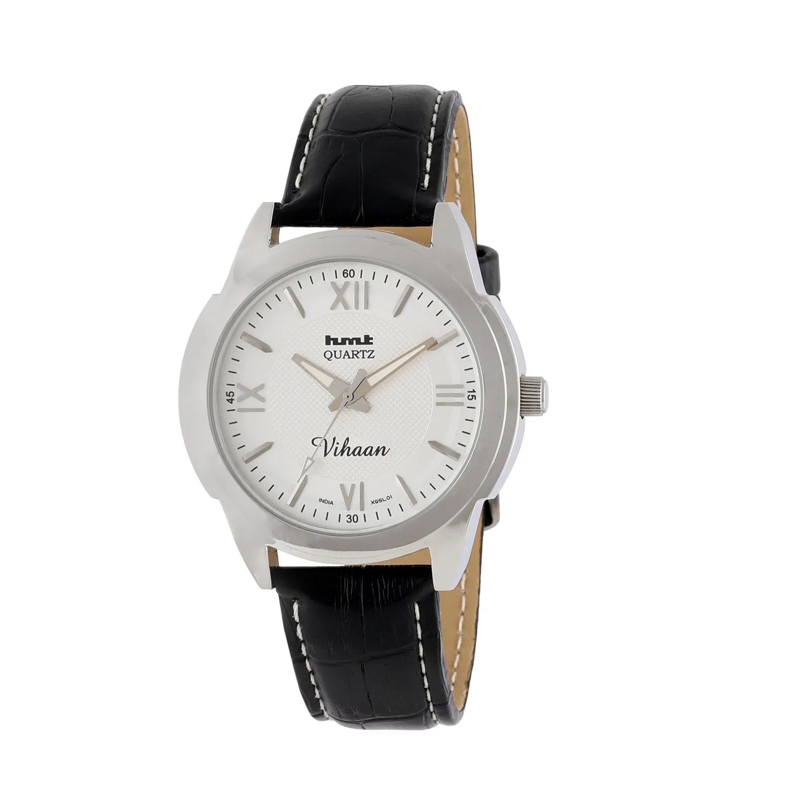

# Best Watches Under 3000 Rupees (2026 Edition)

Finding a great watch doesn't always mean breaking the bank. In fact, the sub-₹3,000 category is home to some of the most iconic, durable, and stylish timepieces ever made. From legendary Casio digital workhorses to elegant Timex dress watches and Indian classics from HMT, this price segment offers incredible value.

Whether you are looking for a rugged daily beater, a Retro statement piece, or a classy watch for office wear, we have curated the ultimate list of the **best watches under ₹3,000** available in India right now.

---

# 1. The Elegant Dress Watch

## [Timex Green Round Dial Analog Men's Watch - TWEG18446](https://shop.timexindia.com/collections/mens/products/timex-green-round-dial-analog-men-s-watch-tweg18446) – ₹3,495 (Often ₹2,000 - ₹3,000 on sale)

Timex Green Round Dial Analog Watch TWEG18446

**Key Specifications:**
- **Case Size:** 43mm
- **Dial Color:** Emerald Green
- **Strap:** Golden Stainless Steel Bracelet
- **Movement:** Quartz
- **Water Resistance:** 30 Meters

This watch is a masterclass in affordable elegance. The **dark emerald green dial** combined with Roman numeral markers gives it a timeless, sophisticated look that punches well above its price tag. The gold-tone case and bracelet add a touch of luxury, making it perfect for weddings, formal events, or simply elevating a smart-casual outfit.

**Why we love it:**
It looks significantly more expensive than it is. The combination of green and gold is a classic pairing that exudes confidence. At 43mm, it has a modern presence on the wrist, making it ideal for average to larger wrist sizes (6-8 inches).

---

# 2. The Absolute Legend

## [Casio F-91WG-9Q](https://www.casio.com/in/watches/casio/product.F-91WG-9Q/) – ₹1,195

Casio F-91WG-9Q Black and Gold

**Key Specifications:**
- **Case Size:** 38.2 × 35.2 × 8.5 mm
- **Battery Life:** 7 Years
- **Weight:** 21g
- **Water Resistance:** Water Resistant (Splash proof)
- **Features:** Alarm, Stopwatch, Hourly Signal

No budget watch list is complete without the legendary F-91W. This specific **Gold Edition (F-91WG-9Q)** adds a subtle touch of flair to the iconic utilitarian design. It is the most sold watch in the world for a reason: it is virtually indestructible, incredibly cheap, and carries a unique "cool factor" worn by everyone from former US Presidents to hipsters and blue-collar workers.

**Why we love it:**
It works on literally any wrist and with any outfit. It's a fashion statement that says you appreciate functional design. With a 7-year battery and a weight so light you'll forget you're wearing it, the F-91WG is the ultimate grab-and-go watch.

---

# 3. The Indian Classic

## [HMT XGSL 01](https://www.hmtwatches.store/product/58bc59e9-4151-458e-84ec-2bec4a832e9e) – Approx ₹2,000 - ₹3,000

HMT XGSL 01 Blue Dial

**Key Specifications:**
- **Case Size:** 40mm
- **Dial Pattern:** Textured / Patterned Blue
- **Strap:** Leather
- **Movement:** Quartz
- **Water Resistance:** 30 Meters

HMT (Hindustan Machine Tools) is an emotion for many Indians. While the mechanical hand-wound watches are hard to find, their quartz collection offers that same Indian essence with modern reliability. The XGSL 01 stands out with its beautiful patterned dial that catches the light in mesmerizing ways.

**Why we love it:**
It’s a piece of Indian history on your wrist. The 40mm case size is a sweet spot for almost all wrist sizes. If you want a conversation starter that isn't a typical Swiss or Japanese brand, an HMT is the way to go.

---

# 4. The Utility Beast

## [Casio W-96H-1BV](https://www.casio.com/in/watches/casio/product.W-96H-1AV/) – ₹1,495 - ₹1,995

Casio W-96H-1BV Dual Time

**Key Specifications:**
- **Case Size:** 43.9 × 35.7 × 12.5 mm
- **Battery Life:** 10 Years
- **Weight:** 32g
- **Water Resistance:** 50 Meters
- **Features:** Dual Time, Multi-function Alarm, Snooze

Often overshadowed by its siblings, the W-96H is a hidden gem. It features a large, highly legible display with big digits, making it incredibly easy to read at a glance. famously worn by Debra Morgan in the show *Dexter*, this watch is built for utility.

**Why we love it:**
The **10-year battery life** is a massive selling point. Combined with 50m water resistance and dual time capability, it is a fantastic travel companion or work watch. It’s slightly larger than the F-91W, giving it a more substantial feel without being bulky.

---

# 5. The Retro Icon

## [Casio A158WA-1](https://www.casio.com/in/watches/casio/product.A158WA-1/) – ₹1,695

Casio Vintage A158WA-1 Silver

**Key Specifications:**
- **Case Thickness:** 8.2mm
- **Strap:** Stainless Steel
- **Battery Life:** 7 Years
- **Water Resistance:** Water Resistant
- **Style:** Retro / Vintage

If the F-91W is the king of resin digital watches, the A158W is the king of retro steel. It serves pure 80s nostalgia with its chrome-plated case and stainless steel bracelet. It’s sleek, shiny, and effortlessly cool.

**Why we love it:**
It looks amazing with a denim jacket or a t-shirt. It has a charm that modern smartwatches simply cannot replicate. The adjustable clasp means you can get the perfect fit without visiting a watchmaker.

---

# 6. The World Traveler

## [Casio Royale AE-1200WH-1BV](https://www.casio.com/in/watches/casio/product.AE-1200WH-1BV/) – ₹2,995

Casio Royale AE-1200WH-1BV World Time

**Key Specifications:**
- **Case Size:** 45 × 42.1 × 12.5 mm
- **Battery Life:** 10 Years
- **Water Resistance:** 100 Meters
- **Features:** World Time Map, 5 Alarms, 1/100 sec Stopwatch

Affectionately nicknamed the "Casio Royale" due to its resemblance to a Bond watch, this is arguably the best value-for-money watch on the planet. The digital world map in the corner isn't just a gimmick—it actually shows your selected time zone.

**Why we love it:**
It is feature-packed! You get **100m water resistance**, a 10-year battery, and world time functionality for under ₹3,000. It looks tactical, futuristic, and retro all at once. Whether you are swimming or traveling across time zones, this watch handles it all.

---

# 7. The Office Essential

## [Casio Enticer MTP-V006L-1B](https://www.casio.com/in/watches/casio/product.MTP-V006L-1B/) – ₹2,395

Casio Enticer MTP-V006L-1B Black Leather

**Key Specifications:**
- **Case Size:** 45mm
- **Dial:** Black with Chrome Indices
- **Strap:** Genuine Leather
- **Complication:** Day and Date Display
- **Water Resistance:** Water Resistant

For a no-nonsense dress watch that commands respect, the Enticer series is hard to beat. The MTP-V006L features a clean black dial with clear Roman numerals and sharp hands. It includes a day-date window, a feature often missing in budget dress watches.

**Why we love it:**
Ideally suited for formal wear, the black leather strap and black dial combo is the definition of understated class. At 45mm, it has a bold presence suitable for modern tastes.

---

# 8. For Her

## [Casio LTP-V007L-7B1](https://www.casio.com/in/watches/casio/product.LTP-V007L-7B1/) – ₹2,495

Casio LTP-V007L-7B1 Rectangular

**Key Specifications:**
- **Case Weight:** 22g (Extra Light)
- **Shape:** Rectangular Tank Style
- **Strap:** Leather
- **Battery Life:** 3 Years
- **Glass:** Mineral Glass

This is a beautiful "Tank" style watch that pays homage to legendary luxury designs. It is incredibly slim, elegant, and feminine. The rectangular dial is a refreshing break from the common round cases.

**Why we love it:**
It is versatile enough to be worn with a saree, a business suit, or jeans. The leather strap is comfortable right out of the box, and the chrome finish gives it a jewelry-like quality.

---

# Final Thoughts

Prices fluctuate, but the value these watches offer remains constant. Whether you pick the indestructible **Casio F-91W**, the feature-loaded **Casio Royale**, or the elegant **Timex**, you are getting a reliable timepiece that will last for years.

**Our Top Pick:** For pure utility, go for the **Casio Royale**. For style, grab the **Timex Green Dial**. And for a watch you can buy blindly, the **Casio F-91W** is the answer.
