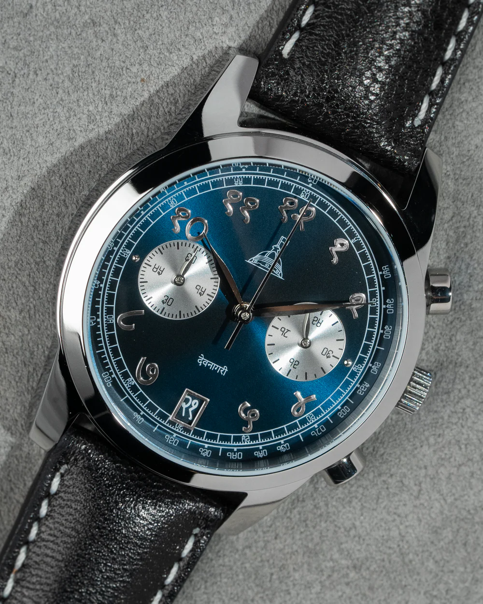
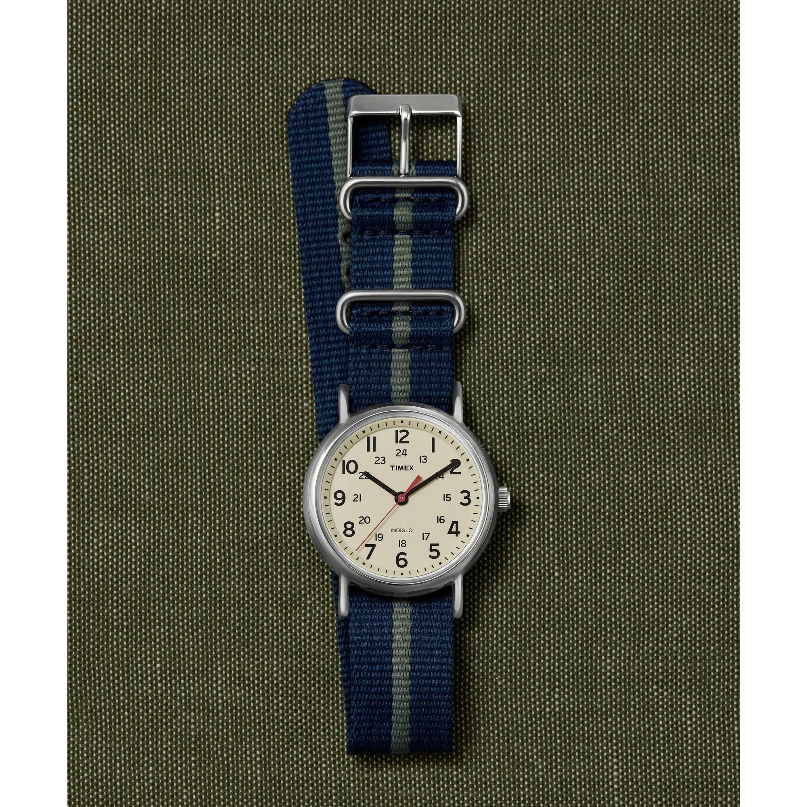
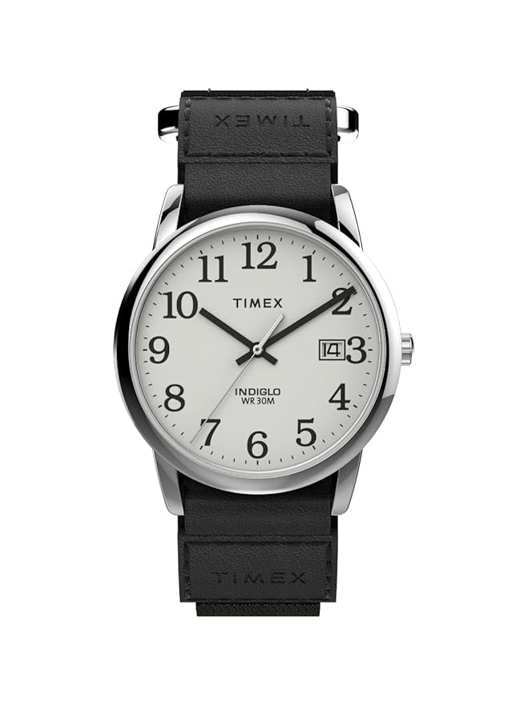
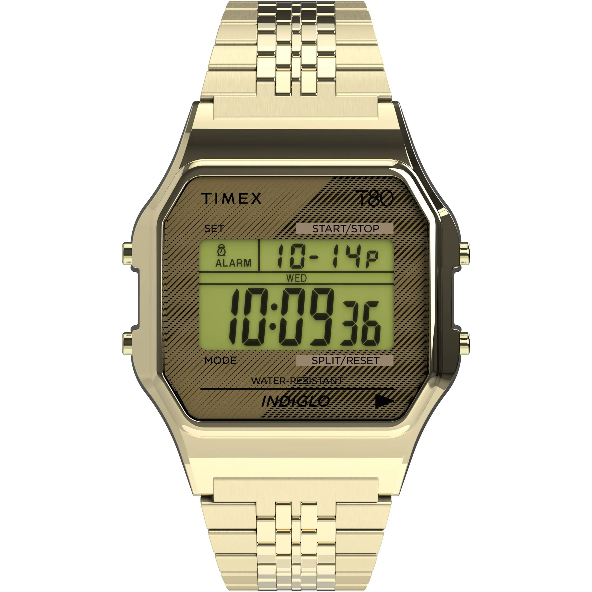
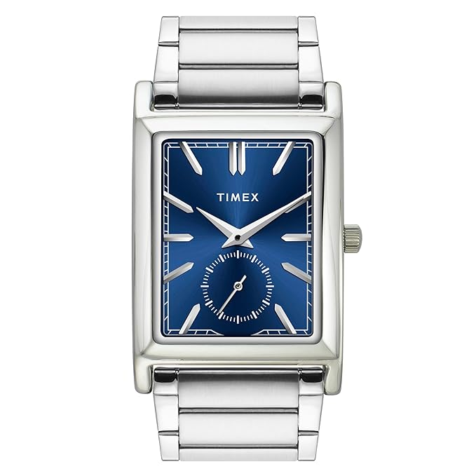
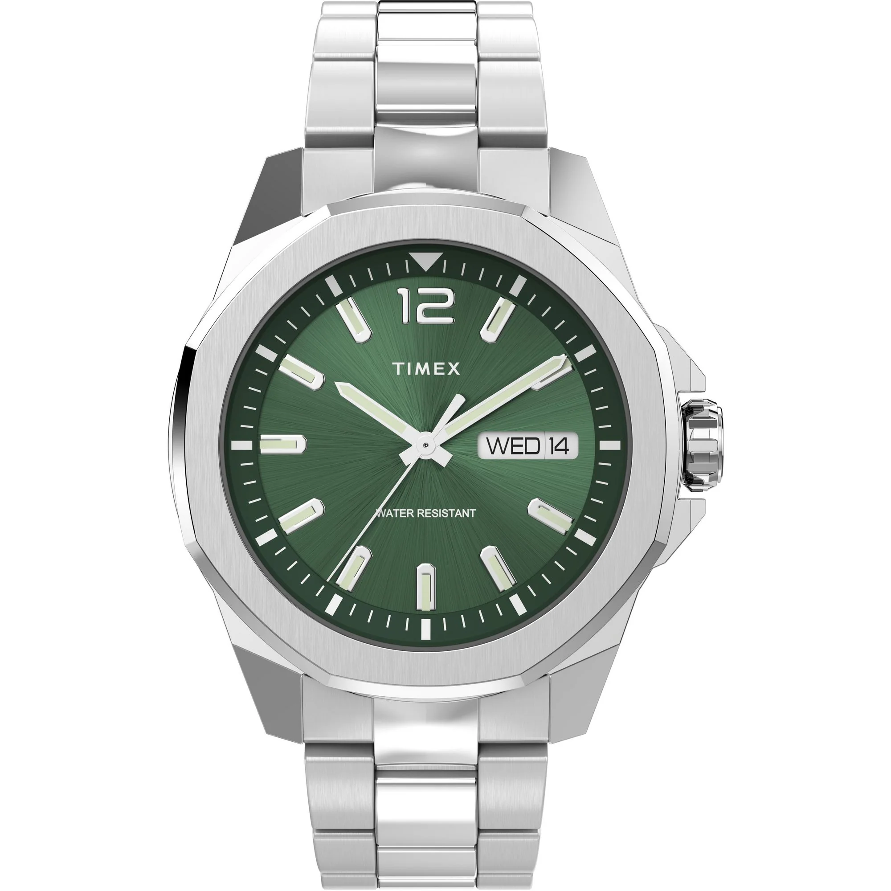
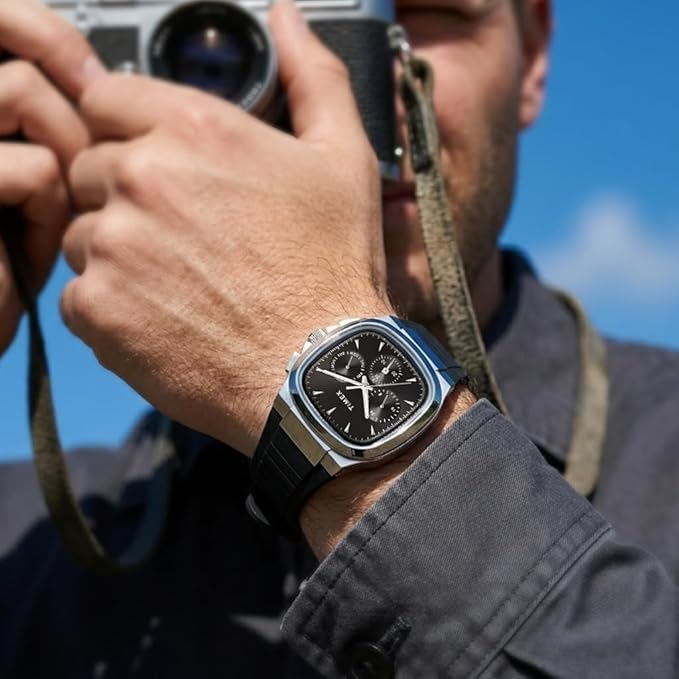
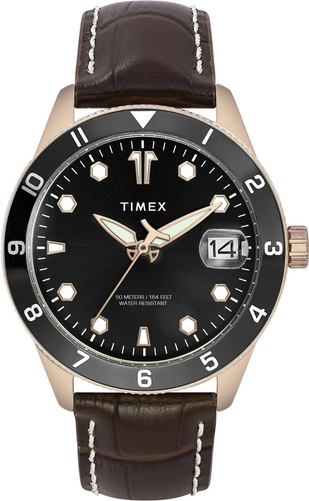

Alright, this is the one everybody has been asking for. The under ₹5,000 guide.

And honestly? This might be the most fun price segment to shop in. You are past the bare-bones "just tell me the time" territory and into the zone where watches start developing real personality. G-Shocks with 200-metre ratings, field watches with military DNA, retro digitals that look like they time-traveled from 1978, an Indian micro-brand chronograph with Devanagari script? Yeah, this list gets weird in the best way.

Prices are as of May 2026 and will fluctuate. If you want to go cheaper, we have already covered the [Best Watches Under ₹3,000](/blog/best-watches-under-3k/), some absolute icons in that guide. And if you are ready to stretch the budget, the [Best Watches Under ₹10,000](/blog/best-watches-under-10k/) guide is the direct sequel to this one. For Timex-specific picks, see the [Best Timex Watches Under ₹10,000](/blog/timex-under-10k/), and for Japanese horology the [Fun Japanese Watches Under ₹50,000](/blog/japanese-watches-under-50k/) guide is waiting.

Let's get into it.

---

# 1. The Cheapest G-Shock on the Planet

## [Casio G-Shock DW-5600MW-7DR](https://amzn.to/4nw7fiv) – ₹4,796

Casio G-Shock DW-5600MW-7DR White Square

**Key Specifications:**
- **Case Size:** 48.9mm
- **Weight:** ~50g
- **Water Resistance:** 200 Meters
- **Heritage:** Direct descendant of the 1983 DW-5000C

Here is a quick history lesson. In 1983, a Casio engineer named Kikuo Ibe had a single obsession: build a watch that could survive a 10-metre drop, resist 10 bar of water pressure, and run on a battery for 10 years. He called it the "Triple 10" concept. After burning through over **200 prototypes** (most of which he dropped from the third floor of a building), he found his breakthrough while watching a kid bounce a rubber ball in a park. The idea? Suspend the watch module inside the case like a ball floating in air. That is how the G-Shock was born.

This DW-5600MW carries that exact DNA. The iconic square silhouette traces directly back to that original DW-5000C, making this one of the most historically significant watch designs you can strap on for under five thousand rupees. The all-white colorway gives it a clean, modern edge that looks equally at home with streetwear, gym gear, or honestly anything.

At around 50 grams, you barely feel it. And yet it is rated to **200 metres** of water resistance. Most watches at this price tap out at 30 or 50 metres. You could literally take this swimming, snorkeling, or into a monsoon without a second thought.

**The bottom line:** This is the cheapest entry point into the G-Shock universe and arguably the best value watch on this entire list. You are buying four decades of engineering heritage for less than the price of a decent dinner for two.

<a href="https://amzn.to/4nw7fiv" target="_blank" rel="noopener noreferrer" class="buy-cta">→ Buy on Amazon</a>

---

# 2. The Indian Micro-Brand Dark Horse

## [DWC Devanagari Chronograph](https://delhiwatchcompany.com/collections/mens-watches/products/dwc-devanagari-chronograph) – ₹4,999

DWC Devanagari Chronograph by Delhi Watch Company

**Key Specifications:**
- **Case Size:** 39mm Stainless Steel
- **Movement:** TMI (Seiko) VK64 MecaQuartz
- **Special Feature:** Custom Devanagari date wheel, a world first
- **Complications:** Two sub-dials + Date at 6
- **Strap:** Genuine leather with quick-release pins
- **Water Resistance:** 50 Meters

This is the dark horse of the list and we need to talk about it.

The Delhi Watch Company has done something nobody else has. They built a chronograph with **Devanagari script** for the hour markers, tachymeter, and sub-dials, paired with a **custom Devanagari date wheel**. That last bit is genuinely a first. No other watch at any price point has done this before. The attention to cultural detail here is remarkable.

Now, the movement. The VK64 MecaQuartz is the same hybrid engine used by brands charging ₹15,000-25,000. It is made by TMI, which is Seiko's movement division. The "meca" part means the chronograph function uses a mechanical module, so when you hit the pusher, you get that satisfying tactile click and the sweeping second hand of a mechanical chronograph, but the timekeeping itself runs on quartz accuracy. Best of both worlds, essentially.

At 39mm in stainless steel with a curved mineral crystal, it wears beautifully on most wrist sizes. The leather strap has quick-release spring bars for easy swapping. The whole package punches so far above its price that it feels almost unfair to the competition.

**The catch:** It is almost always sold out. DWC releases these in small batches and they vanish within hours. If you see one in stock, do not think twice. Just buy it. Set up restock notifications on their site.

**Why it matters:** This is not just a watch recommendation. It is supporting an Indian micro-brand doing genuinely original work with quality movements. More of this, please.

---

# 3. The Watch That Needs No Introduction

## [Timex Weekender T2N654UJ](https://amzn.to/3R0b7MK) – ₹4,545

Timex Weekender Field Watch T2N654UJ

**Key Specifications:**
- **Case Size:** 38mm
- **Strap:** Fabric NATO-style (interchangeable)
- **Backlight:** Indiglo electroluminescent
- **Water Resistance:** 30 Meters
- **DNA:** Field watch

If the watch world had a "gateway drug," it would be the Weekender. This is the watch that has introduced more people to horology than probably any other timepiece in the last two decades.

At 38mm, it sits perfectly on almost every wrist size, from a 5.5-inch wrist to an 8-inch one. The Arabic numeral dial with an inner 24-hour ring gives it subtle military field-watch DNA. The fabric NATO strap is where the magic really happens though: order three or four different straps online (they cost ₹200-400 each) and you essentially have a completely different watch for every day of the week. Brown leather for a date. Olive canvas for the weekend. A striped nylon for the fun of it. The Weekender is not just a watch. It is a whole system.

Then there is the **Indiglo**. Press the crown and the entire dial lights up in this gorgeous blue-green glow. This tech has been a Timex exclusive since 1992. It uses an electroluminescent panel that converts electricity directly into light. No LED, no tritium tubes. Just the entire dial glowing evenly. It is genuinely beautiful, and at this price, no other brand offers anything close.

**One quirk to know:** The Weekender has a famously loud tick. It is a charming quirk that some people love (it gives the watch character) and some people notice in dead-quiet rooms. If you sleep right next to your nightstand, you might want to put it in a drawer at night.

**Pro tip:** Timex has released countless Weekender collaborations and limited editions over the years. It is worth browsing the full range before picking your version.

<a href="https://amzn.to/3R0b7MK" target="_blank" rel="noopener noreferrer" class="buy-cta">→ Buy on Amazon</a>

---

# 4. The Luxe Looker

## [Casio Enticer A2379](https://justintime.in/collections/mens-watches-under-10k/products/casio-enticer-men-quartz-white-dial-analog-stainless-steel-watch-a2379?variant=50302700749075) – ₹4,797

Casio Enticer A2379 White Patterned Dial

**Key Specifications:**
- **Case Size:** 44mm
- **Dial:** White patterned with blue bezel
- **Crown:** Off-centre (4 o'clock position)
- **Complication:** Date display
- **Water Resistance:** 50 Meters
- **Bracelet:** Stainless steel with fold-over clasp

If someone showed you this watch without the price tag, you would guess ₹12,000-15,000. Easily.

The white patterned dial paired with the blue bezel is an absolute stunner. There is a distinct yachting, weekend-regatta energy here that you almost never find at budget prices. The off-centre crown at 4 o'clock is a design cue borrowed from much pricier diver-style watches (Seiko does this on their Prospex line, Citizen does it on the Promaster). It gives the watch a more distinctive profile on wrist and keeps the crown from digging into the back of your hand.

In terms of sheer visual impact per rupee, the Enticer A2379 might be the best deal on this list. It competes aesthetically with the Seiko 5 and the Citizen Promaster line at a fraction of the cost. That is not a comparison we make casually.

**Why we love it:**
This is the watch for people who want to look like they spent serious money but are too smart to actually do it. The white-blue combo is timeless, the stainless steel bracelet adds weight and presence, and at 44mm it commands attention without being obnoxious.

---

# 5. The 177-Million-Unit Legend

## [Timex Easy Reader TW2U84900](https://amzn.to/4fgAML2) – ₹4,220

Timex Easy Reader TW2U84900

**Key Specifications:**
- **Case Size:** 35mm
- **Backlight:** Indiglo
- **Water Resistance:** 30 Meters
- **Heritage:** Based on the original 1977 Easy Reader

Here is a stat that will make your jaw drop: since its debut in 1977, Timex has produced over **177 million Easy Readers**. One hundred and seventy-seven million.

Before it got the "Easy Reader" name, Timex sold similar high-contrast dials under the "Mercury" branding for men and "Petite" for women. The design philosophy was radical in its simplicity: large Arabic numerals, bold hands, a clean dial. The idea was that you should be able to read the time with a glance from across a room. Revolutionary? Maybe not. Perfectly executed? Absolutely.

Jack Nicholson has been photographed wearing one. Bill Murray (the guy famous for wearing two watches simultaneously) is a known Easy Reader fan. Noah Centineo wore one in Netflix's *The Recruit*. The watch has transcended price categories entirely.

At 35mm, this is the pick for people who prefer smaller, elegant watches that sit quietly on the wrist without screaming for attention. Indiglo lights up the dial beautifully in the dark. It is a no-nonsense, deeply classy timepiece that has earned its place in watchmaking history by being, well, perfectly readable.

**Also consider:** The [Easy Reader T2H451UJ](https://amzn.to/4ww4JNn) at ₹3,747. Same iconic design but with a stainless steel expansion bracelet instead of leather. Different vibe, equally classic.

<a href="https://amzn.to/4fgAML2" target="_blank" rel="noopener noreferrer" class="buy-cta">→ Buy on Amazon</a>

---

# 6. The Retro Time Machine

## [Timex 80 Tonneau TW2R79200UJ](https://amzn.to/4tBpLYf) – ₹4,797

Timex 80 Tonneau Gold Digital TW2R79200UJ

**Key Specifications:**
- **Case Shape:** 34mm Tonneau (barrel-shaped)
- **Display:** Digital with day/date
- **Bracelet:** Golden brushed metal
- **Backlight:** Indiglo
- **Water Resistance:** 30 Meters

A quick history detour: Timex entered the digital watch game in **1974**, becoming one of the first major brands to offer LCD watches to the masses. Throughout the late seventies and eighties, they packed their digitals with chronographs, alarms, and even calculators. Features that felt like science fiction at the time. The T80 collection is a love letter to that entire era.

The Tonneau variant takes it a step further. The barrel-shaped case is not just a design choice. It is a callback to a watch shape that dominated the mid-twentieth century before round cases took over everything. Combined with the golden brushed metal bracelet, the whole thing looks like a prop from a Wes Anderson film. It is retro-futuristic in the best way possible.

At 34mm, it is compact enough to sit elegantly on smaller wrists. It weighs almost nothing. Wear it with a black tee and jeans and suddenly your entire outfit has a narrative.

**Why we love it:**
Pure eye candy. This is the kind of watch that makes people stop you and ask "where did you get that?" It is a conversation starter that costs less than most sneakers.

<a href="https://amzn.to/4tBpLYf" target="_blank" rel="noopener noreferrer" class="buy-cta">→ Buy on Amazon</a>

---

# 7. The Sophisticated Rectangle

## [Timex Trendline Rectangle TW000L523](https://amzn.to/4dcdV20) – ₹4,995

Timex Trendline Rectangle Blue Dial TW000L523

**Key Specifications:**
- **Case Size:** 29mm Rectangular
- **Sub Dial:** Separate seconds hand
- **Bracelet:** Stainless Steel
- **Water Resistance:** 30 Meters

Full disclosure, we are massive Timex fans and this is the most Timex-heavy list we have ever done. But we genuinely believe they dominate the under-₹5,000 space like no other brand.

A rectangular silver watch with a blue dial at this price? That is Cartier Tank energy at roughly 1/200th of the cost. The small sub-dial for the seconds hand adds a layer of mechanical charm that most watches at this price simply do not bother with.

This is not a head-turner in the traditional sense. It is more of a slow burn, the kind of watch that people notice on the second glance and then cannot stop looking at. There is a quiet, old-money elegance to rectangular watches that round cases struggle to replicate. Perfect for daily office wear, dinner dates, or any situation where "understated but considered" is the vibe you are going for.

**Pro tip:** Definitely explore the other colorways. Timex offers several variations and each one changes the personality of the watch entirely.

<a href="https://amzn.to/4dcdV20" target="_blank" rel="noopener noreferrer" class="buy-cta">→ Buy on Amazon</a>

---

# 8. The Octagon Tank

## [Timex Essex TW2W13900UJ](https://amzn.to/4uRKqZe) – ₹4,672

Timex Essex Octagonal Green Dial TW2W13900UJ

**Key Specifications:**
- **Case Size:** 46mm (Octagonal)
- **Dial:** Green sunray
- **Complications:** Day and Date
- **Special:** Crown protector
- **Water Resistance:** 50 Meters

Fair warning, this one is a tank. At 46mm, it is built for people with bigger wrists (7 inches and above, ideally) and the confidence to pull off a bold watch. If you have a 6-inch wrist, this is going to look like a wall clock.

But if you can wear it, the Essex is genuinely impressive. The octagonal case gives it a geometric identity that most watches at this price do not even attempt. The green sunray dial catches light beautifully and shifts between dark forest green and a lighter olive depending on the angle. That is the beauty of sunray finishing.

There is a functioning crown protector too, a design feature you usually only see on watches costing five to ten times this. Day-date complication means it is practical beyond just looking cool, and 50 metres of water resistance keeps things worry-free.

**Why we love it:**
For big-wristed people who are tired of slapping on the same round-cased watches as everyone else, the Essex is a breath of fresh air. Bold, geometric, and surprisingly well-finished for the price.

<a href="https://amzn.to/4uRKqZe" target="_blank" rel="noopener noreferrer" class="buy-cta">→ Buy on Amazon</a>

---

# 9. The Unique Square Chrono

## [Timex TWEG353SMU01](https://amzn.to/4uRMXCI) – ₹4,521

Timex Square Dial Chronograph TWEG353SMU01

**Key Specifications:**
- **Case Size:** 43mm (Square)
- **Complication:** Chronograph
- **Casing:** Stainless Steel
- **Water Resistance:** 50 Meters

Finding a square chronograph at any price is rare. Finding one under five thousand rupees that actually looks good? That is genuinely unusual.

The TWEG353SMU01 leans into its uniqueness hard. The square case combined with the chronograph subdials creates this motorsport-adjacent aesthetic. Think TAG Heuer Monaco vibes on a Timex budget. The metal casing gives it proper weight and wrist presence at 43mm, which is unusually big for a square case.

It does not try to be subtle and that is exactly why it works. In a price category dominated by round, minimal designs, this thing stands out like a sore thumb. In the best possible way.

**Why we love it:**
If you want to wear something that literally nobody else at your office or college will have, this is the one. Square chronographs are niche, they are cool, and this one costs less than a pair of mid-range running shoes.

<a href="https://amzn.to/4uRMXCI" target="_blank" rel="noopener noreferrer" class="buy-cta">→ Buy on Amazon</a>

---

# 10. The Golden Classic

## [Timex TWEG30001](https://amzn.to/49LhoCc) – ₹2,700

Timex TWEG30001 Golden Dial Watch

**Key Specifications:**
- **Case Size:** 43mm
- **Dial:** Brushed metal golden with black bezel
- **Date:** Magnified date window
- **Strap:** Leather
- **Water Resistance:** 50 Meters

The cheapest watch on this list and honestly one of the most visually distinctive.

Those hands are the first thing you notice. They have this really unique design that you do not see on typical budget watches. Combined with the brushed golden dial and contrasting black bezel, the whole package has an almost cinematic quality to it. Gold and black is a colour combination that has worked for everything from Art Deco architecture to James Bond opening credits, and it works here too.

The leather strap keeps things comfortable for all-day wear, and the magnified date window is a practical touch that is appreciated. At ₹2,700, you are getting a watch with genuine visual identity at a price that is almost hard to justify not buying.

**Why we love it:**
It looks like it should cost significantly more than it does. The hand design alone sets it apart from everything else in the sub-₹5,000 category. If you are building a small collection on a budget, this is an easy addition.

<a href="https://amzn.to/49LhoCc" target="_blank" rel="noopener noreferrer" class="buy-cta">→ Buy on Amazon</a>

---

# 11. The All-Time Greatest

## [Casio Youth F-91WS-7A3DF](https://amzn.to/4ucGz9e) – ₹1,995

Casio F-91WS-7A3DF Rose Gold Transparent

**Key Specifications:**
- **Case Size:** 38mm
- **Weight:** ~21g
- **Strap:** Transparent resin
- **Accents:** Rose gold
- **Battery Life:** 7 years

You cannot make a watch list without the F-91W. It is the law.

Over **100 million units** have been produced since the original launched in 1989, designed by Ryūsuke Moriai for Casio. It has been on the wrist of Barack Obama, spotted on Dustin Henderson in *Stranger Things*, worn by Ryan Reynolds in *Free Guy*, and famously seen on Chuck Feeney, the billionaire philanthropist who could afford literally any watch on earth and chose the F-91W. That is the kind of anti-luxury credibility no marketing budget can buy.

This particular F-91WS variant takes the legend and gives it a fresh twist. The rose gold accents combined with the transparent resin strap create something that feels almost luxurious. Which is wild for a watch that costs less than a pizza dinner. It photographs incredibly well and looks even better on the wrist.

**Why we love it:**
Because it is the F-91W and it has earned the right to be on every single watch list ever written. This edition just happens to be one of the best-looking versions Casio has produced. Seven-year battery, 21 grams, and a design that transcends every fashion trend. Done.

<a href="https://amzn.to/4ucGz9e" target="_blank" rel="noopener noreferrer" class="buy-cta">→ Buy on Amazon</a>

---

# Final Thoughts

The under ₹5,000 segment is where budget watchmaking gets genuinely exciting. You are not just buying a time-telling device. You are getting watches with real design heritage, engineering stories, and visual personalities that have no business being this affordable.

**Our top picks:**

- **Best value, period:** The **Casio G-Shock DW-5600MW**. 200m water resistance and four decades of shock-resistant engineering for under five grand. Nothing else comes close.
- **Most unique:** The **DWC Devanagari Chronograph**, if you can find one in stock. MecaQuartz movement, Devanagari script, Indian micro-brand excellence. This one is special.
- **Best daily wearer:** The **Timex Weekender**. Infinite strap combinations, Indiglo glow, field watch DNA. The system that keeps on giving.
- **Best looking:** The **Casio Enticer A2379**. Genuinely looks like it costs three times its price. That white-blue dial is chef's kiss.
- **Best for small wrists:** The **Timex Easy Reader** at 35mm. 177 million people over five decades cannot be wrong.
- **Best conversation starter:** Tie between the **Timex 80 Tonneau** (retro-futuristic gold) and the **DWC Devanagari** (cultural pride on your wrist).

Prices fluctuate constantly, so always shop around. Want to make sure you are buying from trusted sellers? Our [Where to Buy Watches in India](/blog/where-to-buy-watches-in-india/) guide covers every reliable retailer. Looking for rugged outdoor-specific picks? The [Best Outdoor Watches](/blog/best-outdoor-watches/) guide is your friend. And if Japanese horology is calling your name, the [Fun Japanese Watches Under ₹50,000](/blog/japanese-watches-under-50k/) deep-dive is waiting.

Want to share your picks or argue about ours? Join us on [r/thewristjournal](https://www.reddit.com/r/thewristjournal/) where we talk watches, share wrist shots, and help each other find the best deals.

Happy hunting.
