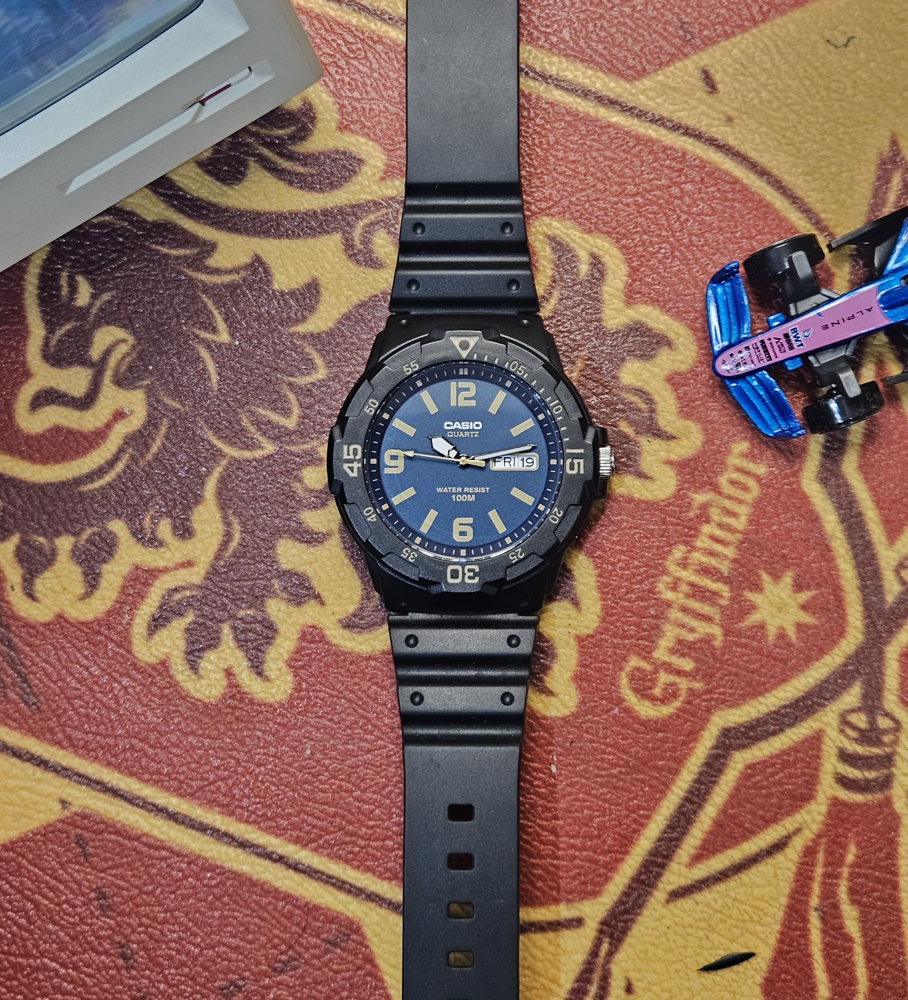

Every single day, without fail, there is a new post on Indian watch Reddit.

"Snagged for 900." "Snagged for 850." "Got it for 800." Sometimes even lower. Same watch, every time. The Casio MRW-200H. It has become a rite of passage at this point. You join the subreddit, you scroll for thirty seconds, and there it is. Someone's flexing their MRW with the enthusiasm of a guy who just bought a Rolex Submariner. And honestly? That energy is not misplaced.

A Casio watch for 800 rupees. Sounds like there has to be a catch. So we bought one and put it through its paces. Here is what we found.

---

# The Deal

The MRW-200H has an MRP of around ₹2,200. But here is the thing: it almost never sells at that price. Flipkart regularly drops this watch to more than half off, and if you time it right during a sale, you can snap it up for ₹800-900. That is not a typo. Eight hundred rupees for a Casio.

We tested the **MRW-200H-2B3V**, the variant with the black case, blue dial, and golden accents. And the first impressions were genuinely surprising.

<a href="https://amzn.to/4w3GYLK" target="_blank" rel="noopener noreferrer" class="buy-cta">→ Buy on Amazon</a>

---

# Specifications

**Key Specifications:**
- **Case Diameter:** 44.6mm (bezel measures ~41mm)
- **Lug-to-Lug:** 47.9mm
- **Thickness:** 11.6mm
- **Weight:** 39g
- **Water Resistance:** 100 Meters
- **Movement:** Japanese Quartz
- **Battery:** SR626SW (~3 years)
- **Accuracy:** ±20 seconds/month
- **Crystal:** Resin Glass (Acrylic)
- **Case Material:** Resin
- **Complications:** Day and Date display
- **Bezel:** Bi-directional rotating (diver-style)

If you do not care about the numbers, here is the short version: the dial sits well on most wrists, may look slightly small if you have very thick wrists, and at 39 grams, you barely feel it. This watch is genuinely, almost weirdly light.

---

# The "Diet G-Shock" and Why It Exists

The MRW-200H first appeared in Casio's lineup around 2011, designed as a dead-simple analog sports watch that borrows heavily from the visual language of classic dive watches. Rotating bezel. Bold markers. High-contrast dial. 100 metres of water resistance. All the diver cues, none of the diver price.

The watch community has since given it the nickname "Diet G-Shock," and it makes sense. The chunky resin case, the sporty aesthetic, the "throw it around and forget about it" attitude. It is essentially a G-Shock that went on a calorie deficit. You get the same Casio DNA, the same no-nonsense toughness, minus the shock-resistant architecture and the premium that comes with the G-Shock label. For most people who just want a reliable beater they genuinely do not need to worry about, the MRW-200H does the job for a fraction of the cost.

---

# On the Wrist

The 100 metres of water resistance is genuinely great at this price. You can take this thing swimming without giving it a second thought. Most watches under ₹2,000 tap out at 30 metres (which, let us be honest, means "try not to wash your hands too aggressively"). The MRW-200H actually lets you get in the water. That alone makes it worth the asking price.

The rotating diver-style bezel is cool to have but lacks the satisfying clickiness you get on more expensive rotating bezels. It works, it turns, it just does not give you the tactile feedback that makes bezel-turning addictive.

Legibility in daylight is very good. The blue dial with the golden hour markers and the white hands with black borders create a high-contrast combination that reads well from any angle. The golden seconds hand is a genuinely delightful touch.

Now here is the important caveat: the 2B3V variant we tested has no lume and no light. Zero visibility in the dark. However, some other MRW-200H variants at the same price point do come with luminous hands, and some have different dial layouts with 24-hour markings. So do your research before buying. Pick the variant that suits your needs.

---

# The Day-Date Window

This is the thing that genuinely amazed me. There is a day *and* a date window on this watch. Both of them. On a watch that costs 800 rupees.

For reference, there are watches in the ₹15,000-20,000 range that only give you a date. No day. Just a date. And here is the MRW-200H casually offering both at a price that is less than what most people spend on a cafe meal for two.

The blue dial with the golden accents is gorgeous. The golden seconds hand catches light in a way that genuinely looks premium. And the white hour and minute hands with their black borders complement the overall aesthetic perfectly. This does not look like a watch that costs what it costs.

---

# The Social Experiment

Here is where it gets fun. As a small test, I asked several colleagues to guess how much this watch costs. Two rounds: before touching it, and after.

**Before touching it:** People guessed anywhere from ₹5,000 to even ₹15,000. Granted, these are not watch enthusiasts, just regular people who look at a watch and make a gut call. But even my watch enthusiast colleagues (shoutout to Saurabh & Ketan) reckoned it was minimum ₹3,000-5,000.

**After touching it:** The estimates dropped to around ₹3,000-3,500. You can feel the resin strap, the lightness, the plastic crystal. It gives the game away a bit.

But even ₹3,000-3,500 is a massive win. The shock on people's faces when I told them this was an 800 rupee watch was absolutely worth it. This does not look like an ₹800 watch. Not even close.

---

# Where the Costs Were Cut

Let us be honest about the compromises, because there are some.

**The strap.** The resin strap feels very plasticky and cheap. It lacks the bendiness and suppleness that comes with better silicone or rubber straps. It gets the job done, but you will notice the difference if you have ever worn a proper silicone strap. On the bright side, it is a standard 18mm lug width, so swapping it for a better strap is easy and cheap.

**The finishing.** The infill colouring on the case markers is slightly uneven in places. Not something you will notice from a normal viewing distance, but up close, you can see the quality control is not exactly Swiss-level. Which, obviously, at ₹800, nobody is expecting it to be.

**The seconds hand alignment.** This is the biggest ick. The seconds hand does not line up precisely with the seconds markers. It is a common quirk on budget quartz watches, and it will bother some people more than others. If you are the type who stares at their seconds hand, you have been warned.

**The crystal.** The resin glass (acrylic/plastic crystal) is functional but not durable against scratches. It may handle impacts okay since plastic tends to absorb rather than shatter, but daily wear will probably leave marks over time. This is not sapphire and it does not pretend to be.

---

# Battery and Durability

Casio claims a 3-year battery life on the SR626SW cell. We have not tested this for obvious reasons (reviewing a watch after three years would be funny content but terrible journalism). Given Casio's track record with quartz accuracy and battery life claims, there is no reason to doubt it.

The accuracy is rated at ±20 seconds per month, which is standard for a quartz movement in this range. You will not need to adjust the time more than once every couple of months, if that.

---

# The Verdict

Here is the real question: what can you realistically expect for ₹800?

The resin strap is cheap. The finishing has minor inconsistencies. The seconds hand misalignment is a genuine annoyance if you pay attention to it. The crystal will scratch. No lume on this particular variant.

But.

This watch punches so far above its weight in looks that it is almost comedic. People think it costs five to fifteen times what it actually costs. It has 100 metres of water resistance. It has a day and date complication. It has a rotating bezel. And it looks genuinely good on the wrist.

I grew fond of this watch. I did not expect to. It was supposed to be a quick test, wear it for a few days, write about it, move on. Instead, it has made my daily rotation. This watch sits in a box with watches that cost more than 50 times its price, and it still finds wrist time. That is not something I say about every watch we review.

**Final Verdict:** Yeah, buy it. It is cheaper than a large chicken dominator pizza at Dominos. We checked.

<a href="https://amzn.to/4w3GYLK" target="_blank" rel="noopener noreferrer" class="buy-cta">→ Buy on Amazon</a>

---

# Variant Guide: Know Before You Buy

The MRW-200H comes in a surprisingly large number of colourways and dial configurations. Some things to keep in mind:

- **Lume availability varies by variant.** Some models have luminous hands, some do not. If nighttime readability matters to you, check the specific model number before ordering.
- **Dial layouts differ.** Some variants have 24-hour markings on the inner ring, others have a cleaner layout. Pick what works for your use case.
- **Pricing is unpredictable.** Flipkart prices swing wildly. Set price alerts if you want to catch it at its lowest. Most community members report snagging it between ₹800 and ₹1,100.

---

If you are looking for more budget watch recommendations, our [Best Watches Under ₹3,000](/blog/best-watches-under-3k/) guide has some fantastic picks in a similar price bracket. And for the next step up, the [Best Watches Under ₹5,000](/blog/best-watches-under-5k/) guide covers watches that pair perfectly alongside the MRW-200H in a growing collection. Want to know where to buy this same watch safely and about the trusted flipkart sellers? Our [Where to Buy Watches in India](/blog/where-to-buy-watches-in-india/) guide has you covered.

Happy hunting.
