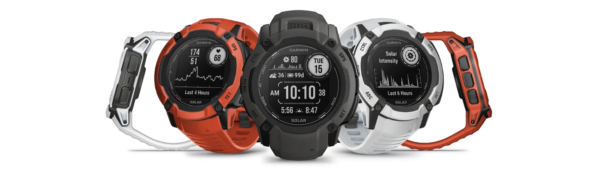

I have a confession to make. The Garmin Instinct 3 is out for a year now, it is shiny, it is newer, and I completely ignored it. Instead, I went out and bought the Instinct 2X Solar — a watch that first hit shelves in early 2023. Three years old. Still sitting on Amazon. Still being sold at full confidence by Garmin.

So naturally, the question is: does it still make sense in 2026?

I have been wearing this thing daily for a couple of weeks now, and the short answer is yes. The longer answer is what follows.

---

# First, a Quick Note on the 2 vs. 2X

There are multiple models floating around — the Instinct 2, the 2X, and the 2X Solar. The one I am reviewing here is the **2X Solar**. The regular 2X is essentially the same watch minus the solar charging and MIP display enhancements, so most of what I say here applies to that too.

Now, you might spot the Instinct 2 (non-X) going for slightly less. Tempting, but hear me out — the 2X is a significantly better watch across the board. Better sensors, better features, better overall package. The price difference between the 2 and 2X is so small that picking the 2 just does not make sense anymore. The only real argument for the Instinct 2 is size. It is noticeably smaller and sits much better on thinner wrists. If you have got a 6-inch wrist and the 50mm 2X looks like a wall clock on you, fair enough — go for the 2.

For everyone else, the 2X is the one to get.

---

# Why the 2X Over the Instinct 3?

One word: price.

The Instinct 2X Solar goes for around **₹30,000–35,000**, and during sales it dips even lower. I picked mine up for **₹29,000** with bank discounts. The Instinct 3? That will set you back **₹52,000–57,000**. We are talking a ₹20,000 gap — that is not pocket change.

And here is the thing — the 2X is not some crippled older model limping along. It runs the same Elevate sensors Garmin uses across their lineup. It still gets software updates. The app support is fully intact. For most people doing most things, the 2X does everything the 3 does at a fraction of the cost.

The Instinct 3 does bring some genuine improvements — better GPS functionality, more size options, more internal storage, and better displays. If those matter to you and the budget is not a concern, go for it. But if you are weighing value for money, the 2X wins that fight comfortably.

---

# Who Should NOT Get This Watch

Before I go further, let me save some of you the trouble.

**If you just want a regular smartwatch** — one that tracks your steps, shows notifications seamlessly, and syncs beautifully with your phone — just get an Apple Watch or a Galaxy Watch. Those work better within their respective ecosystems and are far less finicky. The Instinct is not trying to compete with them and it should not have to.

**If you only care about body vitals** and do not need them on your wrist in real time, look at screenless wearables instead. Wear one on your non-watch wrist and sport your favourite timepiece on the other. The **Amazfit Helio Strap** is brilliant for this — lightweight, accurate, great value — but getting one in India is a nightmare because it is perpetually out of stock. **Whoop** is another option but comes with a subscription. The **Polar Loop** works too but is not the most accurate. Honestly, I would wait for Garmin or Fitbit to release a proper screenless tracker which is on the horizon.

**If you want a field watch**, just get a field watch. The Instinct looks like a rugged tool, but it is fundamentally a smartwatch with a MIP display. It is not trying to be a Seiko Alpinist or a Hamilton Khaki.

---

# Who Should Get This Watch

Right, now for the people who will actually love this thing.

**Do you hate wearing another screen on your wrist?** The MIP display on the Instinct does not feel like a screen. There is no glowing AMOLED panel begging for your attention. It looks more like a classic digital watch than a smartwatch, which is genuinely refreshing.

**Do you go outdoors?** Hikes, runs, treks, weekend camping — if any of these are your thing, the Instinct 2X has you covered with offline GPS, altimeter, barometer, compass, and multi-sport tracking that actually works.

**Do you hate charging your watch?** The solar panel on the 2X Solar means you charge this thing far less frequently than any traditional smartwatch. You still need to charge it — let us not pretend it runs on sunshine alone — but the intervals between charges are genuinely impressive.

**Do you just think it is cool to have sensors on your wrist that work without a phone?** Yeah, same. There is something satisfying about having a compass, a torch, and GPS navigation available at all times without needing to pull out your phone.

If you nodded along to even one of these, you should probably get this watch.

---

# What Is Good About the 2X Solar

Let me run through what I actually enjoyed over the last couple of weeks.

**The sensors are genuinely useful.** Heart rate tracking, SpO2, Body Battery, stress tracking — they all work well and the data feeds into Garmin Connect, which is a surprisingly capable app for tracking trends over time.

**Tracking is accurate.** Run tracking, sleep tracking, step counting — all solid. I compared it against a friend's Apple Watch Ultra on a couple of runs and the GPS data lined up almost perfectly.

**The torch is a sleeper hit.** I did not expect to use the built-in LED flashlight as much as I do. Late night walks, finding something under the bed, signalling during a group hike — it is genuinely practical. There is a red light mode too, which preserves your night vision.

**Solar actually helps.** I am not going to claim infinite battery life, but wearing it outdoors regularly has noticeably extended the time between charges. If you are on a multi-day trek, this matters.

**It is tough.** Fiber-reinforced polymer case, water resistance to 100 meters, built to MIL-STD-810 — this watch feels like it could survive anything short of being backed over by a truck. And honestly, maybe even that.

**MIP display in sunlight is brilliant.** Unlike AMOLED screens that wash out in direct sun, the MIP display gets *more* readable the brighter it is outside. For an outdoor watch, that is the ideal situation.

**Lightweight on the wrist.** Despite the 50mm case, it weighs just about 67 grams. You genuinely forget it is on your wrist, which is exactly what you want from a watch you wear all day.

---

# What Could Be Better

**50mm is big.** There is no way around it. On wrists under 6.5 inches, this thing dominates your entire forearm. Garmin did not offer size options on the 2X line, so you are stuck with it. The Instinct 3 addresses this with multiple sizes — credit where it is due.

**The app is decent, not great.** Garmin Connect does its job well enough, but it does not feel as polished or integrated as what you get with Apple Health or Samsung Health inside their ecosystems. Third-party watch face and app support exists, but it is limited compared to what WearOS or watchOS offer.

**No touchscreen.** All navigation is button-based, which is actually fine for outdoor use (try using a touchscreen with wet fingers on a trail) but can feel a bit clunky when scrolling through menus or entering text.

**Limited variant availability.** Finding specific colourways and strap options in India is a bit of a gamble. Stock is inconsistent, and you often end up just grabbing whatever is available rather than what you actually wanted.

**Complex menu system.** There is a learning curve. Garmin packs a lot of functionality into those five buttons, and it takes a good few days before navigating through widgets, activities, and settings feels natural.

---

# What the Instinct 3 Does Better

For the sake of fairness:

- **Better GPS functionality** — GPS on the 3 is much more accurate in tricky environments like dense forests and urban canyons.
- **More size options** — 40mm, 45mm, 50mm. The 2X only comes in 50mm.
- **More internal storage** — Handy if you load more apps.
- **Better displays** — The AMOLED option on some Instinct 3 models looks stunning, though you trade off battery life and sunlight readability, and even the Instinct 3 MIP display is better than the 2X with better readability.

Are these worth ₹20,000 more? For most people, I genuinely do not think so.

---

# The Verdict

The Garmin Instinct 2X Solar is one of those rare products that ages well. It is built on solid hardware, runs the same sensor suite Garmin uses across their current Instinct lineup, still receives software support, and does everything a serious outdoor user needs without the premium tax.

For ₹29,000–35,000, you are getting solar charging, offline GPS, a built-in torch, comprehensive health tracking, and a watch that can survive being dragged through just about anything. The Instinct 3 is a better watch on paper — nobody is arguing that — but at nearly double the cost, it is a tough sell when the 2X is sitting right there doing 90% of the same job.

If you are in the market for a rugged, capable, no-nonsense outdoor watch and you do not need the absolute latest and greatest, the Instinct 2X Solar is a genuinely fantastic buy in 2026.

**TLDR;** The Instinct 3 is a better watch. The Instinct 2X Solar is a better *deal*. For ₹20,000 less, you get the same Elevate sensors, the same rugged build, solar charging, and full software support. Unless you specifically need multi-band GPS or a smaller case size, save your money.

<a href="https://amzn.to/3QnNGws" target="_blank" rel="noopener noreferrer" class="buy-cta">→ Buy on Amazon</a>

---

Looking for more outdoor watch recommendations? Check out our [Best Watches for the Outdoors at Every Price Point](/blog/best-outdoor-watches/) guide — the Instinct 2X Solar is our pick in the under-₹35,000 bracket for good reason. And if you are curious about where to buy watches in India, we have a [complete guide](/blog/where-to-buy-watches-in-india/) for that too.
