The Great Indian Festival is nearly here, which means the watch section is about to become a sea of crossed-out prices, countdown timers and discounts large enough to make you wonder whether anyone ever paid the original amount. Sometimes there is a properly good watch hiding underneath all of that. Sometimes the watch was cheaper two months ago. We would quite like you to end up with the first kind.

We have put together 18 watches worth keeping an eye on, starting around ₹2,000 and working up to a Seiko GMT. There are familiar Casios, a couple of Timex picks, affordable automatics and some less obvious options from Ratio, Boderry and CIGA Design. The list moves roughly from the affordable end upwards, with a few overlapping price brackets along the way. Having a ₹50,000 budget also does not mean we have to spend every last rupee of it. There are perfectly good watches near the beginning of this list.

You may have noticed quite a lot of black dials here. We tend to start there because they are easy to wear with most things, especially if this is your first watch or the one you will reach for every morning. But do check the other colours before buying. If the version you actually like costs a little more, that can be money better spent than getting the best deal on a watch you feel nothing about.

<strong>🚨 Deal alerts: Flipkart Big Billion Days and Amazon Great Indian Festival deals will be posted live on <a href="https://www.reddit.com/r/thewristjournal/" target="_blank" rel="noopener noreferrer">r/thewristjournal</a>. <a href="https://www.reddit.com/r/thewristjournal/" target="_blank" rel="noopener noreferrer">Join the community</a> so you do not miss them.</strong>

Amazon's [official announcement](https://www.aboutamazon.in/news/retail/amazon-great-indian-festival-2026-dates) gives October 8 as the sale start. The prices below are **buy targets, not confirmed sale offers or predictions**. We used earlier prices and the alternatives available to decide what would make each watch worth recommending. Some targets are more ambitious than others, especially further up the list. Compare the final checkout amount, including any coupon or eligible card discount, before buying.

If you would rather browse without waiting for a sale, our guides to watches [under ₹5,000](/blog/best-watches-under-5k/), [under ₹10,000](/blog/best-watches-under-10k/) and [under ₹20,000](/blog/best-watches-under-20k/) are good places to start. We also have a separate guide to [women's watches under ₹15,000](/blog/womens-watches-under-15k/), with plenty of smaller options.

## 1. The World Map You Probably Don't Need

### [Casio AE-1200WH-1AVDF](https://link.amazon/B0am9Vioc) | Buy target: ₹2,000–2,200

**The essentials:** Digital quartz, resin case and strap, world time, alarms, timer, approximately ten-year battery life, 100m water resistance.

The little world map is doing a lot of the selling here, and we are fine with that. The AE-1200 looks like something you would have desperately wanted after watching a spy film as a child. It also happens to be a very useful watch. You get a clear time display, a collection of timers and alarms, and enough time-zone options to support an international lifestyle considerably more exciting than most of ours. The black resin version keeps the price and weight down, which suits the whole idea rather well.

This exact reference reached ₹1,995 in August, so our target has a recent price behind it. Around ₹2,000, it is one of the easiest recommendations here. Closer to ₹3,000, we would be less inclined to rush. Check the reference carefully, since the silver bracelet version is a different purchase with different pricing. The Royale nickname covers quite a few listings, and the cheapest search result is not necessarily the watch in the photograph you saved. If this one sells out, do check out the other variants of the AE-1200.

<a href="https://link.amazon/B0dSDAm0N" target="_blank" rel="noopener noreferrer sponsored" class="buy-cta">→ Buy on Amazon</a>

## 2. The Weekend Doesn't Need a Bigger Budget

### [Timex Weekender T2N654UJ](https://link.amazon/B05iXGzNn) | Buy target: ₹3,800 or less

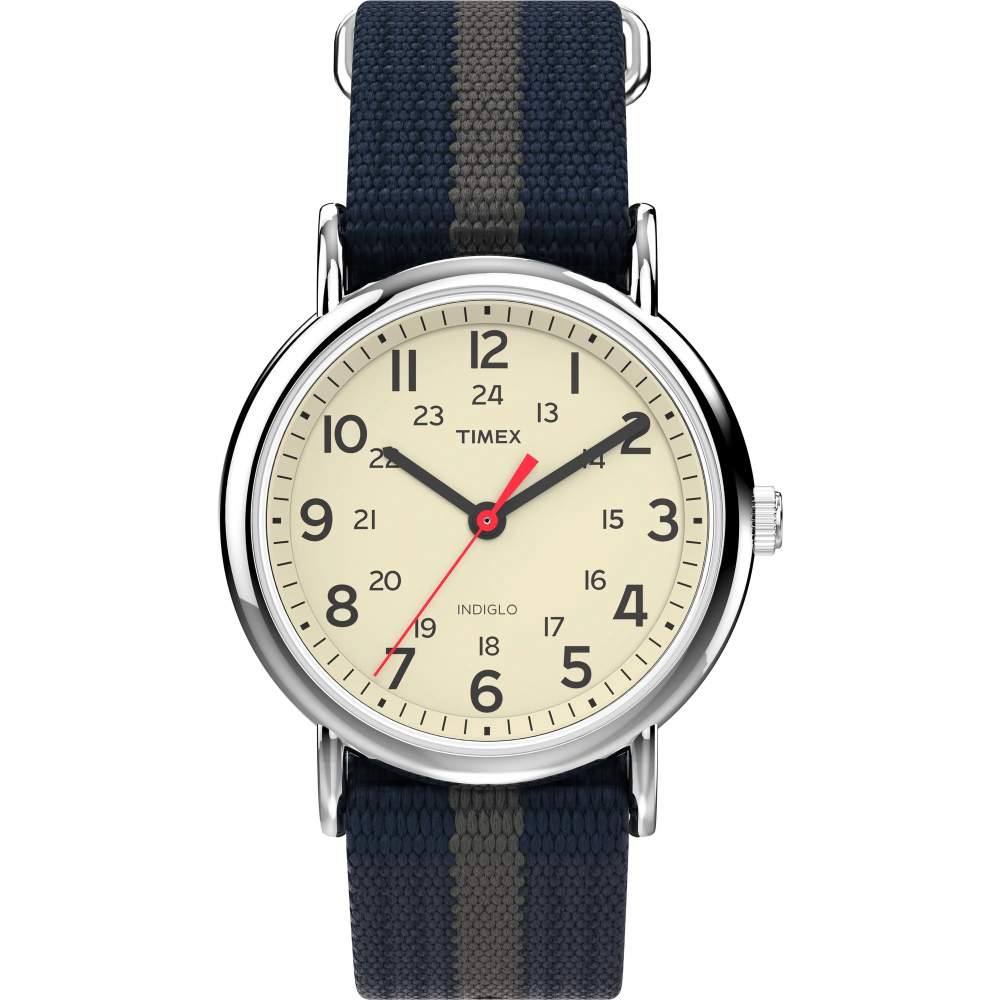

**The essentials:** 38mm case, quartz movement, fabric strap, Indiglo illumination, 30m water resistance.

The Weekender has a very straightforward appeal. A pale dial, clear numerals and a fabric strap make it look relaxed without looking unfinished, and 38mm is a welcome size when so many inexpensive watches seem determined to cover your entire wrist. It is the sort of watch we would wear with a T-shirt and then forget to change before going out for dinner. Swapping the strap is also an inexpensive way to make it feel different, which is occasionally a healthier response than buying another watch.

Indiglo remains a lovely feature: press the crown and the dial lights up, without needing to squint at faintly glowing hands. The water resistance is modest, so keep this one out of the pool. We found a ₹3,847 price in May and a later snapshot around ₹4,200. That makes roughly ₹3,800 a sensible sale target. A large discount against the original MRP is less exciting if the checkout price is still what it has been selling for anyway.

<a href="https://link.amazon/B05iXGzNn" target="_blank" rel="noopener noreferrer sponsored" class="buy-cta">→ Buy on Amazon</a>

## 3. The Square We Keep Coming Back To

### [Casio G-Shock DW-5600UE-1DR](https://link.amazon/B0etr2Omc) | Buy target: ₹4,500–5,000

**The essentials:** Resin construction, shock resistance, LED backlight, stopwatch, countdown timer, 200m water resistance.

There is a reason the plain square G-Shock keeps appearing in buying guides. It gives you the useful parts of owning a G-Shock without asking you to enjoy an enormous case or a dial that resembles a complicated dashboard. The black resin case, readable display and familiar shape work well together, and it is an easy option for travel, exercise or days when you would rather not worry about your watch. It is also a good reminder that the cheapest version of something can be the one you actually want.

The DW-5600UE reached ₹4,546 in July, which makes a return to the ₹4,500–5,000 range worth watching for. This is the battery-powered model. The solar square comes a little later, and the price difference between them matters more than the discount percentage on either listing. If all you want is a dependable digital watch, there is no obligation to work your way through the entire G-Shock catalogue first.

<a href="https://link.amazon/B0etr2Omc" target="_blank" rel="noopener noreferrer sponsored" class="buy-cta">→ Buy on Amazon</a>

## 4. The Duro, Finally at Duro Money

### [Casio MDV-107D-1A1VDF](https://link.amazon/B0bSR9WkT) | Buy target: ₹6,000 or less

**The essentials:** Stainless steel case and bracelet, quartz movement, mineral glass, rotating bezel, screw-lock crown, 200m water resistance.

The Duro makes a very convincing argument for a simple black sports watch. The large markers, straightforward bezel and clean dial give it the familiar dive-watch look without piling on unnecessary decoration. This MDV-107D comes on a steel bracelet, so it is worth comparing the exact model rather than assuming every Duro deal includes the same package. It is also a substantial watch. Casio lists this reference at 49.5mm long and 46.3mm wide, so take the dimensions seriously if you prefer smaller pieces.

The tracked Amazon listing has previously reached ₹5,996, and that is roughly where we would want it again. Around ₹8,000, it becomes a less urgent purchase, particularly with discounted Edifices and G-Shocks nearby. Buy it because you like the clear dial and the overall shape. The rotating bezel might spend more time timing pasta than anything involving the ocean, but that is still a useful job.

<a href="https://link.amazon/B0bSR9WkT" target="_blank" rel="noopener noreferrer sponsored" class="buy-cta">→ Buy on Amazon</a>

## 5. An Edifice Without the Information Overload

### [Casio Edifice EFR-526L-1AVUDF](https://link.amazon/B0fSjhyxd) | Buy target: ₹6,000 or less

**The essentials:** 43.8mm case width, stainless steel case, quartz chronograph, mineral glass, leather strap, 100m water resistance.

Some Edifices look as though they could help you land a plane. This one is a little more restrained. The round case, black dial and leather strap make a conventional, useful combination, with the three subdials adding enough interest without taking over completely. It would be easy to wear to work, and the leather gives it a slightly softer appearance than the larger steel-bracelet chronographs. At 43.8mm wide, though, it still needs a reasonable amount of wrist space.

We would want a proper discount here. Recent tracked pricing was around ₹7,250, and at that amount it is worth comparing the rest of the Edifice range before settling. Around ₹6,000, the argument gets better. The crystal is mineral rather than sapphire, and the leather strap should be kept away from regular soaking regardless of the case's water-resistance rating. This earns its place if you want this particular combination of a straightforward chronograph and leather, rather than simply the largest percentage off.

<a href="https://link.amazon/B0fSjhyxd" target="_blank" rel="noopener noreferrer sponsored" class="buy-cta">→ Buy on Amazon</a>

## 6. A Little More Money, a Little More Sun

### [Casio G-Shock G-5600UE-1DR](https://link.amazon/B0di7Zrlk) | Buy target: ₹6,000–6,400

**The essentials:** Tough Solar charging, shock resistance, world time, LED illumination, resin case and strap, 200m water resistance.

This is where we would look if the cheaper square appealed to you but you are happy spending a little more. The G-5600UE keeps the familiar black square shape and adds Tough Solar, so light keeps its rechargeable battery topped up. You also get world time alongside the usual timers and alarms. It is a very easy watch to recommend to someone who wants a useful everyday companion and has no particular desire to charge another device every evening.

It reached ₹6,396 more than once in August, so the upper end of our target is already supported by recent pricing. If the basic DW-5600 is around ₹5,000 and this is close to ₹6,000, we would lean towards the solar model. If the gap grows much larger, the cheaper watch starts making more sense again. Solar still needs light, incidentally. Buying one and leaving it in a dark drawer for a year is giving the sun very little opportunity to participate.

<a href="https://link.amazon/B0di7Zrlk" target="_blank" rel="noopener noreferrer sponsored" class="buy-cta">→ Buy on Amazon</a>

## 7. The Field Watch With the Sensible Spec Sheet

### [Ratio Quest RTQ019](https://link.amazon/B0axvYBBM) | Buy target: ₹6,500–7,000

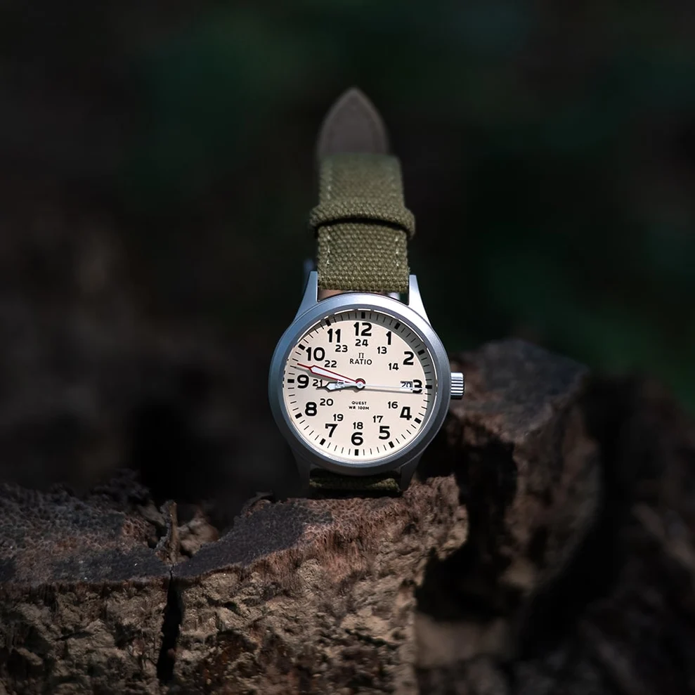

**The essentials:** 40mm stainless steel case, VX42 quartz movement, sapphire crystal with anti-reflective coating, canvas strap, 100m water resistance.

The Quest is an appealing option if you like the Weekender's general idea but want a different set of compromises. You get a steel case, sapphire crystal and a 100m water-resistance rating, wrapped around a straightforward field-watch dial. There is no attempt to make telling the time an event. Clear numerals and a fabric strap are enough, and that is part of why we like it. It is also quartz, so rotating it with other watches does not mean resetting it every time you come back.

The tracked price has been around ₹8,000, with an earlier drop to ₹6,999. Somewhere near ₹7,000 would therefore be a useful sale price, with ₹6,500 being more tempting still. Check the seller and warranty arrangements before ordering, especially if you are comparing an Indian listing with the brand's overseas store. A lower dollar price is not automatically a lower delivered price once shipping and import charges join the conversation. This watch is also available on Ratio's website for ₹5,900 right now, though shipping may take time and will incur additional charges.

<a href="https://link.amazon/B0axvYBBM" target="_blank" rel="noopener noreferrer sponsored" class="buy-cta">→ Buy on Amazon</a>

## 8. Titanium Before Five Figures

### [Boderry Voyager](https://link.amazon/B05TTOu1E) | Buy target: ₹9,500–10,000

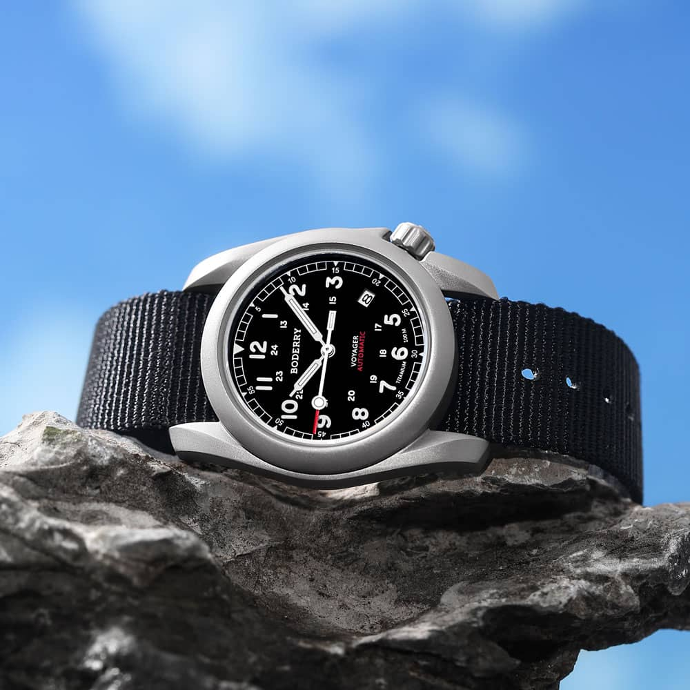

**The essentials:** Titanium case, sapphire crystal, Miyota 8215 automatic movement, screw-down crown, nylon strap, 100m water resistance.

Titanium, sapphire and an automatic movement make a fairly persuasive opening sentence at this price. The Voyager puts them into a simple field-watch design, with a muted case finish and a dial that suits the slightly utilitarian appearance. It is worth a look if you want an automatic without the usual polished dress-watch treatment. Do pay attention to the long lugs, though. A sensible case diameter can still come attached to a watch that stretches further across the wrist than you expected.

Our earlier sale coverage recorded a ₹9,600 offer, while the listing tracked during this research was back at ₹12,999. We would be much more interested if it returned to roughly ₹10,000. Boderry offers different movements and strap configurations, so check that the watch in your basket is the Miyota 8215 version on the nylon strap. The headline photograph and the selected variation do not always make that as obvious as they should.

<a href="https://link.amazon/B05TTOu1E" target="_blank" rel="noopener noreferrer sponsored" class="buy-cta">→ Buy on Amazon</a>

## 9. Alba Gets Its Hands Dirty

### [Alba AL4571X1](https://link.amazon/B02sWIx7V) | Buy target: ₹12,000–12,500

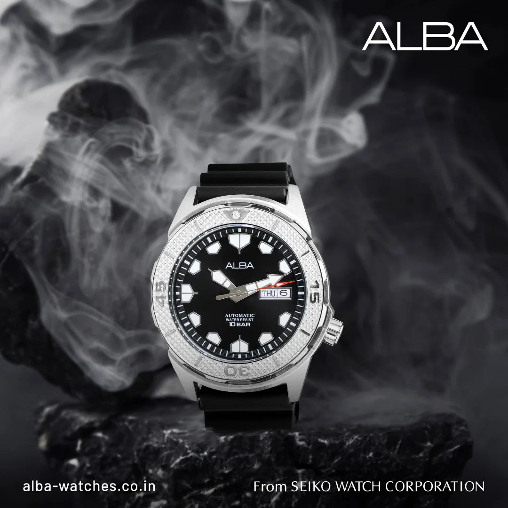

**The essentials:** 42.4mm stainless steel case, Y676 automatic movement, day-date display, mineral crystal, rotating bezel, black silicone strap, 100m water resistance.

The bezel is what caught our eye here. That textured steel ring gives the AL4571X1 a slightly industrial look, with a plain black dial and big white markers keeping the time easy to read. The red tip on the seconds hand is just enough colour. On its black silicone strap, this feels much more like a weekend watch than something bought to disappear under a shirt cuff. At 42.4mm across and 12.9mm thick, it will take up a fair amount of wrist, but the proportions suit the chunky design. We have [written about Alba's place in the Indian market](/blog/alba-watches-india/) before, and this is one of its more appealing sporty options.

The Y676 gets its winding from wrist movement, so expect to give it a gentle swing and reset it after a few days in the drawer. Mineral glass is the other compromise beside the sapphire-equipped alternatives here. [Alba lists this exact reference at ₹14,500](https://alba-watches.co.in/products/al4571x1-black-dial), while [Flipkart price tracking records ₹12,500](https://pricehistory.app/p/alba-al4571x1-mechanical-analog-watch-men-4jO52ow8). We would look for ₹12,000–12,500 during GIF. That is our target for the Amazon listing, not a claim that it has already sold there at that price. Much above ₹13,000, we would have another look at the Ratio before deciding.

<a href="https://link.amazon/B02sWIx7V" target="_blank" rel="noopener noreferrer sponsored" class="buy-cta">→ Buy on Amazon</a>

## 10. Yes, an Invicta

### [Invicta Pro Diver 8926OB](https://link.amazon/B092FonYV) | Buy target: ₹11,500–12,000

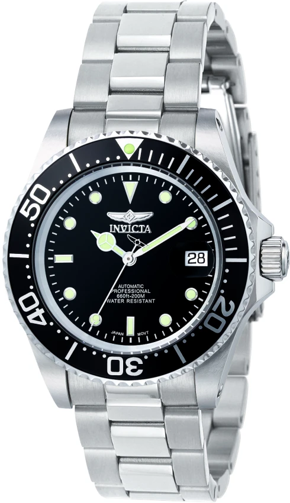

**The essentials:** 40mm stainless steel case, automatic movement, steel bracelet, screw-down crown, 200m water-resistance rating.

Invicta makes some watches that could reasonably require a second wrist. The 8926OB is a much more manageable proposition. A 40mm case, black dial and familiar dive-watch styling give it broad appeal, and the automatic movement makes it an accessible option for someone curious about mechanical watches. The design is clearly borrowing from a very well-known source. If that bothers you, there are more individual-looking watches elsewhere in the list. If it does not, judge the actual watch and price on their merits.

The important number here is the amount you pay, not the amount the listing says you saved. Earlier tracked offers were around ₹11,500–11,900, making roughly ₹12,000 a reasonable ceiling for this sale shortlist. At ₹14,000 or more, we would look harder at the alternatives. Check that you have selected the automatic 8926OB rather than a similarly named quartz Pro Diver, and confirm the seller's warranty terms. Invicta's catalogue is large enough without accidentally buying a different watch from it.

<a href="https://link.amazon/B092FonYV" target="_blank" rel="noopener noreferrer sponsored" class="buy-cta">→ Buy on Amazon</a>

## 11. The Alba I Actually Bought

### [Alba AX7019X1](https://link.amazon/B0jc8pRGs) | Buy target: ₹11,500–12,000

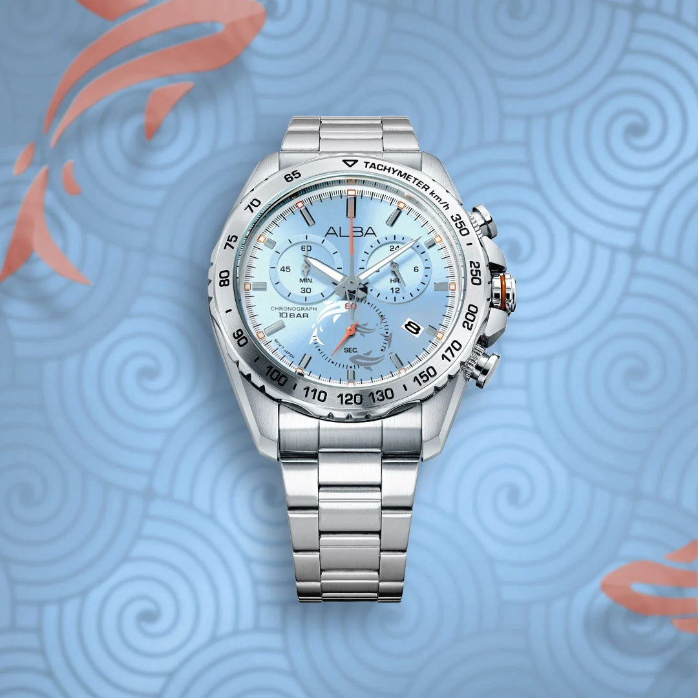

**The essentials:** 44mm stainless steel case, VK68 quartz chronograph, mineral crystal, steel bracelet, 100m water resistance.

This one gets a more personal recommendation because I own it. I paid roughly ₹13,000, and the dial is still the reason I like it so much. The metallic light blue finish catches the light beautifully, the koi pattern across the lower part gives it proper character, and the orange details stop the whole thing from becoming another safe blue chronograph. There is a lot happening, but it works. We have a [full Alba article with my impressions](/blog/alba-watches-india/) if you want the longer version.

The bracelet is okay. It feels a little light, and it is not the part of the watch I would use to justify buying it. The dial and overall styling do that job much better. At 44mm it is also a large watch, so smaller wrists should try it first. We would like to see this around ₹11,500–12,000 during the sale. That is a target rather than a confirmed offer, and it would make a watch I already enjoy easier to recommend against the very competitive Casio options.

<a href="https://link.amazon/B0jc8pRGs" target="_blank" rel="noopener noreferrer sponsored" class="buy-cta">→ Buy on Amazon</a>

## 12. The Marlin With the Right Kind of Clutter

### [Timex Marlin Chronograph TW2W10400UJ](https://link.amazon/B0dBkJRQi) | Buy target: ₹12,000 or less

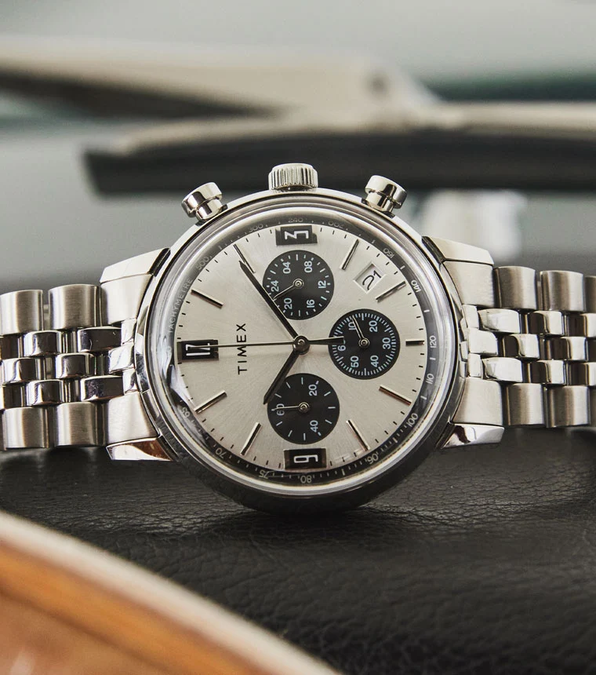

**The essentials:** 40mm stainless steel case, quartz chronograph, domed acrylic crystal, steel bracelet, 50m water resistance.

The Marlin chronograph is one of those watches where the overall design matters more than any individual specification. The contrasting subdials, curved crystal and rounded case give it a convincing vintage look, while the bracelet keeps it useful as an everyday watch. At 40mm, it is also a more manageable alternative to some of the larger chronographs here. There is enough detail to enjoy without needing to turn your wrist into a full motorsport timing station.

The acrylic crystal is part of that look, but it will pick up scratches more readily than sapphire. Make sure you are happy with that before buying. The Amazon tracker recorded a low around ₹12,283 against the ₹14,495 listed price, so ₹12,000 or less would be where we become interested for this particular sale. This is the 40mm TW2W10400UJ. Timex has several similar Marlins now, and a change in reference can mean a different size, dial or strap rather than simply a better discount.

<a href="https://link.amazon/B0dBkJRQi" target="_blank" rel="noopener noreferrer sponsored" class="buy-cta">→ Buy on Amazon</a>

## 13. The Automatic With Sapphire Money Left Over

### [Ratio FreeDiver RTF041](https://link.amazon/B09LXtAHu) | Buy target: ₹12,000–12,500

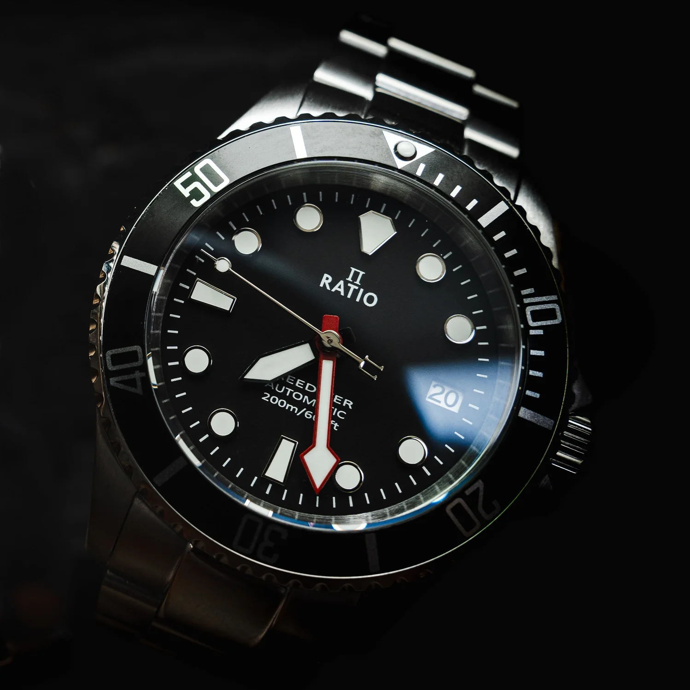

**The essentials:** 43.5mm stainless steel case, NH35 automatic movement, sapphire crystal with anti-reflective coating, steel bracelet, 200m water-resistance rating.

Ratio makes a strong case here if your priority is the watch you get for the money. The black RTF041 has a straightforward sports-watch dial, a rotating bezel and sapphire over the top, with an NH35 automatic movement inside. It is a combination that deserves attention around ₹12,000, particularly when more familiar brands can ask considerably more while still using mineral glass. The black version would be our starting point for versatility, although the coloured dials are worth a look if your collection already has enough sensible choices.

This is not a small watch. At 43.5mm wide and 13mm thick, it needs to suit your wrist before the specification sheet starts winning you over. We found earlier pricing around ₹12,500 within the 200m automatic FreeDiver listings, but the colour and exact reference still need matching when the offer appears. Our target is what would make this RTF041 interesting, not a promise that this exact variant will reach it. Check the seller and after-sales arrangements as carefully as the crystal specification.

<a href="https://link.amazon/B09LXtAHu" target="_blank" rel="noopener noreferrer sponsored" class="buy-cta">→ Buy on Amazon</a>

## 14. The Citizen That Leaves Some Space

### [Citizen Axiom Eco-Drive AU1060-51A](https://www.amazon.in/dp/B00CB9A1OS) | Buy target: ₹15,000–16,000

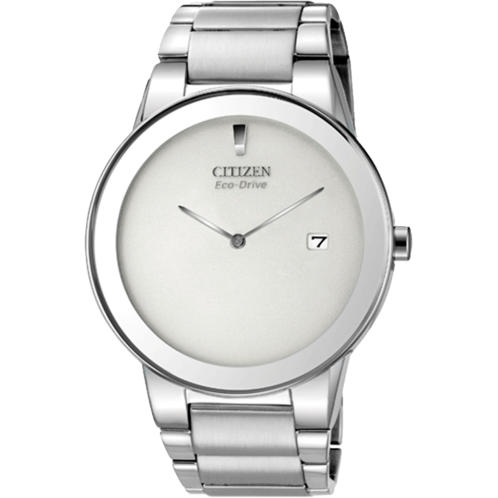

**The essentials:** 40mm stainless steel case, J165 Eco-Drive movement, two hands and date, mineral crystal, steel bracelet, 30m water resistance.

There is almost nothing on this dial, and that is why we like it. Two slim hands, a marker at twelve and a small date window leave the white face wonderfully uncluttered. The glass runs right out to the edge, which makes the Axiom look a little different from the usual round office watch. The silver bracelet keeps it simple enough to wear all week. You do lose the quick reference points of a fully marked dial, so this is probably not the watch for someone who checks the time to the exact minute before every meeting. Some of us would consider that a benefit.

Inside is [Citizen's light-powered J165 movement](https://www.citizenwatches.co.in/products/eco-drive/au1060-51a), so regular exposure to light keeps it running without routine disposable-battery changes. The mineral glass and modest 30m water resistance suit its role as a dress watch; leave it off for swimming. For GIF 2026, **₹15,000–16,000 is the range we would watch for**, based on [tracked Amazon drops to ₹15,795 in March 2026](https://pricehistory.app/p/citizen-stainless-steel-analog-white-dial-men-hkkIjhce). That is a buying target, with no confirmed GIF offer yet. We would not use the much older ₹5,199 low from 2021 as a realistic expectation for this sale.

<a href="https://www.amazon.in/dp/B00CB9A1OS" target="_blank" rel="noopener noreferrer" class="buy-cta">→ Buy on Amazon</a>

## 15. Something Has Happened to the Dial

### [CIGA Design Z Series Edge Z031-BB01-W5BK](https://hourstudio.com/watches/products/ciga-design-edge-z031-bb01-w5bk) | Buy target: ₹20,000–22,000

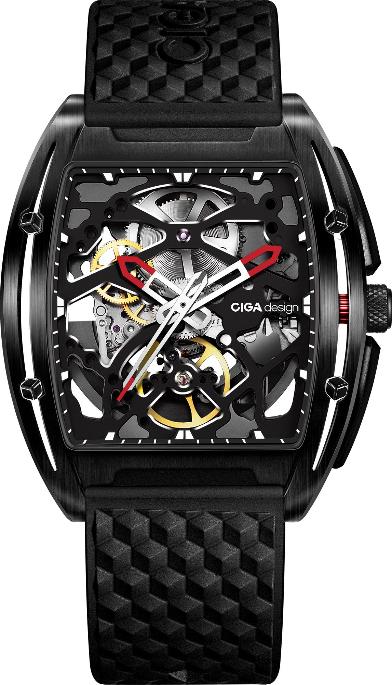

**The essentials:** 40.8mm wide black DLC-coated steel case, automatic skeleton movement, approximately 40-hour power reserve, sapphire crystal, silicone strap, 30m water resistance.

After the very restrained Citizen, this is quite a change of scenery. The black bridges, exposed gears and red-tipped hands give the Edge the look of a small machine strapped to your wrist, which is more or less what it is. The curved barrel-shaped case also makes a welcome change from another round dial. This particular Z031-BB01-W5BK uses steel with a black DLC coating, so do not confuse it with the titanium versions in the same family. We would happily spend too long watching the balance wheel and then have to look again to find out the time.

You get sapphire and [roughly 40 hours of running time on a full wind](https://cigadesign.com/products/series-z-edge), but only 30m water resistance. Treat this as a watch to enjoy looking at, and keep it away from the pool. [HourStudio lists the exact reference at ₹22,610 against ₹26,600 MRP](https://hourstudio.com/watches/products/ciga-design-edge-z031-bb01-w5bk), with [Myntra showing the same offer from Ethos Limited](https://www.myntra.com/watches/cigadesign/ciga-design-men-dial--straps-analogue-automatic-motion-powered-watch-z031-bb01-w5bk/36924328/buy) during research. That gives us a useful comparison before the sale starts. We would aim for ₹20,000–22,000 during the festive offers; a ₹25,000 sale sticker would leave us shopping elsewhere. The lower range is our target, not a confirmed Amazon GIF price.

<a href="https://hourstudio.com/watches/products/ciga-design-edge-z031-bb01-w5bk" target="_blank" rel="noopener noreferrer" class="buy-cta">→ Check price at HourStudio</a>

## 16. The Seiko 5 at a Price We Can Get Behind

### [Seiko 5 Sports SRPD55K1](https://link.amazon/B0gODmd8f) | Buy target: ₹26,000–28,000

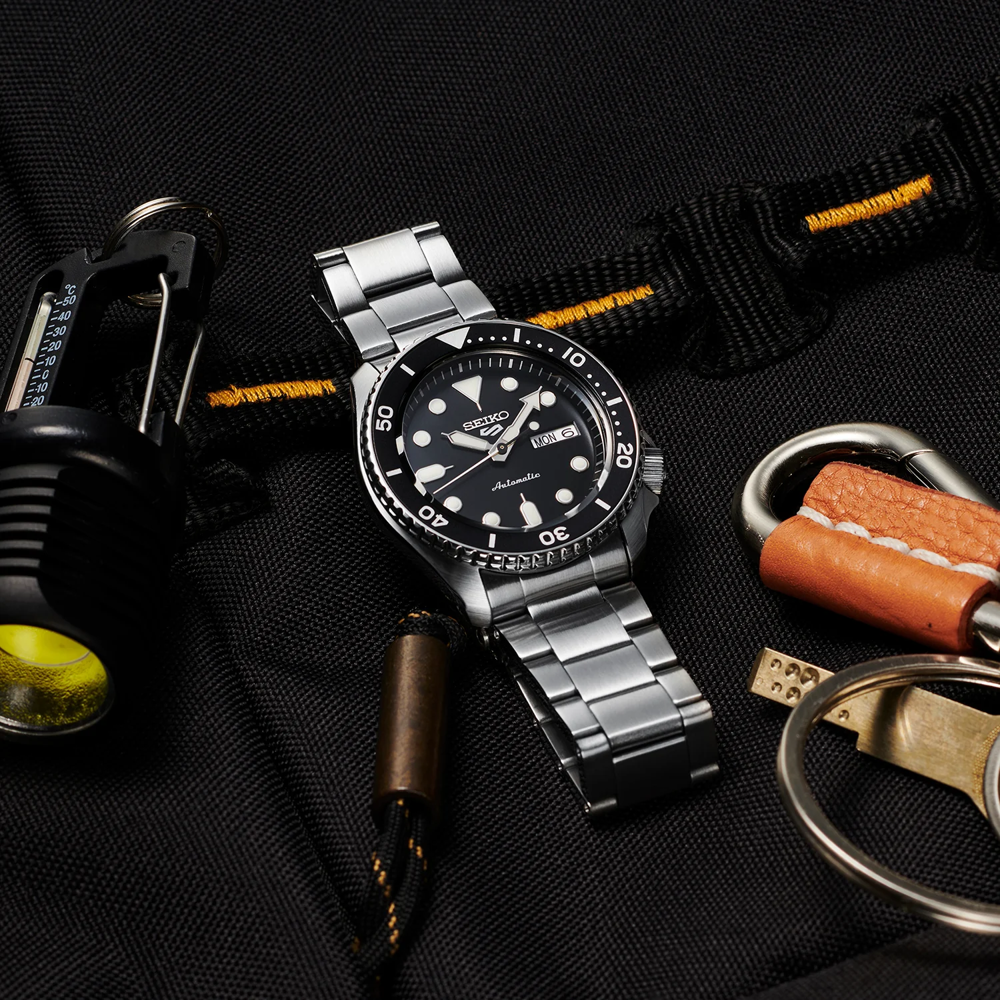

**The essentials:** 42.5mm stainless steel case, 4R36 automatic movement with hand winding and hacking, Hardlex crystal, day-date, 100m water resistance.

The SRPD55 is a familiar watch for a reason. The black dial, broad markers and rounded sports case are easy to like, and the day-date display makes it useful beyond being a first automatic to admire through the caseback. It is a more traditional choice than the CIGA and a more expensive one than the Alba, with the 4R36 adding hand winding and the ability to stop the seconds hand while setting the time. Whether those differences justify the extra money depends on what you want from the watch.

Price is the sticking point. The official MRP is now ₹40,000, while older tracked offers were in the mid-₹20,000s. We would be interested around ₹26,000–28,000, but a routine ten percent off the newer MRP would not make this a standout sale deal for us. You still get Hardlex rather than sapphire, and this is a 100m sports watch rather than an ISO-certified dive watch. There is plenty to enjoy here, provided the price leaves room to enjoy it.

<a href="https://link.amazon/B0gODmd8f" target="_blank" rel="noopener noreferrer sponsored" class="buy-cta">→ Buy on Amazon</a>

## 17. Green and Gold, Without Much Restraint

### [Citizen Tsuyosa NJ0152-51X](https://link.amazon/B0dSkNUIx) | Buy target: ₹32,000–35,000

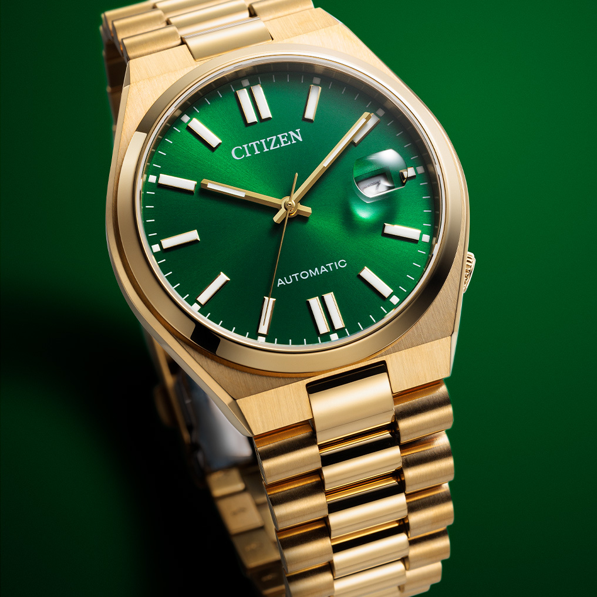

**The essentials:** 40mm gold-tone stainless steel case and bracelet, 8210 automatic movement, approximately 42-hour power reserve, sapphire crystal, date magnifier, 50m water resistance.

Green and gold is hardly a shy combination, and this Tsuyosa makes no attempt to tone it down. The sunray dial looks particularly good against the gold-tone case and bracelet, with the rounded centre links giving it a slightly dressy, seventies feel. We can see this working with a plain shirt or at a wedding without needing much else on the wrist. It is still a 40mm watch, which helps keep all that gold from becoming too much. The finish is over stainless steel, incidentally. A solid-gold Citizen would require a fairly substantial revision to the title of this article.

The [8210 automatic movement, sapphire crystal and 42-hour reserve](https://www.citizenwatch.com/us/en/product/NJ0152-51X) make it a fairly straightforward watch underneath the colour scheme. The small crown tucked near four o'clock is worth trying in person, especially if you rotate watches and reset them often. We would target ₹32,000–35,000 for this version. [Nykaa lists it at ₹44,900](https://www.nykaafashion.com/citizen-men-green-dial-analog-watch-nj0152-51x-m/p/17826035?skuId=17826035), so that asks for a substantial discount and should be treated as an ambitious buying target. If the price stays close to ₹40,000, compare other Tsuyosa colours and retailer offers before paying extra just because this one has caught your eye.

<a href="https://link.amazon/B0dSkNUIx" target="_blank" rel="noopener noreferrer sponsored" class="buy-cta">→ Buy on Amazon</a>

## 18. The GMT, If the Price Comes Back Down

### [Seiko 5 Sports GMT SSK003K1](https://link.amazon/B09HRQv1W) | Buy target: ₹35,000–36,500

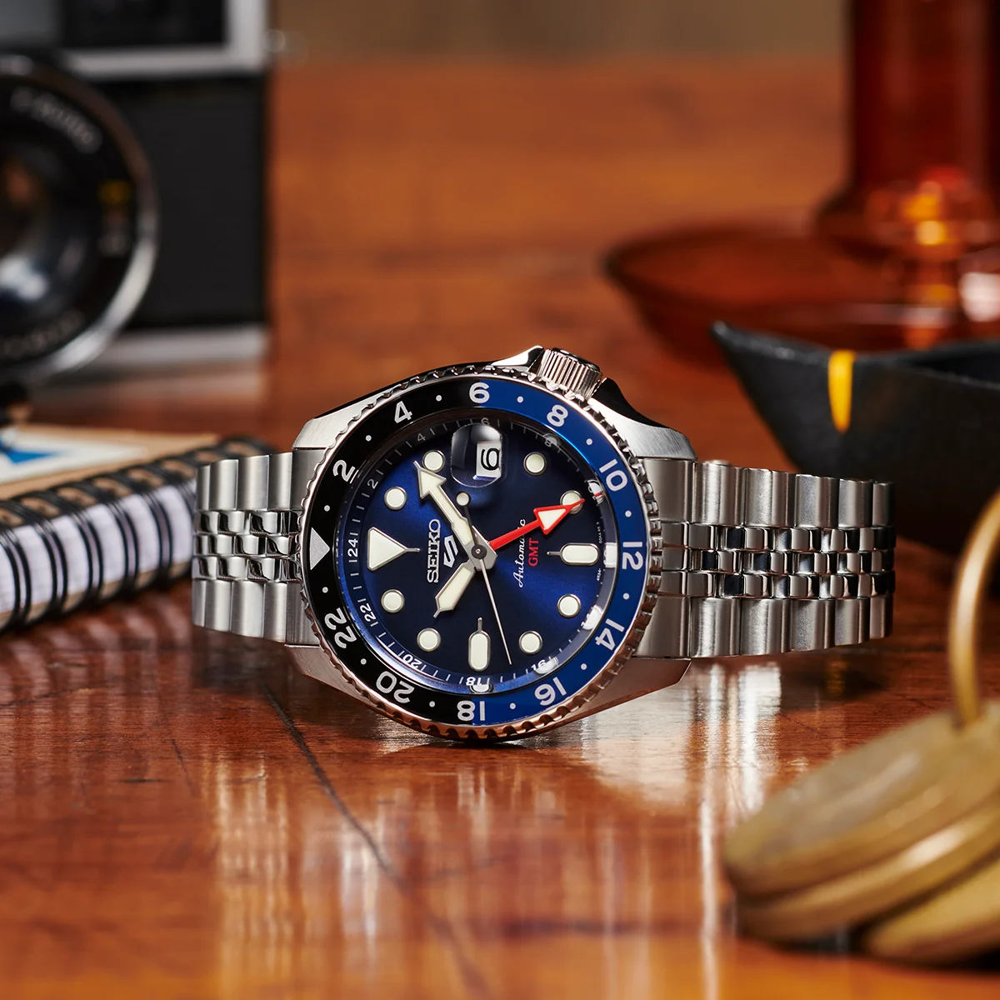

**The essentials:** 42.5mm stainless steel case, 4R34 automatic GMT movement, Hardlex crystal with date magnifier, five-row steel bracelet, 100m water resistance.

The Blueberry is a handsome way to end the list. The blue dial, two-colour bezel and five-row bracelet give it enough detail to feel different from the simpler SRPD, and the extra GMT hand has a useful job if you follow another time zone. The 4R34 is a caller GMT, meaning the GMT hand adjusts independently rather than the local hour hand. That works nicely for keeping track of someone abroad, even if your own travel plans currently extend as far as the office.

This is the most ambitious target here. An older tracked offer reached ₹36,450, but Seiko's official listing now shows ₹55,000, so we should not assume that earlier price will return. We would shortlist it around ₹35,000–36,500 and compare it with other retailers if the offer lands higher. At 13.6mm thick it also has some bulk, and Hardlex remains a compromise at this money. Buy it because you want this particular Seiko GMT, not because the discount has somehow convinced you that you saved enough to buy a second watch.

<a href="https://link.amazon/B09HRQv1W" target="_blank" rel="noopener noreferrer sponsored" class="buy-cta">→ Buy on Amazon</a>

## Where We Would Start

At the affordable end, we would check the AE-1200 and the two square G-Shocks first. Their recent pricing gives us something useful to work with, and all three have a clear reason to be here. Around ₹10,000–12,000, the Voyager is worth watching if you want an automatic field watch, while the Marlin and my Alba are the ones we would choose largely because we enjoy looking at them. The Citizen Eco-Drive is our more practical pick further up, with the Tsuyosa appealing if the design is what you have been waiting for.

The expensive entries need the discounts to do more work. We would be quite happy to leave a Seiko or CIGA out of the final shopping basket if the price does not land where we want it. Check the exact model, seller, warranty and final payable amount, and compare with the brand's own store or an authorised retailer. Our [guide to buying watches in India](/blog/where-to-buy-watches-in-india/) covers that part in more detail. None of the countdown timers gets to make the decision for you.

Found something good, or wondering whether an offer deserves the excitement? Share it on [r/thewristjournal](https://www.reddit.com/r/thewristjournal/). We are always happy to look at another watch. It is the most predictable thing about us.

<!-- EDITOR NOTES, not part of the published article:
Draft prepared 6 October 2026; replacement models researched 7 October 2026. All heading prices are editorial buy targets, not confirmed GIF offers. All 18 product images are matched from GIF-2026. Supplied purchase links are installed; AU1060-51A uses its tracked Amazon ASIN B00CB9A1OS and CIGA Z031-BB01-W5BK links to the verified HourStudio listing. Set the hero image before publication. Keep the existing buy-cta CSS class.

PRICE EVIDENCE:
01 https://pricehistory.app/p/casio-youth-series-digital-grey-dial-mens-XHACWdmb
02 https://pricehistory.app/p/timex-weekender-classic-white-round-dial-analog-WnyNWBSj
03 https://pricehistory.app/p/casio-g-shock-dw-5600ue-1dr-digital-HZ3B8t2h
04 https://pricehistoryapp.com/product/casio-enticer-men-analog-black-dial-men-mdv-107d-1a1vdf-a2189
05 https://pricehistory.app/p/casio-edifice-chronograph-black-dial-mens-watch-yagYErIm
06 https://pricehistory.app/p/casio-g-shock-g-5600ue-1dr-digital-HqRoRdmb
07 https://pricehistory.app/p/ratio-field-watch-sapphire-crystal-nylon-strap-u6kaOmw8
08 https://pricehistory.app/p/boderry-mens-titanium-automatic-military-watch-40mm-G6jRsySj and https://thewristjournal.com/blog/prime-day-2026-part-2/
09 AL4571X1: official MRP ₹14,500, https://alba-watches.co.in/products/al4571x1-black-dial; Flipkart tracker low ₹12,500 on 29 October 2025, https://pricehistory.app/p/alba-al4571x1-mechanical-analog-watch-men-4jO52ow8. Editorial GIF target ₹12,000–12,500, not an Amazon historical low.
10 https://pricehistory.app/p/invicta-automatic-pro-diver-stainless-steel-watch-yfSSRdmb
11 Editorial target, not a verified historic Amazon low. Ownership evidence: https://thewristjournal.com/blog/alba-watches-india/
12 https://pricehistoryapp.com/product/timex-men-silver-tone-round-stainless-steel-dial-analog-watch-tw2w10400uj
13 Family-level evidence only: https://pricehistory.app/p/ratio-freediver-sapphire-crystal-diver-watch-japanese-V1PkpCIm
14 AU1060-51A: Amazon tracker recorded ₹15,795 on 1 and 19 March 2026, https://pricehistory.app/p/citizen-stainless-steel-analog-white-dial-men-hkkIjhce. ASIN B00CB9A1OS. Editorial GIF target ₹15,000–16,000. Do not project the December 2021 low of ₹5,199 onto the upcoming sale.
15 Z031-BB01-W5BK, black DLC steel: ₹22,610 against ₹26,600 MRP at https://hourstudio.com/watches/products/ciga-design-edge-z031-bb01-w5bk and https://www.myntra.com/watches/cigadesign/ciga-design-men-dial--straps-analogue-automatic-motion-powered-watch-z031-bb01-w5bk/36924328/buy. Editorial festive-sale target ₹20,000–22,000. No confirmed Amazon GIF price found.
16 https://pricehistory.app/p/seiko-analog-black-dial-mens-watch-srpd55k1-4Eoxjhce
17 NJ0152-51X: ₹44,900 listed at https://www.nykaafashion.com/citizen-men-green-dial-analog-watch-nj0152-51x-m/p/17826035?skuId=17826035. Editorial target ₹32,000–35,000 requires about 22–29% off that price; not a verified historic low or confirmed upcoming offer.
18 Older evidence only: https://pricehistory.app/p/seiko-analog-stainless-steel-blue-dial-silver-LO8Fl7Q2

SPECIFICATION SOURCES:
https://www.casio.com/in/watches/casio/product.AE-1200WH-1AV/
https://timex.com/products/weekender-38mm-fabric-strap-watch-t2n654
https://www.casio.com/in/watches/gshock/product.DW-5600UE-1/
https://www.casio.com/in/watches/casio/product.MDV-107D-1A1V/
https://www.casio.com/intl/watches/edifice/product.EFR-526L-1AV/
https://www.casio.com/in/watches/gshock/product.G-5600UE-1/
https://www.ratiowatches.com/products/ratio-quest-mens-field-watch-sapphire-canvas-strap-quartz-rtq019-100m-lewis-and-clark-edition
https://www.boderry.com/products/voyager-titanium-field-watch-black
https://alba-watches.co.in/products/al4571x1-black-dial
https://albawatches.com/Watch/AL4571X1
https://www.albawatches.com/storage/instructions/Y676_E.pdf
https://invictawatch.eu/products/reloj-invicta-pro-diver-8926ob
https://thewristjournal.com/blog/alba-watches-india/
https://timex.com/products/marlin-chronograph-tachymeter-40mm-stainless-steel-bracelet-watch-tw2w10400
https://www.ratiowatches.com/products/ratio-freediver-sapphire-stainless-steel-black-dial-automatic-rtf041-200m-mens-watch
https://www.citizenwatches.co.in/products/eco-drive/au1060-51a
https://iwc.com.pk/citizen/product/au1060-51a/
https://cigadesign.com/products/series-z-edge
https://hourstudio.com/watches/products/ciga-design-edge-z031-bb01-w5bk
https://www.seikowatches.com/in-en/products/5sports/srpd55
https://www.citizenwatches.co.in/products/mechanical/nj0152-51x
https://www.citizenwatch.com/us/en/product/NJ0152-51X
https://www.seikowatches.com/in-en/products/5sports/ssk003
-->
