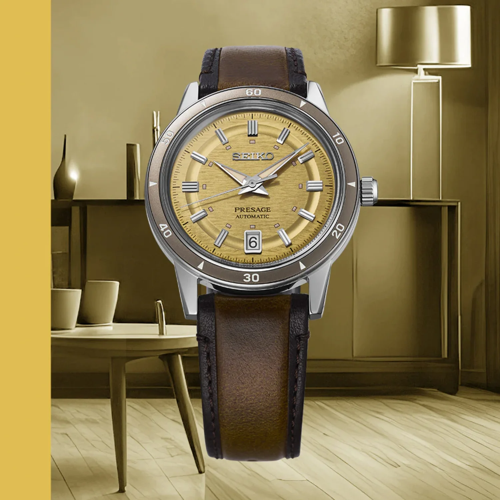
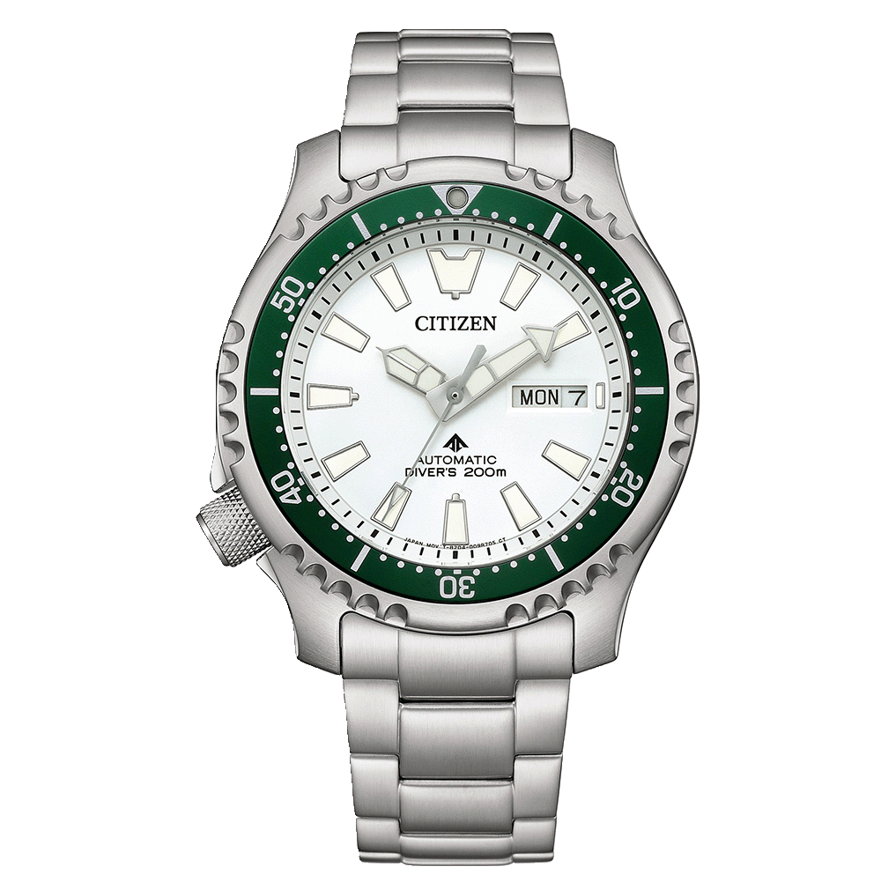
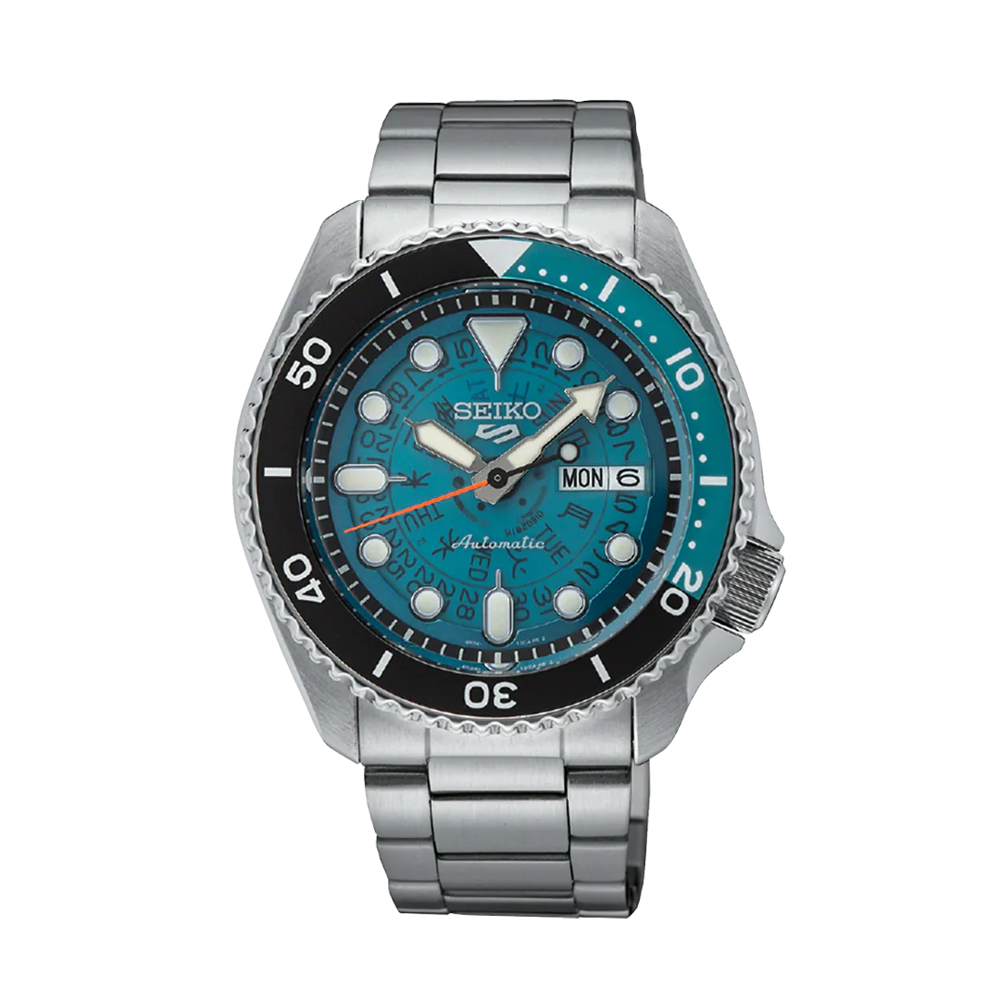
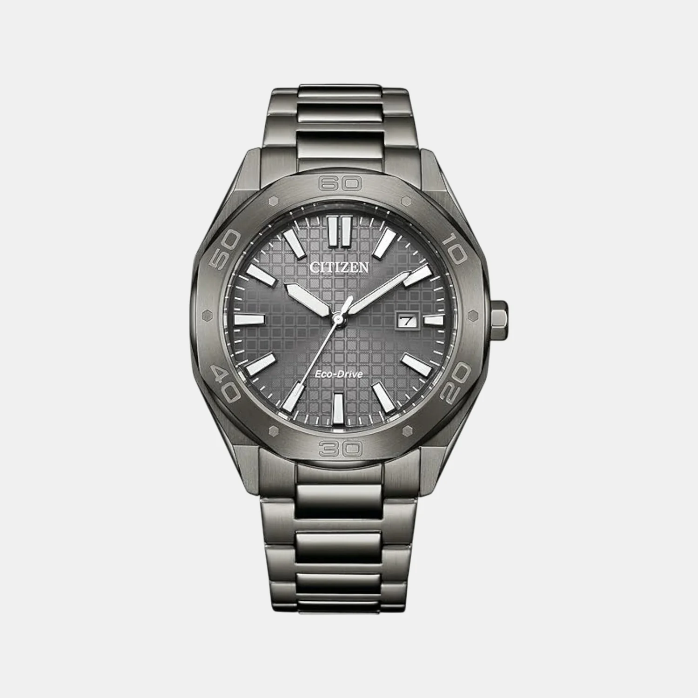
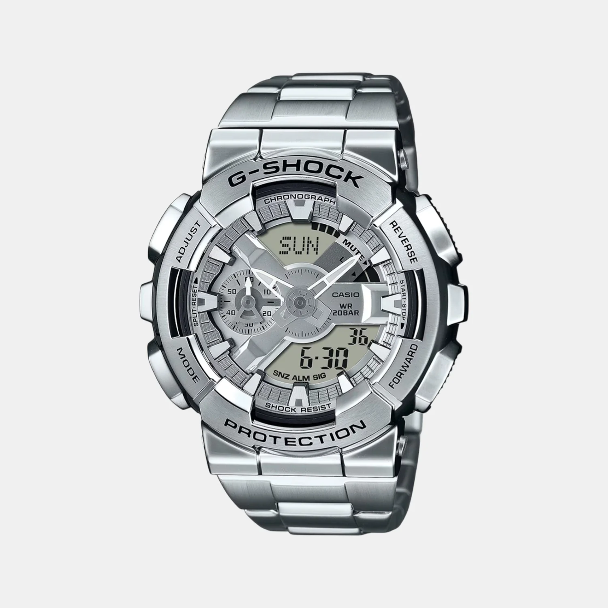
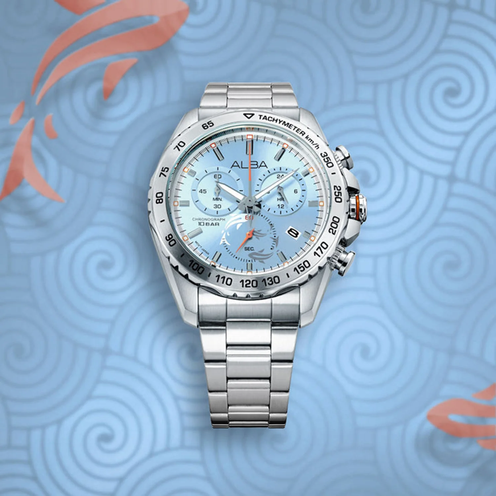
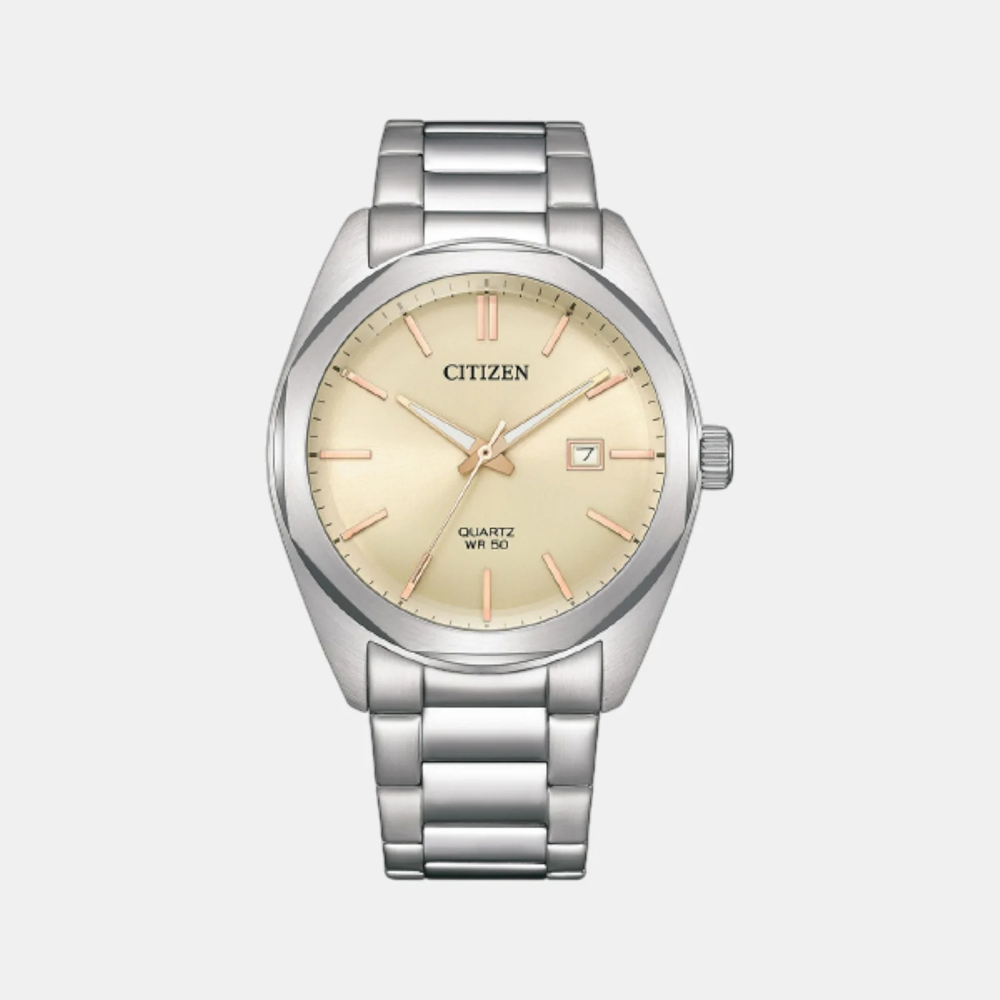
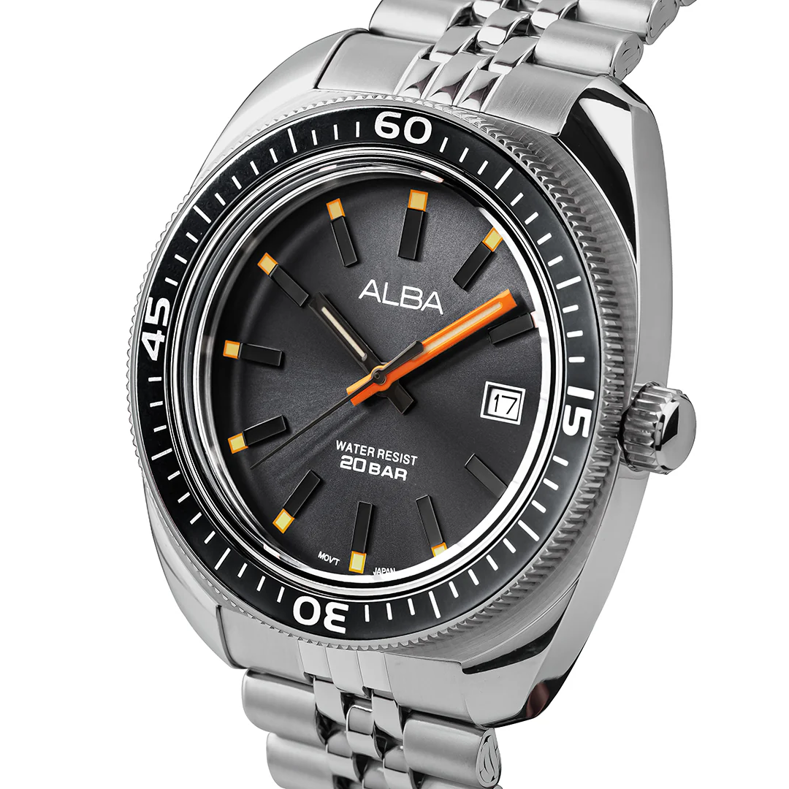

Japanese watchmaking has earned its reputation the hard way — through decades of obsessive engineering, bold design, and giving you far more than what you pay for. Whether it is Seiko's legendary automatics, Citizen's solar-powered wizardry, or Casio's built-like-a-tank G-Shocks, you are getting heritage and innovation without the luxury tax.

This list covers **one standout Japanese watch at every major price point under ₹50,000**, available right now in India. No filler — just watches we genuinely think are worth your money. And if you are on a tighter budget, do not miss our [Best Watches Under ₹3,000](/blog/best-watches-under-3k/) guide — some absolute legends in there.

---

# 1. The Vintage Charmer — ₹50,000

## [Seiko Presage Style60s SRPL75J1](https://seikowatches.co.in/products/seiko-presage-style-60s-in-golden-yellow-srpl75j1) – ₹50,000

Seiko Presage Style60s Golden Yellow SRPL75J1

**Key Specifications:**
- **Movement:** Automatic (41-hour power reserve)
- **Case Size:** ~40mm
- **Crystal:** Hardlex
- **Water Resistance:** 50 meters
- **Strap:** Oiled calf leather

This is one of those watches that photographs well but looks even better in person. The golden yellow dial has a warmth that catches the light in the most flattering way, and paired with a brown oiled calf leather strap, the whole package screams vintage sophistication.

The case design is rooted in the sixties — it draws directly from the iconic Seiko Crown Chronograph of 1964. There is a subtle retro curve to the lugs and a dial layout that feels effortlessly timeless. If you like the idea of wearing something with genuine design heritage on your wrist, this is it.

**The one catch:** At ₹50,000, you are getting Hardlex crystal instead of sapphire, which stings a little. That said, Hardlex is tougher than regular mineral glass and handles daily wear just fine.

**Pro tip:** Presage watches almost always have room for negotiation at authorized dealers. A 10–15% discount is very achievable if you ask nicely.

---

# 2. The Diver That Stands Out — ₹47,500

## [Citizen Promaster Marine "Fugu" NY0168-64A (Limited Edition)](https://justintime.in/collections/citizen/products/citizen-men-automatic-white-dial-analog-stainless-steel-watch-ny0168-64a) – ₹47,500

Citizen Promaster Marine Fugu Limited Edition NY0168-64A

**Key Specifications:**
- **Movement:** Automatic (41-hour power reserve)
- **Case Size:** 42mm
- **Crystal:** Sapphire
- **Water Resistance:** 200 meters
- **Complication:** Day-Date

Honestly? This might be the best watch on this entire list.

The Citizen Fugu earns its nickname from the Japanese pufferfish — you can see the inspiration in the distinctive serrated bezel that gives the watch its unique, almost spiky character. Flip it over and there is a fugu engraved on the caseback, a nice touch of personality that you rarely see at this price.

The white dial with green bezel accents is absolutely gorgeous. It has the kind of presence that makes people ask "what watch is that?" — and this is a limited edition, so not everyone will have one. To top it off, it ships in a collector's dive tank case, which is genuinely cool packaging.

200 meters of water resistance, sapphire crystal, day-date display, automatic movement — this thing checks every single box. Honestly, we struggled to find a real con here.

**Cons:** None. Seriously.

---

# 3. The Skeleton That Actually Works — ₹30,000

## [Seiko 5 Sports SKX Skeleton Style SRPJ45K1](https://seikowatches.co.in/products/seiko-5-sports-skx-skeleton-style-srpj45k1) – ₹30,000

Seiko 5 Sports SKX Skeleton Style SRPJ45K1

**Key Specifications:**
- **Movement:** Automatic (41-hour power reserve)
- **Case Size:** ~42mm
- **Crystal:** Hardlex
- **Water Resistance:** 100 meters
- **Complication:** Day-Date (English + Kanji)

Skeleton dials can go wrong very quickly — they either look cheap or way too busy. The SRPJ45K1 nails the balance.

This is a modern take on a 1970s Seiko design that was originally famous for its translucent dial showing the day/date disc rotation underneath. The highlight? That red-orange second hand pops against the blue tones like nothing else in this price range.

The "5" on the dial is not just styling — it represents the five core features every Seiko 5 has delivered since the beginning: automatic movement, day-date display, water resistance, recessed crown, and a durable case. All five are still present here.

Through the transparent dial you can actually watch the English and Kanji day discs rotate, which is a genuinely cool detail that never gets old. It is the kind of watch that keeps pulling you back for another look at your own wrist.

**The one catch:** Like the Presage above, you are getting Hardlex instead of sapphire crystal at ₹30,000.

---

# 4. The Futuristic Daily Wear — ₹28,500

## [Citizen Eco-Drive BM7637-81H](https://justintime.in/collections/citizen/products/citizen-eco-drive-men-eco-drive-grey-dial-analog-stainless-steel-watch-bm7637-81h) – ₹28,500

Citizen Eco-Drive BM7637-81H Grey Dial

**Key Specifications:**
- **Movement:** Eco-Drive (Solar-powered Quartz)
- **Case Size:** 41mm
- **Crystal:** Mineral
- **Water Resistance:** 100 meters
- **Complication:** Date

There is something quietly menacing about this watch — in the best possible way. The grey-tone case, textured dial, and gun metal finishing come together to create a look that is futuristic but not flashy. It is the kind of watch that says "I know what I am doing" without shouting about it.

The octagonal dial shape gives it a distinctive silhouette that breaks away from the usual round-everything crowd. And that textured dial catches light differently at every angle, adding depth that flat dials simply cannot match.

The real party trick is Citizen's Eco-Drive technology — this watch is powered by any light source. Sunlight, office fluorescents, even a desk lamp. No battery changes, ever. Just strap it on and forget about maintenance. For a daily wearer, that is a massive win.

**Worth noting:** You only get a date window here, no day display. And no sapphire crystal either. At this price, we would have liked to see at least one of those.

---

# 5. The Stainless Steel Tank — ₹21,995

## [Casio G-Shock Full Metal G1687](https://amzn.to/4bABPDs) – ₹21,995

Casio G-Shock Full Metal Stainless Steel G1687

**Key Specifications:**
- **Movement:** Quartz
- **Water Resistance:** 200 meters
- **Features:** World Time, Timer, Stopwatch
- **Material:** Full Stainless Steel

Take everything you know about the G-Shock — the toughness, the reliability, the "I dropped it off a building and it still works" energy — and now imagine the entire thing crafted in stainless steel. That is the G1687.

This is not your plastic playground G-Shock. It is a beast of a watch with real heft and a premium feel that your standard resin models just cannot replicate. The full stainless steel construction gives it a completely different character: more refined, more grown-up, but still unmistakably G-Shock in its DNA.

You still get all the classic features — world time for tracking multiple zones, a countdown timer, and a stopwatch that is accurate down to a fraction. It is basically a toolkit on your wrist.

**Fair warning:** This thing runs big and it runs heavy. If you have smaller wrists or prefer lighter watches, this might feel like too much. Also, at this price point, the lack of Bluetooth connectivity is a bit surprising — most G-Shocks in this range offer app pairing. Looking for G-Shocks built specifically for the outdoors? Check out our [Best Outdoor Watches](/blog/best-outdoor-watches/) guide where we cover the Mudman and Mudmaster.

<a href="https://amzn.to/4bABPDs" target="_blank" rel="noopener noreferrer" class="buy-cta">→ Buy on Amazon</a>

---

# 6. The Koi Fish Stunner — ₹15,000

## [Alba Chronograph AX7019X1](https://amzn.to/4caNJUD) – ₹15,000

Alba Men Quartz Light Blue Dial Chronograph AX7019X1

**Key Specifications:**
- **Movement:** Quartz
- **Case Size:** 44mm
- **Water Resistance:** 100 meters
- **Complication:** Chronograph

We need to talk about this dial. It is light blue with a subtle koi fish silhouette etched into it. Silver and orange accents frame the markers and hands. The whole thing comes together in a way that is genuinely jaw-dropping at this price. We have seen watches three times this price that do not look half as interesting.

Alba is Seiko's more affordable subsidiary brand, and they clearly poured some of that Seiko design DNA into this piece. The 44mm case runs slightly on the bigger side, but the proportions work well with the chronograph sub-dials. The stainless steel bracelet keeps it sporty and versatile enough for both casual and semi-formal wear.

At ₹15,000, this is one of the most visually striking watches you can get in India. It is an absolute banger.

**Worth noting:** No sapphire crystal, but honestly — at fifteen grand, we are not going to hold that against it.

<a href="https://amzn.to/4caNJUD" target="_blank" rel="noopener noreferrer" class="buy-cta">→ Buy on Amazon</a>

---

# 7. The Golden Classic — ₹14,500

## [Citizen Hyperion BI5110-54B](https://amzn.to/4bWSBM5) – ₹14,500

Citizen Hyperion Men Quartz Gold Dial BI5110-54B

**Key Specifications:**
- **Movement:** Quartz
- **Case Size:** 41mm
- **Crystal:** Mineral
- **Water Resistance:** 50 meters
- **Complication:** Date

Gold watches get a bad rap sometimes — people assume they look gaudy or try-hard. The Hyperion proves them wrong.

The yellow-golden dial is rich without being obnoxious, and the matching gold hour markers and hands enhance the look rather than overwhelming it. The stainless steel octagonal case and bracelet add a modern geometric edge that keeps the whole watch from feeling old-fashioned.

At 41mm, it sits perfectly on most wrists. It is the kind of watch that elevates a simple button-down-and-chinos outfit into something that looks put together. Citizen's build quality at this price is dependable as always.

**Worth noting:** Date only — no day display. No sapphire crystal either, but at under fifteen thousand rupees, the overall package still feels like solid value.

<a href="https://amzn.to/4bWSBM5" target="_blank" rel="noopener noreferrer" class="buy-cta">→ Buy on Amazon</a>

---

# 8. The Sporty Underdog — ₹11,000

## [Alba Quartz AS9T87X1](https://justintime.in/collections/alba/products/alba-men-quartz-silver-dial-analog-steel-watch-as9t87x1) – ₹11,000

Alba Men Quartz Silver Dial Analog Steel Watch AS9T87X1

**Key Specifications:**
- **Movement:** Quartz
- **Case Size:** 43mm
- **Water Resistance:** 200 meters
- **Complication:** Date

For eleven thousand rupees, 200 meters of water resistance is impressive — most watches at this price tap out at 50 or 100 meters. That alone puts the AS9T87X1 in a different league.

But it is not just about the specs. The watch has a uniquely shaped square-ish case with rounded edges that stands out from the sea of round watches in this segment. The black dial paired with orange accents gives it a sporty, almost motorsport-inspired personality. It looks like it costs a lot more than it does.

At 43mm in stainless steel, it has good wrist presence without being too chunky. It is the kind of watch you throw on for weekends, gym sessions, or casual outings and never worry about.

**Worth noting:** Date only, no day display — but at this price point, that is perfectly standard.

---

# Final Thoughts

Japanese watchmaking punches harder than any other country at these price points. From ₹11,000 to ₹50,000, you are getting automatic movements, solar power, 200m dive ratings, and genuinely beautiful design — the kind of stuff that Swiss brands charge multiples more for.

**Our top picks:**

- **Best overall:** The **Citizen Fugu** is borderline unfair at ₹47,500. Limited edition, sapphire crystal, 200m rating, and drop-dead gorgeous. If you can swing the budget, get this.
- **Best value:** The **Alba Koi Fish Chronograph** at ₹15,000 delivers a dial that embarrasses watches twice its price.
- **Best daily wearer:** The **Citizen Eco-Drive BM7637-81H** — never change a battery, just strap it on and go.
- **Best for enthusiasts:** The **Seiko 5 Skeleton** at ₹30,000. Watching the Kanji day disc rotate through that translucent dial never gets old.

All prices are MRP. Many of these are available at lower prices during sales or through negotiation at authorized dealers. Need help finding the right store? Our [Where to Buy Watches in India](/blog/where-to-buy-watches-in-india/) guide has every reliable retailer covered. Happy hunting.
