Prime Day is here again. July 4th through 6th, and if last year is anything to go by, the watch section is going to be a mess of flash discounts, "limited time" banners, and prices that swing by the hour. So we did what we always do before a big sale. We went through the listings, cross-checked the specs, and put together a list of what is actually worth clicking "Add to Cart" on.

A quick note before we start: the prices below are our estimates based on MRP and how these specific watches have historically discounted on Flipkart and Amazon. Prime Day pricing can be a hit or miss, so treat these as a guide, not a guarantee. Always check the live price before you buy.

This list spans the full range, from a ₹1,500 Casio digital that will outlive us all to an automatic Edifice that is barely a month old. If you want more budget picks outside the sale window, our [Best Watches Under ₹5,000](/blog/best-watches-under-5k/) and [Best Watches Under ₹10,000](/blog/best-watches-under-10k/) guides are still the definitive word. And if the ₹800 internet-famous Casio catches your eye anywhere in this sale, we already put it through its paces in our [MRW-200H review](/blog/casio-mrw-200h-review/).

Let's get into it.

---

# 1. The ₹1,500 Icon

## [Casio Vintage A-158WA-1Q](https://amzn.to/4veS0gd) – Expected around ₹1,500-1,600

Casio Vintage A-158WA-1Q Digital Watch

**Key Specifications:**
- **Case Size:** 36.8 x 33.2 x 8.2mm
- **Case Material:** Chrome-plated resin case with stainless steel band
- **Crystal:** Resin glass
- **Water Resistance:** Splash resistant
- **Battery Life:** Approximately 7 years
- **Features:** 1/100-second stopwatch, daily alarm, auto-calendar, micro-light

This is the watch that everyone's dad, uncle, or that one friend with impeccable vintage taste already owns. The A158W family has been around since 1989, and this particular chrome-and-black version leans hard into that retro digital look that has somehow become cool again decades later.

At under 34mm across, it is genuinely tiny by modern standards, which is exactly the point. It sits flat, disappears under a cuff, and does not compete with anything else you are wearing. The stopwatch, alarm, and auto-calendar cover everything a digital watch actually needs to do, and the 7-year battery means you will forget it even runs on a battery at all.

**The bottom line:** At this price, it is basically an impulse buy that happens to be a genuinely good watch. Grab two. One for you, one to gift.

<a href="https://amzn.to/4veS0gd" target="_blank" rel="noopener noreferrer" class="buy-cta">→ Buy on Amazon</a>

---

# 2. The Affordable Moonphase

## [Timex TWEG19608](https://amzn.to/3QwfJdG) – Expected around ₹2,400

Timex Multifunction Moon Phase TWEG19608

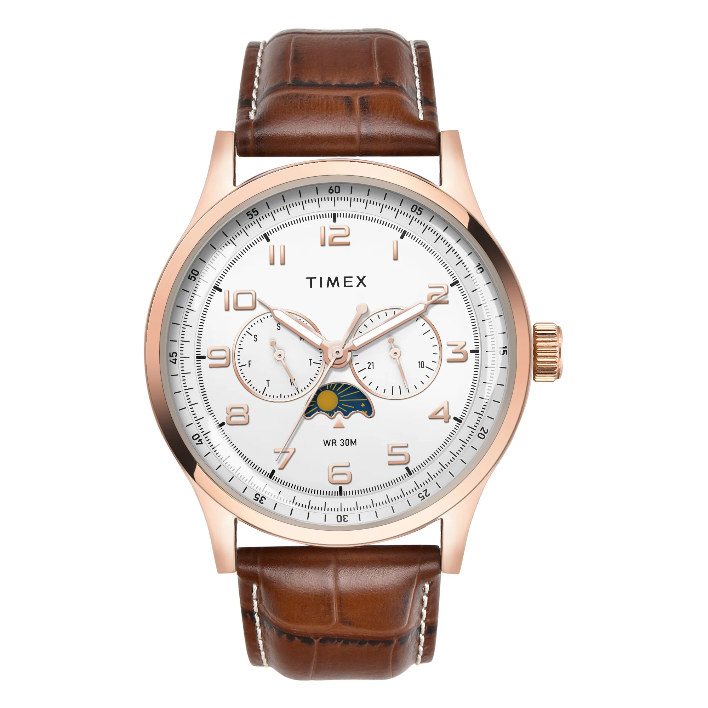

**Key Specifications:**
- **Case Size:** 45mm
- **Movement:** Quartz, multifunction
- **Strap:** Textured leather
- **Complication:** Moonphase, date
- **Water Resistance:** 30 Meters

Moonphase complications are usually the kind of thing you find on watches costing five figures and up, so seeing one show up on a Timex under ₹4,200 MRP is a little bit ridiculous in the best way. It will not track the lunar cycle with the same precision as a mechanical moonphase costing forty times as much, but visually, it delivers the exact same "wait, is that a moonphase" reaction from anyone who notices it.

At 45mm, this is a big watch, so it wears best on medium to larger wrists. The leather strap has a nice textured finish that keeps it from feeling like a pure fashion piece, and the dial layout does a good job of packing in the multifunction subdials without looking cluttered.

**The catch:** 30 metres of water resistance means this is a desk and dinner watch, not a swimming companion. Keep it away from the pool.

<a href="https://amzn.to/3QwfJdG" target="_blank" rel="noopener noreferrer" class="buy-cta">→ Buy on Amazon</a>

---

# 3. The Vintage Date Window Nobody Else Has

## [Timex TW000EL09](https://amzn.to/4eUAR5n) – Expected around ₹2,500

Timex Fashion TW000EL09 Brown Dial

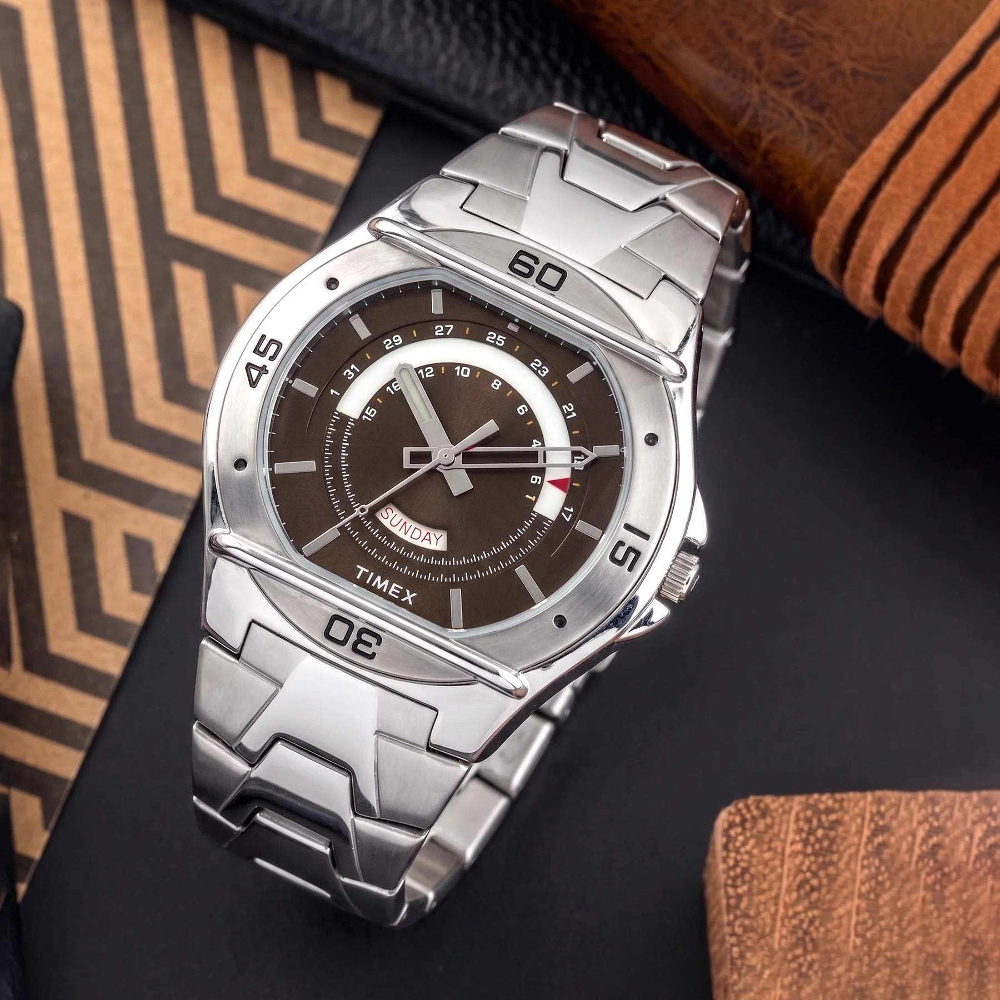

**Key Specifications:**
- **Case Size:** 44.5mm brass case
- **Movement:** Quartz
- **Strap:** Stainless steel bracelet, silver-tone
- **Complication:** Day-date
- **Water Resistance:** 30 Meters

Most watches at this price stick a boring rectangular date window at 3 o'clock and call it a day. The TW000EL09 does something different. The date sits in a curved, semicircle-style cutout near the top of the dial with a small marker pointing to it, which gives the whole face a vintage, almost instrument-panel character you do not see on watches this affordable.

Paired with the warm brown dial and silver bracelet, it reads a lot more expensive than its actual price tag. It is a big watch at 44.5mm, so this one is for people who like a bit of wrist presence, not a minimalist.

**Why it is here:** Unique complications this low in the price ladder are rare, and this one genuinely photographs well. A solid pick if you want a watch that looks like nothing else in the room.

<a href="https://amzn.to/4eUAR5n" target="_blank" rel="noopener noreferrer" class="buy-cta">→ Buy on Amazon</a>

---

# 4. The Brand New Steel Upgrade

## [Casio W-800HD-1AV](https://amzn.to/3QA5u8d) – Expected around ₹2,500

Casio W-800HD-1AV Silver Digital Watch

**Key Specifications:**
- **Case Size:** 44.2 x 36.8 x 13.4mm
- **Weight:** 91g
- **Case & Band:** Resin case with stainless steel band and tri-fold clasp
- **Water Resistance:** 100 Meters
- **Battery Life:** Approximately 10 years
- **Features:** Dual time, LED backlight, 1/100-second stopwatch

This one only just landed. Casio quietly rolled out the W-800HD in early 2026 as a metal-band upgrade to the long-running W-800H, and it is one of the freshest releases on this whole list. The formula is the same no-nonsense digital utility Casio has been perfecting for decades, but this time it comes on a proper stainless steel bracelet with a tri-fold clasp instead of the usual resin strap.

You still get everything that made the original W-800H a cult favorite: 100 metres of water resistance, a genuine 10-year battery, dual time zones, and a green LED backlight for low light. The octagonal-adjacent case shape and brushed silver finish give it a slightly more "grown-up" look than the typical budget Casio digital.

**Why it matters:** This is one of the newest Casio releases you will find discounted this Prime Day, and the steel-band upgrade genuinely changes how it wears. Worth grabbing before word gets around.

<a href="https://amzn.to/3QA5u8d" target="_blank" rel="noopener noreferrer" class="buy-cta">→ Buy on Amazon</a>

---

# 5. The Blacked-Out Stealth Pick

## [Timex TWEG30203](https://amzn.to/4gMVLpy) – Expected around ₹2,700

Timex TWEG30203 Black Dial Remote Second-Date

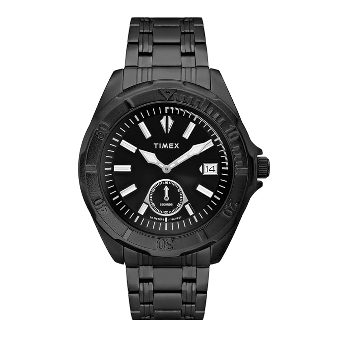

**Key Specifications:**
- **Movement:** Quartz, remote second-date function
- **Case & Bracelet:** Fully blacked-out stainless steel
- **Complication:** Dedicated seconds sub-dial, date
- **Dial:** Black with sharp-edged hour markers

Timex calls this a "remote second-date" watch, which is a fancy way of saying the seconds hand gets its own dedicated sub-dial instead of sweeping across the main dial. It is a small detail, but it completely changes how the face reads at a glance and gives it a more layered, technical look than a standard three-hander.

Everything on this watch, the case, the bracelet, the dial, is blacked out, which gives it a stealthy, almost Bruce Wayne-off-duty energy. The sharp, angular hour markers keep it from feeling like a generic all-black watch and add a bit of edge to the design.

**The bottom line:** If you want something dark, modern, and different from every silver-dial quartz watch flooding this price range, this is the one to grab.

<a href="https://amzn.to/4gMVLpy" target="_blank" rel="noopener noreferrer" class="buy-cta">→ Buy on Amazon</a>

---

# 6. The Bull-Barred Baby Shock

## [Casio G-Shock DW-5600PT-5DR](https://amzn.to/4eHNUqP) – Expected around ₹4,000

Casio G-Shock DW-5600PT-5DR G1334

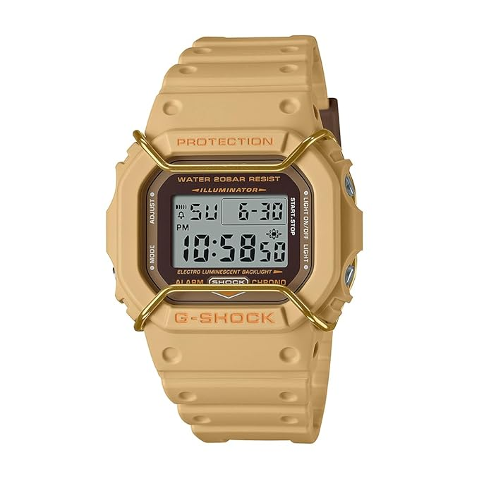

**Key Specifications:**
- **Case Size:** 48.9 x 42.8 x 14.8mm
- **Weight:** 55g
- **Water Resistance:** 200 Meters
- **Battery Life:** Approximately 2 years
- **Case Material:** Resin with metallic wire face protectors

This is a 5600, the same silhouette that traces directly back to the original 1983 DW-5000C, so the DNA here is as legit as G-Shock gets. What makes this particular version stand out is the "Tone-on-Tone" treatment: a golden-brown monochromatic colorway with metallic wire face protectors, or "bull bars," wrapped around the display for the first time on this case shape.

Does a G-Shock actually need more protection than it already has? Not really. But the bull bars add a rugged, industrial look that makes this one of the more distinctive 5600 colorways in recent memory, and the illuminator function means the display lights up cleanly in the dark.

**Why it is here:** 200 metres of water resistance and genuine shock resistance for around ₹4,000 is hard to beat, and the bull-bar detailing means it does not look like every other square G-Shock on the wrist next to you.

<a href="https://amzn.to/4eHNUqP" target="_blank" rel="noopener noreferrer" class="buy-cta">→ Buy on Amazon</a>

---

# 7. The Sapphire Sleeper from Seiko's Sister Brand

## [Alba AS9R17X1](https://amzn.to/3SVL0aw) – Expected around ₹7,000

Alba AS9R17X1 Asterix Blue Dial

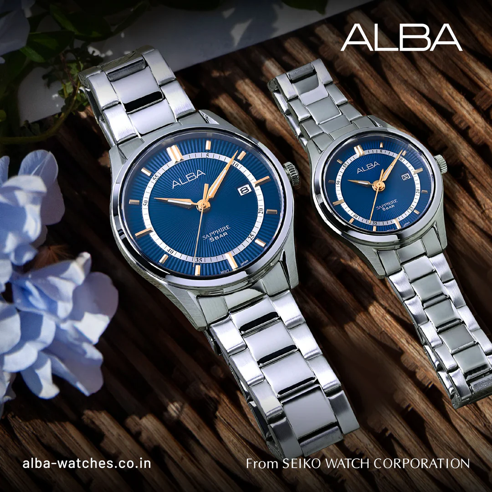

**Key Specifications:**
- **Case Size:** 41mm
- **Movement:** Quartz (Caliber VJ42)
- **Crystal:** Sapphire
- **Case Back:** Screw case back
- **Water Resistance:** 50 Meters

Sapphire crystal under ₹9,000 MRP is genuinely rare, and this is where Alba, Seiko's more fashion-forward sister brand, quietly earns its keep. The Asterix line pairs a deep blue textured dial with luminous hands and a stainless steel bracelet, and the whole thing looks noticeably more expensive than what it costs once you actually handle it.

The 41mm case wears comfortably on most wrists, and the screw-down case back is a nice touch of durability you do not always see at this level. Since Alba runs under the Seiko umbrella, you also get access to Seiko's service network in India, which matters more than people think when it comes time for a battery change or a strap swap.

**Who it is for:** Anyone who wants a scratch-resistant crystal without paying scratch-resistant-crystal prices. A genuinely smart buy hiding in plain sight.

<a href="https://amzn.to/3SVL0aw" target="_blank" rel="noopener noreferrer" class="buy-cta">→ Buy on Amazon</a>

---

# 8. The Black and Gold Statement

## [Casio G-Shock GA-010GB-1A9DR](https://amzn.to/3Rdkity) – Expected around ₹7,000

Casio G-Shock GA-010GB-1A9DR Black Gold

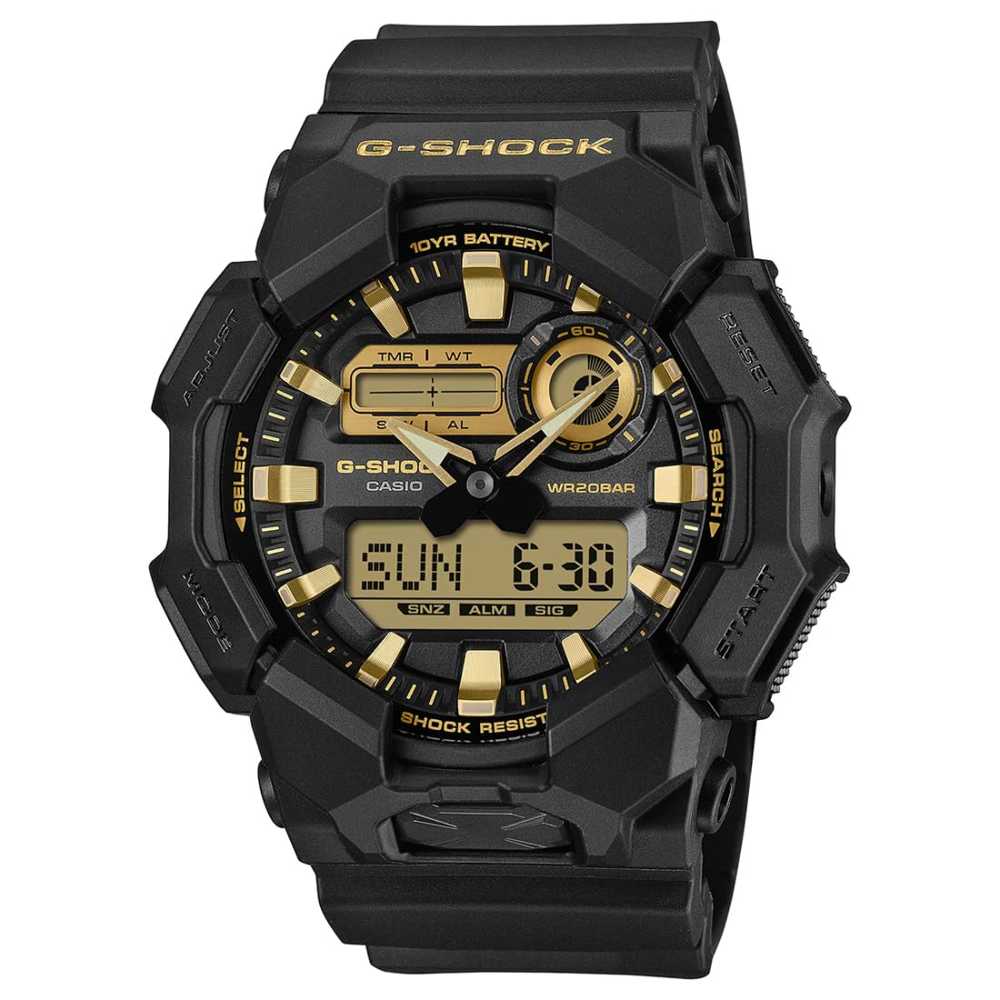

**Key Specifications:**
- **Case Size:** 55.1 x 51.9 x 17.5mm
- **Case & Band Material:** Bio-based resin
- **Water Resistance:** 200 Meters
- **Battery Life:** Approximately 10 years
- **Features:** World time (31 zones/48 cities), 1/100-second stopwatch, 5 daily alarms

This is a big, loud watch, and it knows it. The all-black bio-based resin case and band get gold vapor-deposited indexes and mirrored accents, and the whole thing has a glossy finish that catches light in a way most budget G-Shocks simply do not attempt.

Underneath the styling, this is still a proper large-case G-Shock: 200 metres of water resistance, a genuine 10-year battery, world time across 48 cities, and Casio's usual shock-resistant construction. The bio-based resin is also a nice, quietly eco-conscious touch that Casio has been rolling into more of its lineup lately.

**The bottom line:** If you want a G-Shock that reads as a deliberate style statement rather than just a tool watch, black and gold is the combination to go for, and this is one of the better executions of it at this price.

<a href="https://amzn.to/3Rdkity" target="_blank" rel="noopener noreferrer" class="buy-cta">→ Buy on Amazon</a>

---

# 9. The Field Watch That Punches Above Its Price

## [Ratio Quest](https://amzn.to/44d6thF) – Expected around ₹7,500

Ratio Quest Field Watch Sapphire

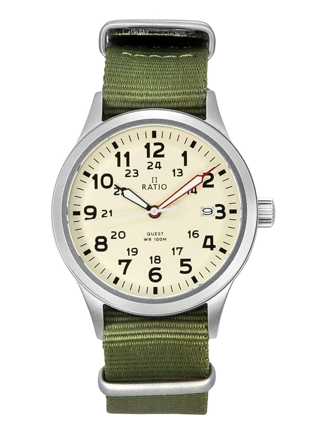

**Key Specifications:**
- **Case Material:** 316L Stainless Steel
- **Movement:** Quartz (Caliber VX42)
- **Crystal:** Sapphire with anti-reflective coating
- **Strap:** Canvas or nylon
- **Water Resistance:** 100 Meters
- **Hands:** Luminous

Ratio is a Singapore-based micro-brand that has built a genuine cult following among enthusiasts for consistently over-delivering on specs relative to price, and the Quest field watch is a textbook example of why. Inspired by early World War-era field watches and the Lewis and Clark expedition, it packs a 316L stainless steel case and an anti-reflective sapphire crystal into a segment usually dominated by mineral glass and base-metal cases.

The dial layouts range from clean black and white to khaki green and beige, all with an easy-reader design and a bold, legible seconds hand that ticks around cleanly. Owners consistently report the accuracy holding up well over years of daily wear, which says a lot for a watch in this range.

**One thing to know:** The lume is functional but not the brightest in low light, a fair trade-off given everything else on the spec sheet. This is a daytime workhorse first.

<a href="https://amzn.to/44d6thF" target="_blank" rel="noopener noreferrer" class="buy-cta">→ Buy on Amazon</a>

---

# 10. The Moon on Your Wrist, Twice

## [Titan Stellar 10050SL01](https://amzn.to/3RF9dBf) – Expected around ₹8,300

Titan Stellar Dual Moonphase 10050SL01

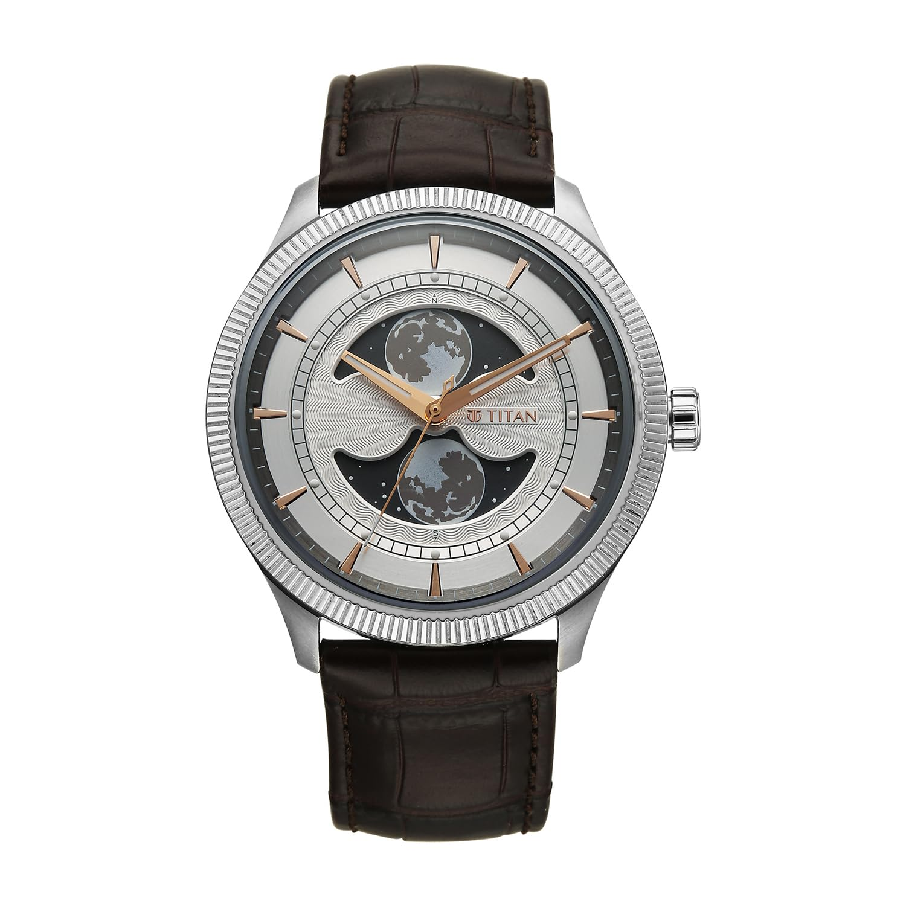

**Key Specifications:**
- **Case Size:** 43 x 47.5mm
- **Thickness:** 11.25mm
- **Movement:** In-house Quartz Caliber 7129A
- **Crystal:** Curved mineral glass
- **Water Resistance:** 5 ATM
- **Complication:** Dual moonphase

Titan's Stellar collection has been on a genuine tear lately, moving the brand from accessible fashion quartz into watches with real horological ambition, and this dual moonphase is the entry point into that story. The oversized moonphase subdial shows the lunar cycle as seen from both hemispheres simultaneously, with individual craters filled in with lume so it glows softly at night.

The fluted bezel and ultra-fine pressed dial pattern add texture that shifts depending on how the light hits it, which is a level of finishing you do not expect from an in-house Indian quartz movement at this price. It comes in Classic Leather, Classic Blue, and IP Bronze finishes, so there is some room to pick a personality.

**Why we love it:** Titan does not always nail the value equation, but this one genuinely does. A unique complication you will not find anywhere else in this price bracket, from a brand that made it entirely in-house.

<a href="https://amzn.to/3RF9dBf" target="_blank" rel="noopener noreferrer" class="buy-cta">→ Buy on Amazon</a>

---

# 11. The Automatic for Under Ten Grand

## [Alba AL4321X1](https://amzn.to/4gQGOCO) – Expected around ₹9,000-10,000

Alba AL4321X1 Ice Blue Automatic

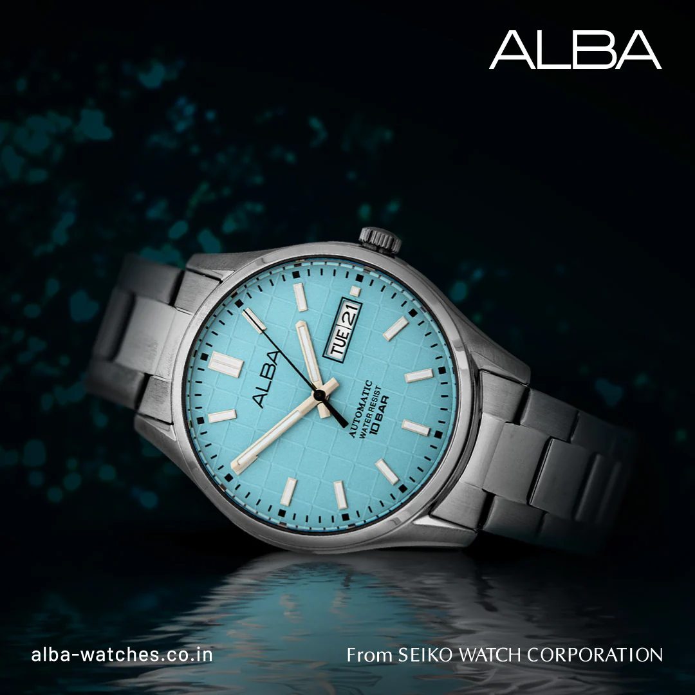

**Key Specifications:**
- **Case Size:** 41mm
- **Movement:** Automatic (Caliber Y676)
- **Crystal:** Mineral
- **Case Back:** Screw see-through case back
- **Complication:** Day-date
- **Water Resistance:** 100 Meters

Getting a real automatic movement, with a screw-down see-through case back to actually watch it work, for under ten thousand rupees is not something most brands can pull off convincingly. Alba manages it here with a striking ice-blue dial that shifts character depending on the light, paired with a stainless steel bracelet and luminous hands and markers.

Reviewers consistently point out that the finishing and weight feel more premium than the price suggests, and the day-date complication adds daily practicality on top of the automatic party trick. Worth knowing going in: like most watches at this price with a basic automatic caliber, the power reserve is on the shorter side, so it prefers to be worn daily rather than left in a drawer.

**The bottom line:** A legitimate entry point into automatic watches with none of the usual compromises on finishing. Great for anyone dipping a toe into mechanical watches for the first time.

<a href="https://amzn.to/4gQGOCO" target="_blank" rel="noopener noreferrer" class="buy-cta">→ Buy on Amazon</a>

---

# 12. The 1000-Metre Diver That Shouldn't Exist at This Price

## [Ratio Free Diver V2](https://amzn.to/49YoCmr) – Expected around ₹10,999

Ratio Free Diver V2 1000m Helium Safe

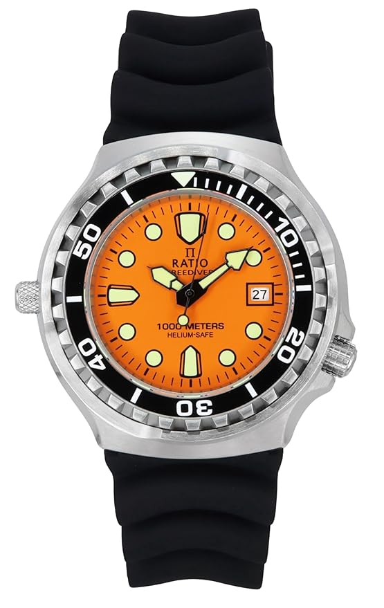

**Key Specifications:**
- **Case Material:** 316L Stainless Steel
- **Movement:** Automatic (Caliber NH36A)
- **Crystal:** Domed sapphire
- **Water Resistance:** 1,000 Meters
- **Feature:** Helium release valve, unidirectional bezel, screw-down crown

This is the watch on this list that genuinely makes no sense on paper. A 1,000-metre water resistance rating and a functioning helium release valve are features you find on professional saturation diving instruments costing multiples of this price, not on a watch you can grab during a flash sale. Ratio pulls it off with a proper 316L stainless steel case, a domed sapphire crystal, and the tried-and-tested Seiko NH36A automatic movement inside.

The two screw-down crowns, one for time and date at 4 o'clock and one for the helium valve at 2 o'clock, are positioned specifically to avoid digging into your wrist or your palm during impact, a small but thoughtful engineering detail. The lume is genuinely bright and long-lasting, a step up from the field watch in this same lineup.

**Who this is for:** Dive watch enthusiasts who want specs that would normally require a much bigger budget. A proper conversation-starter of a watch, and a real diver, not just a diver-styled fashion piece.

<a href="https://amzn.to/49YoCmr" target="_blank" rel="noopener noreferrer" class="buy-cta">→ Buy on Amazon</a>

---

# 13. The 1969 Time Capsule, Automatic Edition

## [Timex Marlin TWEG26711](https://amzn.to/3QA9eXj) – Expected in the ₹12,000-14,000 range

Timex Marlin TWEG26711 Viscount Automatic

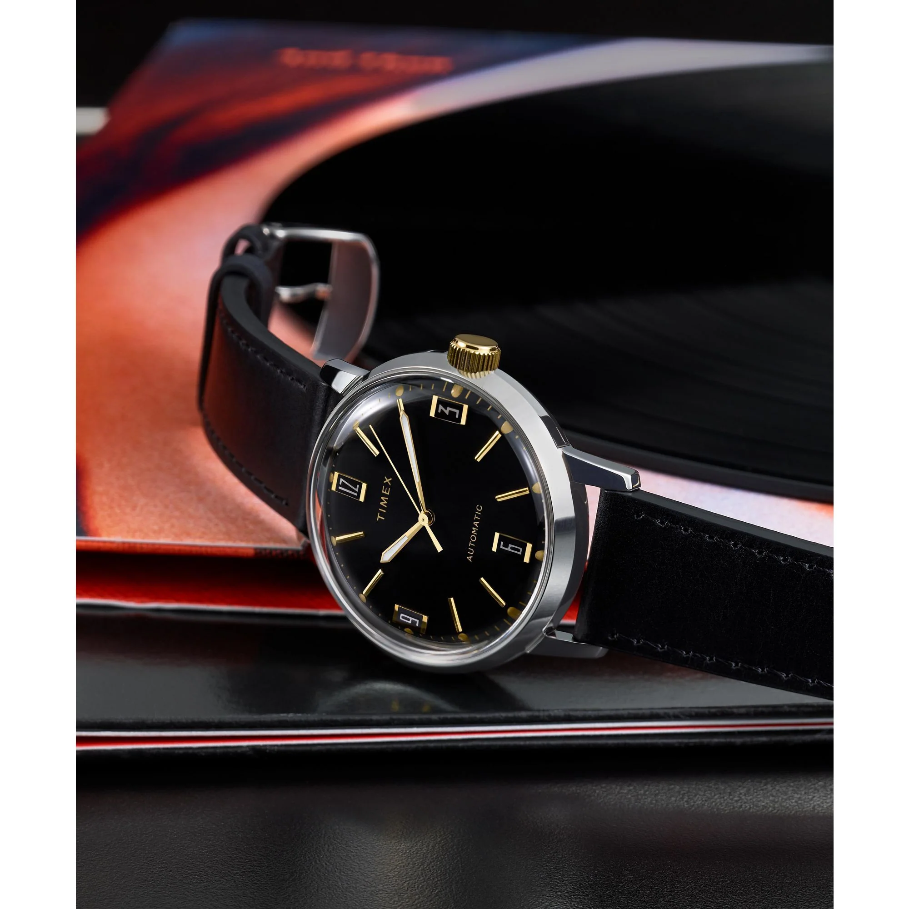

**Key Specifications:**
- **Case Material:** Stainless steel with domed acrylic crystal
- **Movement:** 21-jewel automatic
- **Power Reserve:** Up to 40 hours
- **Case Back:** Exhibition case back
- **Strap:** Leather

This one pulls directly from Timex's 1969 "Viscount" collection: boxed 3, 6, 9, and 12 numerals, raised applied indices, and a sunray dial finish that catches light beautifully as it moves. Add a domed acrylic crystal and an exhibition case back that shows off the automatic movement, and this is one of the most authentically vintage-feeling watches on the entire list.

The black dial paired with gold hands is a genuinely handsome combination, the kind of pairing that looks equally at home with a suit or a plain t-shirt. Being a real 21-jewel automatic with a 40-hour power reserve means it needs regular wrist time to stay wound, which is the trade-off with any mechanical piece at this level.

**A quick heads-up:** Automatic Marlins in this range typically see Prime Day discounts in the 15-25% zone based on how this SKU and similar Marlin references have historically moved, so budget accordingly rather than chasing a rock-bottom number.

<a href="https://amzn.to/3QA9eXj" target="_blank" rel="noopener noreferrer" class="buy-cta">→ Buy on Amazon</a>

---

# 14. The Brand New Cushion-Case Dress Watch

## [Timex Marlin TW2Y65100UJ](https://amzn.to/4y3kPih) – Expected around ₹17,000

Timex Marlin Draper TW2Y65100UJ Silver Gilt

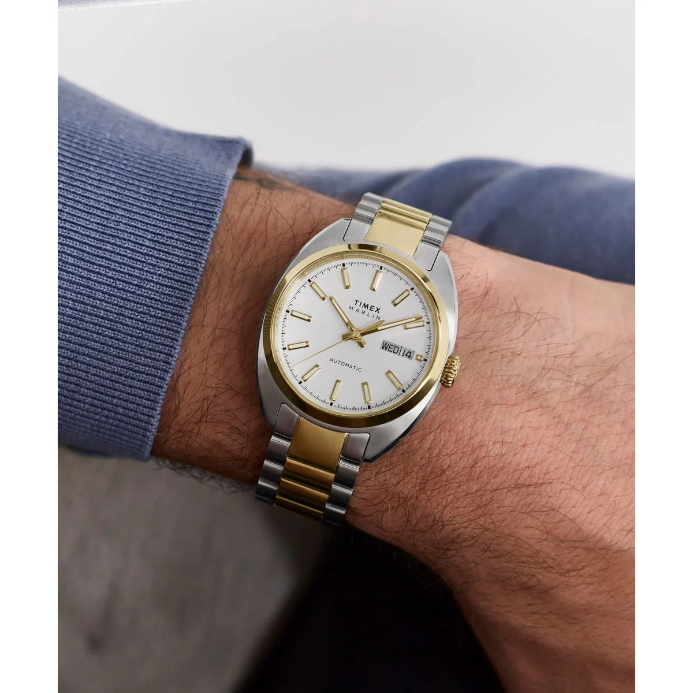

**Key Specifications:**
- **Case Size:** 37mm barrel-shaped cushion case
- **Movement:** Automatic
- **Power Reserve:** Up to 40 hours
- **Case Back:** Exhibition case back with quick-date function
- **Bracelet:** Stainless steel with quick-release spring bars and butterfly clasp
- **Water Resistance:** 50 Meters

This is another very recent release, part of the new Marlin Draper Automatic line that only landed in 2026. The barrel-shaped cushion case is a deliberate callback to 1960s dress watch silhouettes, finished with vertical brushing on top and a polished bezel for contrast.

The silver dial with gilt accents gives it a warm, classic look, and the exhibition case back with a genuinely useful quick-date function at 3 o'clock is a level of thoughtfulness you do not always get at this price. Quick-release spring bars on the bracelet mean swapping to a leather strap for a dressier look takes seconds, no tools required.

**Why it matters:** Very few 37mm automatic dress watches this new hit the market at this price point. If compact, vintage-proportioned watches are your thing, this is worth moving on quickly.

<a href="https://amzn.to/4y3kPih" target="_blank" rel="noopener noreferrer" class="buy-cta">→ Buy on Amazon</a>

---

# 15. The Eco-Drive You'll Forget You're Wearing

## [Citizen Eco-Drive Axiom AU1060-51E](https://amzn.to/4p3mCzZ) – Expected around ₹20,000

Citizen Eco-Drive Axiom AU1060-51E Black Dial

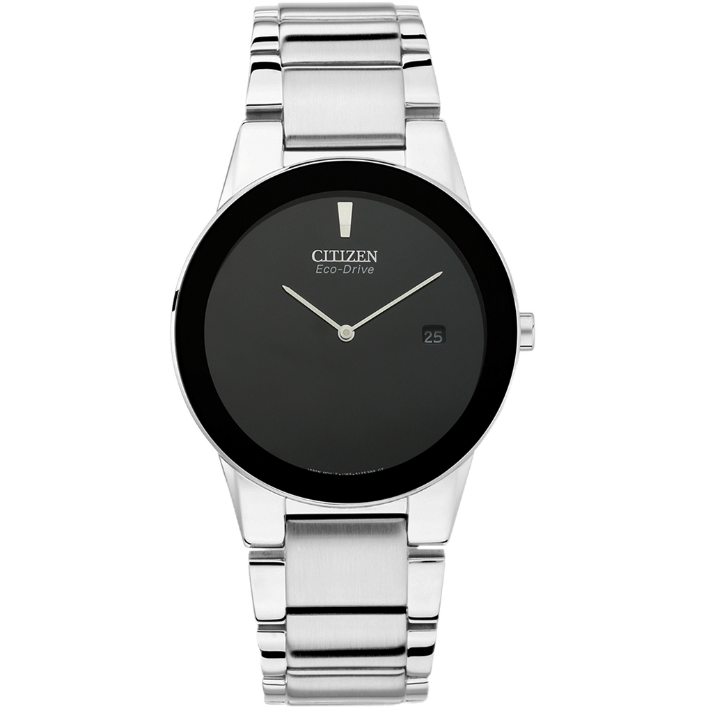

**Key Specifications:**
- **Case Size:** 40mm
- **Thickness:** 8mm
- **Movement:** Eco-Drive light-powered
- **Crystal:** Edge-to-edge mineral glass
- **Complication:** Date
- **Water Resistance:** 50 Meters
- **Dark Reserve:** Approximately 6 months on full charge

We covered Citizen's Eco-Drive tech in depth in our [Seiko Alternatives guide](/blog/seiko-alternatives-citizen/), and the Axiom remains one of the cleanest expressions of it. The black dial and silver bracelet combination is minimalist in the best sense: just a date window and a single 12 o'clock marker, nothing fighting for attention.

At 8mm thick and 40mm across, it sits almost flush against the wrist, and the edge-to-edge mineral crystal gives it a modern, bezel-less look. Since it runs on Eco-Drive, any light source, sunlight, office lighting, even a desk lamp, keeps it charged, and a full charge holds for around six months in complete darkness. You genuinely never think about the battery again.

**The one thing to know:** 50 metres of water resistance is fine for daily wear and rain, but this stays out of the pool. It is a desk and dinner watch, not a sports piece.

<a href="https://amzn.to/4p3mCzZ" target="_blank" rel="noopener noreferrer" class="buy-cta">→ Buy on Amazon</a>

---

# 16. The Cheapest Way Into Seiko 5 Automatic

## [Seiko SNKP17K1](https://amzn.to/4azKrcy) – Expected around ₹22,000

Seiko 5 SNKP17K1 Blue Dial Automatic

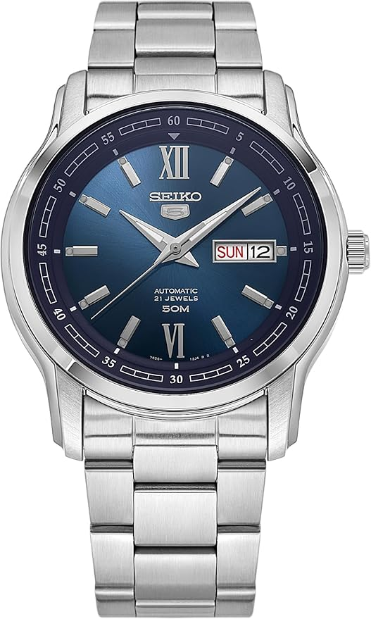

**Key Specifications:**
- **Movement:** Automatic (Caliber 7S26)
- **Power Reserve:** Approximately 41 hours
- **Crystal:** Hardlex
- **Complication:** Day-date
- **Case Back:** Exhibition case back
- **Bracelet:** Stainless steel

If you have been following our [Seiko Alternatives series](/blog/seiko-alternatives-citizen/), you already know Seiko has pushed prices up across the board in India this year. The SNKP17K1 remains one of the last true entry points into a Seiko 5 automatic still carrying its old-school character: a rich blue dial with Roman numeral accents, luminous hands, and a day-date function that has been a Seiko 5 signature for decades.

The Caliber 7S26 inside is a proven workhorse, the same movement that has powered countless Seiko 5 references over the years, with roughly 41 hours of power reserve. The exhibition case back is a nice bonus at this level, letting you actually see the movement doing its thing rather than taking it on faith.

**Worth knowing:** Hardlex is scratch-resistant but not sapphire, so it will pick up hairline marks over the years. That said, it should not crack under normal wear, and most owners consider it a fair trade-off for the price.

<a href="https://amzn.to/4azKrcy" target="_blank" rel="noopener noreferrer" class="buy-cta">→ Buy on Amazon</a>

---

# 17. The Retro-Futurist With an Omega-Grade Crystal

## [Timex Marlin Jet TW2Y24500UJ](https://amzn.to/4b0XMuA) – Expected around ₹24,995

Timex Marlin Jet TW2Y24500UJ Domed Crystal

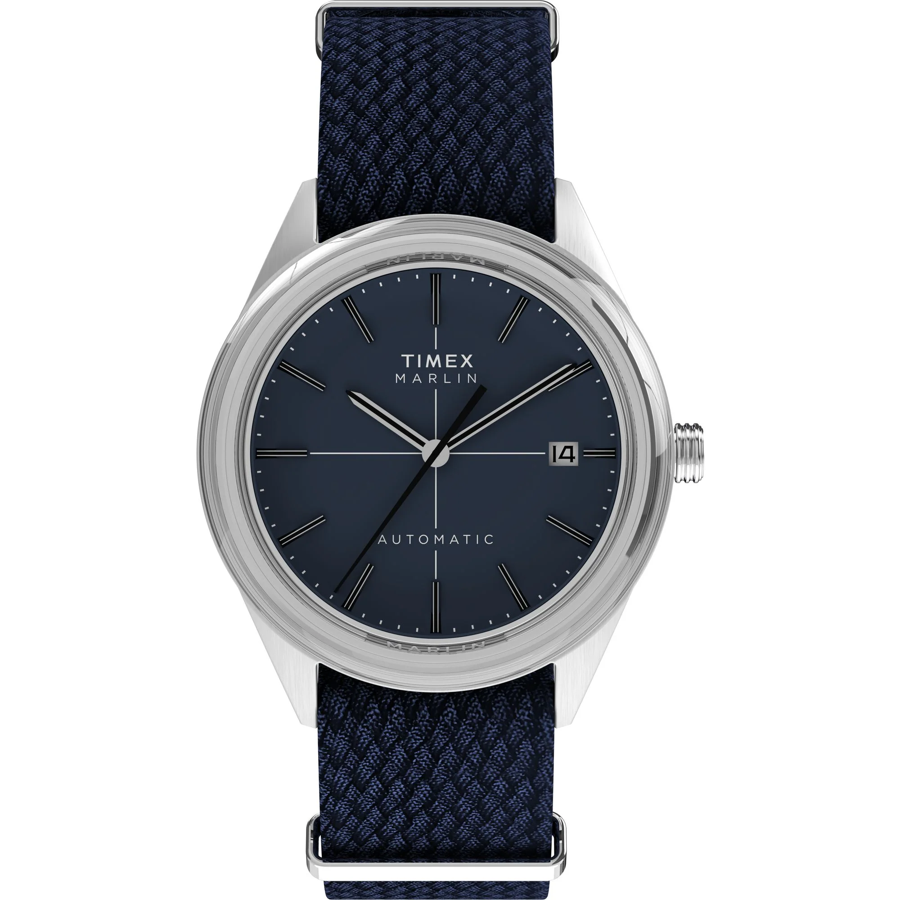

**Key Specifications:**
- **Case Size:** 38mm brushed stainless steel
- **Movement:** 21-jewel automatic (Miyota M09F)
- **Crystal:** Domed Hesalite
- **Case Back:** Exhibition case back mirroring the crystal's dome
- **Strap:** Woven perlon
- **Water Resistance:** 50 Meters

The headline feature here is the crystal. Timex used Hesalite, a refined acrylic that is the exact same material Omega uses on the Speedmaster Moonwatch, and domed it over the entire top surface of the case, bezel and all. That single design choice gives the Marlin Jet a depth and vintage warmth that mineral or sapphire crystal simply cannot replicate, and it is genuinely rare to see this kind of detail below the ₹25,000 mark.

The concentric circle motifs repeated on the crown, case back, and inner bezel tie the whole retro-futuristic theme together, and the woven perlon strap adds a tactile, textured contrast to the otherwise clean, brushed steel case. It wears smaller and more vintage than its 38mm spec suggests, thanks to short lugs and a compact profile.

**One thing to know:** Hesalite is softer than mineral or sapphire and will pick up scratches over time, but unlike glass, those scratches can be polished out with a bit of Polywatch and a soft cloth. A worthwhile trade for that dome.

<a href="https://amzn.to/4b0XMuA" target="_blank" rel="noopener noreferrer" class="buy-cta">→ Buy on Amazon</a>

---

# 18. The Automatic That's Barely a Month Old

## [Casio Edifice EFK-110D-2ADR](https://amzn.to/4p6tJYs) – Expected around ₹25,000

Casio Edifice EFK-110D-2ADR Blue Textured Dial

**Key Specifications:**
- **Case Size:** 38mm
- **Thickness:** 11.8mm
- **Movement:** Automatic with manual winding, approximately 42-hour power reserve
- **Crystal:** Sapphire
- **Case Back:** Screw-lock exhibition case back
- **Water Resistance:** 100 Meters
- **Accuracy:** -20 to +40 seconds per day

This is genuinely one of the newest watches on this entire list. The EFK-110D only just landed on Casio's official listings this year, and it represents the brand's second serious swing at a proper automatic movement after the well-received EFK-100D. Casio trimmed the case down to a slim, wearable 38mm and 11.8mm thick, a noticeable reduction from the original.

The richly textured blue dial is created through an electroforming process, giving it visible depth and a premium look that plays well against the sharp bezel and applied indexes. Inside is a genuine automatic movement running at 21,600 vibrations per hour with 21 jewels, hacking seconds, and a 42-hour power reserve, all visible through a screw-lock exhibition case back. Sapphire crystal and 100 metres of water resistance round out a spec sheet that would normally command a much higher price from a Swiss or Japanese heritage brand.

**Why it competes:** The watch community has already started comparing this to watches like the Seiko 5 and the Tissot PRX, and at this price with these specs, Casio genuinely holds its own. If you want the newest watch on this list, this is it.

<a href="https://amzn.to/4p6tJYs" target="_blank" rel="noopener noreferrer" class="buy-cta">→ Buy on Amazon</a>

---

# Final Thoughts

Eighteen watches, three days of sale, and a price range that runs from "impulse buy" to "actually think about it." That is Prime Day for you. A few honest recommendations if you are short on time:

**Our top picks:**

- **Best under ₹5,000:** The **Casio W-800HD-1AV**. Brand new steel-band upgrade, 100m water resistance, 10-year battery. Hard to beat at this price.
- **Best automatic under ₹10,000:** The **Alba AL4321X1**. A real automatic with a see-through case back for under ten grand is not something you find often.
- **Best diver, period:** The **Ratio Free Diver V2**. 1,000 metres, sapphire, a helium valve. This should not exist at this price, but it does.
- **Best story:** The **Timex Marlin Jet**. A Hesalite crystal shared with the Omega Speedmaster on a sub-₹25,000 Timex is the kind of detail that makes a watch worth talking about.
- **Best value overall:** The **Casio Edifice EFK-110D-2ADR**. A brand-new automatic movement, sapphire crystal, and a screw-lock exhibition case back. This is the one we would grab first if the discount lands right.
- **Safest bet:** The **Seiko SNKP17K1**. Proven movement, proper day-date complication, and one of the last old-school entry points into Seiko 5 before prices climbed further.

Remember, these are estimated Prime Day prices based on historical discounting, not confirmed numbers. Always double-check the live price against the MRP before you buy. If you want more curated picks outside the sale window, our [Best Watches Under ₹5,000](/blog/best-watches-under-5k/) and [Best Watches Under ₹10,000](/blog/best-watches-under-10k/) guides are still your best starting points, and our [Seiko Alternatives: Citizen](/blog/seiko-alternatives-citizen/) guide is worth a read if the Citizen or Seiko picks above caught your eye. Not sure which sellers to trust during a sale rush? Our [Where to Buy Watches in India](/blog/where-to-buy-watches-in-india/) guide covers that too.

Snagged something good in this sale? Come brag about it, or ask us if it is worth it before you buy, on [r/thewristjournal](https://www.reddit.com/r/thewristjournal/).

Happy hunting.