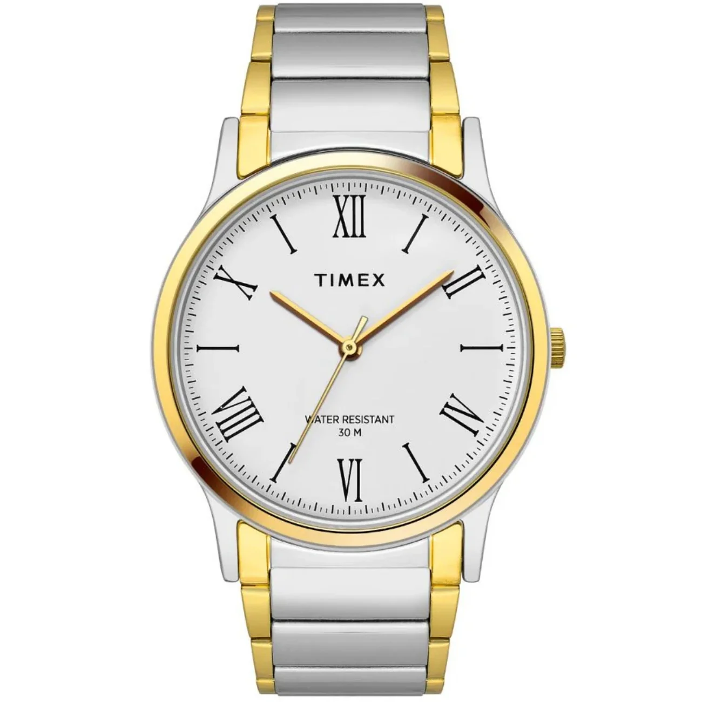
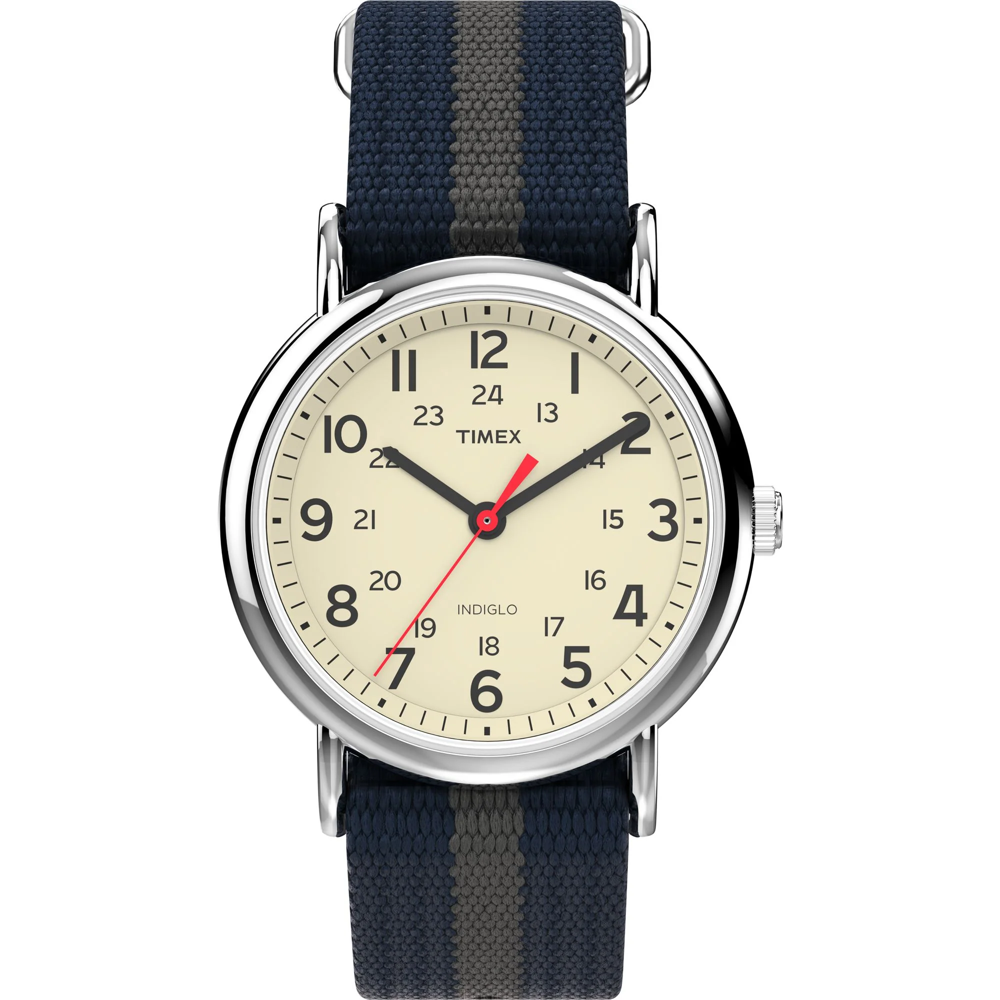
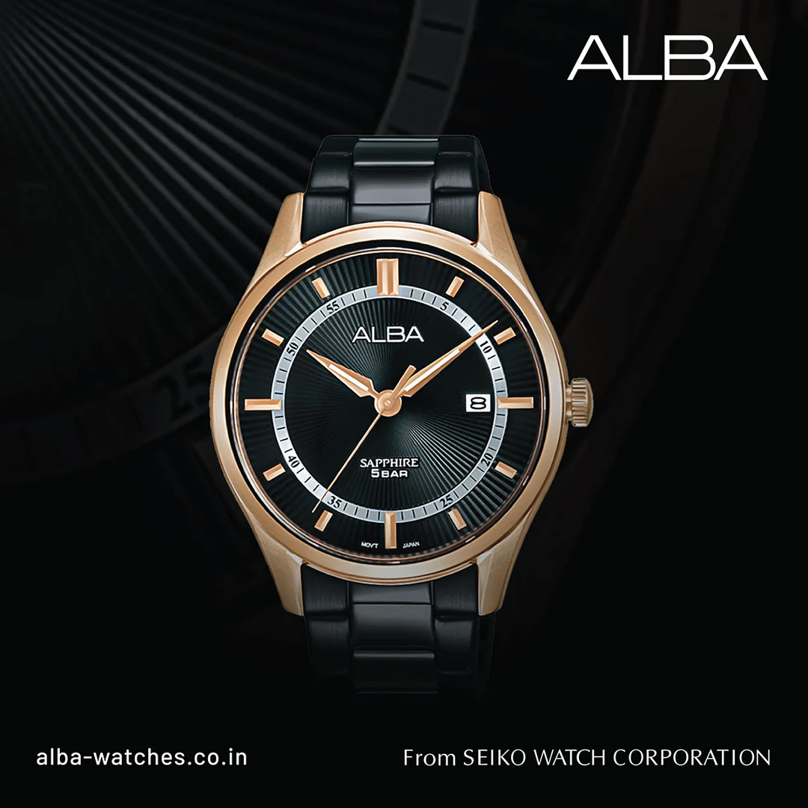
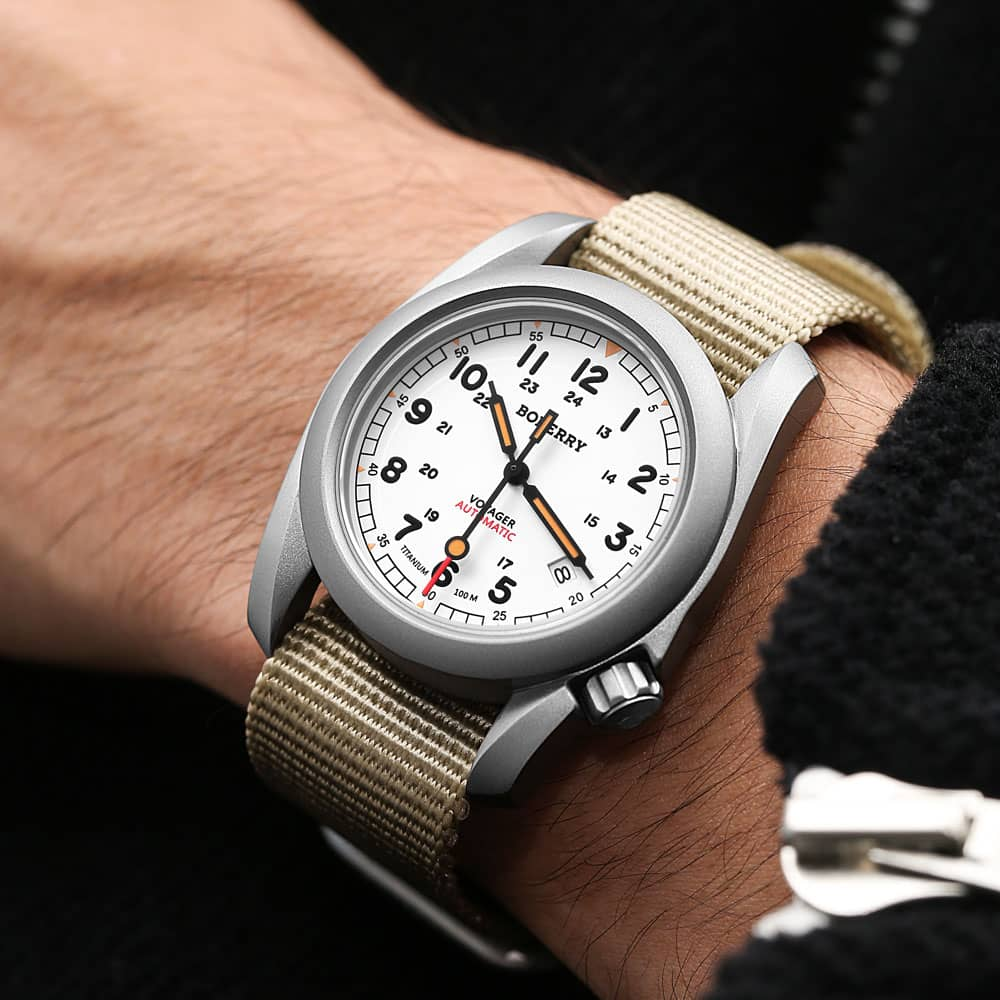
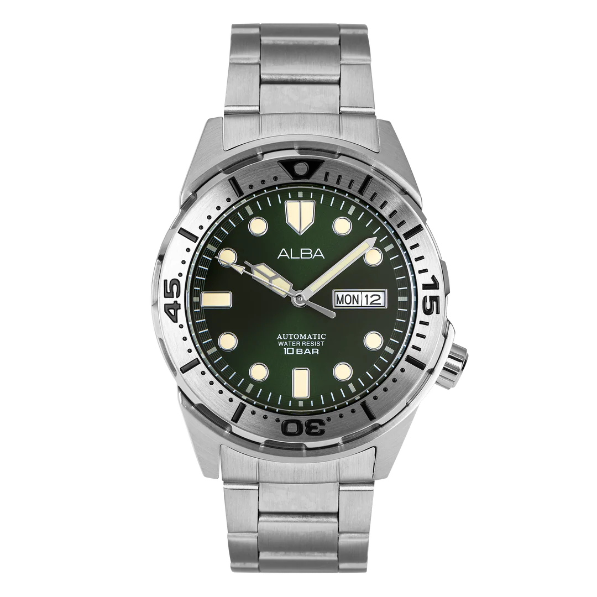
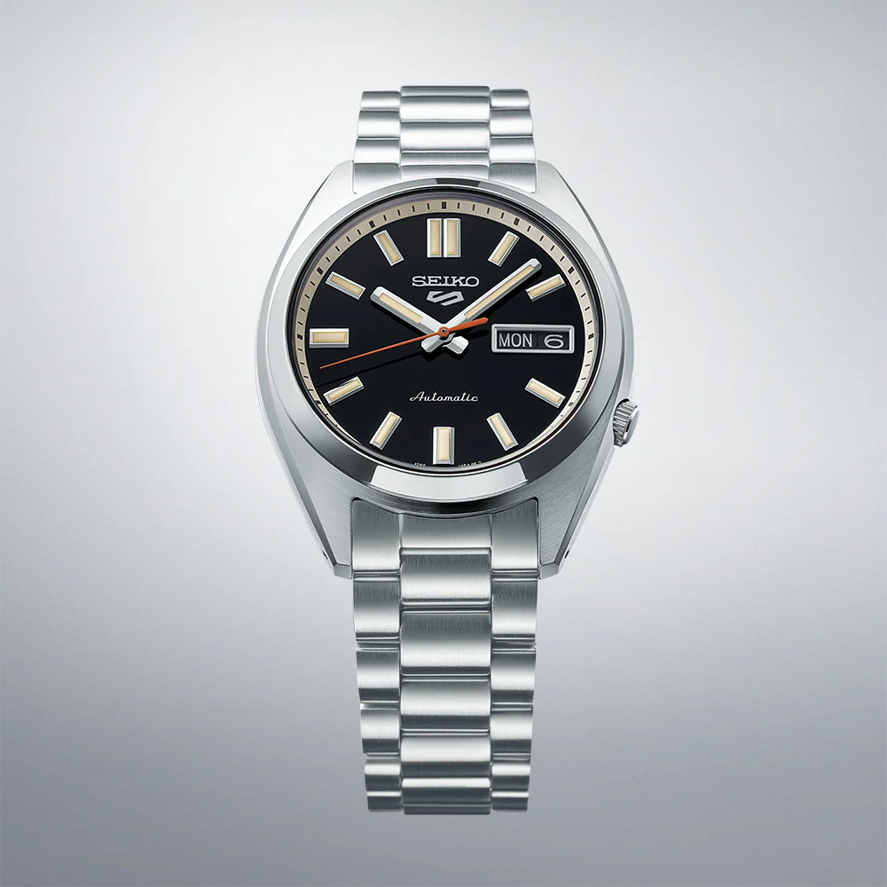
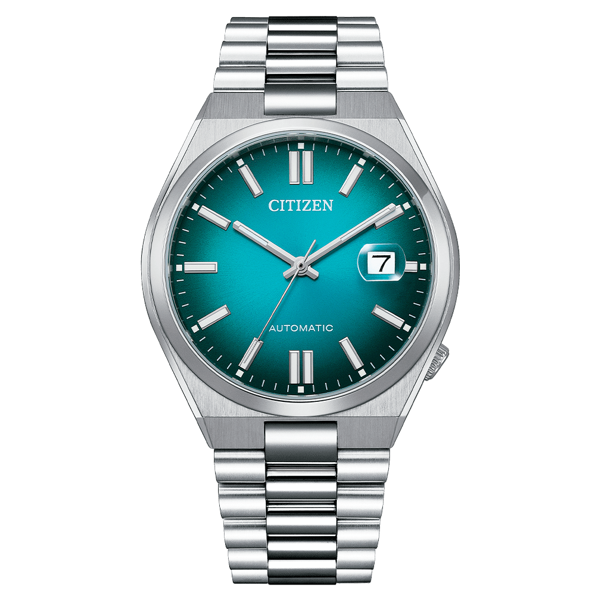
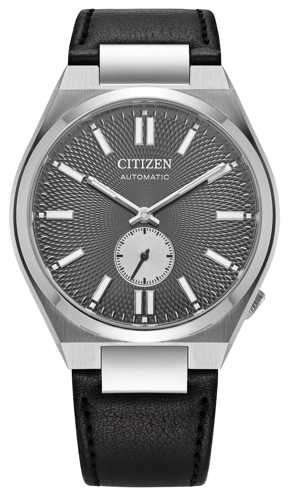
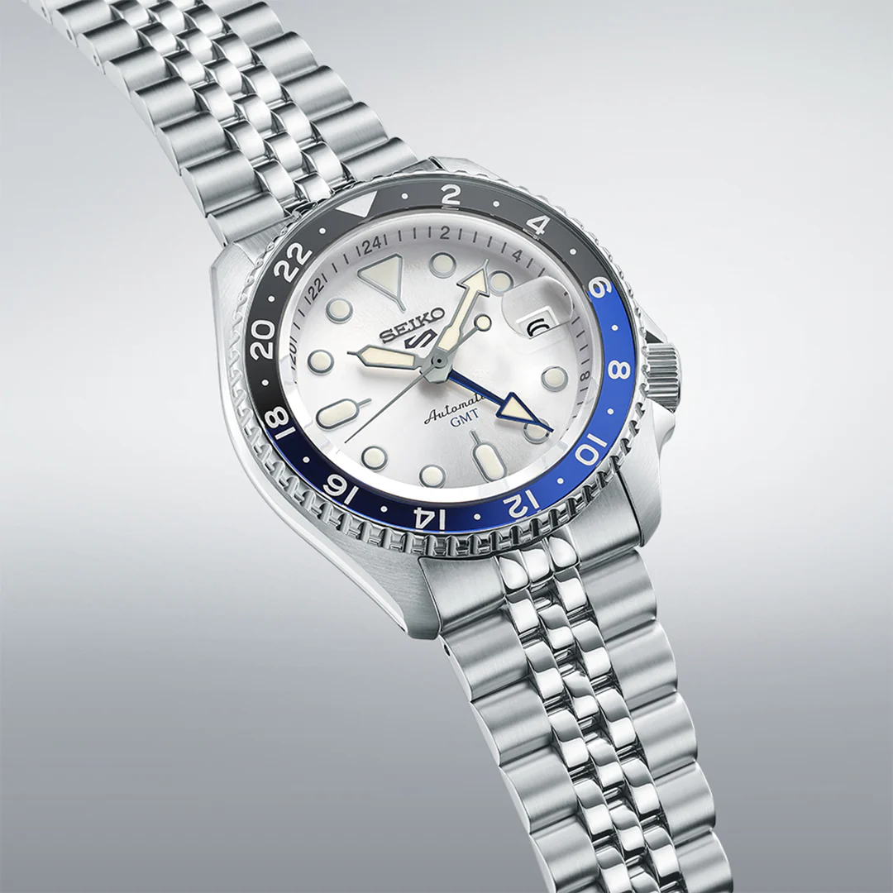

The sale is live, and the prices are moving fast. [Part 1](/blog/prime-day-2026-part-1/) covered our estimated picks going into Prime Day. This is Part 2, and the big difference is that everything below is a real, current price, checked while the sale is actually running, including card discounts. No more "expected around." These are the numbers you can actually go check right now.

We also went further up the price ladder this time. Part 1 stopped around ₹25,000. This one goes all the way to ₹45,000, so if Part 1 felt a little too budget-focused for your taste, this is the guide with more to sink your teeth into: a titanium field watch from a micro-brand you have probably never heard of, two flavors of the Citizen Tsuyosa, and a proper Seiko 5 GMT.

As always, sale prices swing by the hour, so treat everything here as a snapshot rather than a promise. If you missed our other guides, the [Best Watches Under ₹5,000](/blog/best-watches-under-5k/) and [Best Watches Under ₹10,000](/blog/best-watches-under-10k/) posts remain solid picks outside the sale window, and our [Seiko Alternatives: Citizen](/blog/seiko-alternatives-citizen/) guide is worth a read given how much Citizen shows up on this list too.

Let's get into it.

---

# 1. The Cheapest Watch Across Both Parts

## [Timex Classics TW000R432](https://amzn.to/4f3Dr9n) – ₹1,200 (Live Price)

Timex Classics TW000R432 White Dial

**Key Specifications:**
- **Case Size:** 39-40mm brass case
- **Movement:** Quartz
- **Dial:** White with Roman numeral markers
- **Strap:** Two-tone stainless steel bracelet
- **Water Resistance:** 30 Meters

This beats even the cheapest pick from Part 1, and it does not feel like a compromise to get there. The white dial with Roman numeral hour markers and the two-tone gold and silver bracelet give it a classic, formal look that punches well above what its price tag suggests. At 39-40mm, it sits comfortably on most wrists without looking oversized.

This is not a watch trying to impress anyone with complications. It is a plain three-hand quartz watch that does one thing, look sharp with formal wear, and does it well. The MRP itself sits under ₹2,000, so seeing it discounted to ₹1,200 during the sale makes it close to an impulse-buy price point.

**The bottom line:** At this price, there is genuinely no reason not to grab one, whether for yourself or as a gift.

<a href="https://amzn.to/4f3Dr9n" target="_blank" rel="noopener noreferrer" class="buy-cta">→ Buy on Amazon</a>

---

# 2. The Mesh Band Debut

## [Casio Vintage A158WEM-3DF](https://amzn.to/4few28h) – ₹3,400 (Live Price)

Casio Vintage A158WEM-3DF Mesh Band Green Dial

**Key Specifications:**
- **Case Size:** 36.8 x 33.2 x 8.5mm
- **Weight:** 52g
- **Case & Band:** Chrome-plated resin case with stainless steel mesh band
- **Water Resistance:** 30 Meters
- **Battery Life:** Approximately 7 years
- **Features:** LED backlight, 1/100-second stopwatch, daily alarm

This is genuinely new. Casio only just gave the classic A158 its first-ever mesh band option, and this is one of two launch colorways, a silver case with a contrasting dark green dial. The A158 itself has been a budget digital icon since 1989, so putting it on a fine-woven, pressed stainless steel mesh band is a deliberate move upmarket for a watch that used to only come on resin straps.

The mesh band is treated with a specialized pressing process that adds a bit of depth and texture rather than sitting flat, and it delivers a noticeably more refined, dressier look than the standard A158 while keeping the same reliable 7-year battery and 1/100-second stopwatch functionality underneath.

**Why it matters:** If you already own an A158 in resin, this is the version that finally makes it look like it belongs with a shirt and trousers, not just gym wear.

<a href="https://amzn.to/4few28h" target="_blank" rel="noopener noreferrer" class="buy-cta">→ Buy on Amazon</a>

---

# 3. The Gateway Drug, Now Cheaper

## [Timex Weekender T2N654UJ](https://amzn.to/44Jz8ej) – ₹3,700 (Live Price)

Timex Weekender T2N654UJ Cream Dial

**Key Specifications:**
- **Case Size:** 38mm
- **Strap:** Fabric slip-through, interchangeable
- **Backlight:** Indiglo electroluminescent
- **Water Resistance:** 30 Meters
- **DNA:** Field watch

We already called this one the watch world's gateway drug in our [Best Watches Under ₹5,000](/blog/best-watches-under-5k/) guide, and it earns a repeat mention here simply because the sale price makes it even easier to recommend. The cream dial with Arabic numerals and inner 24-hour ring gives it subtle military DNA, and the slip-through fabric strap means you can swap colors and moods in seconds without any tools.

The Indiglo backlight remains the party trick that no other brand offers at this price: press the crown and the whole dial glows an even blue-green, tech that has been Timex-exclusive since 1992. At 38mm, it fits an unusually wide range of wrist sizes.

**Pro tip:** Buy two or three extra straps online for ₹200-400 each and this single watch becomes an entire rotation of different looks.

<a href="https://amzn.to/44Jz8ej" target="_blank" rel="noopener noreferrer" class="buy-cta">→ Buy on Amazon</a>

---

# 4. The Illuminator Turns 30

## [Casio Vintage A168WGG-1A](https://amzn.to/4vmPx3y) – ₹4,500 (Live Price)

Casio Vintage A168WGG-1A Black Dial Gray Metal

**Key Specifications:**
- **Case Size:** 38.6 x 36.3 x 9.6mm
- **Weight:** 49g
- **Case & Band:** Black chrome-plated resin case with gray ion-plated stainless steel band
- **Backlight:** EL backlight ("Illuminator")
- **Water Resistance:** 30 Meters
- **Battery Life:** Approximately 7 years

If the mesh-band A158 above is the "classy" sibling, this is the cool one. The A168 debuted in 1995 and has become just as iconic as its A158 predecessor, thanks largely to its bold "ILLUMINATOR" branding across the face and the thin EL backlight panel that lights the whole display evenly in the dark, a real upgrade over the tiny micro-lights older digital watches used.

This particular version pairs an all-black chrome case with a gray ion-plated metal bracelet and black dial, giving it a considerably tougher, more street-ready look than the standard resin-strap A168. The design was significant enough in Japan to win the Good Design Long Life Design Award in 2011, which says something about how well a ₹4,500 digital watch has aged.

**Why we love it:** Same reliable guts as every other A168, wrapped in a metal bracelet that makes it look twice the price.

<a href="https://amzn.to/4vmPx3y" target="_blank" rel="noopener noreferrer" class="buy-cta">→ Buy on Amazon</a>

---

# 5. The Square That Never Gets Old

## [Casio G-Shock DW-5600UE-1DR](https://amzn.to/4fiOixf) – ₹5,000 (Live Price)

Casio G-Shock DW-5600UE-1DR Black Square

**Key Specifications:**
- **Case Size:** 48.9 x 42.8 x 13.4mm
- **Weight:** 52g
- **Water Resistance:** 200 Meters
- **Battery Life:** Approximately 5 years
- **Case Material:** Resin

If you only ever buy one G-Shock in your life, there is a strong argument it should be some version of this one. The DW-5600 traces its shape directly back to the original 1983 DW-5000C, the watch engineer Kikuo Ibe built after being obsessed with creating something that could survive a 10-metre drop. This UE version runs the updated module with an LED backlight and a longer 5-year battery life, an upgrade over the older EL-backlit versions.

At under 53 grams and rated to 200 metres of water resistance, it remains one of the most durable watches you can buy at any price, let alone ₹5,000. The all-black matte finish keeps it stealthy and versatile enough to wear with literally anything.

**The bottom line:** This is the platonic ideal of a G-Shock. If in doubt, buy this one.

<a href="https://amzn.to/4fiOixf" target="_blank" rel="noopener noreferrer" class="buy-cta">→ Buy on Amazon</a>

---

# 6. The Everyday Leather Chronograph

## [Casio Edifice EFR-526L-7BVUDF](https://amzn.to/4w419cV) – ₹6,600 (Live Price)

Casio Edifice EFR-526L-7BVUDF Beige Dial Brown Leather

**Key Specifications:**
- **Case Size:** 43.8-44mm
- **Thickness:** 11.6mm
- **Case Back:** Screw-lock back
- **Crystal:** Mineral
- **Complication:** Chronograph with three sub-dials, date
- **Water Resistance:** 100 Meters

This is the Edifice that does not scream "sports watch," which is exactly why it works so well as a daily driver. The genuine leather strap and cream dial give it a casual-formal quality that most chronographs at this price cannot pull off, and the brown bezel against the beige dial is a warm, understated color combination.

Under the hood, it is a proper three-subdial chronograph: a 60-minute counter at 9 o'clock, a 24-hour indicator at 3 o'clock, and a small seconds sub-dial at 6 o'clock, all functional rather than decorative. 100 metres of water resistance is generous for a leather-strapped watch, though obviously the strap itself is not going anywhere near a pool.

**Why it is here:** A genuinely versatile everyday watch that goes from desk to dinner without looking like it is trying too hard.

<a href="https://amzn.to/4w419cV" target="_blank" rel="noopener noreferrer" class="buy-cta">→ Buy on Amazon</a>

---

# 7. The Sapphire Dress Watch Nobody's Talking About

## [Casio Enticer BMS-100L-1AVDF](https://amzn.to/4gEj7xN) – ₹8,100 (Live Price)

Casio Enticer BMS-100L-1AVDF Black Dial Leather

**Key Specifications:**
- **Case Size:** Approximately 40.5mm
- **Case Material:** Stainless steel
- **Crystal:** Sapphire
- **Strap:** Genuine leather
- **Complication:** 24-hour sub-dial
- **Water Resistance:** 50 Meters

Sold in India as part of the Enticer lineup, this is actually Casio's new "Beside" collection globally, which only launched at the start of 2026. The whole point of Beside is bringing sapphire crystal, still fairly rare in Casio's non-Edifice lineup, into an affordable, dressy package, and this black-dial leather version is one of the cleanest executions of it.

The black dial with a 24-hour sub-dial keeps things simple and formal, the kind of watch that disappears under a cuff at a business meeting and does not draw attention to itself. The silver stainless steel case against black leather is a classic, safe combination that works with almost any formal outfit.

**Who it is for:** Anyone who wants scratch-resistant sapphire on a dress watch without paying dress-watch prices for it. Quietly one of the smarter buys in this whole list.

<a href="https://amzn.to/4gEj7xN" target="_blank" rel="noopener noreferrer" class="buy-cta">→ Buy on Amazon</a>

---

# 8. The Golden Twin

## [Alba AS9R10X1](https://amzn.to/4vfvDYa) – ₹9,500 (Live Price)

Alba AS9R10X1 Black Dial Golden Case

**Key Specifications:**
- **Case Size:** 41mm
- **Movement:** Quartz (Caliber VJ42)
- **Crystal:** Sapphire
- **Case Back:** Screw case back
- **Water Resistance:** 50 Meters

This is the golden sibling to the Alba AS9R17X1 we featured in Part 1, and honestly it is just as good a buy. Same 41mm case, same sapphire crystal, same VJ42 quartz movement, and the same screw-down case back, but swapped into a golden case with a black patterned dial and golden hour markers and hands instead of the blue.

The brushed metal dial finish combined with the golden accents gives this version a warmer, dressier character than its sibling, and it wears equally well on a formal shirt or a casual outfit thanks to the neutral black and gold combination. As with the blue version, the date complication adds practicality without cluttering the dial.

**The bottom line:** If you already have your eye on the blue AS9R17X1 from Part 1, this golden version is worth cross-shopping before you decide. Same excellent specs, different personality.

<a href="https://amzn.to/4vfvDYa" target="_blank" rel="noopener noreferrer" class="buy-cta">→ Buy on Amazon</a>

---

# 9. The Titanium Field Watch You've Never Heard Of

## [Boderry Voyager Automatic Titanium](https://amzn.to/4woL9Sg) – ₹9,600 (Live Price)

Boderry Voyager Titanium Field Watch

**Key Specifications:**
- **Case Size:** 40mm diameter, 12mm thick, 48mm lug-to-lug
- **Case Material:** Solid titanium, sandblasted finish
- **Movement:** Automatic (Seiko NH35, hacking, 3-hand with date)
- **Crystal:** Sapphire, recessed
- **Water Resistance:** 100 Meters
- **Lume:** Swiss Super-LumiNova C3
- **Weight:** 74g

Boderry is a Chinese micro-brand that has built a genuine cult following in field-watch enthusiast circles for one simple reason: it pairs a real Seiko NH35 automatic movement and a sapphire crystal with a solid titanium case, at a price that most brands cannot touch. The design is an unabashed homage to the classic Bertucci A-2T field watch, right down to the recessed sapphire crystal and the crown positioned at 4 o'clock to avoid digging into your wrist.

At 74 grams for a full titanium case, it is noticeably lighter than an equivalent stainless steel watch would be, and the sandblasted matte finish suits the rugged field-watch aesthetic. The screw-down crown gives it a genuine 100 metres of water resistance, well beyond what most watches in this price bracket offer.

**Worth knowing:** This is a newer, independent brand rather than an established name, so long-term reliability is still being proven out by the community. Early feedback has been largely positive on the movement and case quality, with the strap being the most common area people end up swapping out.

<a href="https://amzn.to/4woL9Sg" target="_blank" rel="noopener noreferrer" class="buy-cta">→ Buy on Amazon</a>

---

# 10. The Green Diver With a Day-Date

## [Alba AL4371X1](https://amzn.to/4y2GF5B) – ₹10,700 (Live Price)

Alba AL4371X1 Green Dial Automatic Diver

**Key Specifications:**
- **Case Size:** 42.4mm
- **Movement:** Automatic (Caliber Y676)
- **Case Back:** Screw case back
- **Bezel:** Rotating diver-style
- **Complication:** Day-date
- **Water Resistance:** 10 Bar (100 Meters)

This is Alba leaning into diver-watch territory, and it works well. The dark green patterned dial paired with a genuine rotating bezel and diver-style markers gives it real sports-watch character, while the day-date complication at this price point, on an automatic movement, is a genuinely reasonable ask.

At 42.4mm in stainless steel with a screw-down case back, it has enough wrist presence to read as a proper diver rather than a diver-styled dress piece, and the 100 metres of water resistance backs that up. The Y676 automatic caliber is the same reliable movement Alba uses across its automatic lineup, so it benefits from a track record within the Seiko group.

**Why we love it:** A genuinely well-specced automatic diver with a day-date complication, at a price where most competitors are still stuck on quartz.

<a href="https://amzn.to/4y2GF5B" target="_blank" rel="noopener noreferrer" class="buy-cta">→ Buy on Amazon</a>

---

# 11. The Slim Chronograph With Racing Green Accents

## [Casio Edifice EFR-S567DC-1AVUDF](https://amzn.to/4y4jO9C) – ₹11,800 (Live Price)

Casio Edifice EFR-S567DC-1AVUDF Black Slim Sapphire

**Key Specifications:**
- **Case Size:** 45.6mm, 50.5mm lug-to-lug
- **Thickness:** 9.5mm
- **Case Material:** Black ion-plated stainless steel
- **Crystal:** Sapphire
- **Water Resistance:** 100 Meters
- **Battery Life:** Approximately 5 years

Part of Casio's Edifice Slim series, and the name is not an exaggeration. A 9.5mm thick case is genuinely rare for a watch with a working chronograph function, and it means this sits flat and comfortable under a shirt cuff in a way most chronographs simply cannot manage. Despite the slim profile, it does not feel like a compromise: the case and band are fully black ion-plated stainless steel, and the crystal is proper sapphire rather than mineral glass.

The green accents on the four bezel screws are a small but effective detail that breaks up the all-black design and gives it a sporty edge without being loud about it. The hairline-finished dial and bezel add a genuine sense of quality that is easy to feel the moment you handle it.

**Why it competes:** All-black, all-sapphire, genuinely slim, and a chronograph that actually works. There is not much else at this price offering the same combination.

<a href="https://amzn.to/4y4jO9C" target="_blank" rel="noopener noreferrer" class="buy-cta">→ Buy on Amazon</a>

---

# 12. The Metal-Clad Giant

## [Casio G-Shock GM-110BB-1ADR](https://amzn.to/4p2VoJq) – ₹15,600 (Live Price)

Casio G-Shock GM-110BB-1ADR Black Metal Bezel

**Key Specifications:**
- **Case Size:** 51.9 x 48.8 x 16.9mm
- **Weight:** 93g
- **Bezel:** Forged, cut, and polished stainless steel with black ion plating
- **Water Resistance:** 200 Meters
- **Battery Life:** Approximately 3 years
- **Features:** World time, 1/100-second stopwatch, auto LED light

The GM-110 takes the legendary GA-110, the model widely credited with reviving G-Shock's popularity when it launched in 2010, and swaps its resin bezel for a genuine forged stainless steel one, put through around 20 separate forging, cutting, and polishing steps to get its distinctive layered look. The result is a heavier, more premium-feeling watch that still carries every bit of the toughness the GA-110 built its reputation on.

This particular colorway goes fully monochromatic: black ion-plated bezel, black resin case, black dial, for an all-black fashion statement that reads as genuinely luxe rather than purely sporty. World time across 48 cities and a full 1/100-second stopwatch round out the feature set.

**The bottom line:** If you want the GA-110's icon status but in a heavier, more grown-up metal finish, this is exactly that watch.

<a href="https://amzn.to/4p2VoJq" target="_blank" rel="noopener noreferrer" class="buy-cta">→ Buy on Amazon</a>

---

# 13. The 70s Throwback in a Post-Hike World

## [Seiko 5 SRPK89K1](https://amzn.to/3TiyPVl) – ₹27,000 (Live Price)

Seiko 5 SRPK89K1 Black Wash Dial Orange Hand

**Key Specifications:**
- **Movement:** Automatic (in-house Caliber 4R36)
- **Power Reserve:** Approximately 40 hours
- **Accuracy:** +45/-35 seconds per day
- **Crystal:** Semi-spherical glass
- **Complication:** Day-date
- **Water Resistance:** 100 Meters

We have written before about how Seiko's ₹10,000 across-the-board price hike changed the value equation in India this year, and the SRPK89K1 is a good example of what that means in practice: a heavy discount here reflects genuinely new pricing rather than just a seasonal markdown. It continues the long-running Seiko 5 Sports SNXS lineage, pulling design cues straight from the 70s Seiko 5 Sports catalogue.

The deep black wash dial uses diamond-cut, finely grooved hour markers and non-triangular, wider hands to lean into that retro look, while the orange seconds hand is a direct callback to classic 70s Seiko styling. The in-house 4R36 automatic movement inside is the same reliable engine found across countless Seiko 5 references, backed by the brand's decades-long reputation for durability.

**Why it is here:** A genuine slice of Seiko 5 heritage with a distinctive retro dial, at a moment when the brand's pricing makes every good deal worth grabbing.

<a href="https://amzn.to/3TiyPVl" target="_blank" rel="noopener noreferrer" class="buy-cta">→ Buy on Amazon</a>

---

# 14. The Teal Dial Everyone's Talking About

## [Citizen Tsuyosa NJ0151-88X](https://amzn.to/44aYCkQ) – ₹33,000 (Live Price)

Citizen Tsuyosa NJ0151-88X Teal Gradient Dial

**Key Specifications:**
- **Case Size:** 40mm
- **Thickness:** 11.7mm
- **Movement:** Automatic (in-house Caliber 8210)
- **Power Reserve:** Approximately 40 hours
- **Crystal:** Sapphire with anti-reflective coating and date magnifier
- **Case Back:** Exhibition case back
- **Water Resistance:** 50 Meters

"Tsuyosa" means "strength" in Japanese, and this collection has become one of the most talked-about entry-level integrated-bracelet automatics on the market since it launched in 2022, largely because it dares to compete visually with watches costing several times as much. The gradient teal dial here uses a sunray-brushed finish that shifts between deep turquoise and green depending on the light, a genuinely striking effect that photographs beautifully.

The 316L stainless steel case is finished to a level well above what you would expect at this price: fine brushing at the lugs, mirror-polished bevels, and a recessed crown at 4 o'clock for a fully integrated silhouette. The in-house Caliber 8210 automatic movement is visible through an exhibition case back, decorated with a gold rotor, and delivers a solid 40-hour power reserve.

**Why it competes:** This is Citizen's answer to watches like the Tissot PRX, and on finishing alone, it more than holds its own. If you have been eyeing an integrated-bracelet automatic, this is worth serious consideration.

<a href="https://amzn.to/44aYCkQ" target="_blank" rel="noopener noreferrer" class="buy-cta">→ Buy on Amazon</a>

---

# 15. Tsuyosa's Dressier Sibling

## [Citizen Tsuyosa NK5010-01H](https://amzn.to/4fiABhN) – ₹40,000 (Live Price)

Citizen Tsuyosa NK5010-01H Gray Leather Small Seconds

**Key Specifications:**
- **Case Size:** 40mm
- **Movement:** Automatic (Caliber 8322)
- **Power Reserve:** Approximately 60 hours
- **Crystal:** Anti-reflective sapphire
- **Strap:** Quick-interchangeable black leather bracelet
- **Complication:** Small seconds sub-dial
- **Water Resistance:** 50 Meters

If the teal-dialed NJ0151-88X above is the sporty Tsuyosa, this is the version that leans dressy. It swaps the integrated metal bracelet for a seamlessly integrated, quick-release black leather strap and a textured gray dial, giving the whole watch a more understated, versatile personality that works just as well with a suit as with weekend wear.

The recessed crown at 4 o'clock keeps the sleek integrated silhouette that defines the Tsuyosa line, while a contrasting seconds counter at 6 o'clock with lume-accented details adds visual interest without cluttering the dial. Underneath is the Caliber 8322 automatic movement, capable of a genuinely impressive 60-hour power reserve, meaning you could take it off Friday evening and it would still be ticking come Monday morning.

**Who it is for:** Anyone who wants the Tsuyosa design language but in a more formal, leather-strapped package with a meaningfully longer power reserve than the standard steel version.

<a href="https://amzn.to/4fiABhN" target="_blank" rel="noopener noreferrer" class="buy-cta">→ Buy on Amazon</a>

---

# 16. The GMT for the Splurge List

## [Seiko 5 Sports SKX GMT SSK033K1](https://amzn.to/448bok3) – ₹45,000 (Live Price)

Seiko 5 Sports SKX GMT SSK033K1 Blue White

**Key Specifications:**
- **Movement:** Automatic with GMT function
- **Bezel:** Bi-color 24-hour, Hardlex-coated
- **Bracelet:** "Beads of rice" five-piece link design
- **Lume:** LumiBrite hands and indices
- **Complication:** GMT, day-date
- **Water Resistance:** 100 Meters (standard SKX GMT spec)

This is the priciest watch across both parts of this guide, and it earns its place. The SSK033K1 pulls from a popular archive colorway that captures blue sky breaking through clouds, a silvery-white dial paired with a deep blue bezel that genuinely looks like sunlight spreading across the sky. The GMT hand adds real practicality for tracking a second time zone, and the high-visibility hour markers plus a clear 24-hour bezel make multi-timezone reading quick and easy at a glance.

The "beads of rice" bracelet is a direct callback to the classic SKX heritage, its five-piece link design forming small X-shaped patterns that have become instantly recognizable among Seiko divers. LumiBrite treatment on the hands and indices means it glows brightly and fades slowly, staying legible well into the night.

**Why it is here:** A genuine GMT complication with real Seiko 5 Sports heritage and a colorway that stands out from every other blue-dial diver on the market. If you are going to spend this much during a sale, this is a defensible way to do it.

<a href="https://amzn.to/448bok3" target="_blank" rel="noopener noreferrer" class="buy-cta">→ Buy on Amazon</a>

---

# Final Thoughts

That is Part 2 done: sixteen more watches, real live pricing, and a range that finally stretches all the way up to ₹45,000. Between this and [Part 1](/blog/prime-day-2026-part-1/), that is 34 watches covered across this Prime Day, so between the two guides there really should be something for every budget.

**Our top picks from this batch:**

- **Best under ₹5,000:** The **Casio G-Shock DW-5600UE-1DR**. The most iconic G-Shock silhouette there is, 200 metres of water resistance, at ₹5,000. Hard to argue with.
- **Best hidden gem:** The **Boderry Voyager**. A titanium case and a real Seiko automatic movement from a brand most people have never heard of. Worth the risk of trying something new.
- **Best sapphire on a budget:** The **Casio Enticer BMS-100L-1AVDF**. Sapphire crystal on a dress watch at this price is genuinely rare.
- **Best value automatic:** The **Citizen Tsuyosa NJ0151-88X**. Finishing that competes with watches costing multiples more, and a dial color that photographs beautifully.
- **Best splurge:** The **Seiko 5 Sports SKX GMT SSK033K1**. A real GMT complication with genuine SKX heritage baked into the bracelet and dial design.

Remember these are live prices as checked, but Prime Day discounts can and do change hour to hour, so always verify the current price before checkout. If you are still building out your collection outside the sale, our [Best Watches Under ₹5,000](/blog/best-watches-under-5k/) and [Best Watches Under ₹10,000](/blog/best-watches-under-10k/) guides remain solid starting points, and our [Seiko Alternatives: Citizen](/blog/seiko-alternatives-citizen/) guide goes deeper into the Tsuyosa and the rest of Citizen's lineup. Not sure who to trust for a safe purchase during a sale rush? Our [Where to Buy Watches in India](/blog/where-to-buy-watches-in-india/) guide has you covered.

Got a good catch during this sale? Come share it, or ask us before you commit to a big purchase, on [r/thewristjournal](https://www.reddit.com/r/thewristjournal/).

Happy hunting.