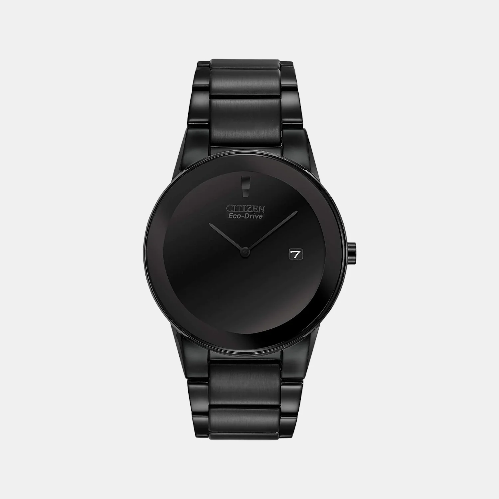
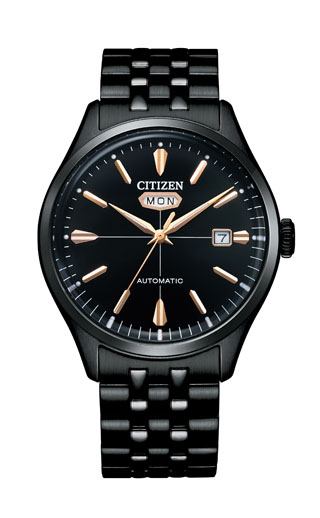
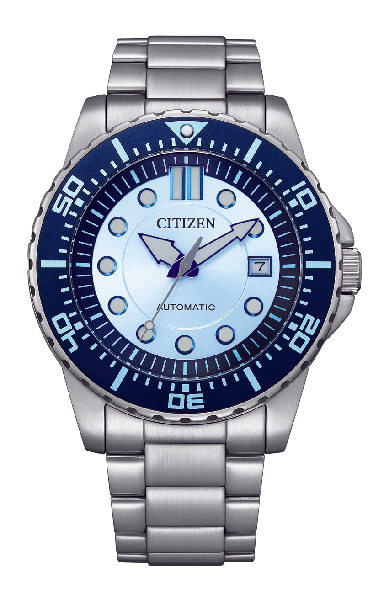
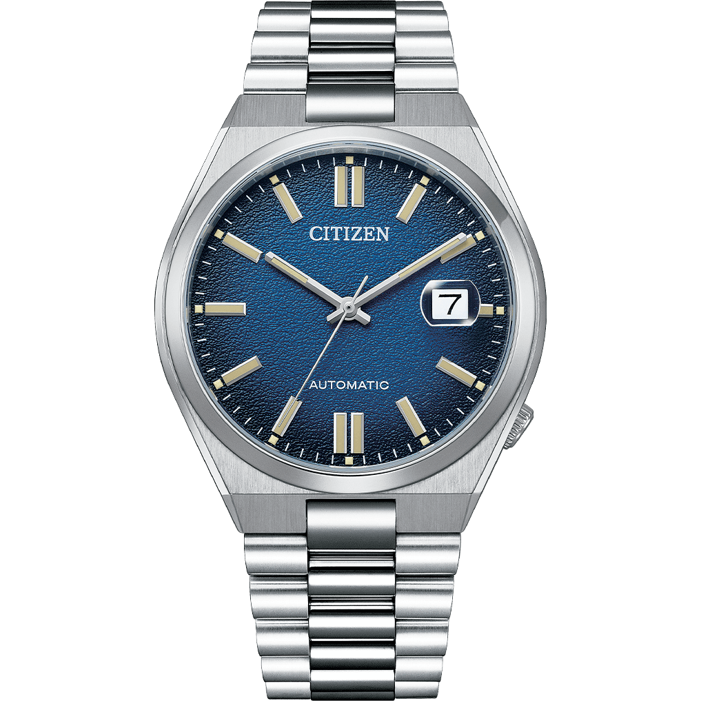
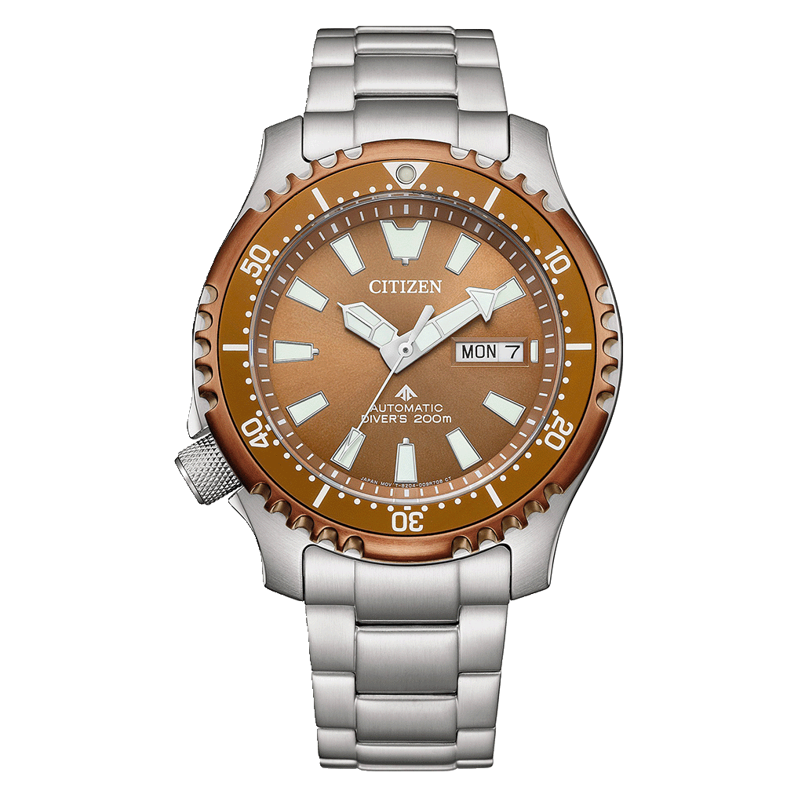
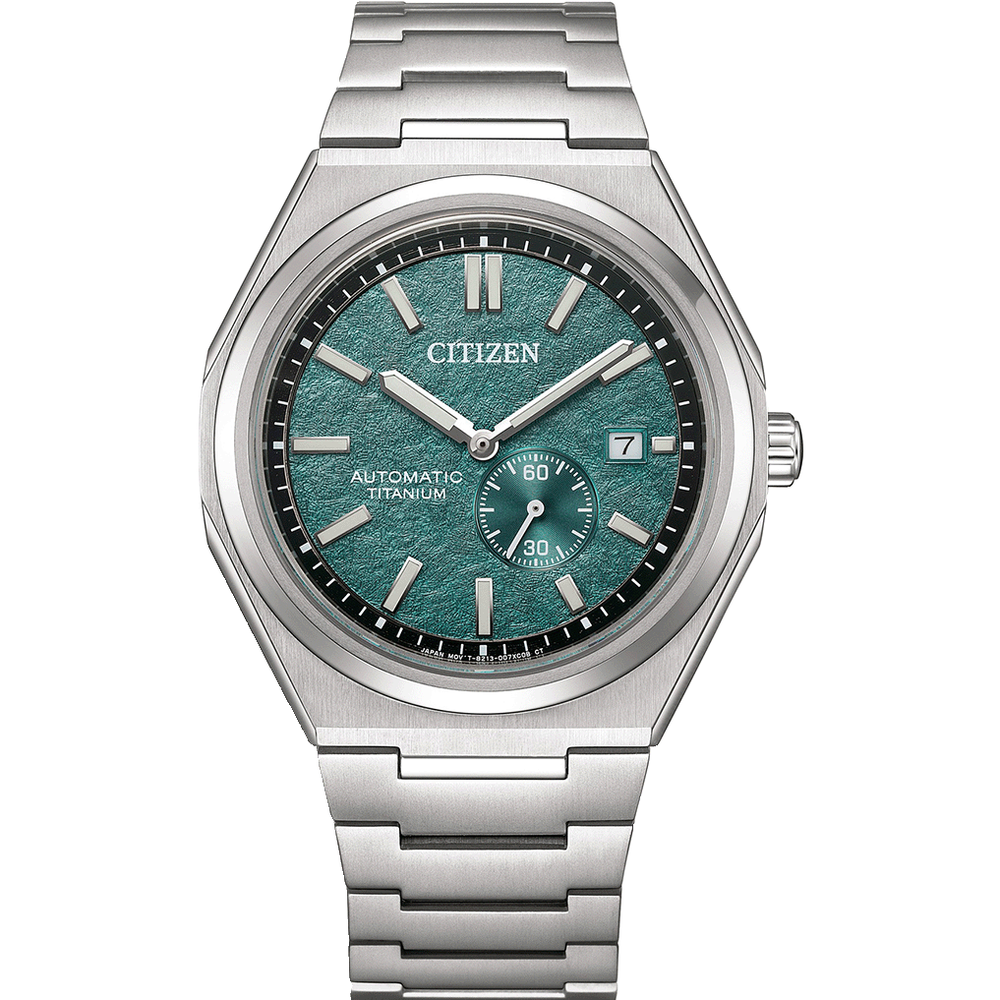

So Seiko went and did it. A flat ₹10,000 price hike across the entire Indian portfolio. The Seiko 5 Sports SRPD series is now pushing past ₹30,000. The Presage line got hit even harder, with some models jumping by ₹12,000. Authorized dealers have been told to rein in discounts too, bringing the old 20%+ deals down to a strict 7 to 15% range. Between the rupee fluctuation and Seiko's global push to go "upmarket," the brand that built its reputation on insane value-for-money has priced itself out of reach for a lot of Indian buyers.

This leaves a massive gap in the ₹20,000 to ₹60,000 range. And that is where things get interesting. Because Seiko is not the only Japanese watchmaker with a century of heritage, killer movements, and a lineup that punches way above its price.

This is Part 1 of our Seiko Alternatives series. We are starting with **Citizen**, because frankly, they deserve it.

---

## A Quick Word on Citizen

Before we get into the watches, let's talk about the company. Because Citizen's story is one of the most fascinating in all of watchmaking and most people have no idea.

It started in **1918**, when Kamekichi Yamazaki founded the Shokosha Watch Research Institute in Tokyo. The goal was simple but ambitious: make high-quality watches domestically, at a time when owning a watch in Japan meant importing something expensive from Switzerland or America. In 1924, the institute completed its first pocket watch. The Mayor of Tokyo, Count Shinpei Goto, saw it and proposed the name "Citizen," hoping these watches would be accessible to every citizen of the country. **Citizen Watch Co., Ltd.** was officially established in 1930.

Fast forward to the quartz revolution. While Seiko fired the first shot with the Astron in 1969, Citizen built on that foundation and kept pushing. In 1975, they released the Crystron Mega, the world's most accurate wristwatch at the time, with an annual deviation of just ±3 seconds. A year later, in 1976, they dropped the Crystron Solar Cell, the world's first analog solar-powered quartz watch. This is the tech that eventually evolved into their most famous innovation.

In **1995**, Citizen introduced **Eco-Drive**: the world's first system to hide a solar cell beneath the watch dial. No visible solar panels, no battery changes, just any light source keeping the watch running indefinitely. It remains their signature technology three decades later, and it is genuinely brilliant.

Then there is **Miyota**, Citizen's movement-making subsidiary. As of 2024, Miyota produces roughly 100 million movements annually. The Caliber 2035 alone has been manufactured in over 5 billion units. That is not a typo. Five. Billion. When you see a micro-brand or fashion brand advertising "Japanese movement," there is a very good chance it is a Miyota inside. Citizen does not just make watches. They supply the beating hearts for a massive chunk of the global watch industry.

Right. Now that you know who we are dealing with, let's get into the recommendations.

---

# 1. The Stealth Minimalist

## [Citizen Eco-Drive Axiom AU1065-58E](https://amzn.to/4upQwiI) - ₹21,500

Citizen Eco-Drive Axiom AU1065-58E All Black

**Key Specifications:**
- **Case Size:** 40mm
- **Thickness:** 8mm
- **Movement:** Eco-Drive (Caliber J165)
- **Material:** Black Ion-Plated Stainless Steel
- **Crystal:** Edge-to-Edge Mineral Glass
- **Complication:** Date Display
- **Water Resistance:** 30 Meters
- **Dark Reserve:** ~6 months on full charge

The Axiom is one of those watches that makes you go "wait, that is only twenty-one thousand?" The entire thing is blacked out. Black ion-plated case, black bracelet, black dial. And that edge-to-edge mineral crystal creates this seamless, almost bezel-less look that feels way more futuristic than the price suggests.

At 8mm thick and 40mm across, it sits incredibly flat on the wrist. This is not a watch that screams for attention. It is the opposite. It whispers. It hugs the minimal aesthetic hard, and if you are the kind of person who wears all-black everything and wants a watch that matches that energy without any fuss, the Axiom is basically perfect.

The Eco-Drive Caliber J165 means you never change a battery. Any light source, sunlight, office fluorescents, even a decent desk lamp, charges the cell beneath the dial. Once fully charged, it runs for about six months in complete darkness. You literally strap it on and forget about maintenance for life.

It comes in a bunch of colourways too, so if all-black is not your thing, explore the range. But let's be honest. The all-black version is the one that turns heads.

**The one thing to know:** 30-metre water resistance means it handles rain and hand-washing, but do not take it swimming. This is a dress/daily watch, not a sports piece.

<a href="https://amzn.to/4upQwiI" target="_blank" rel="noopener noreferrer" class="buy-cta">→ Buy on Amazon</a>

---

# 2. The 1965 Time Capsule

## [Citizen C7 NH8395-77E](https://amzn.to/4vL9Bgx) - ₹24,000

Citizen C7 NH8395-77E Black Gold

**Key Specifications:**
- **Case Size:** 40.2mm
- **Thickness:** 13.1mm
- **Movement:** Automatic (Caliber 8200)
- **Power Reserve:** ~40 Hours
- **Jewels:** 21
- **Beat Rate:** 21,600 vph
- **Material:** Black Ion-Plated Stainless Steel
- **Crystal:** Mineral
- **Complications:** Day and Date
- **Water Resistance:** 50 Meters

Here is a piece of trivia most people do not know: in 1965, Citizen released the Crystal Seven, the first Japanese watch to use mineral crystal instead of acrylic. It was also the world's slimmest automatic watch with a day-date display at the time. That is significant history, and this C7 collection is a direct tribute to it.

The NH8395-77E keeps the most distinctive design element from the original: the day window positioned right next to the 12 o'clock marker, rather than the usual 3 or 6 o'clock placement you see on every other watch. It sounds like a small thing, but it completely changes how the dial reads. Your eye goes straight to it. It is unusual, it is vintage, and it gives the watch an identity that nothing else at this price has.

The black IP coating with golden accents creates a dressy, slightly retro look. The exhibition caseback lets you watch the Caliber 8200 doing its thing, which is always a nice bonus on an automatic. At 40.2mm, the proportions are modern without being oversized.

**Why it is here:** At ₹24,000, you are getting a genuine mechanical watch with real design heritage and a distinctive look that does not exist anywhere else in this price range. The day window at 12 o'clock alone makes this worth the price of admission.

<a href="https://amzn.to/4vL9Bgx" target="_blank" rel="noopener noreferrer" class="buy-cta">→ Buy on Amazon</a>

---

# 3. The Beginning Blue

## [Citizen NJ0178-81M](https://amzn.to/49Tr4Lc) - ₹32,000

Citizen NJ0178-81M Beginning Blue

**Key Specifications:**
- **Case Size:** 43mm
- **Thickness:** 12.4mm
- **Movement:** Automatic (Caliber 8210)
- **Power Reserve:** ~42 Hours
- **Jewels:** 21
- **Beat Rate:** 21,600 vph
- **Material:** Stainless Steel
- **Crystal:** Mineral Glass
- **Complication:** Date Display
- **Case Back:** Exhibition (see-through)
- **Water Resistance:** 100 Meters

This is from Citizen's "Beginning Blue" limited edition line, and the light blue textured dial is genuinely stunning in person. Photos do not quite capture how the texture plays with light. It shifts and catches differently at every angle, which gives the watch a sense of depth that flat dials at this price simply cannot match.

The integrated stainless steel bracelet keeps the whole design clean and cohesive. The Caliber 8210 inside is a proven workhorse, nothing fancy, but reliable and easy to service when the time comes. That exhibition caseback lets you see it ticking away, which is always a treat with an automatic. At 43mm it runs on the bigger side, so if you have wrists under 6.5 inches, try it on before buying.

100 metres of water resistance is a solid upgrade over most dress automatics at this price, which typically top out at 30 or 50 metres. You can swim with this on and not worry about it. Just do not mistake it for a dive watch, it does not have a rotating bezel or ISO dive certification.

The Seiko 5 SRPD used to be the obvious pick in this bracket, but with Seiko's prices climbing past ₹30,000 for basic models, this Citizen suddenly looks like the smarter buy. You get similar specs, an arguably more interesting dial, and you are buying from a brand with proper service centres across India.

**Why it matters:** Limited edition, so once these sell out, they are gone. If blue dials are your thing, this one is hard to beat at the price.

<a href="https://amzn.to/49Tr4Lc" target="_blank" rel="noopener noreferrer" class="buy-cta">→ Buy on Amazon</a>

---

# 4. The Seiko 5 Killer

## [Citizen Tsuyosa](https://amzn.to/4xhGAdO) - ₹35,000

Citizen Tsuyosa Blue Dial NJ0151-88L

**Key Specifications:**
- **Case Size:** 40mm
- **Movement:** Automatic (Miyota Caliber 8200 series)
- **Power Reserve:** ~42 Hours
- **Material:** Stainless Steel
- **Crystal:** Sapphire with Date Magnifier
- **Case Back:** Skeleton (see-through)
- **Complication:** Date Display
- **Water Resistance:** 50 Meters

Let's get straight to it. The Tsuyosa is the watch that should be making Seiko very, very uncomfortable right now.

"Tsuyosa" means "strength" in Japanese, and the collection is a modern reimagining of the NH299 series, one of Citizen's best-selling mechanical watch lines through the late 1990s and early 2000s, especially in overseas markets. The original NH299 distinguished itself by using full stainless steel construction at a time when most affordable watches were still made from plated brass. That same commitment to doing things properly carries over here.

The headline feature is **sapphire crystal**. Let that sink in. The Seiko 5 SRPD, which now costs about the same or more after the price hike, still ships with Hardlex. Hardlex is better than regular mineral glass, sure, but it is not sapphire. Sapphire is the gold standard for scratch resistance. The Tsuyosa has it, plus a date magnifier built into the crystal. That alone makes it better value than the Seiko 5 at current prices.

The dials are where Citizen went all out. Sand-blasted textures in blues, greens, whites, and a gorgeous salmon colourway. Each one catches light differently and creates depth that you do not expect from a watch at this price. The skeleton caseback shows off the movement, which is a nice touch for anyone who appreciates the mechanical side of things.

The off-centre crown at 4 o'clock is a callback to the original NH299 design and also keeps the crown from digging into your wrist. Practical and historically accurate.

**The bottom line:** At ₹35,000, the Tsuyosa gives you sapphire crystal, a solid automatic movement, excellent dial textures, and proper stainless steel construction. The Seiko 5 and Presage are now competing directly with this watch on price, and the Tsuyosa beats them on crystal quality. That is a problem for Seiko, and a win for you.

<a href="https://amzn.to/4xhGAdO" target="_blank" rel="noopener noreferrer" class="buy-cta">→ Buy on Amazon</a>

---

# 5. The Pufferfish Diver

## [Citizen Promaster NY0164-65X](https://amzn.to/4ekSprb) - ₹43,000

Citizen Promaster Fugu NY0164-65X Copper Dial

**Key Specifications:**
- **Case Size:** 42mm (3-piece construction)
- **Thickness:** 12.8mm
- **Movement:** Automatic (Caliber 8204, with manual winding and hacking)
- **Power Reserve:** ~42 Hours
- **Material:** Stainless Steel
- **Bezel:** Copper rotating with aluminum grip ring
- **Crystal:** Anti-Reflective Sapphire
- **Crown Position:** 8 o'clock
- **Dial:** Copper with luminous hands and markers
- **Water Resistance:** 200 Meters (ISO Compliant)
- **Screw-Down Crown:** Yes

This is Citizen's answer to the Seiko Prospex, and it is a serious one.

The "Fugu" nickname comes from the serrated bezel, inspired by the fugu, the Japanese pufferfish. It is one of the most recognizable bezels in the dive watch world at any price. Flip the watch over and you will find a pufferfish engraved on the caseback, a nice personality touch that shows Citizen is having fun with this one.

The original Promaster diver launched in 1989, and this NY0164-65X is a modern reimagining of that icon. The 3-piece, 42mm case is built to actual dive standards, not just "splash proof" marketing talk. ISO 6425 compliant, screw-down crown, 200 metres of water resistance. This is a real tool diver.

The copper-toned dial and bezel combo is the standout. Most dive watches at this price play it safe with black, blue, or Pepsi bezels. The copper here is unusual, it catches light differently depending on the angle and gives the whole watch a warm, vintage character that black-dial divers just cannot replicate.

Sapphire crystal with anti-reflective coating means you get excellent legibility underwater and serious scratch resistance. The crown sits at 8 o'clock rather than the traditional 3, which keeps it from digging into your wrist during extended wear. The lume on the hands and markers is excellent, bright and long-lasting.

The Caliber 8204 inside supports manual winding and hacking (the second hand stops when you pull the crown to set the time). Both features are expected at this price point but still worth noting.

For context: the Seiko Prospex starts delivering comparable 200-metre automatics at well over ₹40,000 now, and those come with Hardlex, not sapphire. The Citizen gives you the better crystal, a more distinctive design, and ships in a limited edition collector's dive tank case. That last bit is just cool.

**Who is this for:** Dive watch enthusiasts who want something with real heritage and actual dive capability, but do not want to look like every other Seiko Prospex owner at the next watch meetup.

<a href="https://amzn.to/4ekSprb" target="_blank" rel="noopener noreferrer" class="buy-cta">→ Buy on Amazon</a>

---

# 6. The Titanium Statement

## [Citizen Zenshin](https://amzn.to/4evR6qt) - ₹58,000

Citizen Zenshin Super Titanium Teal Dial NJ0180-80X

**Key Specifications:**
- **Case Size:** 40.5mm
- **Thickness:** 11.25mm
- **Movement:** Automatic (Caliber 8322)
- **Power Reserve:** 40/60 Hours depending on the movement
- **Beat Rate:** 21,600 vph
- **Material:** Super Titanium with Duratect TIC coating
- **Crystal:** Sapphire
- **Complications:** Date + Small Seconds Sub-Dial
- **Water Resistance:** 100 Meters
- **Weight:** Significantly lighter than stainless steel equivalents

The Zenshin is the most expensive watch on this list, and it is also the one that makes the strongest case for Citizen as a brand that can play in the big leagues.

Let's start with the material. Super Titanium is Citizen's proprietary alloy that is five times harder than stainless steel while being 40% lighter. On top of that, they apply Duratect TIC (Titanium Carbide) surface hardening, which makes the finish extremely resistant to scratches and corrosion. This is serious materials science, the kind of tech that most brands only offer at significantly higher price points.

The integrated bracelet design places this firmly in the modern sports-luxury category. The polished and brushed finishing on the case and bracelet is genuinely impressive for the price. Pick it up and the first thing you notice is how light it is. Then you notice how good the finishing looks. These two things together create a wearing experience that is hard to match at ₹58,000.

The textured blue dial is accented with a black outer minute ring and silver-tone details. A date window at 3 o'clock handles daily utility, while a small seconds sub-dial alongside it adds visual interest and a complication that shows off the movement's capability. The ones with the Caliber 8322 delivers a generous 60-hour power reserve, meaning you can take the watch off Friday evening and it will still be running Monday morning. While this one with the 8213 movement has a power reserve of 40 hours which is still good.

Sapphire crystal keeps it scratch-free, and 100 metres of water resistance means you do not need to baby it.

**The Seiko comparison:** This competes directly with the Seiko Presage and Alpinist ranges, which now sit at similar or higher price points post-hike. The Seiko offerings use stainless steel and Hardlex. The Citizen gives you titanium, sapphire crystal, a longer power reserve, and scratch-resistant Duratect coating. On a pure specs-to-price basis, the Zenshin is hard to argue against.

<a href="https://amzn.to/4evR6qt" target="_blank" rel="noopener noreferrer" class="buy-cta">→ Buy on Amazon</a>

---

# Final Thoughts

Look, Seiko is still a great brand. Nobody is disputing that. They make beautiful watches with genuine mechanical heritage. But the ₹10,000 price hike has fundamentally changed the value equation in India, and pretending otherwise would be dishonest.

Citizen stepped into the gap with watches that match or beat Seiko on specs, materials, and finishing at every price point in this range. Sapphire crystals where Seiko gives you Hardlex. Super Titanium where Seiko gives you stainless steel. Eco-Drive technology that eliminates battery maintenance entirely. And a movement-making subsidiary (Miyota) that powers a huge percentage of the global watch industry.

**Our top picks:**

- **Best value, period:** The **Citizen Tsuyosa** at ₹35,000. Sapphire crystal, solid automatic, excellent dials, and stainless steel construction. It beats the Seiko 5 on specs at the same price. That is all you need to know.
- **Best for minimalists:** The **Citizen Eco-Drive Axiom** at ₹21,500. All-black, 8mm thin, never needs a battery. The stealth pick.
- **Best diver:** The **Citizen Promaster Fugu** at ₹43,000. ISO-compliant, sapphire crystal, 200m rating, and that iconic serrated bezel. A genuine Prospex competitor.
- **Best for enthusiasts:** The **Citizen Zenshin** at ₹58,000. Super Titanium, Duratect coating, 60-hour power reserve, sapphire crystal. The spec sheet reads like science fiction at this price.
- **Best vintage vibes:** The **Citizen C7** at ₹24,000. That 12 o'clock day window is a direct callback to 1965 and nothing else looks like it.
- **Best limited edition:** The **Citizen NJ0178-81M** at ₹32,000. That textured blue dial in person is something else. Grab it before it is gone.

This is Part 1 of our Seiko Alternatives series. Citizen was up first because, frankly, they had the most to say. Next up, we will be looking at other brands filling the same gap. Stay tuned.

Prices fluctuate constantly, so always shop around. If you want to see our full list of curated favorites, check out **[The Wrist Journal's Amazon Storefront](https://amzn.in/d/02h4kG6d)**.

Want to make sure you are buying from trusted sellers? Our [Where to Buy Watches in India](/blog/where-to-buy-watches-in-india/) guide covers every reliable retailer. For more Japanese watches, the [Fun Japanese Watches Under ₹50,000](/blog/japanese-watches-under-50k/) guide has you covered. And if you are on a tighter budget, the [Best Watches Under ₹10,000](/blog/best-watches-under-10k/) and [Best Watches Under ₹5,000](/blog/best-watches-under-5k/) guides are right there.

Happy hunting.
