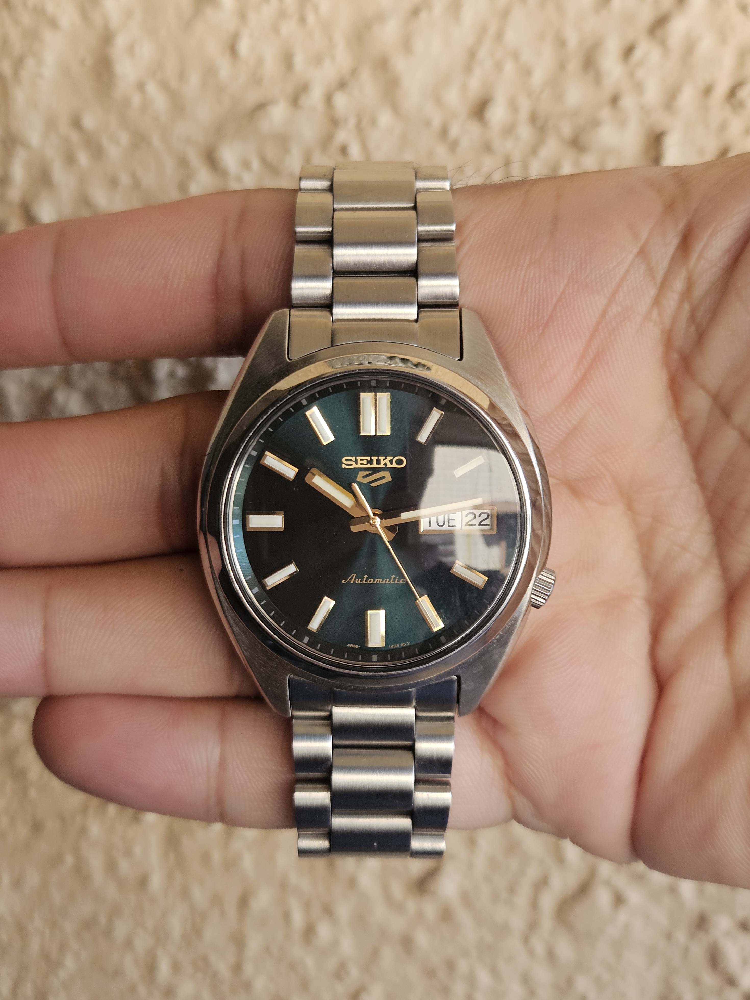
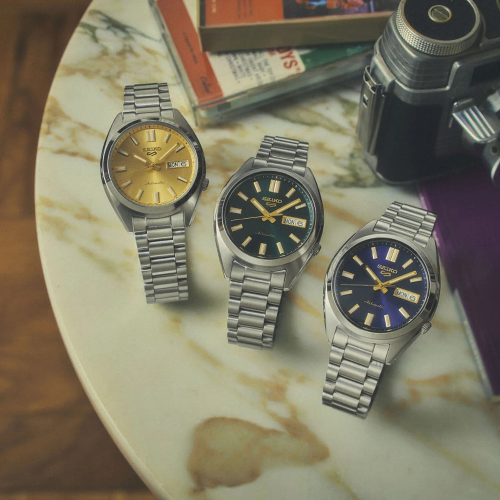

I wore the Seiko SRPL57K1 for a few weeks, and the thing that stayed with me was just how good this watch looks. Seiko's familiar dive-style 5 Sports watches tend to get most of the attention, but this little green SNXS deserves a look before you buy one of those. The rounded case, compact proportions and gold accents give it a very different personality. If the usual Seiko 5 is the sporty brother, this is the classier one. It also costs ₹40,000 at MRP, though, which makes the question of whether you should buy it slightly more complicated.

## That Green Dial

The dial is easily my favourite part. Under the right light it turns a beautiful emerald green, then gets dark enough to look almost black in other conditions. It is the sort of dial that makes you move your wrist around a little just to see the colour change. A product photograph showing one flat shade of green really does not tell you much about how this watch looks in person.

The gold-coloured hands and hour markers make a huge difference too. Against that green, they give the watch a richness that makes it look more expensive than it is. There is enough shine to catch your attention, but keeping the case and bracelet in steel stops the gold from becoming too much. The combination is easily the biggest reason I would choose this particular version.

*Seiko SRPL57K1 looking greenish-black under indoor lighting.*

## A Size Seiko Gets Right

At 37.4mm across and 44.7mm lug to lug, this is a lovely size for small to medium wrists. The rounded case is a big part of the appeal, giving it a softer look than the more angular sports watches you usually see around this price. It is 12.5mm thick, so do not mistake it for a particularly thin dress watch, but the overall proportions worked really well for me.

The steel has a nice shine to it, which suits the dial beautifully. Over my few weeks of wear, the case also held up well without picking up scratches particularly easily. That is an observation from a short review period, rather than a promise about how it will look after a year. Still, my experience so far has been encouraging.

## The Useful Details

| Specification | Seiko SRPL57K1 |
| --- | --- |
| Case | Stainless steel, 37.4mm |
| Lug to lug / thickness | 44.7mm / 12.5mm |
| Movement | 4R36 automatic with hand-winding and hacking |
| Power reserve | Approximately 41 hours |
| Crystal | Curved Hardlex |
| Water resistance | 10 bar / 100m |
| Functions | Day and date |
| Lug width | 18mm |
| India MRP | ₹40,000 |

The 4R36 gives you the familiar Seiko automatic setup, including hand-winding and the ability to stop the seconds hand when setting the time. Its roughly 41-hour reserve means you should expect to reset it if you leave it unworn for a full weekend. There is nothing especially adventurous here, but the movement and day-date display suit an everyday watch like this.

Hardlex at ₹40,000 is a fair thing to question. I would have liked sapphire for its better scratch resistance, especially when comparing the Seiko with my Orient Mako 40. In actual use, though, the crystal looks beautifully clear and glossy, and visibility has been very good. I like the way it presents the dial. That does not remove the material compromise, but it does mean the watch is nicer to look at than “Hardlex” on a product listing might suggest.

## The Bracelet Is Just Okay

The bracelet is where my enthusiasm settles down a bit. It is neither particularly good nor particularly bad, just okay. It suits the watch visually, but the quality does not impress me in the same way the dial and case do. Based on my Mako 40, I prefer what Orient offers here. At a discounted price I can live with the Seiko's bracelet quite happily; at the full ₹40,000, I would want better.

## Green, Blue or Gold?

This SNXS Vintage Gold collection comes in three colours, all listed at the same Indian MRP. My time on the wrist was with the green SRPL57K1; the other two are alternatives to consider rather than watches I have separately tested.

| Reference | Colour | Seiko's name |
| --- | --- | --- |
| SRPL55K1 | Blue | Blazer Blue |
| SRPL57K1 | Green | Green Tie |
| SRPL59K1 | Gold | Gold Cufflinks |

They share the same core specifications, so the choice is mostly about which dial you want to wear. Blue would be my suggestion if green is not your thing, while the gold dial leans further into the vintage look. My pick is still the green. That shift from emerald to almost black, with the gold markers sitting against it, is what sold me on this watch.

## Would I Buy It at ₹40,000?

At MRP, I think it is an appealing but slightly expensive buy. Seiko's higher prices make the ordinary bracelet and lack of sapphire harder to overlook. I would check dealer discounts before paying full price, because a meaningful reduction makes this a much easier recommendation. Comparing it with my Orient Mako 40, I still think the Orient is better value, with sapphire, 200m water resistance and a bracelet I prefer. The Seiko's appeal is how much I enjoy its design.

For someone after a GADA, or “go anywhere, do anything” watch, I would actually favour this over the familiar dive-style Seiko 5 for an everyday mix of casual clothes and smarter outfits. The dressier face gives it more flexibility without making it feel too formal. It looks distinctive, fits smaller wrists well and has a dial I enjoyed throughout the review. I can acknowledge that my Mako 40 offers more for the money and still find this Seiko very difficult to resist.
