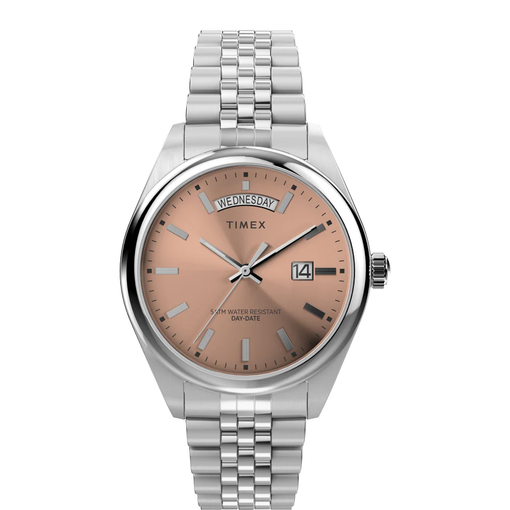
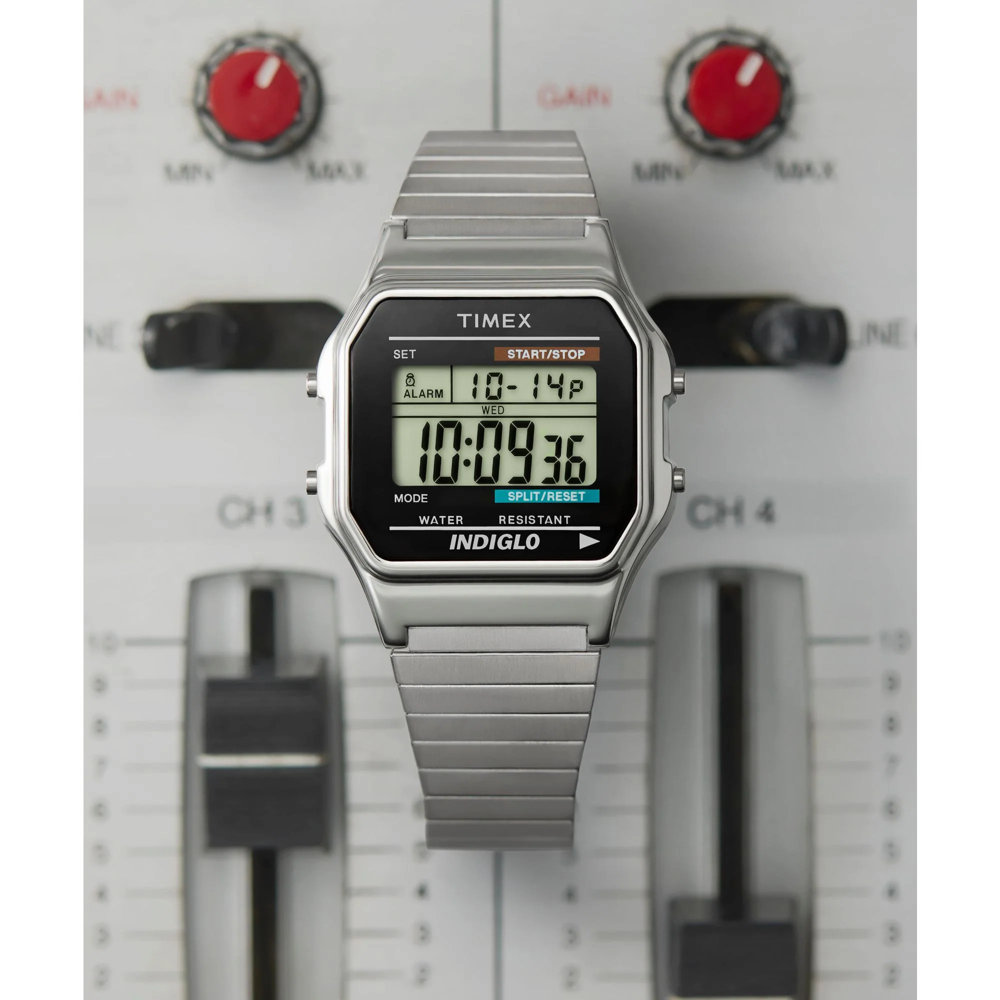
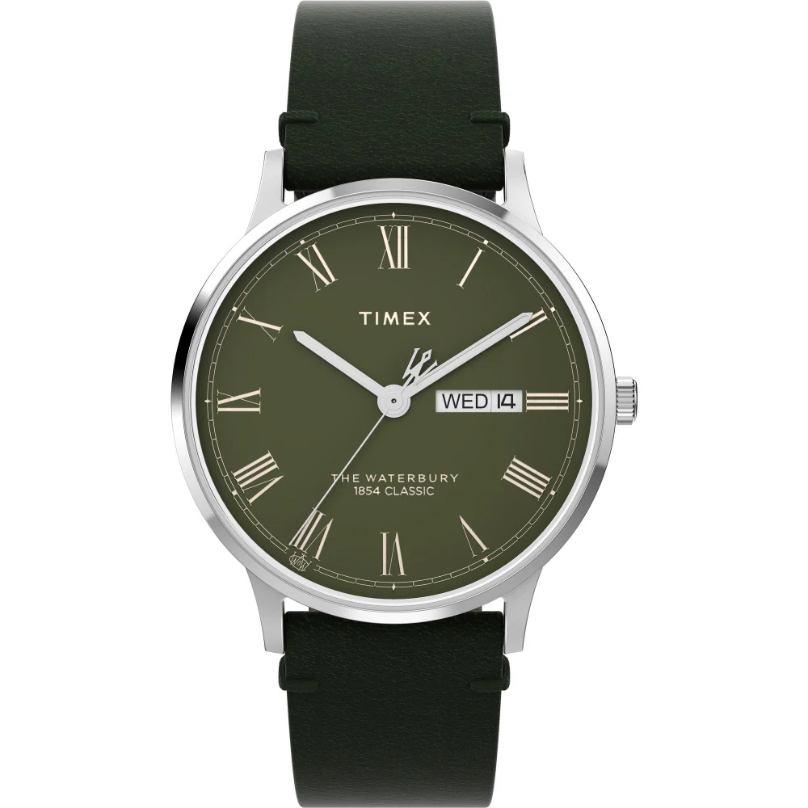
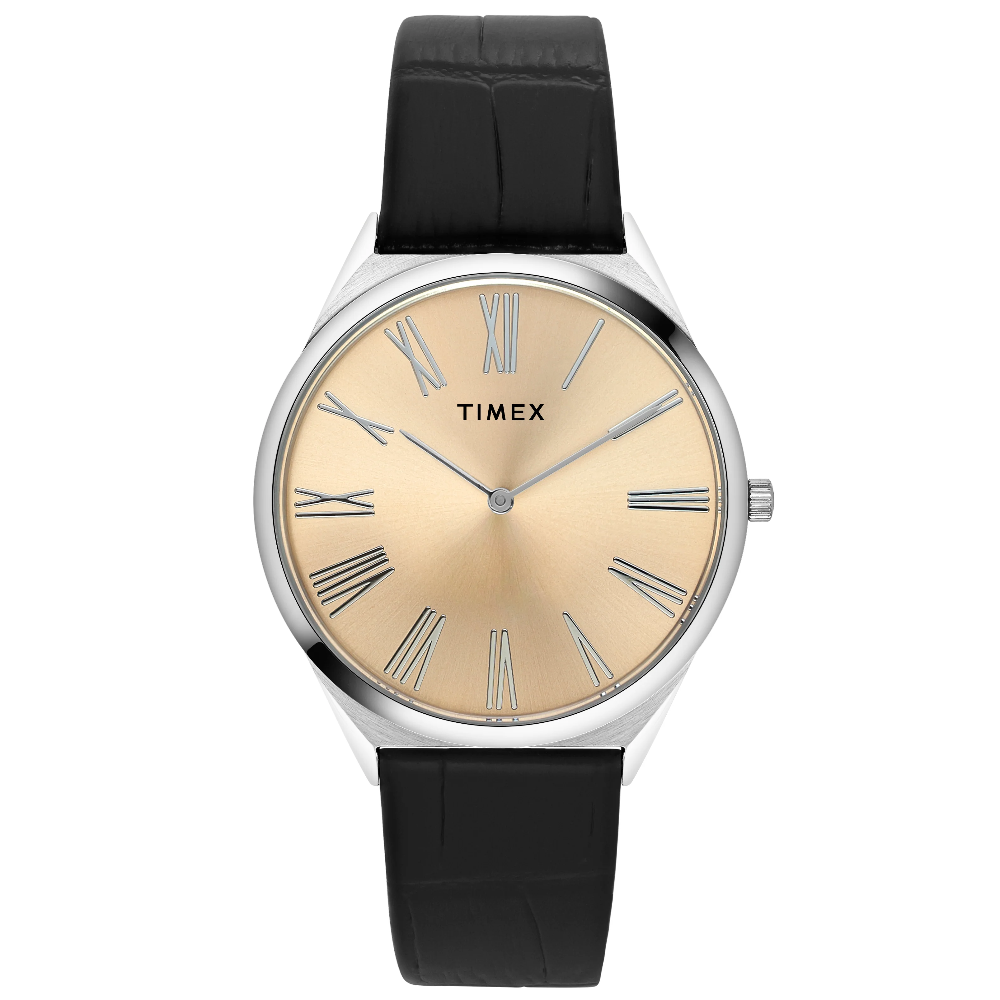
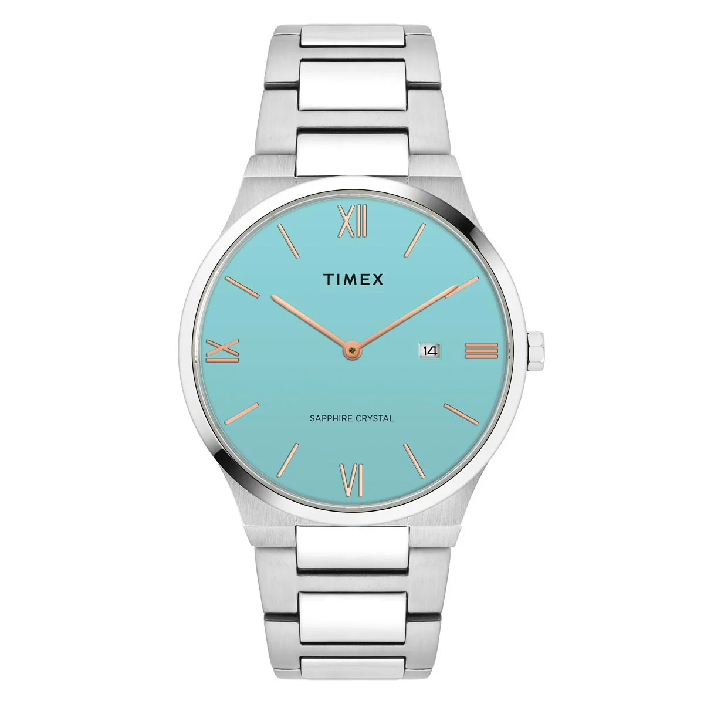
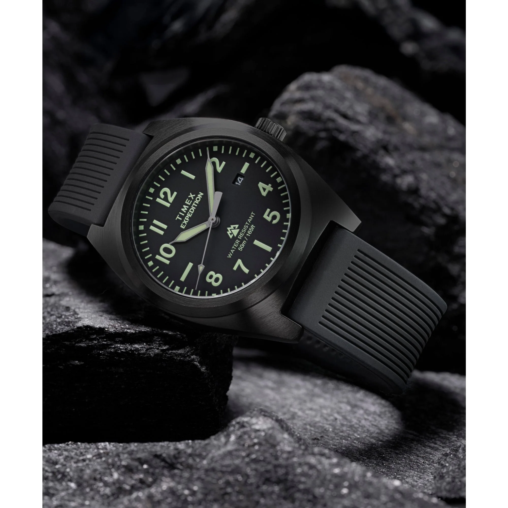
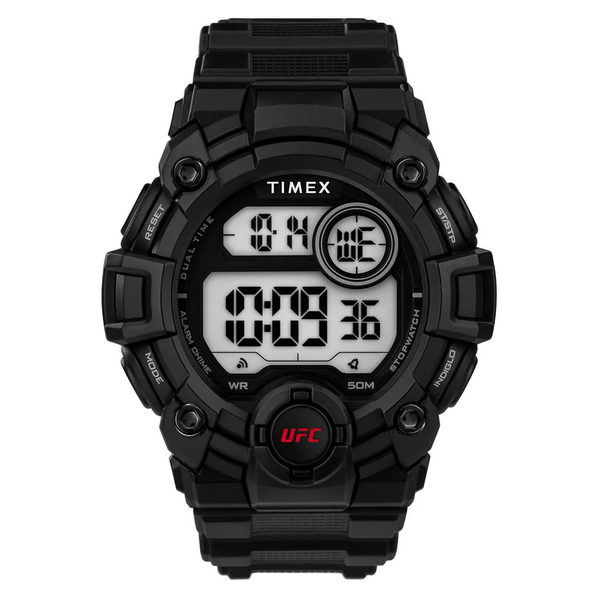
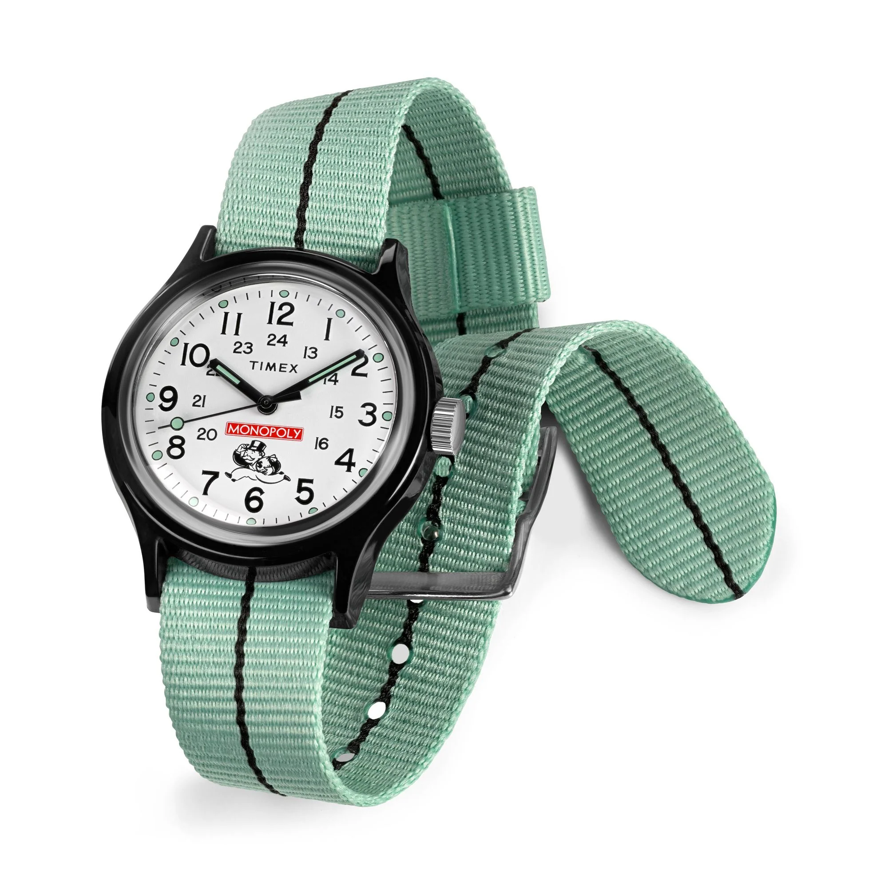
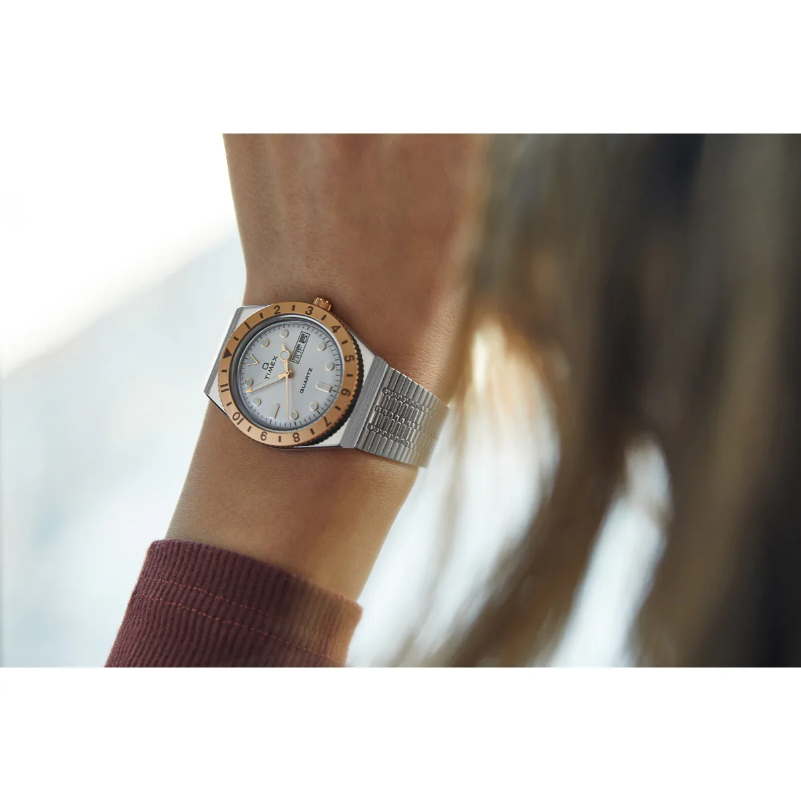

# Best Timex Watches Under 10,000 Rupees (2026 Edition)

If you are searching for the **best Timex watches under 10,000 rupees**, you are in the right place. Timex offers some of the most compelling value-for-money watches in India — combining heritage, durability, and modern design.

Rather than listing generic “best overall” options, this guide breaks down the best Timex watches by category: daily wear, dress watches, sports/outdoor pieces, plus a few special picks.

All prices mentioned are MRP. These watches are often available at discounted prices during sales.

---

## About Timex

Timex is a 170+ year-old watchmaker with a rich horological heritage. The brand traces its roots back to the Waterbury Clock Company in Connecticut and has built a reputation for producing durable, accessible, and stylish timepieces.

Timex watches were widely used during World War I, helping popularize wristwatches among soldiers. Over the decades, the brand has not hesitated to experiment — from bold retro digitals to modern integrated-bracelet sports watches and playful collaborations.

Timex continues to deliver reliable quartz movements, practical complications, and distinctive designs — all at approachable price points.

---

# 1. Best Daily Beater Watches Under 10K

A daily beater is a watch you can wear without thinking twice — to work, errands, casual outings, or travel. It should be durable, versatile, and comfortable.

---

## 1.1 [Timex Legacy 41mm Stainless Steel Bracelet Watch](https://shop.timexindia.com/collections/mens/products/timex-trend-men-brown-round-dial-analog-watch-tw2w42700uj?_gl=1*x7xudf*_up*MQ..*_gs*MQ..&gclid=Cj0KCQiA7rDMBhCjARIsAGDBuEACllGD_uyEHSLTDFEyii0iT4gwyAzRuNdU_2aXZglSsuJwAwQ0nRkaAmC2EALw_wcB&gbraid=0AAAAACFJAFn1x2KQ984IP_iHsTeKkWjdn) – ₹9,995

Timex Legacy 41mm Stainless Steel Bracelet Watch

**Key Specifications:**
- 41mm case
- Stainless steel Jubilee-style bracelet
- Quartz movement
- 50m water resistance
- Separate day and date counters
- Brown sunburst dial

The Timex Legacy offers a refined aesthetic at an accessible price point. The brown dial gives it a warm, elegant character, while the Jubilee-style bracelet enhances wrist presence.

The watch draws inspiration from classic day-date designs but maintains its own identity. At 41mm, it fits wrists between 6 to 8 inches comfortably. It works equally well with office attire or smart casual outfits.

If you prefer a different dial color, consider the green dial variant from the [Timex Trend lineup](https://shop.timexindia.com/collections/mens/products/timex-trend-green-round-dial-analog-men-s-watch-tweg27104?_gl=1*seyy0k*_up*MQ..*_gs*MQ..&gclid=Cj0KCQiA7rDMBhCjARIsAGDBuEACllGD_uyEHSLTDFEyii0iT4gwyAzRuNdU_2aXZglSsuJwAwQ0nRkaAmC2EALw_wcB&gbraid=0AAAAACFJAFn1x2KQ984IP_iHsTeKkWjdn).

---

## 1.2 [TIMEX TREND Green Round Dial Analog Men’s Watch – TWEG27003](https://shop.timexindia.com/collections/mens/products/timex-trend-green-round-dial-analog-men-s-watch-tweg27003?_gl=1*ppju*_up*MQ..&gclid=Cj0KCQiA7rDMBhCjARIsAGDBuEACllGD_uyEHSLTDFEyii0iT4gwyAzRuNdU_2aXZglSsuJwAwQ0nRkaAmC2EALw_wcB&gbraid=0AAAAACFJAFn1x2KQ984IP_iHsTeKkWjdn) – ₹9,495

TIMEX TREND Green Round Dial Analog Men's Watch TWEG27003

**Key Specifications:**
- 43mm case
- Oyster-style bracelet
- 100m water resistance
- Rotating bezel
- Sea green dial

This is a diver-style watch with strong wrist presence. The sea green dial stands out immediately and offers a refreshing alternative to typical black or blue sports watches.

With 100m water resistance and a rotating bezel, it has the rugged aesthetic of a dive watch while remaining suitable for everyday wear. The bracelet adds to its sporty yet polished appeal.

For someone wanting a bold daily watch with strong visual identity, this is an excellent option.

---

## 1.3 [TIMEX Classic Grey Square Dial Digital Watch – T78587UJ](https://shop.timexindia.com/collections/mens/products/timex-classic-grey-square-dial-digital-men-s-watch-t78587uj?_gl=1*zh2h9b*_up*MQ..&gclid=Cj0KCQiA7rDMBhCjARIsAGDBuEACllGD_uyEHSLTDFEyii0iT4gwyAzRuNdU_2aXZglSsuJwAwQ0nRkaAmC2EALw_wcB&gbraid=0AAAAACFJAFn1x2KQ984IP_iHsTeKkWjdn) – ₹5,995

TIMEX Classic Grey Square Dial Digital Men's Watch T78587UJ

**Key Specifications:**
- Retro 80s design
- Digital display
- Indiglo backlight
- Stopwatch function
- 42mm lug-to-lug
- Brushed finish case

For fans of retro digital watches, this model offers a strong alternative to mainstream options. The brushed finish and classic square case give it authentic vintage appeal.

Timex’s proprietary Indiglo electroluminescent backlight ensures excellent visibility in low light. Lightweight, practical, and understated — this is a reliable everyday companion.

---

# 2. Best Dress Watches Under 10K

Dress watches should be refined, elegant, and versatile enough for formal occasions, business settings, or evening events.

---

## 2.1 [Waterbury Classic 40mm Leather Strap Watch](https://shop.timexindia.com/collections/mens/products/timex-waterbury-men-green-round-dial-analog-watch-tw2w50500uj?_gl=1*1rvq866*_up*MQ..&gclid=Cj0KCQiA7rDMBhCjARIsAGDBuEACllGD_uyEHSLTDFEyii0iT4gwyAzRuNdU_2aXZglSsuJwAwQ0nRkaAmC2EALw_wcB&gbraid=0AAAAACFJAFn1x2KQ984IP_iHsTeKkWjdn) – ₹7,495

Timex Waterbury Classic 40mm Leather Strap Watch

**Key Specifications:**
- 40mm case
- Leather strap
- Olive dial
- Roman numerals
- Day-date complication
- Quartz movement

The Waterbury Classic pays homage to Timex’s historical roots. The stylized “W” detail on the dial and second hand is subtle yet distinctive.

The olive dial adds sophistication and depth, especially under formal lighting. Paired with Roman numerals and a leather strap, this is an excellent option for business and formal wear.

---

## 2.2 [TIMEX Orange Round Dial Analog Men’s Watch – TWEG27900](https://shop.timexindia.com/collections/mens/products/timex-orange-round-dial-analog-men-s-watch-tweg27900?_gl=1*1ezanad*_up*MQ..&gclid=Cj0KCQiA7rDMBhCjARIsAGDBuEACllGD_uyEHSLTDFEyii0iT4gwyAzRuNdU_2aXZglSsuJwAwQ0nRkaAmC2EALw_wcB&gbraid=0AAAAACFJAFn1x2KQ984IP_iHsTeKkWjdn) – ₹8,295

TIMEX Orange Round Dial Analog Men's Watch TWEG27900

**Key Specifications:**
- 5.15mm ultra-thin case
- Leather strap
- Golden-orange dial
- Minimalist design
- 30m water resistance

With a case thickness of just 5.15mm, this is one of the sleekest watches on this list. The golden-orange dial delivers a distinctive yet tasteful presence.

Minimalist markers and a slim profile make it ideal for formal occasions. It slips easily under a shirt cuff and pairs well with tailored attire.

---

## 2.3 [TIMEX Men Blue Round Dial Analog Watch – TWEG23604](https://shop.timexindia.com/collections/mens/products/timex-men-blue-round-dial-analog-watch-tweg23604?_gl=1*jmdpm0*_up*MQ..&gclid=Cj0KCQiA7rDMBhCjARIsAGDBuEACllGD_uyEHSLTDFEyii0iT4gwyAzRuNdU_2aXZglSsuJwAwQ0nRkaAmC2EALw_wcB&gbraid=0AAAAACFJAFn1x2KQ984IP_iHsTeKkWjdn) – ₹9,995

TIMEX Men Blue Round Dial Analog Watch TWEG23604

**Key Specifications:**
- 41mm case
- Stainless steel oyster-style bracelet
- Sapphire crystal
- Tiffany-style blue dial
- Quartz movement

This is the only watch on this list featuring sapphire crystal, offering superior scratch resistance compared to mineral glass.

The light blue dial gives it a contemporary integrated-bracelet sports aesthetic. It delivers strong visual impact while remaining elegant enough for semi-formal occasions.

For buyers seeking maximum feature value under 10,000 rupees, this is a standout.

---

# 3. Best Outdoor / Sports Watches Under 10K

These watches are designed for rugged usage — travel, workouts, hiking, and daily physical activity.

---

## 3.1 [TIMEX Capstone Black Round Dial Analog Watch – TW2Y18100UJ](https://shop.timexindia.com/collections/mens/products/timex-capstone-black-round-dial-analog-mens-watch-tw2y18100uj?_gl=1*not258*_up*MQ..&gclid=Cj0KCQiA7rDMBhCjARIsAGDBuEACllGD_uyEHSLTDFEyii0iT4gwyAzRuNdU_2aXZglSsuJwAwQ0nRkaAmC2EALw_wcB&gbraid=0AAAAACFJAFn1x2KQ984IP_iHsTeKkWjdn) – ₹9,995

TIMEX Capstone Black Round Dial Analog Men's Watch TW2Y18100UJ

**Key Specifications:**
- 39mm brushed case
- Silicone strap
- Luminescent hands
- Date function
- Quick-release spring bars
- 76 grams

The Capstone is a compact, rugged sports watch with a distinctive case shape. At 39mm and 76 grams, it is comfortable for long wear.

The silicone strap makes it ideal for active use, and the luminescent hands improve visibility in low light conditions. A practical and versatile outdoor companion.

---

## 3.2 [Timex UFC Rematch 50mm Resin Strap Watch](https://shop.timexindia.com/collections/mens/products/timex-ufc-strength-collection-premium-quality-men-s-quartz-analog-digital-dial-coloured-watch-round-dial-with-50-mm-case-width-tw5m531000d?_gl=1*xhg1pe*_up*MQ..&gclid=Cj0KCQiA7rDMBhCjARIsAGDBuEACllGD_uyEHSLTDFEyii0iT4gwyAzRuNdU_2aXZglSsuJwAwQ0nRkaAmC2EALw_wcB&gbraid=0AAAAACFJAFn1x2KQ984IP_iHsTeKkWjdn) – ₹5,495

Timex UFC Rematch 50mm Resin Strap Watch

**Key Specifications:**
- 50mm case
- Resin strap
- Analog-digital display
- 100-hour chronograph
- Indiglo backlight
- 50m water resistance

This is a bold, oversized sports watch with serious presence. The all-black aesthetic gives it a tough, athletic character.

The digital features combined with analog styling make it highly functional. Ideal for larger wrists and users seeking a durable, high-visibility sports watch.

---

# Special Funky Pick

## [Timex x Monopoly MK1 36mm Fabric Strap Watch](https://shop.timexindia.com/collections/mens/products/timex-x-monopoly-mk1-36mm-fabric-strap-watch?_gl=1*1dquamw*_up*MQ..&gclid=Cj0KCQiA7rDMBhCjARIsAGDBuEACllGD_uyEHSLTDFEyii0iT4gwyAzRuNdU_2aXZglSsuJwAwQ0nRkaAmC2EALw_wcB&gbraid=0AAAAACFJAFn1x2KQ984IP_iHsTeKkWjdn) – ₹8,995

Timex x Monopoly MK1 36mm Fabric Strap Watch

**Key Specifications:**
- 36mm case
- Fabric strap
- White dial
- 12-hour and 24-hour markings
- 30m water resistance

Created to celebrate Monopoly’s 90th anniversary, this watch features Mr. Monopoly on the dial. It is playful, highly distinctive, and a conversation starter.

The 36mm case size makes it wearable across wrist sizes. For buyers seeking something unconventional and expressive, this is an excellent choice.

---

# Special Women-Only Pick

## [Q Timex 36mm Stainless Steel Bracelet Watch](https://shop.timexindia.com/collections/womens-watches/products/timex-timex-lab-collection-premium-quality-women-s-analog-silver-tone-dial-coloured-quartz-watch-round-dial-with-36-mm-case-width-tw2u95600) – ₹9,995

Q Timex 36mm Stainless Steel Bracelet Watch

**Key Specifications:**
- 36mm case diameter
- Stainless steel bracelet
- Silver dial with gold accents
- Day-date complication
- Quartz movement

Part of the Q Timex collection, this watch combines vintage styling with modern finishing. The silver and gold accents create a refined, elegant aesthetic.

At 36mm, it offers balanced wrist presence and works well for formal and everyday wear. A highly recommended option under 10,000 rupees.

---

# Final Thoughts

Timex offers exceptional variety under ₹10,000 — from elegant dress watches and retro digitals to rugged sports models and playful collaborations.

Whether you need:
- A dependable daily watch  
- A refined dress piece  
- A rugged outdoor companion  
- Or something expressive and unique  

There is a Timex model that fits the requirement without exceeding your budget.

If purchased during sales, many of these watches offer even greater value, making them some of the best watch investments under 10,000 rupees in India.

