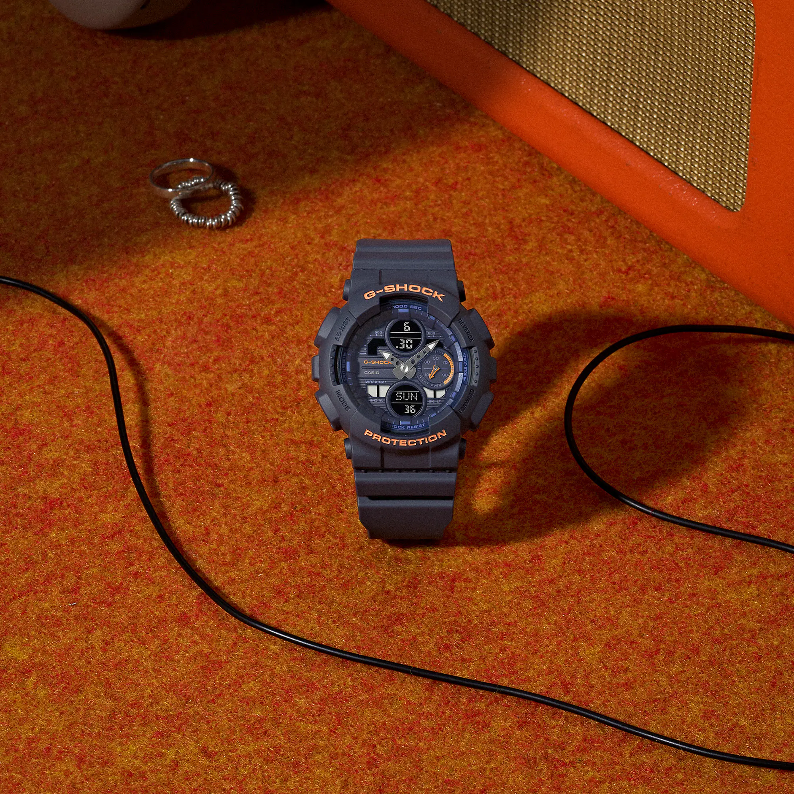
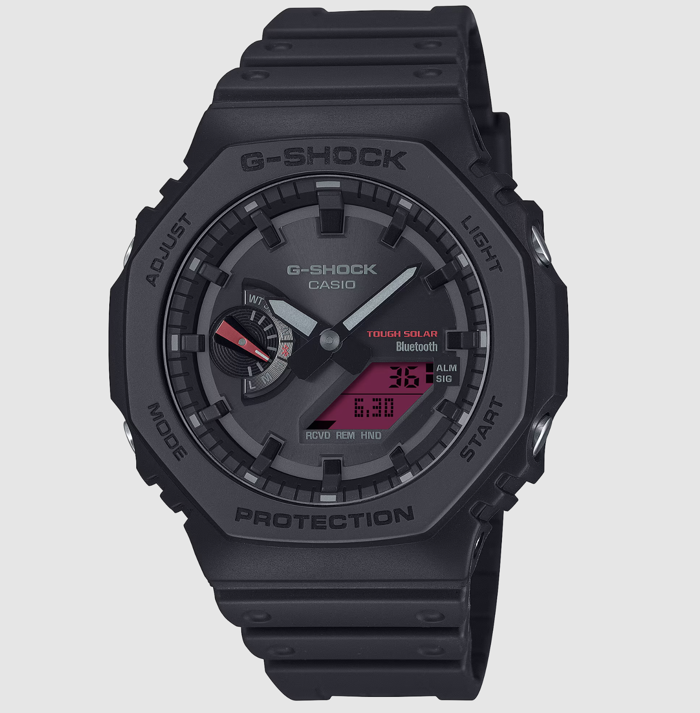

Quick gut check: should you buy a G-Shock?

Yes. Automatic, non-negotiable, scientifically backed yes.

G-Shocks are the most durable, widely produced watches on the planet, and honestly, everyone should own at least one. It's the watch that takes everything you throw at it, shrugs it off, and asks for more. Every scratch tells a story. Every scar has lore. Skip a G-Shock while building a collection in India and you're basically building a house without a foundation.

But before we get to the recommendations, you need the origin story, because G-Shock did not come out of a corporate board meeting. It came out of a broken heart and a bathroom window.

---

## The Story of the Triple 10

In 1981, Kikuo Ibe, a lead watch designer at Casio, dropped and destroyed a pocket watch his father had given him. Instead of just buying a replacement, he became obsessed with one idea: build a watch that would never break, no matter what.

He formed "Project Team Tough" around a concept he called the **Triple 10**. The watch had to survive a 10 metre drop, resist 10 bar of water pressure, and run for 10 years on a single battery. Simple on paper. Brutal in practice.

For months, his team dropped over 200 prototypes out of a third storey bathroom window at Casio's R&D centre. Every single one shattered. Ibe was ready to give up until he watched a kid bouncing a rubber ball in a park, and something clicked. The centre of a rubber ball stays protected while the outside absorbs the impact.

That observation became the **hollow case structure**. The timekeeping module floats inside the case, suspended at only a few contact points rather than bolted rigidly in place. In 1983, that idea became the DW-5000C, and the whole G-Shock empire was born from a guy refusing to accept that watches just break sometimes.

## Fun Facts You Probably Did Not Know

- **The Hockey Puck Controversy:** A US launch commercial showed a player slap-shotting a DW-5000C into a net like it was just another puck. Viewers accused Casio of faking it. So a TV news show tested it live on air with a professional player. The watch survived without a scratch.
- **The 25-Ton Truck:** In 2017, Casio set a Guinness World Record by driving a 24.97-ton truck over a standard, off-the-shelf G-Shock. It kept ticking afterward. That is the level of violence you are casually strapping to your wrist for the price of a nice dinner.
- **The Alien Posterior Rule:** There's one unwritten rule in the watch community. Any G-Shock is a good G-Shock, except for that one model that bears an unfortunate resemblance to an alien's backside. You know the one. Stick to the classics on this list and you'll be fine.

One quick housekeeping note before we get into it. Every watch below shares the G-Shock baseline: shock resistant construction, 200 metre water resistance, and the standard feature set of alarms, stopwatch, timer, and world time. Non-smart models typically run 3 to 5 years on a battery, while the Bluetooth-enabled ones land closer to 2 years since the radio chip drinks more power. I'll only call out specs when a model genuinely goes beyond that baseline, so I'm not repeating myself ten times over. Prices are accurate as of writing but they move around, so check the links before you commit.

Ranked from lowest price to highest.

---

# 1. The Gateway Drug

## [G-Shock GD-010-1DR](https://amzn.to/4wbjjZO) - ₹4,896

G-Shock GD-010-1DR Black Tactical

**Key Specifications:**
- **Case Size:** 52mm
- **Design:** Aggressive Octagon (Youth Illuminator-style)
- **Water Resistance:** 200 Meters
- **Battery Life:** 10 Years
- **Features:** World Time, Stopwatch, Countdown Timer
- **Finish:** Plain Single-Tone Black

This is where the addiction usually starts. The GD-010 is one of the cheapest doors into the G-Shock world, and it doesn't feel like a compromise once it's actually on your wrist. The octagonal case borrows its silhouette from Casio's standard Youth Illuminator line, but underneath it's running every heavy duty G-Shock spec you'd expect from something costing three times as much.

At 52mm it sits big, like most G-Shocks do, and the plain single tone black case means it goes with absolutely everything you own. No flashy colourways to second guess, no finish to baby. The genuine headline here is the 10 year battery. Most watches in this price bracket need a battery swap every couple of years. This one, you buy, you wear, and you basically forget it exists until the decade is up.

**The bottom line:** if your budget is firmly [under ₹5,000](/blog/best-watches-under-5k/), stop scrolling and just buy this. It's a fortress that doesn't ask anything of you.

<a href="https://amzn.to/4wbjjZO" target="_blank" rel="noopener noreferrer" class="buy-cta">→ Buy on Amazon</a>

---

# 2. The Living Legend

## [G-Shock DW-5600PT-5DR (G1334)](https://amzn.to/4eHNUqP) - ₹5,596

G-Shock DW-5600PT-5DR Golden Brown with Bullbars

**Key Specifications:**
- **Case Size:** 43mm
- **Design:** Classic Square (5600 Series)
- **Display:** Illuminator Backlight
- **Protection:** Factory-fitted Golden Bullbars
- **Water Resistance:** 200 Meters
- **Battery Life:** 3-5 Years

If you know, you know. The 5600 series is the most recognisable G-Shock alive, and that's not an exaggeration. It's a near direct continuation of the original 1983 DW-5000C, the watch that started this whole story. Casio has barely touched the core shape in over four decades, and that's sort of the entire point. You're not buying a trend. You're buying the same square that's been on wrists since before most of us were born.

This particular variant takes that historical square and drenches it in a golden-brown tint that reads as subtle rather than loud, which is unusual for a watch this iconic. It's an Illuminator model too, so the backlight brightens the display nicely the moment it gets dark. Then, almost as an afterthought, Casio threw golden bull bars over the crystal. Does a watch already engineered to survive a 25 ton truck actually need more protection? Honestly, probably not. I'll admit the bullbars are mostly theatre. But they make the watch look meaner, and sometimes that's reason enough.

**Why it matters:** at 43mm, this is one of the smaller G-Shocks on this whole list, which makes it the obvious pick if your wrist struggles with the bigger 50mm-plus cases everyone else is wearing.

<a href="https://amzn.to/4eHNUqP" target="_blank" rel="noopener noreferrer" class="buy-cta">→ Buy on Amazon</a>

---

# 3. The Dragon Eye

## [G-Shock GA-110CD-1A3](https://amzn.to/4xO1S31) - ₹8,186

G-Shock GA-110CD-1A3 Emerald Green

**Key Specifications:**
- **Case Size:** 51mm
- **Dial:** Metallic Emerald Green
- **Layout:** Analog-Digital (Ana-Digi)
- **Water Resistance:** 200 Meters
- **Battery Life:** 3-5 Years
- **Also Available In:** Ice Blue, Sage Green, Two-Tone Silver/Gold

This one isn't trying to be subtle, and I love that about it. The GA-110 is 51mm of genuine wrist armour, and against the matte black case, that emerald green dial almost glows, like a dragon's eye peeking out from somewhere it shouldn't be. There's something faintly extraterrestrial about how the metallic green catches light against the flat matte resin around it.

Here's a thing a lot of people don't talk about with ana-digi G-Shocks: the LCD window underneath the analog dial is often cramped and genuinely hard to read on a lot of older or budget models, because the digital portion gets squeezed into whatever leftover space the analog layout doesn't use. The GA-110CD actually gets this right. The digital display is legible without straining, which honestly should be table stakes but isn't always.

**The catch:** none, really. This is just a big, confident watch that knows exactly what it is and doesn't apologise for it.

<a href="https://amzn.to/4xO1S31" target="_blank" rel="noopener noreferrer" class="buy-cta">→ Buy on Amazon</a>

---

# 4. The Stealth CasiOak

## [G-Shock GMA-P2100BA-7ADR](https://amzn.to/4oJf3y2) - ₹8,494

G-Shock GMA-P2100BA-7ADR Off-White

**Key Specifications:**
- **Case Size:** 40mm
- **Design:** CasiOak Octagon Bezel
- **Finish:** Off-White with Blue Accents
- **Water Resistance:** 200 Meters
- **Battery Life:** 3-5 Years
- **Sizing:** Compact, Unisex

Quick bit of context before this one, because the octagonal bezel on it isn't an accident. When Casio launched the GA-2100 back in 2019, the internet immediately noticed the bezel looked a lot like the Audemars Piguet Royal Oak, a watch that costs roughly two hundred times as much. The nickname "CasiOak" stuck almost overnight, and it's now one of the most desirable shapes in the entire G-Shock catalogue. Casio will tell you, fairly, that the original 1983 DW-5000C already had an octagonal bezel, so really they were referencing their own history rather than copying anyone. Either way, the shape works.

This GMA-P2100 takes that exact octagonal DNA and shrinks it into a 40mm case, which is the size most people who say "G-Shocks are too bulky for me" are actually looking for. Yes, it's officially marketed as a women's pick. No, that should stop literally nobody. The off-white cream resin reads clean without going full white-white, and the subtle blue accents are the kind of detail you only notice once you've owned it for a week.

**The catch:** the small ana-digi window is fine, not great. You're not going to be reading the LCD from across a room. But you're also not buying this watch for the LCD. You're buying it because it looks genuinely good, and it easily holds its own against pieces on our [Best Watches Under ₹10,000](/blog/best-watches-under-10k/) list.

<a href="https://amzn.to/4oJf3y2" target="_blank" rel="noopener noreferrer" class="buy-cta">→ Buy on Amazon</a>

---

# 5. The Unexpected Matte

## [G-Shock GMA-S140-2A2DR](https://amzn.to/4vFkgJK) - ₹8,794

G-Shock GMA-S140-2A2DR Matte Navy

**Key Specifications:**
- **Case Size:** 46mm
- **Finish:** Deep Matte Navy with Hazard Orange Accents
- **Water Resistance:** 200 Meters
- **Battery Life:** 3-5 Years
- **Sizing:** Listed as Women's, Wears Universally

Technically another women's size at 46mm, and again, anyone can wear it and should feel free to. The real story with this one is the finish, not the size. Most G-Shocks default to a glossy black resin because it's the safe, obvious choice. This matte navy does something different, and it genuinely feels better against the skin too, less plasticky and more textured in hand.

Then there's the hazard orange detail on the hands, which is small but does a lot of work. It pulls just enough colour into an otherwise dark, moody watch to make it feel intentional rather than generic. I think people underrate how much a colourway changes the personality of an otherwise identical watch, and this is a good example of that. Same baseline G-Shock internals as everything else on this list, completely different vibe on the wrist.

**Why it matters:** it's a totally different energy from the all-black tactical crowd that dominates this price range, without trying too hard to stand out.

<a href="https://amzn.to/4vFkgJK" target="_blank" rel="noopener noreferrer" class="buy-cta">→ Buy on Amazon</a>

---

# 6. The Omnitrix

## [Casio G-Shock G1552 (GA-2300)](https://amzn.to/3R4e27j) - ₹8,995

Casio G-Shock GA-2300 Black

**Key Specifications:**
- **Case Size:** 42mm
- **Design:** Compact Octagon
- **Water Resistance:** 200 Meters
- **Battery Life:** 3-5 Years
- **Colourways:** Multiple (Black Recommended)

We already mentioned this one in our [under ₹10k](/blog/best-watches-under-10k/) list, and honestly, it would have felt wrong to leave it off this one too. There's a specific reason this watch lives rent-free in a lot of people's heads, and for me it's purely nostalgic. The compact, slightly unconventional case shape immediately reminds me of the Omnitrix from Ben 10, that chunky alien-tech wristwatch every kid in the 2000s desperately wanted strapped to their arm.

You put this on and some childish part of your brain genuinely expects something to happen. It won't, obviously, you're still just checking the time, but the feeling is real and it's a big part of the appeal. Strip away the nostalgia and you've still got a properly compact G-Shock that hits every baseline spec on this list without the bulk most G-Shocks carry. Every colourway available looks good. I'm pointing you toward black mainly because it's the one that disappears into any outfit while still keeping that funky shape doing the talking.

**Who this is for:** anyone who wants G-Shock toughness without G-Shock bulk, plus a little bit of childhood nostalgia thrown in for free.

<a href="https://amzn.to/3R4e27j" target="_blank" rel="noopener noreferrer" class="buy-cta">→ Buy on Amazon</a>

---

# 7. The Origami Engineer

## [G-Shock GBA-950-7ADR](https://amzn.to/4oJn0TU) - ₹10,995

G-Shock GBA-950-7ADR Minty Green

**Key Specifications:**
- **Case Size:** 44mm
- **Band:** OUTSENSE Co-Designed Origami Strap
- **Connectivity:** Bluetooth Step Tracker + Auto Time Sync
- **Water Resistance:** 200 Meters
- **Battery Life:** ~2 Years (Bluetooth Model)
- **Display:** Digital, No MIP Screen

Casio partnered with OUTSENSE Inc., a company that genuinely specialises in origami engineering, to rethink something as basic as a watch strap. That sounds like marketing fluff right up until you actually wear it. By analysing the precise mountain and valley fold angles used in traditional paper folding, they built a band whose base sections pull outward to the left and right, which pulls the case in snug against the underside of your wrist instead of letting it shift around all day. It's a small thing, but you notice it within the first hour of wearing it.

On the tech side, the watch adds Bluetooth for step tracking and automatic time syncing, but it deliberately skips the MIP display that you'd find on the GBD lineup. This isn't trying to be a smartwatch. It's a smart digital watch, full stop, and that distinction matters because it means the case stays slim instead of bulking up to fit a screen nobody asked for here. The minty green colourway is also just genuinely refreshing to look at compared to the sea of black resin everywhere else on this list.

**Why it matters:** most "smart" G-Shocks add bulk to make room for the tech. This one quietly adds comfort instead, and that's a trade I'll take every time.

<a href="https://amzn.to/4oJn0TU" target="_blank" rel="noopener noreferrer" class="buy-cta">→ Buy on Amazon</a>

---

# 8. The Vampire of Watches

## [G-Shock GA-B2100BBR-1A](https://amzn.to/4uX4gSr) - ₹11,995

G-Shock GA-B2100BBR-1A All Black / Red

**Key Specifications:**
- **Case Size:** 48.5mm
- **Design:** CasiOak Octagon, Carbon Core Guard
- **Finish:** All-Black with High-Saturation Red LCD
- **Power:** Tough Solar (No Battery Changes)
- **Connectivity:** Bluetooth Smartphone Link
- **Water Resistance:** 200 Meters

This watch is not fun. It is not quirky. It is downright lethal, and that's coming from someone who finds most G-Shocks at least a little bit charming. Take the octagonal CasiOak shape, black out the entire case and band, and then drop an insanely saturated red LCD dead centre on the dial. The GA-B2100BBR looks bloodthirsty and a little bad boyish in a way that genuinely surprised me the first time I saw it in person. It radiates a dark, almost supernatural energy. It's the vampire of the watch world, properly cool, properly intimidating, and a completely different vibe from the titanium pieces in our [Seiko Alternatives: Citizen](/blog/seiko-alternatives-citizen/) guide.

What pushes this one above the basic CasiOak though is what's hiding under the hood. This is part of the GA-B2100 line, which means it runs on Tough Solar power, so you're never hunting for a battery, and it pairs over Bluetooth to a companion app for automatic time correction, world time across roughly 300 cities, and a phone finder feature if you ever misplace your handset. It also keeps the Carbon Core Guard structure from the standard CasiOak for genuine shock resistance, not just the look of it.

**Who this is for:** anyone who wants their watch to look as serious as their Monday morning feels, while quietly never having to think about charging it.

<a href="https://amzn.to/4uX4gSr" target="_blank" rel="noopener noreferrer" class="buy-cta">→ Buy on Amazon</a>

---

# 9. The Absolute Cutest

## [G-Shock GA-100SHB-5A](https://amzn.to/3Stslmj) - ₹11,995

G-Shock GA-100SHB-5A Shiba Inu Edition

**Key Specifications:**
- **Case Size:** 51mm
- **Theme:** Shiba Inu, Japan's National Treasure
- **Dial:** Designed to Mimic Shiba Inu Facial Features
- **Water Resistance:** 200 Meters
- **Battery Life:** 3-5 Years

From the lethal straight to the adorable. This big case G-Shock is entirely dedicated to the Shiba Inu, the ancient Japanese dog breed that the entire internet has collectively adopted as its emotional support animal, and I'd argue it might be the best looking piece in this whole roundup. The brown exterior with the cream interior looks genuinely sweet rather than gimmicky, which is a hard balance to strike on a novelty watch.

The detail work is what sells it. The top surface of the dual-colour band represents the dog's dominant coat colour, while the off-white underside echoes the countershading you see on a real Shiba's belly and legs. The watch face itself is built around the same idea: the LCD window and the hour and minute hands are positioned to evoke the dog's eyes and nose, so the whole dial reads as a face if you look at it right. There's also a sesame Aka-Shiba colourway in the same series, with a brown bezel and a dual-tone brown band that mimics a slightly different coat pattern, worth a look if the cream version isn't quite your colour. Full-body silhouettes of the dog show up again on the inset dial, the case back, and the band loop, so the theme follows through everywhere instead of stopping at the dial.

**Why it matters:** this is the rare novelty watch that's actually well designed underneath the cute factor, not just a sticker slapped on a standard case.

<a href="https://amzn.to/3Stslmj" target="_blank" rel="noopener noreferrer" class="buy-cta">→ Buy on Amazon</a>

---

# 10. The Bluetooth Beater

## [G-Shock GBD-300-7](https://amzn.to/4aTKLmv) - ₹12,215

G-Shock GBD-300-7 White High Contrast

**Key Specifications:**
- **Case Size:** 48mm, Slim Profile
- **Display:** High-Definition MIP Screen
- **Connectivity:** Bluetooth, Activity Tracking, Auto Time Sync
- **Water Resistance:** 200 Meters
- **Battery Life:** ~2 Years

Okay, Bluetooth G-Shocks. What's actually the point, and who are they for? I own a couple of these now, so let me give you the honest, slightly unpopular opinion: you probably don't need one. Yes, it tracks steps. Yes, it tracks activity. No, it's not particularly accurate at either, and I'd be lying if I said I check those numbers all that often. The notifications are nice to glance at, sure, but that's about as far as the "smart" part goes for me day to day.

So why does it still make the list? Because my older GBD-100 has quietly become my favourite watch to travel with, mostly for one tiny feature: the moment my flight lands and my phone reconnects, it auto corrects to the local time zone without me touching a button. That alone has saved me more confused glances at airport clocks than I'd like to admit. The new GBD-300 keeps that same trick and shaves the whole case down to something noticeably slimmer and easier to live with day to day.

**Who this is for:** if you actually want serious activity tracking, get a cheaper Garmin from our [Best Outdoor Watches](/blog/best-outdoor-watches/) guide, or a screenless tracker, and pair it with a mechanical on your other wrist. But if you want a watch that does everything a normal G-Shock does well, with a genuinely sharp screen and that one travel trick on top, this is the one to get.

<a href="https://amzn.to/4aTKLmv" target="_blank" rel="noopener noreferrer" class="buy-cta">→ Buy on Amazon</a>

---

# Final Thoughts

Here's the honest truth after going through all ten of these. Whether you spend five grand on a classic DW-5600 or stretch the budget for the Shiba Inu edition, you genuinely cannot lose. A G-Shock is one of the only watches that belongs just as naturally on a billionaire's wrist as it does on a student's. They're classless, in the best possible sense of that word.

**Our top picks:**

- **Best value, period:** The **GD-010-1DR** at ₹4,896. Tactical looks, a 10 year battery, and absolutely nothing left to overthink.
- **Best classic:** The **DW-5600PT-5DR** at ₹5,596. The most iconic G-Shock silhouette ever made, dressed up in golden-brown with bull bars for character.
- **Best for smaller wrists:** The **GMA-P2100BA-7ADR** at ₹8,494. 40mm of genuine CasiOak DNA with none of the bulk, and a fair bit of horological history behind that bezel shape.
- **Best nostalgia pick:** The **GA-2300 "Omnitrix"** at ₹8,995. Compact, light, and it feels more like a gadget than a watch in the best way.
- **Best statement piece:** The **GA-B2100BBR-1A "Vampire"** at ₹11,995. All-black with a red LCD, Tough Solar, and Bluetooth underneath the menace.
- **Most unique:** The **GA-100SHB-5A Shiba Inu** at ₹11,995. A genuinely well-executed novelty dial that earns its price instead of coasting on cuteness alone.
- **Best tech:** The **GBD-300-7** at ₹12,215. A slim case, a sharp screen, and Bluetooth time sync that actually solves a real travel problem.

If you're just starting out, check our [Best Watches Under ₹3,000](/blog/best-watches-under-3k/) guide for the absolute base-level legends. But if you want a watch that will genuinely outlive your grandchildren, you're looking at it right here.

Got a G-Shock you think deserves the spotlight in Part 2? Come share it on [r/thewristjournal](https://www.reddit.com/r/thewristjournal/) where we talk watches, compare collections, and argue about which 5600 variant is the real one.

Happy hunting.